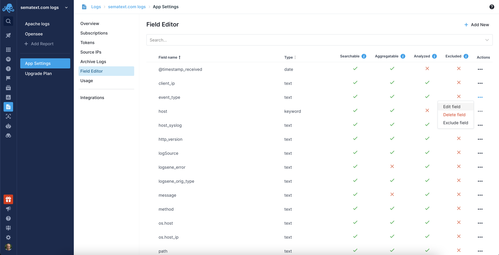

title: Sematext Logs User Guide
description: Sematext Cloud is a modern monitoring, log management, transaction tracing, and real user monitoring system that aggregates and structures your logs across various languages and platforms. It is a suite of products that combine high-quality logging experience with other monitoring and alerting devops tools helping fix production issues

## Logs Component Settings

Field Editor gives you the full control over the log events in your Logs App. You can easily remove fields, edit them, or add new fields with the option to set their types. 

