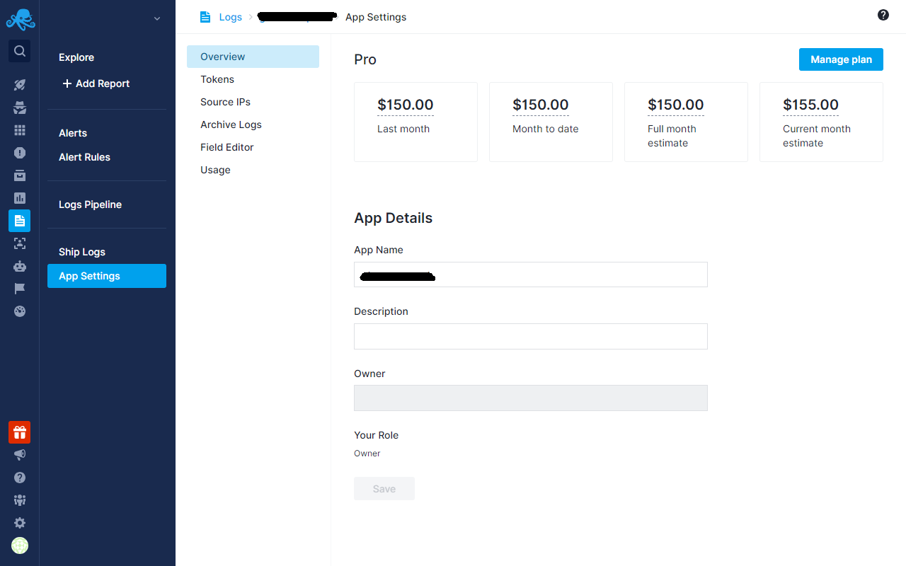
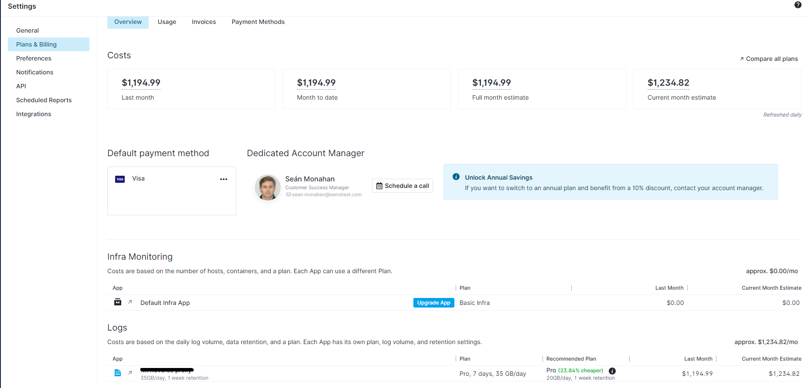

title: Pricing Guide
description: This guide explains how Sematext Cloud's flexible and transparent pricing works, helping you manage costs effectively based on your needs.

We offer flexible and transparent pricing for all of our four solutions: [Monitoring](https://sematext.com/docs/monitoring/), [Logs](https://sematext.com/docs/logs/), [Experience](https://sematext.com/docs/experience/), and [Synthetics](https://sematext.com/docs/synthetics/). This guide explains how our pricing works, helping you manage costs effectively based on your needs.

**Useful Links:**

- [Cost Calculator](https://sematext.com/cost-calculator/)
- [Pricing](https://sematext.com/pricing/)
- Reach out to our [Customer Success Manager](https://meetings.hubspot.com/sean-monahan) to discuss pricing, custom plans, volume discounts, cost optimizations, or anything else.

## Apps and Plans

For each of the four solutions, you can create multiple [Apps](https://sematext.com/docs/guide/app-guide/). Apps act as containers for your data. Every App is isolated and standalone, each App can have a different plan and other attributes that affect cost. This allows you to customize costs for each App individually and control the overall spend. For each App you can change the following:

- [Logs](https://sematext.com/pricing/#logs) Apps: 
  - Plan
  - Daily log volume
  - Data retention
- [Monitoring](https://sematext.com/pricing/#infrastructure) Apps: 
  - Plan
  - Number of hosts and containers
  - Data retention 
- [Experience](https://sematext.com/pricing/#experience) Apps: 
  - Plan
  - Page views
  - Data retention
- [Synthetics](https://sematext.com/pricing/#synthetics) Apps: 
  - Plan
  - Number of [Browser](https://sematext.com/docs/synthetics/browser-monitor/) and [HTTP](https://sematext.com/docs/synthetics/http-monitor/) monitors
  - Data retention
  
This flexibility ensures you only pay for what you use. For example, you might create multiple Apps and choose a minimal retention plan for test hosts and a higher retention plan for production hosts.

All App attributes, like plan, data retention, etc. can be changed up or down at any time without contacting Sematext. All changes take effect right away.

Refer to our [cost calculator](https://sematext.com/cost-calculator/) to estimate costs for each solution based on your needs. The calculator sums up the total based on your selections and shows your estimated monthly charge. You can also explore detailed plans on the [pricing page](https://sematext.com/pricing/).

Custom plans and pricing is available. Contact our [Customer Success Manager](https://meetings.hubspot.com/sean-monahan?uuid=4265218b-524a-4ca7-8ec7-2ba4ea120a0f) to discuss anything Sematext related and for custom plans.

All of our plans include support via live chat and email. For Standard and Pro Plans, we also provide phone support and a dedicated account manager for any questions about Sematext, such as pricing, best practices, and demos.

## Payment Methods

- Credit Card - charged at the first of the month for the previous month’s usage
- Monthly Invoices
- Prepayment - We invoice you and, once we receive your payment, we add this amount as credit towards your Sematext account balance. Every month, we subtract from this balance according to your previous month's usage. We notify you before your balance gets too low, so that we can repeat the invoicing process before your credit runs out. This is also how the annual plan works: you prepay for 12 months and receive a 10% discount in return.
- If you are using multiple solutions and an annual prepayment, you will receive a 15% discount. To check your eligibility and inquire about other discounts, you can schedule a call with your account manager directly from the Settings screen.

## Team Management and Billing Policies

- You can invite as many team members as you want at no additional cost.
- If you use Sematext as a team or company, we recommend creating an account that is not tied to any individual's email and converting it to a [team account](https://sematext.com/docs/team/#team-account). There are no additional costs for using a team account. Others can then be invited to and removed from that account and be assigned roles.
- Users can have [different roles such as user, admin, and billing admin](https://sematext.com/docs/team/).
  - Account owners and billing admins can add or remove credit cards and have full control over the Apps within the account.
- You can set a billing email within the Settings screen. This email, along with the account owner's and billing admin’s emails, will receive invoices.
- We charge credit cards on the 1st of the month. If the charge fails, we will send you an email about the failure and will keep trying until the 15th. If we cannot charge by the 15th, and a free plan is available, we will downgrade the Apps to the free plan. If a free plan is not available, we will disable your Apps. As soon as you enter a valid payment method, you can enable your Apps without losing any data. If your App was downgraded to a free plan with limited features and data retention, your older data will get deleted according to the free plan’s features and data limits.
- If you are on an annual payment plan, we will email the account owner, billing admins, and the billing email when the prepaid balance is low and it's time to top-up.

## Cost Estimation

### App-Level Cost Estimation

To see the details of your estimated cost for a specific App, go to the App, click on App Settings from the left menu panel. 

 

- **Last month**: Amount charged for the App for the previous month.
- **Month to date**: Costs for your App made in the current month so far.
- **Full month estimate**: Estimate for future months based on the current usage and plan. For the purpose of this calculation, the trial period is ignored.
- **Current month estimate**: Sum of costs for the current month so far and estimate for the rest of the month based on current usage and plan. This estimate takes into account any trial period but you won’t be charged for the usage during the trial period.

### Account-Level Cost Estimation

For a general overview of your estimated monthly costs across all Apps, visit the Settings → Plans & Billing screen. There, you can see a detailed breakdown of costs by each App in the data table at the bottom of the screen.

 

### Trial Period

We offer a 14-day trial period with all Pro features enabled. During this period, you won't be charged. Estimated costs for trial Apps will show as $0 in the Plans & Billing section. However, if you're curious about post-trial costs, you can toggle on the Show Estimations for Trial Apps button.

## Billing Flexibility

### No Commitment

Unless you choose to switch to an annual payment plan, which you can do at any time, there is no commitment and no contract with Sematext. When/if you want to stop using Sematext you simply stop sending us your metrics and/or switch to the Free plan. You can also upgrade/downgrade your plans at any given time, as well as change the data retention, number of hosts, volume of logs, etc. Usage is metered hourly, so any changes made will take effect immediately.

Our goal is to provide a flexible and transparent pricing model, ensuring there are no surprises at the end of the month by offering customizable plans and clear cost estimations. If you have any questions or need further assistance, reach out to us at support@sematext.com.

## FAQ

### Where and how often can I change plans? 

You can downgrade or upgrade an [App](https://sematext.com/docs/guide/app-guide/) anytime you want and any number of times. To do this, click on the App you want to downgrade/upgrade, navigate to 'App Settings' from the left menu panel, and click on the 'Manage Plan' option. From the flyout, you can select the plan that best fits your needs.

### Where and how often can I change data retention?  

You can change data retention of an [App](https://sematext.com/docs/guide/app-guide/) anytime you want and any number of times. To do this, click on the App you want to change the retention, navigate to 'App Settings' from the left menu panel, and click on the 'Manage Plan' option. From the flyout, you can select the retention that best fits your needs.

### Can I ship logs from different hosts to the same App without additional charges?

The easiest way to ship logs to Sematext Cloud is by using [Sematext Agent](https://sematext.com/docs/agents/sematext-agent/). Our Logs Apps don’t charge based on the number of hosts you are shipping data from. Our pricing is based on the daily log volumes you are shipping to Sematext Cloud. Therefore, you can install [Sematext Agent](https://sematext.com/docs/agents/sematext-agent/) on multiple hosts or use our [custom integrations](https://sematext.com/docs/logs/sending-log-events/#custom-integration-options) to ship logs to the same App without additional charges. We also recommend using [Logs Pipelines](https://sematext.com/docs/logs/pipelines/) to drop redundant and noisy log events to save on costs. Refer to [Reduce Log Monitoring Costs](https://sematext.com/docs/logs/reduce-costs-with-pipelines/) for more information. 

[Sematext Logs](https://sematext.com/docs/logs/) also offers plan recommendations based on the daily log volume you shipped during the last 7 days. 

Refer to [Plan Recommendations](https://sematext.com/docs/logs/plan-recommendations/) for more information.

### How can I handle sudden log volume spikes?

[Sematext Logs](https://sematext.com/docs/logs/) provides an option to put a hard limit to reject data once the specified GB/day limit is reached, to avoid surprises at the end of the month. It also allows you to change set that limit so high as to virtually eliminate it. The choice is yours.

Refer to [Going over the selected daily volume](https://sematext.com/docs/logs/logs-usage-screen/#going-over-the-selected-daily-log-volume) for more information.

### What is Received vs. Stored pricing for Logs

The costs for Logs Apps are affected by the volume of data you send to a Logs App. When you transmit raw log messages, a fixed rate of $0.10 per GB applies (received price), regardless of your plan, daily volume, or retention. Storage prices vary across plans, daily log volumes, and retention periods. Before Sematext stores logs, based on your specified [Logs Pipelines](https://sematext.com/docs/logs/pipelines/) conditions, you can discard logs or portions of logs to filter out noise and minimize storage expenses, thereby reducing your costs.

The unit price ($/GB) goes down as the daily log volume increases.

Refer to [Reduce Log Monitoring Costs](https://sematext.com/docs/logs/reduce-costs-with-pipelines/) for more information. 

Refer to [Logs pricing](https://sematext.com/pricing/#logs) for more information on stored pricing based on selected plan and retention.

### How do you bill for container monitoring?

Container monitoring is based on the base price and per-container price. The base price includes monitoring of a container host and free monitoring of up to N containers. Per-container price is applied only if you run more than N containers per host. The number of containers per host is averaged for the whole App. The base price and the number of containers included in it depends on the plan. Note that monitoring of container host and containers is independent of monitoring of applications you run in those containers. Containerized applications monitored by Sematext are metered as separate hosts. In other words, whether the monitored application is running in a container or in a VM or directly on a server or in a public cloud instance is the same as far as metering and billing is concerned. For plans and price details see https://sematext.com/pricing/.

Containers are monitored and charged through Infra Apps which can also monitor your bare-metal servers and virtual machines.

