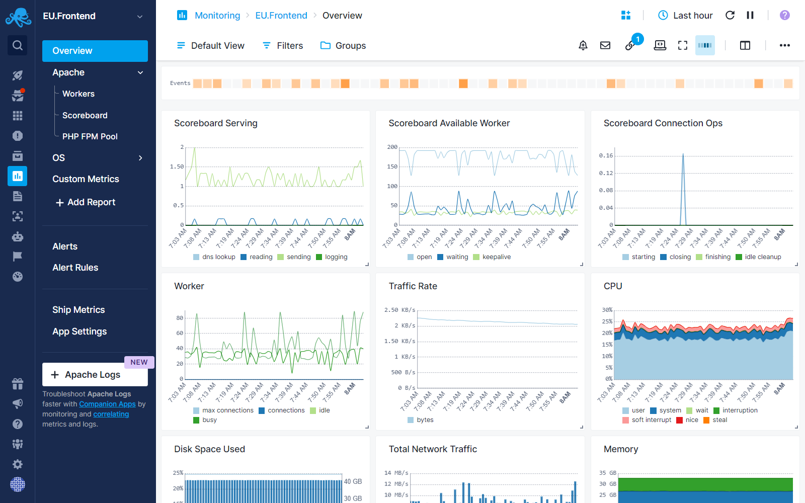
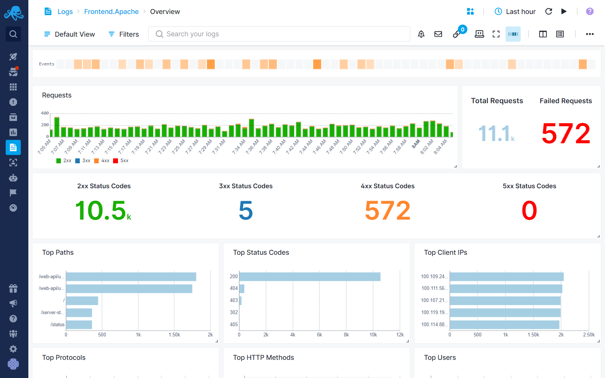
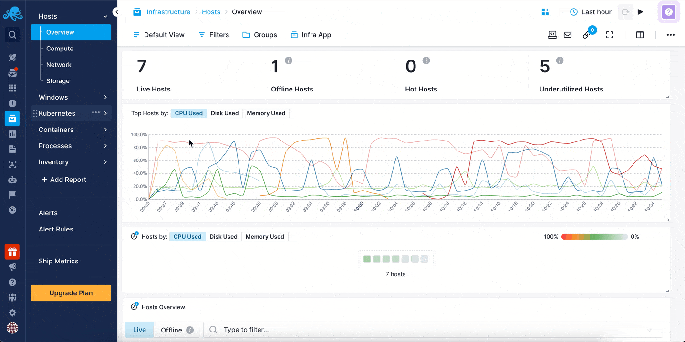
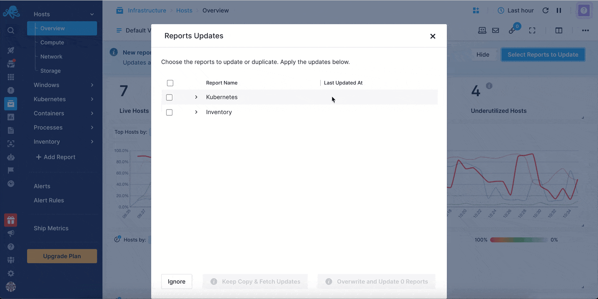
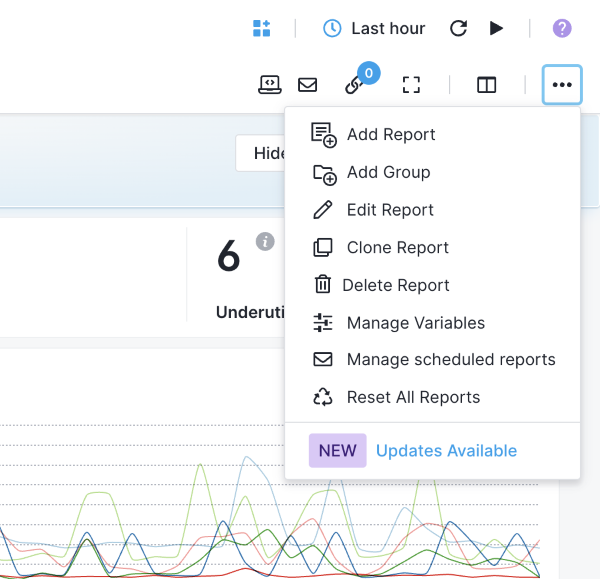

title: What is a Report?
description: Sematext Cloud Reports Guide. Using out-of-the-box reports or custom reports to visualize data.

A report in Sematext Cloud is a collection of visual components, like charts and tables, that help you monitor and analyze your metrics and logs. When you send metrics and logs to Sematext Cloud, we automatically provide you with out-of-the-box reports based on the [integration](https://sematext.com/docs/integration/) you’ve chosen when creating [Monitoring](https://sematext.com/docs/monitoring/) or [Logs](https://sematext.com/docs/logs/) [Apps](https://sematext.com/docs/guide/app-guide/). These reports are designed to highlight the most important data.
For example, if you want to collect metrics from an Apache web server and create an [Apache Monitoring App](https://sematext.com/docs/integration/apache-integration/), the reports will immediately display key metrics such as Scoreboard status, Worker activity, and performance data.

Similarly, if you want to collect logs from an Apache web server and create an [Apache Logs App](https://sematext.com/docs/integration/apache-integration/#apache-logs), the out-of-the-box reports will provide visualizations for logs, such as total and failed requests, response codes, top HTTP methods, and user activity.

On top of the out-of-the-box reports, you can also create Custom Reports tailored to your specific needs.

## Why Create Custom Reports?

While the default reports are a great starting point, you might want to focus on specific data that’s important to you. Maybe you want to track something unique to your setup, or compare different metrics side by side. Or you might be shipping [custom metrics](https://sematext.com/docs/monitoring/custom-metrics/) to your [Monitoring App](https://sematext.com/docs/monitoring/) and create a report to visualize that data. In this case, you can create a custom report that shows exactly what you need to see.

### How to Create a Custom Report

-  Go to your App where you want to create the report.
-  Click on "Add Report" that is available in the left menu panel.

- Add visualization components. You can choose from charts (like line, bar, or pie charts) or tables to display your data using [Chart Builder](https://sematext.com/docs/dashboards/chart-builder/). You can also decide which metrics or logs to show, based on what you want to monitor.

## Report Updates

When you create a Monitoring and Logs App in Sematext you get out of the box reports. From time to time we update and improve those reports. For example, as monitored metrics and logs change we improve the metrics charts, we update log parsing and charting, etc.

**Stay notified and stay updated**  
Customized reports are a powerful way to adjust your data visualization to your specific needs. To ensure you always have the latest and most relevant data, Sematext provides **Report Updates** functionality. Imagine you've customized one of the out of the box **Apache Monitoring Reports** to include specific metrics unique to your environment and that, at some point later, Sematext has made improvements to those same reports. When that happens, you will be be notified and can decide whether to keep your custom report as is or not.

#### How It Works

1. **Out-of-the-Box Reports:**
   - For users who haven't customized their reports, all updates to out-of-the-box reports are applied automatically. No action is needed, you're always up-to-date with the latest features and improvements.

2. **Customized Reports:**
   - If you've customized any reports, you'll get a notification info box when updates are available for those reports. You can:
     - **Overwrite existing reports**: Replace your current customizations entirely with the updated out-of-the-box report.

       
       
     - **Keep a copy and fetch new updates**: Bring the latest reports while keeping your existing customizations intact. The newly fetched reports will be saved under the same group as the existing ones, with a name format like "Report-Name Date" (e.g., Overview 19-12-2024). In multi-level menus, the group name may be added as a prefix to help organize and identify the reports.

       
       
     - **Ignore and keep your existing report**: Continue using your customized report without fetching the updates. 

   The notification info box can be hidden by clicking the 'Hide' button. It will reappear as a reminder after 30 days. At any time, a menu item labeled 'Updates Available' can be accessed via the three-dot (more options) menu of each report, allowing you to update your reports as needed.
   
   

#### Why Use Report Updates?

- Stay informed about new features and improvements to out-of-the-box reports.
- Keep your Monitoring and Logs Apps up to date with the latest features.
- Maintain control over your customized reports without unexpected changes.
