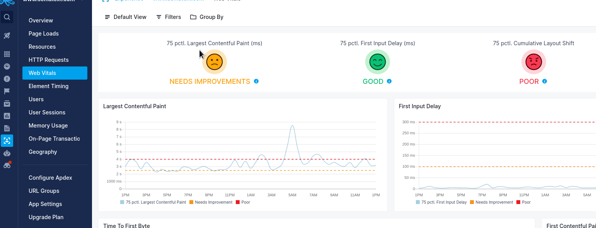
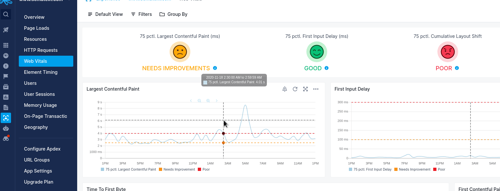

title: Saved Views Guide
description: Sematext Cloud is a modern monitoring, log management, transaction tracing, and real user monitoring system that includes over 40 monitoring integrations. It is a suite of products that combine high-quality logging experience with other monitoring and alerting devops tools helping fix IT production issues

Filtering and grouping data is a central part of the Sematext Cloud user interface. With Saved Views you can save your filters and groups for faster access later. If you find yourself often applying the same filters on your data then this feature can be a time saver.

The feature is available on all screens where the Saved Views button is visible. This button displays "Default View" when no saved view is selected as shown in the animations below.

To save a view for later, follow the steps below:

1. Change the filters according to which data you want to see
2. Click on the highlighted Saved Views button
3. Click on "Save As" and enter a descriptive name for the filter

Sometimes later, when you come back to this screen:

1. Click on Saved Views button
2. Select the previously saved view

Saved Views are available in Monitoring, Logs, Synthetics, and Experience Apps as well as on any dashboards you've created.
