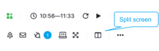
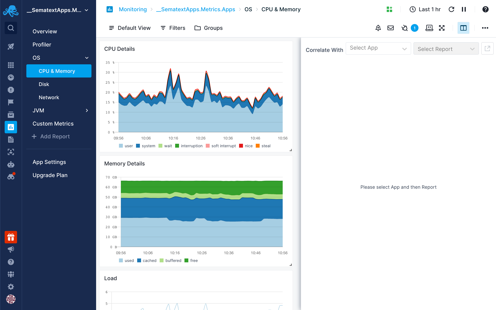
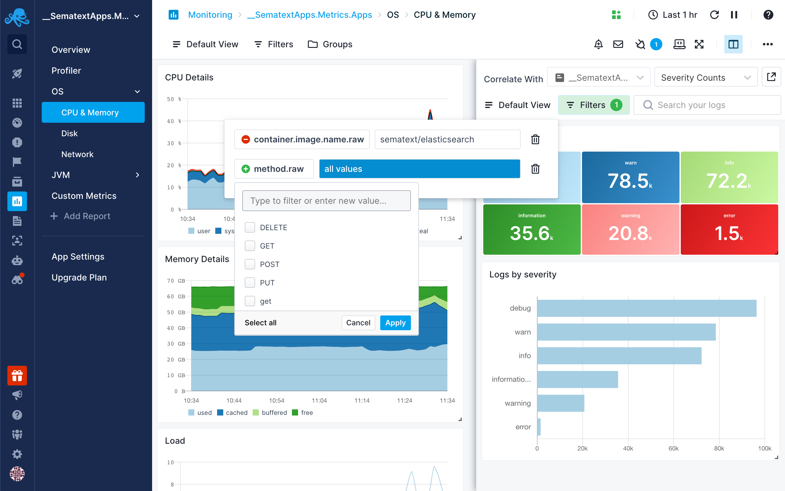

title: Split Screen Guide
description: Split Screen is product-wide correlation and data-pivoting feature. With Split Screen you can compare any two reports or dashboards, even the same report or dashboard but with different filters and groups in the two different screens.

<iframe src="https://www.youtube.com/embed/N3oXASgIt2E" 
frameborder="0" allow="autoplay; encrypted-media" 
allowfullscreen class="video"></iframe>

Split Screen is a product-wide correlation and data-pivoting feature. With Split Screen you can compare any two reports or dashboards, even the same report or dashboard but with different filters and groups in the two different screens.

The Split Screen is available across the whole product and you can open any dashboard or report with events, logs, or metrics within the Split Screen. 

To open the Split Screen, click the Split Screen button in the top right part of any report.

### Using Split Screen

When initially opened, the Split Screen panel will be empty.

You can view events, metrics, and logs from any App or Dashboard report.

Select an App, Dashboard, or Monitor and the default report will be automatically selected.
You can select any other report as well.

Once you select a report you want to correlate with, it’ll be remembered so you can quickly toggle it.

### Filtering Split Screen

Split screen will use the same time interval as the main screen. Apart from the time, it will have its own set of filters.
It allows showing unrelated reports with the same filters, but also comparing the same report with different filters.

The filters will be stored in the browser so you can safely toggle or refresh the page without losing the currently enabled set of filters.
