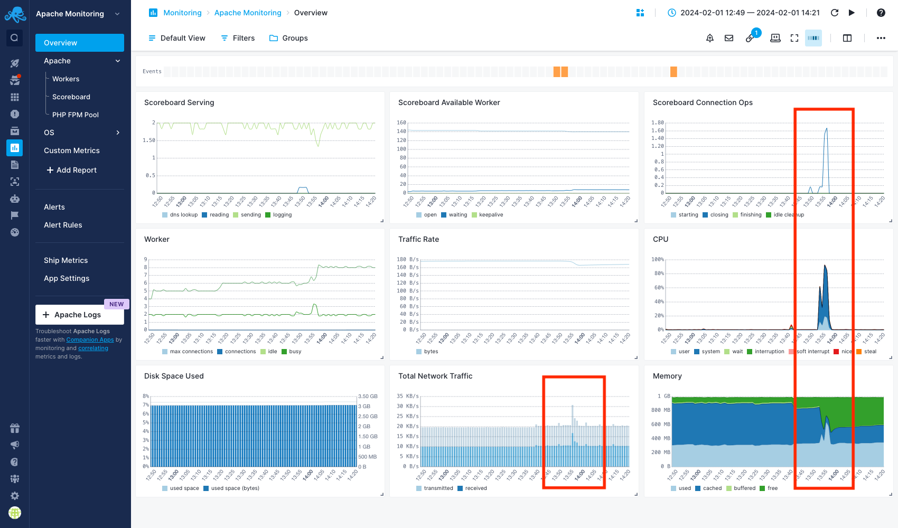
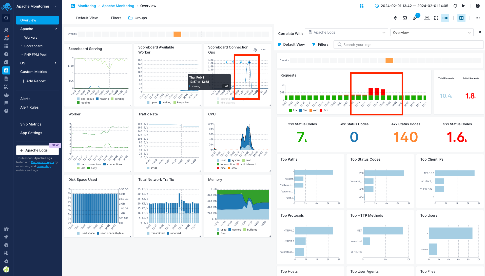
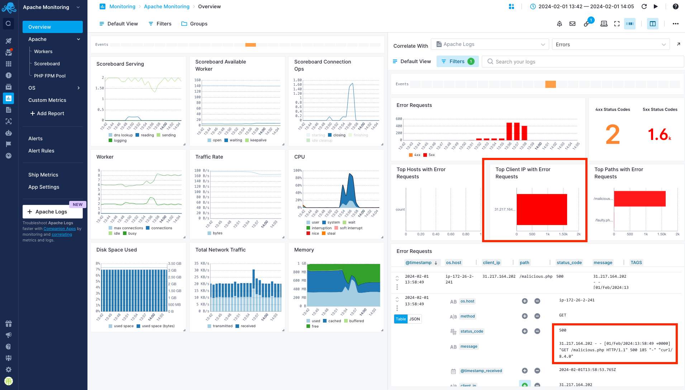

title: Split Screen Guide
description: Split Screen is product-wide correlation and data-pivoting feature. With Split Screen you can compare any two reports or dashboards, even the same report or dashboard but with different filters and groups in the two different screens.

<iframe src="https://www.youtube.com/embed/N3oXASgIt2E" 
frameborder="0" allow="autoplay; encrypted-media" 
allowfullscreen class="video"></iframe>

Split Screen is a product-wide correlation and data-pivoting feature. With Split Screen you can compare any two reports or dashboards, even the same report or dashboard but with different filters and groups in the two different screens.

The Split Screen is available across the whole product and you can open any dashboard or report with events, logs, or metrics within the Split Screen. 

To open the Split Screen, click the Split Screen button in the top right part of any report.

### Using Split Screen

When initially opened, the Split Screen panel will be empty.

You can view events, metrics, and logs from any App or Dashboard report.

Select an App, Dashboard, or Monitor and the default report will be automatically selected.
You can select any other report as well.

Once you select a report you want to correlate with, it’ll be remembered so you can quickly toggle it.

### Filtering Split Screen

Split screen will use the same time interval as the main screen. Apart from the time, it will have its own set of filters.
It allows showing unrelated reports with the same filters, but also comparing the same report with different filters.

The filters will be stored in the browser so you can safely toggle or refresh the page without losing the currently enabled set of filters.

### Example Use Case

As a Systems Administrator, you've noticed a sudden increase in Apache server traffic, indicating a potential denial-of-service (DoS) attack. You have some suspicions but need to troubleshoot the issue further.

You have set up two Apps in Sematext Cloud for [monitoring your Apache server](https://sematext.com/docs/integration/apache-integration/): Apache Monitoring for metrics and Apache Logs for logs. You plan to investigate further by checking the Apache metrics and then using Split Screen to correlate metrics with logs to identify any malicious activity.

#### Apache metrics

You access the Apache Monitoring App and navigate to the Overview report. There are serveral abnornal spikes following the same pattern in various charts, including CPU, Memory, Network Traffic and Scoreboard Connection Ops. You focus on the Scoreboard Connections Ops chart, where you notice a spike in [worker closing connections](https://sematext.com/docs/integration/apache-integration/#apache-metrics). You suspect that an attacker may be flooding the server with a high volume of requests, causing normal connections to be dropped and resulting in an increase in workers closing connections.

Now, you need help from your logs to continue the investigation. If you don't have a Logs App, you can easily use the [Companion Apps](https://sematext.com/docs/guide/connected-apps/#companion-apps) to create an Apache Logs App and connect it with your Apache Monitoring App so that you can correlate logs and metrics, as we will see in the next section.

#### Analyze metrics and logs together

You will use Split Screen to check the Apache logs and correlate them with the metrics that you observed. From the Apache Monitoring App, click on the Split Screen icon. A new panel with Apache Logs App will shown. In one panel, view the scoreboard connections chart. In the other panel, switch to the Apache Logs App and select the Overview report.

Look for any correlation between the spike in scoreboard connections and corresponding logs. You notice an increased number of 5xx HTTP status codes and you'll see that their distribution in Requests chart matches the spikes in scoreboard connections.

#### Identify suspicious activity

To learn more about these 5xx errors, you can select the Errors report in the Apache Logs App from the left pane. There, you can see that a particular client is causing all these errors. Additionally, there is a specific path associated with all these error requests. To further drill down into specific log entries, you can filter by this client and check the logs. It becomes clear that a file named malicious.php is causing 500 errors and flooding the server with requests.

Now, you can take appropriate actions by blocking this IP, removing the malicious file, and continuously monitoring your infrastructure to confirm that the incident has been resolved.
