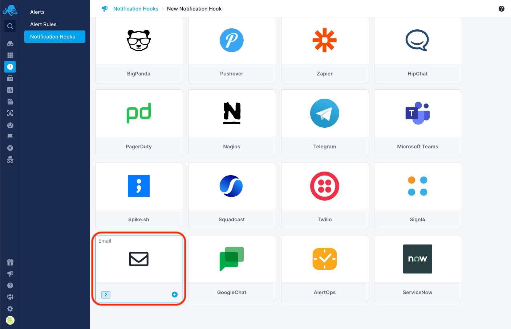
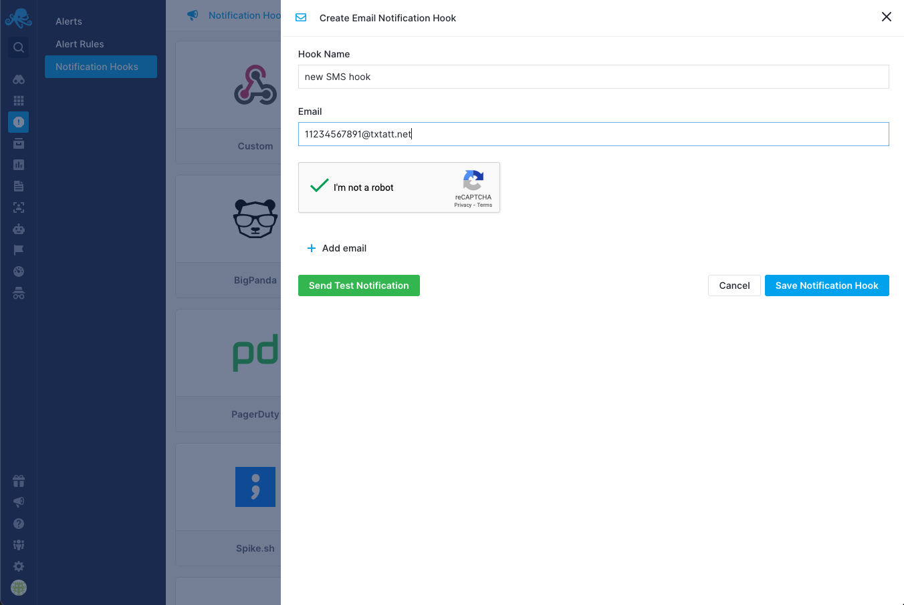

title: Alerts SMS / text Integration
description: Sending SMS / text for threshold, anomaly and / or heartbeat alerts with Sematext infrastructure and application monitoring platform.

You can use Sematext's [email Notification Hook](https://sematext.com/docs/integration/alerts-email-integration/) to receive alert notifications via SMS / text. Please note that this feature is currently available to US cell phone numbers only.

## Add New SMS / text Notification Hook

Navigate to [Notification Hooks](https://apps.sematext.com/ui/hooks/create) (in [EU](https://apps.eu.sematext.com/ui/hooks/create)) and select Email card to create a new SMS / Text notification hook.

Enter required hook name and email address. Simply type in the email to SMS gateway for whatever carrier your recipient uses, and include their cell phone number in front of the “@” sign. For example, if your recipient’s cell phone number is 1-123-456-7891 and their carrier is AT&T, you would type in the following address in the email: 11234567891@txtatt.net. 

Almost every single carrier has its own address for this specific purpose, here is a list of all the major carriers’ email to sms gateways:
- T-Mobile – number@tmomail.net 
- Virgin Mobile – number@vmobl.com
- AT&T – number@txt.att.net
- Sprint – number@messaging.sprintpcs.com
- Verizon – number@vtext.com
- Tracfone – number@mmst5.tracfone.com
- Ting – number@message.ting.com
- Boost Mobile – number@myboostmobile.com
- U.S. Cellular – number@email.uscc.net
- Metro PCS – number@mymetropcs.com

## Third-Party Services
SMS / text notifications can also be enabled by integrating Sematext Notification Hooks with the third-party service Twilio. For further information, please see [Twilio Alerts Integration](https://sematext.com/docs/integration/alerts-twilio-integration).
