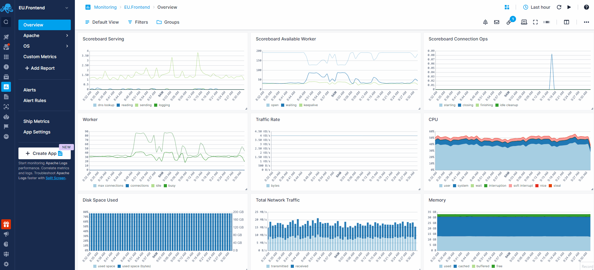
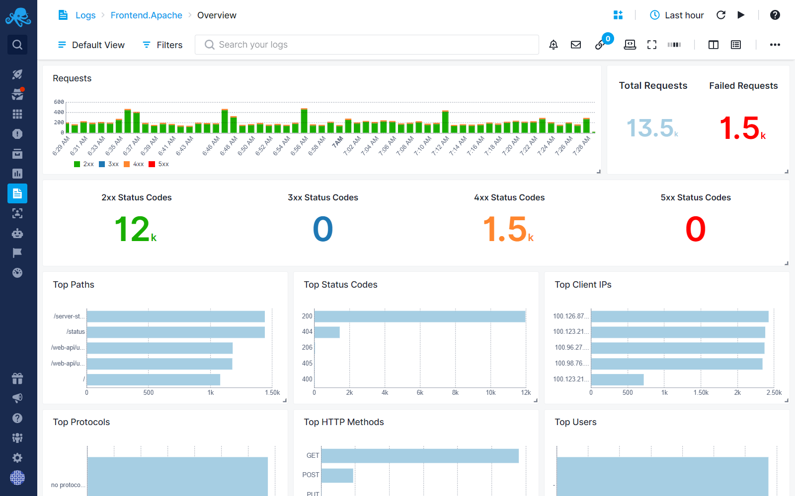
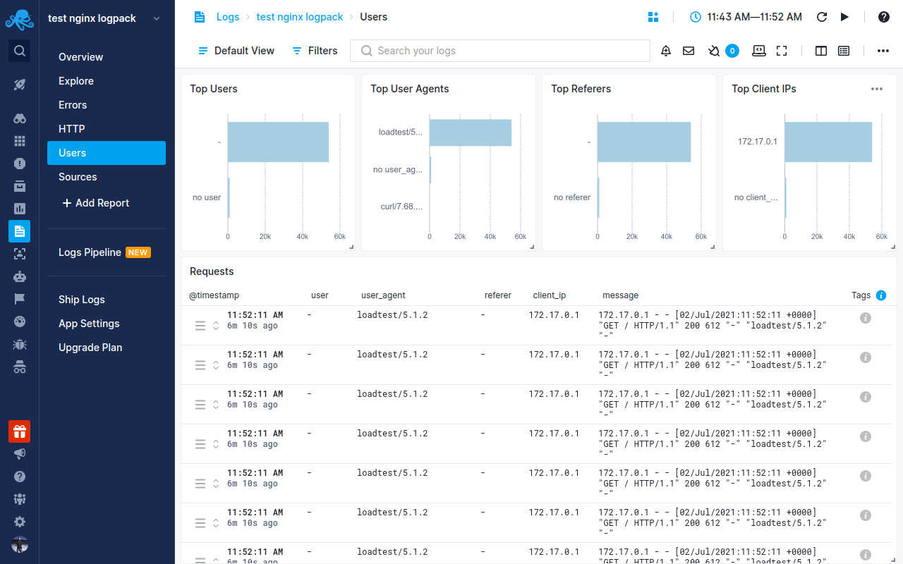

title: Apache
description: Apache monitoring integration sends workers, scoreboard, php fpm, and httpd server performance metrics and other inventory data from your OS and web server to Sematext in cloud SaaS infrastructure and application monitoring & log management service 

Apache is an open-source web server software that serves web pages to users over the internet. The [Sematext Agent](https://sematext.com/docs/agents/sematext-agent/) collects Apache metrics and logs, transmits them to Sematext Cloud; installing the agent takes less than 5 minutes.

## Install Sematext Agent

1.  Activate Apache `mod_status` module with `sudo a2enmod status` and configure it in `status.conf` file, e.g. in `/etc/apache2/mods-enabled/status.conf`:

        ExtendedStatus On
        <Location /server-status>
          SetHandler server-status
        </Location>

2. Create an Apache Logs or Monitoring [App](https://sematext.com/docs/guide/app-guide/). This will let you install the agent and control access to your monitoring and logs data.
3. Install the Sematext Agent according to the [https://apps.sematext.com/ui/howto/Apache/overview](https://apps.sematext.com/ui/howto/Apache/overview) displayed in the UI.
4. After installing the agent, the Discovery tab shows all the Apache services identified on the host and you will start receiving metrics or logs from Apache services.
5. If you've created an Apache Monitoring App and want to collect Apache logs as well, or vice versa, click on the **Create Logs App** button from the left menu panel. This will navigate you to the 'Create Logs App' (or Monitoring App) page, where you'll find all the discovered log sources from Apache services and manage log and metric shipping effortlessly.

Having both Apache Logs and Monitoring Apps lets you correlate performance metrics and logs, and accelerate troubleshooting using [Split Screen](https://sematext.com/docs/guide/split-screen/) for faster resolution. For example, if you see an increase in 4XX errors, monitoring can tell what's the impact on Apache's response times and CPU usage.

To [explore logs and services](https://sematext.com/docs/monitoring/autodiscovery/) across multiple hosts, navigate to [Fleet & Discovery > Discovery > Services](https://apps.sematext.com/ui/fleet-and-discovery/discovery/services) (or  [Sematext Cloud Europe](https://apps.eu.sematext.com/ui/fleet-and-discovery/discovery/services)). From there, you can create additional [Apps](https://sematext.com/docs/guide/app-guide/) or stream data to existing ones without requiring any additional installations. 

## Apache Metrics

Metric Name | Key | Agg | Type | Description
--- | --- | --- | --- | ---
async closing | apache.connections.async.closing | Avg | Double | 
async writing | apache.connections.async.writing | Avg | Double | 
busy | apache.workers.busy | Avg | Double | 
total | apache.connections.total | Avg | Double | 
requests count | apache.requests.count | Sum | Long | 
idle | apache.workers.idle | Avg | Double | 
async keep alive | apache.connections.async.keepAlive | Avg | Double | 
keepalive | apache.workers.keepalive | Avg | Double | <b>keepalive</b>: Number of workers currently sending keepalive messages
open | apache.workers.open | Avg | Double | <b>open</b>: Number of workers currently not busy with any process
sending | apache.workers.sending | Avg | Double | <b>sending</b>: Number of workers currently sending a reply
finishing | apache.workers.finishing | Avg | Double | <b>finishing</b>: Number of workers currently gracefully finishing connections
reading | apache.workers.reading | Avg | Double | <b>reading</b>: Number of workers currently reading incoming requests
closing | apache.workers.closing | Avg | Double | <b>closing</b>: Number of workers currently closing a connection
idle cleanup | apache.workers.cleanup | Avg | Double | <b>idle cleanup</b>: Number of workers currently performing idle cleanup procedure
starting | apache.workers.starting | Avg | Double | <b>starting</b>: Number of workers currently starting up a connection
logging | apache.workers.logging | Avg | Double | <b>logging</b>: Number of workers currently busy updating log files
waiting | apache.workers.waiting | Avg | Double | <b>waiting</b>: Number of workers currently waiting for a connection
dns lookup | apache.workers.dns | Avg | Double | <b>dnslookup</b>: Number of workers currently requesting DNS lookup

## PHP-FPM Monitoring

PHP-FPM monitoring can be enabled along with Apache monitoring. See [PHP-FPM](./php) for more details.

## Apache Logs

Once data is in, you can explore it via the built-in reports: 

## Exploring logs

Once data is in, you can explore it using the built-in reports or create your own. For example, you can use the Users report to check on where the requests are coming from:

Other built-in reports include:

- **Errors**: Logs specifically about errors. You can see which status codes are returned and which errors are logged by your Apache server.
- **HTTP**: Logs about Apache access logs. Use this report to view any and all data about HTTP requests and responses.
- **Sources**: Logs about Apache source files. You can view where the logs are collected from and from where in the world users are accessing your Apache server.

## Troubleshooting

If you have trouble sending logs, try out the latest version of [Sematext Agent](../agents/sematext-agent/installation/). Also, make sure Sematext Agent is configured to send logs to your Apache Logs App. If you're using Apache in a container, make sure to configure it to output logs to the stdout/stderr streams. Last, check the [Log Agents panel](https://sematext.com/docs/fleet/#log-agents) for any errors, and refer to our [Sematext Logs FAQ](https://sematext.com/docs/logs/faq/) for useful tips.

If you are having issues with Sematext Monitoring, i.e. not seeing Apache metrics, see
[How do I create the diagnostics package](/monitoring/spm-faq/#how-do-i-create-the-diagnostics-package).

For more troubleshooting information please look at [Troubleshooting](/monitoring/spm-faq/#troubleshooting) section.
