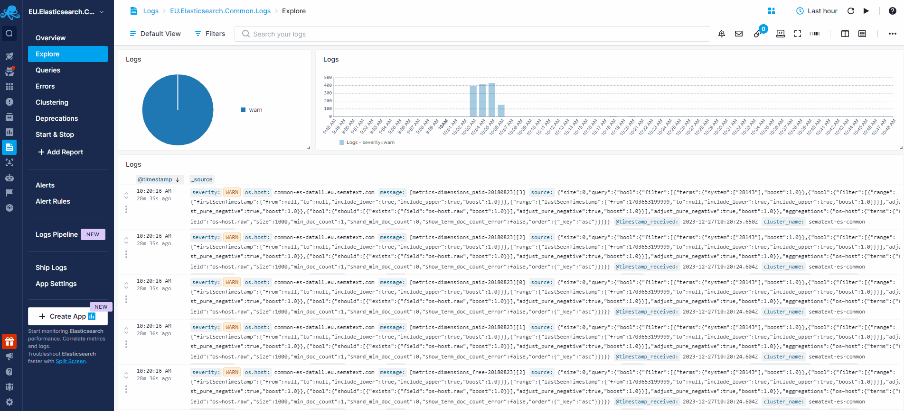
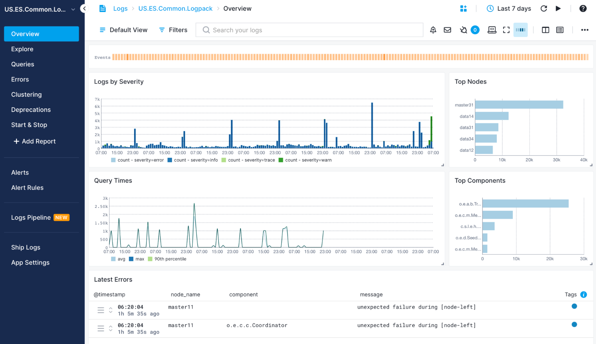
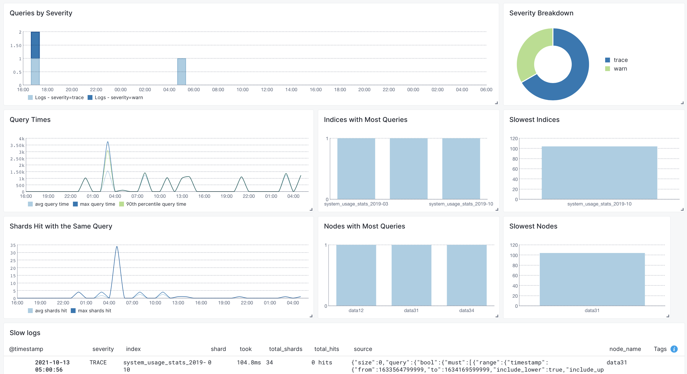

title: Elasticsearch
description: Collect and monitor key Elasticsearch metrics such as request latency, indexing rate, and segment merges with built-in anomaly detection, threshold, and heartbeat alerts. Send notifications to email and various chatops messaging services, correlate events & logs, filter metrics by server, node, time or index, and visualize your cluster's health with out of the box graphs and custom dashboards

Elasticsearch is a distributed, RESTful search and analytics engine designed for scalability and high-performance search functionalities across varied data types and sources. The [Sematext Agent](https://sematext.com/docs/agents/sematext-agent/) collects Elasticsearch metrics and logs, transmits them to Sematext Cloud; installing the agent takes less than 5 minutes.

## Install Sematext Agent

1. Create an Elasticsearch Logs or Monitoring [App](https://sematext.com/docs/guide/app-guide/). This will let you install the agent and control access to your monitoring and logs data.
2. Install the Sematext Agent according to the [https://apps.sematext.com/ui/howto/Elasticsearch/overview](https://apps.sematext.com/ui/howto/Elasticsearch/overview) displayed in the UI.
3. After installing the agent, the Discovery tab shows all the Elasticsearch services identified on the host and you will start receiving metrics or logs from Elasticsearch services.
4. Make sure that HTTP metrics are enabled by setting `http.enabled: true` in `elasticsearch.yaml`. Also set the `node.name` value in the same file. Elasticsearch will otherwise generate a random node name each time an instance starts, making tracking node stats over time impossible. The `elasticsearch.yml` file can be found in `/etc/elasticsearch/elasticsearch.yml` or `$ES_HOME/config/elasticsearch.yml`.
5. If you've created an Elasticsearch Monitoring App and want to collect Elasticsearch logs as well, or vice versa, click on the **Create Logs App** button from the left menu panel. This will navigate you to the 'Create Logs App' (or Monitoring App) page, where you'll find all the discovered log sources from Elasticsearch services and manage log and metric shipping effortlessly.



Having both Elasticsearch Logs and Monitoring Apps lets you correlate performance metrics and logs, and accelerate troubleshooting using [Split Screen](https://sematext.com/docs/guide/split-screen/) for faster resolution. For example, correlating metrics (such as CPU, memory usage, disk I/O) with logs (search queries, indexing operations), you can identify if a sudden spike in resource usage aligns with a specific type of query or indexing operation. This correlation helps in optimizing queries, indexing strategies, or scaling resources to maintain optimal performance. Or if you see logs of a node restarting, metrics let you see the impact on the rest of the cluster in terms of CPU, GC, and other metrics. Including query time metrics, even if you don't collect slowlogs from [all] queries.

To [explore logs and services](https://sematext.com/docs/monitoring/autodiscovery/) across multiple hosts, navigate to [Fleet & Discovery > Discovery > Services](https://apps.sematext.com/ui/fleet-and-discovery/discovery/services) (or  [Sematext Cloud Europe](https://apps.eu.sematext.com/ui/fleet-and-discovery/discovery/services)). From there, you can create additional [Apps](https://sematext.com/docs/guide/app-guide/) or stream data to existing ones without requiring any additional installations. 

## Important Metrics to Watch and Alert on
### System and JVM Metrics
The first place we would recommend looking for in a new system are the OS metrics: CPU, memory, IO and network. A healthy CPU graph looks like this:


Note how the relative percentage of *wait* and *system* is negligible compared to *user*. Meaning we don't have a bottleneck in IO. And total usage isn't close to 100% all the time, so there's headroom.

If there's high CPU usage, have a look at JVM garbage collection (GC) times. Which are probably good candidates for alerts. If GC times are high, then Elasticsearch is in trouble with JVM memory, rather than doing useful work with the CPU. You can look deeper into JVM memory usage to check. A healthy pattern looks like a shard tooth:


When it comes to system memory, don't be worried if you see very little free, like here:


The operating system will try to cache your index files as much as it can. The *cached* memory can be freed up, if the system needs more memory.
### Elasticsearch-specific metrics
You'll want to monitor query rates and times. In other words, how fast is Elasticsearch responding? Since this will likely impact your users, these are metrics worth alerting on as well.


On the indexing side, check the indexing rate:


And correlate it with the asynchronous refresh and merge times, as they can correlate with your CPU spikes:


For example, if refresh time is too high, you might want to adjust the [refresh interval](https://sematext.com/blog/elasticsearch-refresh-interval-vs-indexing-performance/).

Last, but certainly not least, you may want to get an alert if a node leaves the cluster, so you can replace it. Once you do, you can keep an eye on shard stats, to see how many are initializing or relocating:


## Elasticsearch Default Alerts

As soon as you create an Elasticsearch App, you will receive a set of default [alert rules](https://sematext.com/docs/guide/alerts-guide/). These pre-configured rules will notify you of important events that may require your attention, as shown below.

### Node count anomaly

This alert rule continuously monitors the count of nodes in an Elasticsearch cluster, checking for anomalies in the number of nodes present within the cluster. When anomalies are detected, it triggers a warning (WARN priority). The minimum delay between consecutive alerts triggered by this alert rule is set to 10 minutes.

Suppose an Elasticsearch cluster typically maintains a stable number of nodes, but due to various factors such as node failures, scaling activities, or network issues, the node count experiences sudden changes. When this happens, the alert rule checks for anomalies in the count of nodes over the last 90 minutes. Upon detecting the anomaly, the alert rule triggers a warning.

#### Actions to take

- Check the status of nodes within the Elasticsearch cluster for any nodes that may be offline, unavailable, or experiencing issues
- If node failures are detected, you may need to restart failed nodes or replace hardware
- If the node count changes due to scaling activities (e.g., adding or removing nodes), review the recent scaling events to confirm that they are intentional and expected
- Monitor network connectivity between nodes within the Elasticsearch cluster for any network issues that may be affecting communication and node discovery


### Java old gen usage > 97%

This alert rule continuously monitors the usage of Java's old generation heap memory in an Elasticsearch environment, triggering a warning if the usage exceeds 97%. The minimum delay between consecutive alerts triggered by this alert rule is set to 10 minutes.

Suppose the Java old generation heap memory usage in the Elasticsearch environment starts increasing and eventually exceeds 97% over a 5-minute period.

#### Actions to take

- Analyze the application's memory usage patterns for any memory leaks
- Review and optimize the Java Virtual Machine (JVM) configuration, including heap size settings, garbage collection algorithms, and memory management parameters
- Monitor system resources, including memory, CPU, and disk I/O, and consider scaling them up if necessary
- Investigate recent application changes, updates, or deployments that may have contributed to the spike in memory usage

### Field data size

This alert rule continuously monitors the field data size in an Elasticsearch cluster and triggers a warning if the field data size exceeds a certain threshold (20 in this case). The minimum delay between consecutive alerts triggered by this alert rule is set to 10 minutes.

Suppose the field data size in the Elasticsearch cluster increases significantly due to increased query loads or inefficient queries. When this happens, the alert rule checks the field data size over the last 10 minutes. If it exceeds 20% of the JVM heap committed memory during this timeframe, the alert rule triggers a warning.

#### Actions to take

- Analyze the query patterns and usage that contribute to the increased field data size. Look for inefficient or resource-intensive queries that may need optimization
- Optimize queries to reduce the amount of field data loaded into memory. This may involve restructuring queries, using filters, or optimizing aggregations to minimize memory usage
- Consider scaling up the resources allocated to the Elasticsearch cluster, such as increasing the JVM heap size, to accommodate the increased field data size


### Tripped parent circuit breaker

This alert rule continuously monitors the tripping of the parent circuit breaker in an Elasticsearch cluster, detecting instances where the circuit breaker has been triggered due to resource constraints or overload. When such instances are detected, it triggers a warning (WARN priority). The minimum delay between consecutive alerts triggered by this alert rule is set to 10 minutes.

Suppose an Elasticsearch cluster experiences a sudden increase in query load or indexing throughput, leading to resource contention and triggering the parent circuit breaker. When this happens, the alert rule checks for instances of the parent circuit breaker being tripped over the last 5 minutes. The alert is triggered as soon as the circuit breaker is tripped at least once within the specified timeframe.

#### Actions to take

- Analyze resource usage metrics for the Elasticsearch cluster, including CPU, memory, and disk utilization, to identify the source of the increased load
- Review and optimize search queries or indexing operations that may be contributing to the increased load on the cluster. Consider optimizing query performance, reducing indexing throughput

### Unassigned shards anomaly

This alert rule continuously monitors the presence of unassigned shards in an Elasticsearch cluster, identifying anomalies in the number of unassigned shards over time. When anomalies are detected, it triggers a warning (WARN priority). The minimum delay between consecutive alerts triggered by this alert rule is set to 10 minutes.

Suppose an Elasticsearch cluster typically maintains a low number of unassigned shards, but due to issues such as node failures or disk space constraints, the number of unassigned shards suddenly increases. When this happens, the alert rule checks for anomalies in the number of unassigned shards over the last 30 minutes. Upon detecting the anomaly, the alert rule triggers a warning.

#### Actions to take

- Check the status of Elasticsearch nodes to determine if any nodes are experiencing issues or are offline
- Review disk space on Elasticsearch nodes to see if there is sufficient space available for shard allocation
- Review shard allocation settings in the Elasticsearch cluster configuration to make sure that shards are allocated properly and evenly across nodes
- Recover unassigned shards and allocate them to available nodes in the cluster

### Thread pool rejections anomaly

This alert rule continuously monitors thread pool rejections in an Elasticsearch environment, identifying anomalies in the rate at which thread pool requests are rejected. When anomalies are detected, it triggers a warning (WARN priority). The minimum delay between consecutive alerts triggered by this alert rule is set to 10 minutes.

Suppose an Elasticsearch cluster experiences a sudden increase in thread pool rejections, potentially due to resource limitations or high query loads. When this happens, the alert rule checks for anomalies in thread pool rejections over the last 90 minutes. Upon detecting the anomaly, the alert rule triggers a warning.

#### Actions to take

- Review system metrics for the Elasticsearch cluster, including CPU, memory, and disk usage, for any resource constraints that may be contributing to thread pool rejections
- Analyze query patterns for any inefficient or resource-intensive queries. Optimize queries to reduce the load on the cluster
- Review thread pool configurations and adjust settings such as thread counts, queue sizes, and timeouts to better accommodate the workload and prevent thread pool saturation

### Used memory > 80%

This alert rule continuously monitors memory usage in an Elasticsearch environment and triggers a warning (WARN priority) when the used memory exceeds 80% of the total available memory. The minimum delay between consecutive alerts triggered by this alert rule is set to 10 minutes.

Suppose the Elasticsearch cluster experiences a sudden increase in activity or data volume, leading to increased memory usage. When the used memory exceeds 80% of the total available memory, the alert rule checks memory usage over the last hour. Upon crossing the threshold, the alert rule triggers a warning.

#### Actions to take

- Investigate the cause of increased memory usage in the Elasticsearch cluster, such as processes or activities contributing to the high memory consumption
- Review and optimize the configuration settings of the Elasticsearch cluster, including heap size allocation and cache settings

### Swap usage

This alert rule continuously monitors swap usage in an Elasticsearch environment by tracking the rate of swap input/output operations. When any amount of swap usage is detected, it triggers a warning (WARN priority). This includes even the slightest swap activity, such as reading or writing a single byte to or from swap space.

The minimum delay between consecutive alerts triggered by this alert rule is set to 10 minutes.

Suppose there is some activity detected in the swap usage on a node in the Elasticsearch cluster. Despite the relatively small amount of swap activity, the alert rule triggers a warning to prevent any big (and potentially unacceptable) slowdowns in Elasticsearch caused by accessing swap memory.

#### Action to take

- Review system resource metrics to identify any spikes or anomalies in CPU, memory, or disk usage that may be contributing to swap usage
- Evaluate Elasticsearch configuration settings and adjust resource allocations as needed to optimize performance and prevent any swap usage

### Open files > 85%

This alert rule continuously monitors the percentage of open files in an Elasticsearch cluster. When the percentage exceeds 85% within the specified timeframe, it triggers a warning (WARN priority). The minimum delay between consecutive alerts triggered by this alert rule is set to 10 minutes.

Suppose an Elasticsearch cluster typically operates with a healthy percentage of open files, but due to increased usage or resource limitations, the percentage of open files exceeds 85%. When this happens, the alert rule checks for instances where the percentage of open files exceeds 85% within the last 10 minutes and triggers a warning.

#### Actions to take

- Review resource usage metrics and system logs to identify any issues contributing to the high percentage of open files
- Review Elasticsearch cluster configuration settings and consider optimizing resource allocation and file management settings to better handle file usage and prevent excessive file opening

### Load average

This alert rule continuously monitors the load average of an Elasticsearch cluster and triggers a warning when the load average exceeds a specified threshold (currently when load average is more than 2). The minimum delay between consecutive alerts triggered by this alert rule is set to 10 minutes.

Suppose the average load on the Elasticsearch cluster typically remains below 2, but due to increased query loads or resource constraints, the load average spikes above 2. When this happens, the alert rule checks for load average values over the last 30 minutes. Upon detecting the load average anomaly, the alert rule triggers a warning.

#### Actions to take

-  Review system metrics such as CPU, memory, and disk usage for any source of increased load on the Elasticsearch cluster
- Review and optimize queries or indexing processes that may be contributing to the increased load on the cluster
- If the increased load is due to resource limitations, consider scaling up resources such as CPU or memory

You can [create additional alerts](https://sematext.com/docs/alerts) on any metric.


## Metrics

Metric Name<br> Key *(Type)* *(Unit)*                                                                          |  Description
---------------------------------------------------------------------------------------------------------------|-------------------------------------------------------------------
parent max size<br>**es.circuitBreaker.parent.size.max** <br>*(long gauge)* *(bytes)*                    |  max parent circuit breaker size
parent estimated size<br>**es.circuitBreaker.parent.size.estimate** <br>*(long gauge)* *(bytes)*                    |  estimated parent circuit breaker size
parent overhead<br>**es.circuitBreaker.parent.size.overhead** <br>*(double gauge)*                   |  parent circuit breaker overhead
parent tripped<br>**es.circuitBreaker.parent.tripped** <br>*(counter)*                    |  parent circuit breaker tripped
inFlightRequests max size<br>**es.circuitBreaker.inFlightRequests.size.max** <br>*(long gauge)* *(bytes)*                    |  max in-flight requests size
inFlightRequests estimated size<br>**es.circuitBreaker.inFlightRequests.size.estimate** <br>*(long gauge)* *(bytes)*                    |  estimated in-flight requests size
inFlightRequests overhead<br>**es.circuitBreaker.inFlightRequests.size.overhead** <br>*(double gauge)*                   |  in-flight requests overhead
inFlightRequests tripped<br>**es.circuitBreaker.inFlightRequests.tripped** <br>*(counter)*                    |  in-flight requests circuit breaker tripped
fieldData max size<br>**es.circuitBreaker.fieldData.size.max** <br>*(long gauge)* *(bytes)*                    |  max fieldData size
fieldData estimated size<br>**es.circuitBreaker.fieldData.size.estimate** <br>*(long gauge)* *(bytes)*         |  estimated fieldData size
fieldData overhead<br>**es.circuitBreaker.fieldData.size.overhead** <br>*(double gauge)*                       |  fieldData overhead
request maximum size<br>**es.circuitBreaker.request.size.max** <br>*(long gauge)* *(bytes)*                    |  max request size
fieldData tripped<br>**es.circuitBreaker.fieldData.tripped** <br>*(counter)*                    |  fieldData circuit breaker tripped
request estimated size<br>**es.circuitBreaker.request.size.estimate** <br>*(long gauge)* *(bytes)*             |  estimated request size
request overhead<br>**es.circuitBreaker.request.size.overhead** <br>*(double gauge)*                           |  request overhead
request tripped<br>**es.circuitBreaker.request.tripped** <br>*(counter)*                    |  request circuit breaker tripped
ES nodes<br>**es.cluster.nodes** <br>*(long gauge)*                                                            |  Number of nodes in the ES cluster
ES data nodes<br>**es.cluster.nodes.data** <br>*(long gauge)*                                                  |  Number of data nodes in the ES cluster
number of processors<br>**es.cpu.allocated.count** <br>*(long gauge)*                                                            |  number of processors allocated to the Elasticsearch process
full cluster state updates<br>**es.cluster.state.published.full** <br>*(long counter)*                                                            |  full cluster state updates published
cluster state incompatible diff updates<br>**es.cluster.state.published.diff.incompatible** <br>*(long counter)*                                                            |  cluster state incompatible diff updates published
cluster state compatible diff updates<br>**es.cluster.state.published.diff.compatible** <br>*(long counter)*                                                            |  cluster state compatible diff updates published
active primary shards<br>**es.cluster.health.shards.active.primary** <br>*(long gauge)*                        |  Number of active primary shards
active shards<br>**es.cluster.health.shards.active** <br>*(long gauge)*                                        |  Number of active shards
relocating shards<br>**es.cluster.health.shards.relocating** <br>*(long gauge)*                                |  Number of currently relocating shards
initializing shards<br>**es.cluster.health.shards.initializing** <br>*(long gauge)*                            |  Number of currently initializing shards
unassigned shards<br>**es.cluster.health.shards.unassigned** <br>*(long gauge)*                                |  Number of currently unassigned shards
outgoing searches<br>**es.adaptiveReplicaSelection.searches.outgoing** <br>*(long gauge)*                                |  searches from the monitored node to the remote node
average queue size<br>**es.adaptiveReplicaSelection.queue.size.avg** <br>*(double gauge)*                                |  exponentially weighted moving average queue size for searches on the remote node
average service time<br>**es.adaptiveReplicaSelection.service.time.avg** <br>*(long gauge)* *(ms)*                               |  exponentially weighted moving average task execution time on the remote node
average response time<br>**es.adaptiveReplicaSelection.response.time.avg** <br>*(long gauge)* *(ms)*                               |  exponentially weighted moving average response time on the remote node
rank<br>**es.adaptiveReplicaSelection.rank** <br>*(double gauge)*                                |  rank of the remote node used for replica selection
open HTTP conns<br>**es.connection.http.current.open** <br>*(long gauge)*                                      |  open HTTP conns (current_open)
total opened HTTP conns<br>**es.connection.http.total.opened** <br>*(long gauge)*                              |  total opened HTTP conns (total_opened)
open TCP conns<br>**es.connection.tcp.server.open** <br>*(long gauge)*                                         |  open TCP conns (server_open)
network received packets<br>**es.transport.rx.packets** <br>*(long counter)*                                   |  network received packets count (rx_count)
network received size<br>**es.transport.rx.bytes** <br>*(long counter)* *(bytes)*                              |  network received size (rx_size)
network transmitted packets<br>**es.transport.tx.packets** <br>*(long counter)*                                |  network transmitted packets count (tx_count)
network transmitted size<br>**es.transport.tx.bytes** <br>*(long counter)* *(bytes)*                           |  network transmitted size (tx_size)
active conn openings<br>**es.connection.tcp.active.opens** <br>*(long counter)*                                |  active conn openings (active_opens)
passive conn openings<br>**es.connection.tcp.passive.opens** <br>*(long counter)*                              |  passive conn openings (passive_opens)
open sockets<br>**es.connection.tcp.current.estab** <br>*(long gauge)*                                         |  open sockets (current_estab)
inbound segments (in_segs)<br>**es.connection.in.segs** <br>*(long counter)*                                   |  inbound segments (in_segs)
outbound segments (out_segs)<br>**es.connection.out.segs** <br>*(long counter)*                                |  outbound segments (out_segs)
retransmitted segments (retrans_segs)<br>**es.connection.retrans.segs** <br>*(long counter)*                   |  retransmitted segments (retrans_segs)
socket resets (estab_resets)<br>**es.connection.tcp.estab.resets** <br>*(long counter)*                        |  socket resets (estab_resets)
failed socket open (attempt_fails)<br>**es.connection.tcp.attempt.fails** <br>*(long counter)*                 |  failed socket open (attempt_fails)
connection errors<br>**es.connection.in.errors** <br>*(long counter)*                                          |  connection errors
socket resets sent (out_rsts)<br>**es.connection.tcp.out.rsts** <br>*(long counter)*                           |  socket resets sent (out_rsts)
docs count (prim)<br>**es.index.docs.primaries** <br>*(long gauge)*                                            |  docs count on primary shards
docs deleted (prim)<br>**es.index.docs.deleted.primaries** <br>*(long gauge)*                                  |  docs deleted on primary shards
docs count (all)<br>**es.index.docs.totals** <br>*(long gauge)*                                                |  docs count on all (primary and replica) shards
docs deleted (all)<br>**es.index.docs.deleted.total** <br>*(long gauge)*                                       |  docs deleted on all (primary and replica) shards
size on disk (prim)<br>**es.index.files.size.primaries** <br>*(long gauge)* *(bytes)*                          |  size on the disk of primary shards
size on disk (all)<br>**es.index.files.size.total** <br>*(long gauge)* *(bytes)*                               |  size on the disk of all (primary and replica) shards
indexed docs (prim)<br>**es.indexing.docs.added.primaries** <br>*(long counter)*                               |  docs indexed on primary shards
deleted docs (prim)<br>**es.indexing.docs.deleted.primaries** <br>*(long counter)*                             |  docs deleted on primary shards
indexing time (prim)<br>**es.indexing.time.added.primaries** <br>*(long counter)* *(ms)*                       |  time spent indexing on primary shards
deleting time (prim)<br>**es.indexing.time.deleted.primaries** <br>*(long counter)* *(ms)*                     |  time spent deleting on primary shards
indexed docs (all)<br>**es.indexing.docs.added.total** <br>*(long counter)*                                    |  docs indexed on all (primary and replica) shards
deleted docs (all)<br>**es.indexing.docs.deleted.total** <br>*(long counter)*                                  |  docs deleted on all (primary and replica) shards
indexing time (all)<br>**es.indexing.time.added.total** <br>*(long counter)* *(ms)*                            |  time spent indexing on all (primary and replica) shards
deleting time (all)<br>**es.indexing.time.deleted.total** <br>*(long counter)* *(ms)*                          |  time spent deleting on all (primary and replica) shards
recovery throttle time<br>**es.index.recovery.time.throttled** <br>*(long counter)* *(ms)*                          |  time during which recovery was throttled (due to indices.recovery.max_bytes_per_sec limit)
completion memory<br>**es.index.completion.size** <br>*(long gauge)* *(bytes)*                               |  memory used by the Completion Suggester
translog size<br>**es.index.translog.size** <br>*(long gauge)* *(bytes)*                               |  transaction log size
translog operations<br>**es.index.translog.operations** <br>*(long gauge)*                               |  number of operations in the transaction log
translog uncommitted size<br>**es.index.translog.uncommittedSize** <br>*(long gauge)* *(bytes)*                               |  transaction log uncommitted size
translog uncommitted operations<br>**es.index.translog.uncommittedOperations** <br>*(long gauge)*                               |  number of uncommitted operations in the transaction log
segments count<br>**es.segments.count.total** <br>*(long gauge)*                               |  number of segments
segments memory<br>**es.segments.memory.total** <br>*(long gauge)* *(bytes)*                               |  total memory for segment-related data structures
terms memory<br>**es.segments.memory.terms** <br>*(long gauge)* *(bytes)*                               |  memory used by the terms dictionary
stored fields memory<br>**es.segments.memory.storedFields** <br>*(long gauge)* *(bytes)*                               |  memory used by stored fields
term vectors memory<br>**es.segments.memory.termVectors** <br>*(long gauge)* *(bytes)*                               |  memory used by term vectors
norms memory<br>**es.segments.memory.norms** <br>*(long gauge)* *(bytes)*                               |  memory used by (length) norms
points memory<br>**es.segments.memory.points** <br>*(long gauge)* *(bytes)*                               |  memory used by point fields (includes numeric, date, geo)
doc values memory<br>**es.segments.memory.docValues** <br>*(long gauge)* *(bytes)*                               |  memory used by doc values
indexing buffer memory<br>**es.segments.memory.indexWriter** <br>*(long gauge)* *(bytes)*                               |  memory used by the IndexWriter
version map memory<br>**es.segments.memory.versionMap** <br>*(long gauge)* *(bytes)*                               |  memory used by the version map
fixed bitset memory<br>**es.segments.memory.fixedBitSet** <br>*(long gauge)* *(bytes)*                               |  memory used by the fixed bitset that speeds up nested queries/aggregations
read ops<br>**es.disk.io.operations.read** <br>*(long counter)*                               |  disk IO read operations
write ops<br>**es.disk.io.operations.write** <br>*(long counter)*                               |  disk IO write operations
script compilations<br>**es.script.compilations.total** <br>*(long counter)*                               |  script compilations (use params in scripts to reduce them)
script cache evictions<br>**es.script.cache.evictions** <br>*(long counter)*                               |  script cache evictions
script compilations limit triggered<br>**es.script.compilations.limitTriggered** <br>*(long counter)*                               |  script compilations circuit breaker triggered (see script.max_compilations_rate setting)
ingest calls<br>**es.ingest.calls.total** <br>*(long counter)*                               |  number of calls to this pipeline
ingest failures<br>**es.ingest.calls.errors** <br>*(long counter)*                               |  number of failed calls to this pipeline
ingest time<br>**es.ingest.time** <br>*(long counter)* *(ms)*                               |  time spent in this pipeline
gc collection count<br>**jvm.gc.collection.count** <br>*(long counter)*                                        |  count of GC collections
gc collection time<br>**jvm.gc.collection.time** <br>*(long counter)* *(ms)*                                   |  duration of GC collections
open files<br>**jvm.files.open** <br>*(long gauge)*                                                            |  jvm currently open files
max open files<br>**jvm.files.max** <br>*(long gauge)*                                                         |  jvm max open files limit
used<br>**jvm.pool.used** <br>*(long gauge)* *(bytes)*                                                         |  jvm pool used memory
used<br>**jvm.pool.max** <br>*(long gauge)* *(bytes)*                                                          |  jvm pool max memory
thread count<br>**jvm.threads** <br>*(long gauge)*                                                             |  current jvm thread count
peak thread count<br>**jvm.threads.peak** <br>*(long gauge)*                                                   |  peak jvm thread count
merge count (prim)<br>**es.indexing.merges.primaries** <br>*(long counter)*                                    |  merge count on primary shards
merge time (prim)<br>**es.indexing.merges.time.primaries** <br>*(long counter)* *(ms)*                         |  merge time on primary shards
merged docs count (prim)<br>**es.indexing.merges.docs.primaries** <br>*(long counter)*                         |  merged docs count on primary shards
merged docs size (prim)<br>**es.indexing.merges.docs.size.primaries** <br>*(long counter)* *(bytes)*           |  merged docs size on primary shards
throttled merge time (prim)<br>**es.indexing.merges.throttled.time.primaries** <br>*(long counter)* *(ms)*           |  throttled time for merges (i.e. when merges fall behind) on primary shards
merge count (all)<br>**es.indexing.merges.total** <br>*(long counter)*                                         |  merge count on all (primary and replica) shards
merge time (all)<br>**es.indexing.merges.time.total** <br>*(long counter)* *(ms)*                              |  merge time on all (primary and replica) shards
merged docs count (all)<br>**es.indexing.merges.docs.total** <br>*(long counter)*                              |  merged docs count on all (primary and replica) shards
merged docs size (all)<br>**es.indexing.merges.docs.size.total** <br>*(long counter)* *(bytes)*                |  merged docs size on all (primary and replica) shards
throttled merge time (all)<br>**es.indexing.merges.throttled.time.total** <br>*(long counter)* *(ms)*           |  throttled time for merges (i.e. when merges fall behind) on all (primary and replica) shards
field cache evictions<br>**es.cache.field.evicted** <br>*(long counter)*                                       |  Field cache evictions
field cache size<br>**es.cache.field.size** <br>*(long gauge)* *(bytes)*                                       |  Field cache size
filter cache evictions<br>**es.cache.filter.evicted** <br>*(long counter)*                                     |  Filter cache evictions
filter cache size<br>**es.cache.filter.size** <br>*(long gauge)* *(bytes)*                                     |  Filter cache size
filter/query cache count<br>**cache.filter.size.count** <br>*(long counter)*                                     |   Filter/query cache count of elements
filter/query cache hit count<br>**es.cache.filter.hits** <br>*(long counter)*                                     |  Number of requests hitting the filter/query cache
filter/query cache miss count<br>**es.cache.filter.misses** <br>*(long counter)*                                     |  Number of requests missing the filter/query cache
request cache evictions<br>**es.cache.request.evicted** <br>*(long counter)*                                     |  Request cache evictions
request cache size<br>**es.cache.request.size** <br>*(long gauge)* *(bytes)*                                     |  Request cache size
request cache hit count<br>**es.cache.request.hits** <br>*(long counter)*                                     |  Number of requests hitting the request cache
request cache miss count<br>**es.cache.request.misses** <br>*(long counter)*                                     |  Number of requests missing the request cache
warmer current<br>**es.cache.warmer.current** <br>*(long gauge)*                                               |  Warmer current
warmer total<br>**es.cache.warmer.total** <br>*(long counter)* *(bytes)*                                       |  Warmer total
warmer total time<br>**es.cache.warmer.time** <br>*(long counter)* *(ms)*                                      |  Warmer total time
filter/query cache count<br>**es.cache.filter.size.count** <br>*(long counter)*                                |  Filter/query cache count of elements
refresh count (prim)<br>**es.indexing.refreshes.primaries** <br>*(long counter)*                               |  refresh count on primary shards
refresh time (prim)<br>**es.indexing.refreshes.time.primaries** <br>*(long counter)* *(ms)*                    |  refresh time on primary shards
refresh count (all)<br>**es.indexing.refreshes.total** <br>*(long counter)*                                    |  refresh count on all (primary and replica) shards
refresh time (all)<br>**es.indexing.refreshes.time.total** <br>*(long counter)* *(ms)*                         |  refresh time on all (primary and replica) shards
flush count (prim)<br>**es.indexing.flushes.primaries** <br>*(long counter)*                                   |  flush count on primary shards
flush time (prim)<br>**es.indexing.flushes.time.primaries** <br>*(long counter)* *(ms)*                        |  flush time on primary shards
flush count (all)<br>**es.indexing.flushes.total** <br>*(long counter)*                                        |  flush count on all (primary and replica) shards
flush time (all)<br>**es.indexing.flushes.time.total** <br>*(long counter)* *(ms)*                             |  flush time on all (primary and replica) shards
query count (prim)<br>**es.query.count.primaries** <br>*(long counter)*                                        |  query count on primary shards
query latency (prim)<br>**es.query.latency.time.primaries** <br>*(long counter)* *(ms)*                        |  query latency on primary shards
fetch count (prim)<br>**es.fetch.count.primaries** <br>*(long counter)*                                        |  fetch count on primary shards
fetch latency (prim)<br>**es.fetch.latency.time.primaries** <br>*(long counter)* *(ms)*                        |  fetch latency on primary shards
avg. query latency (primaries)<br>**es.query.latency.primaries.avg** <br>*(long gauge)* *(ms)*                 |  avg. query latency on primary shards
suggest count (prim)<br>**es.suggest.count.primaries** <br>*(long counter)*                                        |  suggest count on primary shards
suggest latency (prim)<br>**es.suggest.latency.time.primaries** <br>*(long counter)* *(ms)*                        |  suggest latency on primary shards
scroll count (prim)<br>**es.scroll.count.primaries** <br>*(long counter)*                                        |  scroll count on primary shards
scroll latency (prim)<br>**es.scroll.latency.time.primaries** <br>*(long counter)* *(ms)*                        |  scroll latency on primary shards
search open contexts (prim)<br>**es.opencontexts.primaries** <br>*(long gauge)*                                        |  open search contexts on primary shards
query count (all)<br>**es.query.count.total** <br>*(long counter)*                                             |  query count on all (primary and replica) shards
query latency (all)<br>**es.query.latency.time.total** <br>*(long counter)* *(ms)*                             |  query latency on all (primary and replica) shards
fetch count (all)<br>**es.fetch.count.total** <br>*(long counter)*                                             |  fetch count on all (primary and replica) shards
fetch latency (all)<br>**es.fetch.latency.time.total** <br>*(long counter)* *(ms)*                             |  fetch latency on all (primary and replica) shards
avg. query latency (all)<br>**es.query.latency.total.avg** <br>*(long gauge)* *(ms)*                           |  avg. query latency on all (primary and replica) shards
suggest count (all)<br>**es.suggest.count.total** <br>*(long counter)*                                        |  suggest count on all (primary and replica) shards
suggest latency (all)<br>**es.suggest.latency.time.total** <br>*(long counter)* *(ms)*                        |  suggest latency on all (primary and replica) shards
scroll count (all)<br>**es.scroll.count.total** <br>*(long counter)*                                        |  scroll count on all (primary and replica) shards
scroll latency (all)<br>**es.scroll.latency.time.total** <br>*(long counter)* *(ms)*                        |  scroll latency on all (primary and replica) shards
search open contexts (all)<br>**es.opencontexts.total** <br>*(long gauge)*                                        |  open search contexts on all (primary and replica) shards
real-time get count (prim)<br>**es.request.rtg.primaries** <br>*(long counter)*                                |  real-time get count on primary shards
real-time get latency (prim)<br>**es.request.rtg.time.primaries** <br>*(long counter)* *(ms)*                  |  real-time latency on primary shards
real-time get exists count (prim)<br>**es.request.rtg.exists.primaries** <br>*(long counter)*                  |  real-time get exists count on primary shards
real-time get exists latency (prim)<br>**es.request.rtg.exists.time.primaries** <br>*(long counter)* *(ms)*    |  real-time get exists latency on primary shards
real-time get missing count (prim)<br>**es.request.rtg.missing.primaries** <br>*(long counter)*                |  real-time get missing count on primary shards
real-time get missing latency (prim)<br>**es.request.rtg.missing.time.primaries** <br>*(long counter)* *(ms)*  |  real-time get missing latency on primary shards
real-time get count (all)<br>**es.request.rtg.total** <br>*(long counter)*                                     |  real-time get count on all (primary and replica) shards
real-time get latency (all)<br>**es.request.rtg.time.total** <br>*(long counter)* *(ms)*                       |  real-time latency on all (primary and replica) shards
real-time get exists count (all)<br>**es.request.rtg.exists.total** <br>*(long counter)*                       |  real-time get exists count on all (primary and replica) shards
real-time get exists latency (all)<br>**es.request.rtg.exists.time.total** <br>*(long counter)* *(ms)*         |  real-time get exists latency on all (primary and replica) shards
real-time get missing count (all)<br>**es.request.rtg.missing.total** <br>*(long counter)*                     |  real-time get missing count on all (primary and replica) shards
real-time get missing latency (all)<br>**es.request.rtg.missing.time.total** <br>*(long counter)* *(ms)*       |  real-time get missing latency on all (primary and replica) shards
active shards<br>**es.cluster.shards.active** <br>*(long gauge)*                                               |  Number of active shards
active primary shards<br>**es.cluster.shards.active.primary** <br>*(long gauge)*                               |  Number of active primary shards
initializing shards<br>**es.cluster.shards.initializing** <br>*(long gauge)*                                   |  Number of initializing shards
relocating shards<br>**es.cluster.shards.relocating** <br>*(long gauge)*                                       |  Number of relocating shards
unassigned shards<br>**es.cluster.shards.unassigned** <br>*(long gauge)*                                       |  Number of unassigned shards
active threads<br>**es.thread.pool.active** <br>*(long gauge)*                                                 |  active threads
thread pool size<br>**es.thread.pool.size** <br>*(long gauge)*                                                 |  thread pool size
thread pool queue<br>**es.thread.pool.queue** <br>*(long gauge)*                                               |  thread pool queue
thread pool queue size<br>**es.thread.pool.queue.size** <br>*(long gauge)*                                     |  thread pool queue size
rejected threads<br>**es.thread.pool.rejected** <br>*(long counter)*                                           |  rejected threads
thread pool largest<br>**es.thread.pool.largest** <br>*(long gauge)*                                           |  thread pool largest
completed threads<br>**es.thread.pool.completed** <br>*(long counter)*                                         |  complete threads
thread pool min<br>**es.thread.pool.min** <br>*(long gauge)*                                                   |  thread pool min
thread pool max<br>**es.thread.pool.max** <br>*(long gauge)*                                                   |  thread pool max

## Logs

Once data is in, you can explore it via the built-in reports: 



## Exploring logs

Once data is in, you can explore it using the built-in reports or create your own. For example, you can use the Queries report to see a breakdown of your queries and "zoom in" to the ones you're interested in:



Other built-in reports include:

- **Errors**: breakdown of what's wrong: which nodes or components generate errors
- **Clustering**: logs produced by components that have to do with cluster coordination: master logs, logs related to a node joining/leaving a cluster and shard allocation
- **Deprecation**: breakdown of deprecation logs by node and coomponent
- **Start & Stop**: startup-related and shutdown-related logs. Look here if a node went down unexpectedly or doesn't show up in the cluster when started

### Alert Setup
There are 3 types of alerts in Sematext:

 - **Heartbeat alerts**, which notify you when a Elasticsearch DB server is down
 - Classic **threshold-based alerts** that notify you when a metric value crosses a predefined threshold
 - Alerts based on statistical **anomaly detection** that notify you when metric values suddenly change and deviate from the baseline

Let’s see how to actually create some alert rules for Elasticsearch metrics in the animation below. The request query count chart shows a spike. We normally have up to 100 requests, but we see it can jump to over 600 requests. To create an alert rule on a metric we’d go to the pulldown in the top right corner of a chart and choose “Create alert”. The alert rule applies the filters from the current view and you can choose various notification options such as email or configured [notification hooks](https://sematext.com/docs/alerts/#alert-integrations) (PagerDuty, Slack, VictorOps, BigPanda, OpsGenie, Pusher, generic webhooks etc.)


## More about Elasticsearch Monitoring

* [Elasticsearch Monitoring Guide](https://sematext.com/blog/elasticsearch-guide/)
* [Top 10 Elasticsearch Metrics To Monitor](https://sematext.com/blog/top-10-elasticsearch-metrics-to-watch/)
* [Elasticsearch Open Source Monitoring Tools](https://sematext.com/blog/elasticsearch-open-source-monitoring-tools/)
* [Monitoring Elasticsearch With Sematext](https://sematext.com/blog/monitoring-elasticsearch-with-sematext/)

## Troubleshooting

If you have trouble sending logs, try out the latest version of [Sematext Agent](../agents/sematext-agent/installation/). Also, make sure Sematext Agent is configured to send logs to your Elasticsearch Logs App. Last, check the [Log Agents panel](https://sematext.com/docs/fleet/#log-agents) for any errors, and refer to our [Sematext Logs FAQ](https://sematext.com/docs/logs/faq/) for useful tips.

### FAQ

** Why doesn't the number of documents I see in Sematext match the number of documents in my Elasticsearch index **

Sematext collects index stats from primary shards only.  To see the
total number of documents in an index, select all shards in that index
and choose "sum".  The list of shards and the "sum" function can be
found in the "Shard filter" in the Index Stats
report.

** Can Sematext Agent collect metrics even when Elasticsearch HTTP API is disabled **

Each Sematext Agent collects Elasticsearch metrics only from the local
node by accessing the Stats API via HTTP.  To allow only local access
add the following to elasticsearch.yml. Don't forget to restart each ES
node to whose elasticsearch.yml you add this.

``` bash
http.host: "127.0.0.1"
```

** Can I point Sematext Agent to a non-localhost Elasticsearch node **

Yes.  Adjust
/opt/spm/spm-monitor/conf/spm-monitor-config-*TOKEN\_HERE*-default.properties
and change the SPM\_MONITOR\_ES\_NODE\_HOSTPORT property from the
default localhost:9200 value to use an alternative hostname:port.  After
that restart Sematext Agent (if you are running a standalone App Agent version) or
Elasticsearch process(es) with embedded App Agent.

** My Elasticsearch is protected by basic HTTP authentication, can I use Sematext Agent  **

Yes. You just need to adjust
/opt/spm/spm-monitor/conf/spm-monitor-config-*TOKEN\_HERE*-default.properties
file by adding the following two properties (replace values with your
real username and password):

``` properties
ST_MONITOR_ES_NODE_BASICAUTH_USERNAME=yourUsername
ST_MONITOR_ES_NODE_BASICAUTH_PASSWORD=yourPassword
```

Restart your Sematext Agent after this change (either with **sudo service
spm-monitor restart** in case of standalone App Agent or by restarting
Elasticsearch node if you are using in-process
App Agent).

** I am using Sematext Agent and I don't see Index (and/or Refresh/Flush/Merge) stats, why is that **

Sematext Agent collects Index stats only from
primary shards, so it is possible that you installed Sematext Agent on some
Elasticsearch node which hosts only replicas. The same is also true for
Refresh/Flush and Merge stats. Also note that Sematext Agent
should be installed on all your Elasticsearch nodes to get the complete
picture of your cluster in Sematext Reports UI.
