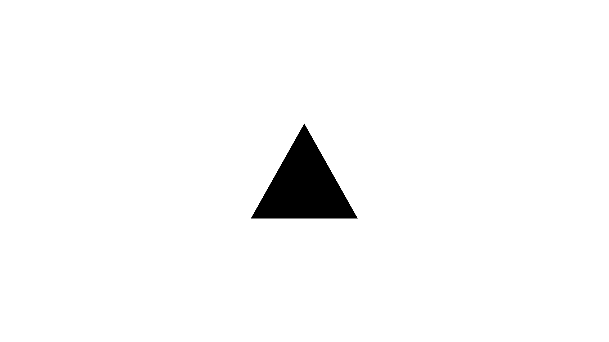

title: Integrations
descriptions: Sematext integrations with ready to use monitoring agents and log shippers for infrastructure and container monitoring, log management and analytics, alerting, chatops, and more. Our Cloud and on-premises platform exposes the Elasticsearch API and syslog receivers with built in anomaly detection, data analysis and visualization tools and services

## Monitoring & Logs

Sematext supports over 100 different integrations that automatically collect thousands of metrics and logs. Each integration includes a number of pre-built dashboards, reports, and alert rules that are readily available, requiring no additional configuration. Additionally, several integrations can be enabled through [Service Autodiscovery](/monitoring/autodiscovery/) without the need for modifying or restarting any services.

	

		<a href="../integration/apache/">
			

				

					

						

							
						

						

							<h5>Apache</h5>monitor total network traffic, PHP FPM pool listen queues and processes, scoreboard available worker and
							connection Ops, request rates, memory, cpu, ...
						

					

				

			

		</a>
	

	

		<a href="../integration/elasticsearch/">
			

				

					

						

							
						

						
<h5>Elasticsearch</h5>request rate, indexing, JVM Pool size, latency, documents, nodes, cluster health, cache, thread pools, circut breakers, search, index stats, ...

					

				

			

		</a>
	

	

          <a href="../integration/jvm/">
                  

                          

                                  

                                          

                                                  
                                          

                                          
<h5>JVM</h5>max open files, used, deamon thread count, thread count, collection count / avg size / max time, ...

                                  

                          

                  

          </a>
  

  

          <a href="../integration/kubernetes/">
                  

                          

                                  

                                          

                                                  
                                          

                                          
<h5>Kubernetes</h5> Get detailed insights into your cluster’s health, performance metrics, resource counts amongst other important metrics...

                                  

                          

                  

          </a>
  

  

          <a href="../integration/mysql/">
                  

                          

                                  

                                          

                                                  
                                          

                                          
<h5>Mysql</h5>connections, queries/questions rate, select rate, mysql traffic, cache usage, mysql trafffic, MyISAM key, InnoDB, table stats, ...

                                  

                          

                  

          </a>
  

  

          <a href="../integration/nginx/">
                  

                          

                                  

                                          

                                                  
                                          

                                          

                                                  <h5>Nginx</h5>total requests, connections, serving connections, CPU, load, memory, I/O read/wriew, total network traffic, ...
                                          

                                  

                          

                  

          </a>
  

  

          <a href="../integration/nginxplus/">
                  

                          

                                  

                                          

                                                  
                                          

                                          
<h5>Nginx Plus</h5>requests, cache hits, server checks, status zones, caches, upstreams, CPU, IO read/write, disk space used, ...

                                  

                          

                  

          </a>
  

  

          <a href="../integration/opensearch/">
                  

                          

                                  

                                          

                                                  
                                          

                                          
<h5>OpenSearch</h5>Cluster Health, Shard Stats, Index Stats, Search, Cache, Thread Pools, Circuit Breakers, Connections, Scripting, Ingest...

                                  

                          

                  

          </a>
  

  

          <a href="../integration/postgresql/">
                  

                          

                                  

                                          

                                                  
                                          

                                          

                                                  <h5>PostgreSQL</h5>All key PostgreSQL and OS metrics, in one place.
                                          

                                  

                          

                  

          </a>
  

  

          <a href="../integration/solr/">
                  

                          

                                  

                                          

                                                  
                                          

                                          
<h5>Solr</h5>index stats, request rate, added docs, JVM pool size, query result cache, doxument cache, filter cache, warmup, indexing, ...

                                  

                          

                  

          </a>
  

  

          <a href="../integration/solrcloud/">
                  

                          

                                  

                                          

                                                  
                                          

                                          

                                                  <h5>Solr Cloud</h5>error count, deletes by id, added docs, rollbacks, soft commits, lookups, evictions, hits, max doc, segments, autocommit max time, ...
                                          

                                  

                          

                  

          </a>
  

  

          <a href="../integration/varnishcache/">
                  

                          

                                  

                                          

                                                  
                                          

                                          
<h5>Varnish Cache</h5>Backend and Client connections and requests, Cache Hits and Misses, Threads, Bans...

                                  

                          

                  

          </a>
  

## Monitoring

Sematext Monitoring supports over 100 different integrations that automatically collect thousands of metrics. Each integration includes a number of pre-built dashboards, reports, and alert rules that are readily available, requiring no additional configuration. Additionally, several integrations can be enabled through [Service Autodiscovery](/monitoring/autodiscovery/) without the need for modifying or restarting any services.

	

		<a href="../integration/akka/">
			

				

					

						

							
						

						

							<h5>Akka</h5>predefined visualizations and dashboards with mailbox size, routing time, errors count, actors, dispatchers,
							routers, time in mailbox, ...
						

					

				

			

		</a>
	

	

		<a href="../integration/aws/">
			

				

					

						

							
						

						

							<h5>Amazon Web Services</h5>EC2, EBS and ELB metrics, reads, writes, rejected requests, network in and out, consumed read/write
							ops, requests count, ...

					

				

			

		</a>
	

	

		<a href="../integration/cassandra/">
			

				

					

						

							
						

						

							<h5>Cassandra</h5>write request latency, requests count, cluster state, SSTable, Network traffic, garbage collectors, bloom filter, compactions, cache, cluster metrics, ...

					

				

			

		</a>
	

	

		<a href="../integration/clickhouse/">
			

				

					

						

							
						

						

							<h5>ClickHouse</h5>current metrics, profile events, asynchronous metrics, part stats, replication & replica metrics, ...

					

				

			

		</a>
	

	

		<a href="../integration/couchbase/">
			

				

					

						

							
						

						

							<h5>Couchbase</h5>current metrics, db operations, documents, cache, connections, memory usage, ...

					

				

			

		</a>
	

	

		<a href="../integration/docker/">
			

				

					

						

							
						

						
<h5>Containers</h5>container CPU, memory, count, swap, memory I/O throughput, network traffic and errors, memory failed counter, ...

					

				

			

		</a>
	

	

		<a href="../integration/hbase/">
			

				

					

						

							
						

						
<h5>HBase</h5>non heap used / max / commited, success time and ops, blocked, teminated, warn, fatal, total max, and many other metrics, ...

					

				

			

		</a>
	

  

    <a href="../integration/infra/">
      

        

          

            

              
            

            
<h5>Infra</h5>Monitor servers, VMs, containers (Docker, Kubernetes, Swarm, Nomad, EKS, ECS, AKS, GKE...), clusters, processes, packages, events, ...

          

        

      

    </a>
  

  

    	<a href="../integration/jenkins/">
    		

    			

    				

    					

    						
    					

    					

    						<h5>Jenkins</h5>health and executors state; builds, nodes, jobs, runs activity; http requests and responses...
    					

    				

    			

    		

    	</a>
    

  

          <a href="../integration/kafka/">
                  

                          

                                  

                                          

                                                  
                                          

                                          
<h5>Kafka</h5>consumer lag, ISR, purgatory, active controllers, requests, topic bytes/messages, consumer request time, partitions, log cleaner, ...

                                  

                          

                  

          </a>
  

  

          <a href="../integration/mongodb/">
                  

                          

                                  

                                          

                                                  
                                          

                                          
<h5>MongoDB</h5>storage, DB memory, locks, documents, DB network, DB operations, DB journal, background flushes, network connections, ...

                                  

                          

                  

          </a>
  

  

          <a href="../integration/node.js/">
                  

                          

                                  

                                          

                                                  
                                          

                                          
<h5>Node.js</h5>process memory, workers, event loop latency, garbage collection, CG released memory, response time, request rate, ...

                                  

                          

                  

          </a>
  

  

          <a href="../integration/express.js/">
                  

                          

                                  

                                          

                                                  
                                          

                                          
<h5>Express.js</h5>process memory, workers, event loop latency, garbage collection, response/request rates, HTTP monitoring, ...

                                  

                          

                  

          </a>
  

  

          <a href="../integration/php/">
                  

                          

                                  

                                          

                                                  
                                          

                                          
<h5>PHP</h5>active processes, idle processes, max listen queue, slow request count, total processes, listen queue, ...

                                  

                          

                  

          </a>
  

  

          <a href="../integration/redis/">
                  

                          

                                  

                                          

                                                  
                                          

                                          

                                                  <h5>Redis</h5>connected clients, keyspace missses, command processes, expired keys, keyspace hits, evicted keys, used memory, connected slaves, ...
                                          

                                  

                          

                  

          </a>
  

  

          <a href="../integration/hadoop/">
                  

                          

                                  

                                          

                                                  
                                          

                                          
<h5>Hadoop</h5>max open files, used, deamon thread count, thread count, collection count / avg size / max time / time, ...

                                  

                          

                  

          </a>
  

  

          <a href="../integration/spark/">
                  

                          

                                  

                                          

                                                  
                                          

                                          
<h5>Spark</h5>last received delay, unprocessed batches, receivers, waiting batches, active jobs, driver memory used, all jobs, executors, cores free, write ops, ...

                                  

                          

                  

          </a>
  

  

          <a href="../integration/storm/">
                  

                          

                                  

                                          

                                                  
                                          

                                          
<h5>Storm</h5>supervisors, topologies, slots, acked, failed, executed, tasks, emitted, transferred, acked, failed, ...

                                  

                          

                  

          </a>
  

  

          <a href="../integration/tomcat/">
                  

                          

                                  

                                          

                                                  
                                          

                                          
<h5>Tomcat</h5>bytes sent, error requests, max connections, poller thread count, current threads busy, queue size, pool size, rejected sessions, ...

                                  

                          

                  

          </a>
  

  

          <a href="../integration/zookeeper/">
                  

                          

                                  

                                          

                                                  
                                          

                                          

                                                  <h5>Zookeeper</h5>quorum size, outstanding requests, watch count, count, ephemerals, node count, sent, approximate data size, sent, count, ...
                                          

                                  

                          

                  

          </a>
  

## Logging
### Ingestion
Logs can be shipped to Sematext using a number of different [log shippers, logging libraries, protocols, APIs](./generic-logs-integration), etc.

Two main ingestion APIs are supported:
- HTTP / REST API which is compatible with Elasticsearch bulk indexing API
- Syslog via various protocols

The Elasticsearch-compatible API lets you:

- send log events directly from your application, using any logging library that has an Elasticsearch Adapter
- send log events using a log shipper as Filebeat, Logstash, rsyslog,Fluentd, Logagent, Vector, or anything that can output to Elasticsearch

The Elasticsearch-compatible API is not limited to log ingestion.  It can also be used for querying logs, retrieving them programmatically, or to change the log even structure or mapping in Elasticsearch parlance. Using this API you can:
- search for logs from your own application, from the command line using tools like `curl`, or by configuring/adapting existing Elasticsearch UIs, such as Kibana
- optionally define custom mappings for your log types, so you can tweak the way your logs are indexed

### Dashboards
Each logs integration comes with a number of useful dashboards and reports out of the box, as well as out of the box alert rules and copy-paste instructions for setting up log collection and shipping.  Log shipping can also be enabled through [Logs Autodiscovery](/logs/discovery/intro/) without installing any additional log shippers and without the need to connect to servers, VMs, containers, etc.

	

		<a href="./generic-logs-integration">
			

				

					

						

							
						

						

							<h5>Generic Logs</h5>Logs that support multiple different integrations, log shippers, and configurations.
						

					

				

			

		</a>
	

	

		<a href="./github-webhook-events-integration">
			

				

					

						

							
						

						

							<h5>GitHub Webhook Events</h5>By configuring the Webhook to point to Sematext, you can store all data about the triggered events in one place. Gain insight into your entire GitHub workflow in your Organization.
						

					

				

			

		</a>
	

	

		<a href="./journald-integration">
			

				

					

						

							
						

						

							<h5>Linux Logs</h5>Ship and manage Linux logs. Gain insight into messages generated by your infrastructure.
						

					

				

			

		</a>
	

	

		<a href="./vercel-logs-integration">
			

				

					

						

							
						

						

							<h5>Vercel Logs</h5>Receive and manage logs from Vercel. Gain insight into Static and Jamstack sites and Serverless Functions.
						

					

				

			

		</a>
	

	

		<a href="./mobile-apps-logs">
			

				

					

						

							
						

						

							<h5>Mobile Apps Logs</h5>Ship and manage mobile applications logs, get insight into logs associated with the device, operating system and location.
						

					

				

			

		</a>
	

## Experience

	

		<a href="../experience/integrations#angular">
			

				

					

						

							
						

						

							<h5>Angular</h5>Full support for single-page applications built with the Angular framework.
						

					

				

			

		</a>
	

	

		<a href="../experience/integrations#react">
			

				

					

						

							
						

						

							<h5>React</h5>Full support for single-page applications built with the React library.
						

					

				

			

		</a>
	

	

		<a href="../experience/integrations#vuejs">
			

				

					

						

							
						

						

							<h5>Vue.js</h5>Full support for single-page applications built with Vue.js.
						

					

				

			

		</a>
	

	

		<a href="../experience/integrations#ember">
			

				

					

						

							
						

						

							<h5>Ember</h5>Full support for single-page applications built with the Ember framework.
						

					

				

			

		</a>
	

  

		<a href="../experience/integrations#static-websites">
			

				

					

						

							
						

						

							<h5>Static Websites</h5>Full support for all types of static websites.
						

					

				

			

		</a>
	

  

		<a href="../experience/integrations#server-side-rendered-websites">
			

				

					

						

							
						

						

							<h5>Server-side rendered websites</h5>Full support for all types of SSR websites and applications.
						

					

				

			

		</a>
	

	

		<a href="../experience/integrations#vercel">
			

				

					

						

							
						

						

							<h5>Vercel</h5>Full support for real user monitoring metrics for all types of websites hosted on Vercel.
						

					

				

			

		</a>
	

All of the integrations require adding and [configuring the Experience script](../experience/getting-started). However, unlike static websites and SSR websites, single-page applications require [one more configuration step](../experience/integrations) to register route changes.

## Alerts & Notifications

Multiple types of [alerts](/alerts) can be triggered on metrics and on logs and sent to a number of Notification Hooks - 3rd party services, email, or Webhooks: 

- [Email as default system notification hook](/integration/alerts-email-integration/)
- [Custom user defined WebHook](/integration/alerts-webhooks-integration/)
- [PagerDuty](/integration/alerts-pagerduty-integration/)
- [Slack](/integration/alerts-slack-integration/)
- [OpsGenie](/integration/alerts-opsgenie-integration/)
- [Big Panda](/integration/alerts-bigpanda-integration/)
- [VictorOps](/integration/alerts-victorops-integration/)
- [Pushover](/integration/alerts-pushover-integration/)
- [Telegram](/integration/alerts-telegram-integration/)
- [Microsoft Teams](/integration/alerts-microsoft-teams-integration/)
- [SMS / text](/integration/alerts-sms-integration/)
- [Spike.sh](/integration/alerts-spikesh-integration/)
- [Squadcast](/integration/alerts-squadcast-integration/)
- [Twilio](/integration/alerts-twilio-integration/)
- [Signl4](/integration/alerts-signl4-integration/)
- [Nagios](/integration/alerts-nagios-integration/)
- [Hipchat](/integration/alerts-hipchat-integration/)
- [Zapier](/integration/alerts-zapier-integration/)
- [AlertOps](/integration/alerts-alertops-integration/)
