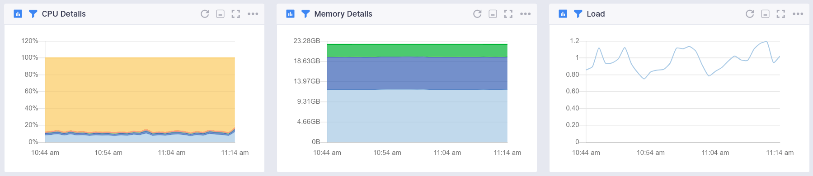
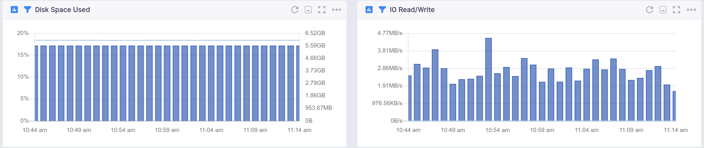
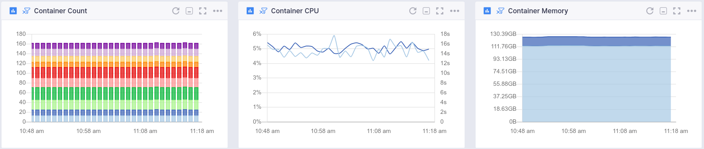
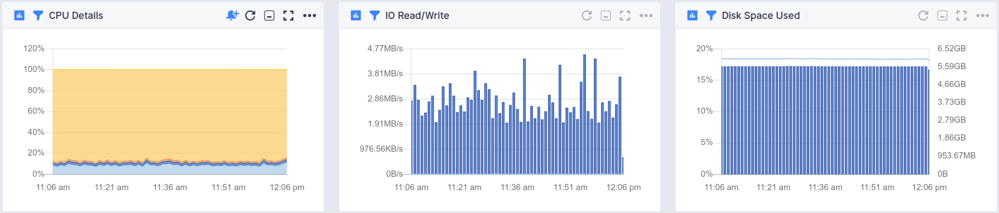
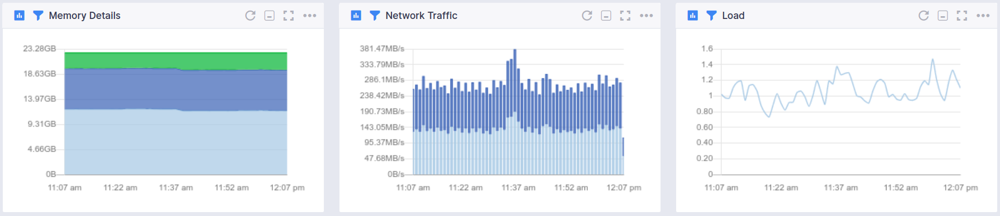
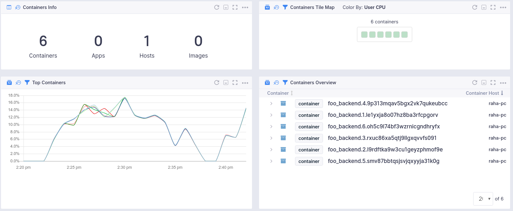

title: Infrastructure Monitoring Integration
description: Infrastructure performance monitoring - metrics, events, processes, packages, log collection and parsing for bare-metal servers, virtual machines and containers with support for Docker, containerd, k8s, swarm, nomad, ecs, eks, aks, gke.

The Sematext Infra Integration uses [Sematext Agent](../agents/sematext-agent) to collect metrics, events, processes, packages for bare-metal servers, virtual machines and containers. Container monitoring is supported for Docker, containerd, k8s, Swarm, Nomad, ECS, EKS, AKS, GKE and more.

We at Sematext aim to save you time and effort by giving you a strong starting point for monitoring your infrastrcture. You will **not** have to:

- figure out which metrics to collect and which ones to ignore
- give metrics meaningful labels
- hunt for metric descriptions in the docs so that you know what each of them actually shows
- build charts to group metrics that you really want on the same charts, not N separate charts
- figure out, for each metric, which aggregation to use (min? max? avg? something else?)
- build dashboards to combine charts with metrics you typically want to see together
- set up basic alert rules

We set it up for you, out-of-the-box!


## Monitoring with Sematext Agent

Sematext Agent collects various metrics and other info about servers, virtual machines, container hosts and containers and ships that to Sematext Cloud.

First create an [Infra Monitoring App in Sematext Cloud](https://apps.sematext.com/ui/monitoring-create). You will be presented with installation instructions for many possible environments.


## How it works

A Golang-based [Sematext Agent](../agents/sematext-agent) will be installed on your machine. This Agent sends all infrastructure data to an Infra App whose token is configured during the Agent's installation.

It is capable of running in two kinds of environments:
- bare-metal, virtual machine - we provide rpm/deb packages for most popular linux distributions
- containers - a special sematext/agent container image provides support for monitoring in container environments

In both cases, installing the agent will start gathering all infrastructure data right away. Additionally, it will enable [Monitoring](../monitoring/autodiscovery) and [Logs Autodiscovery](../logs/discovery/intro/) features which make it possible to automatically start monitoring any of supported [Sematext integrations](./index) or to ship logs produced by any process or container.


## Enabling Infra Monitoring

If you've set up Sematext Monitoring at some point in the past, you can easily enable Infra Monitoring by:

- [Upgrading](./spm-faq/#agent-updating) your `sematext-agent` to the latest version
- Setting up Infra App token on each of your machines by running the `setup-infra` command (in bare-metal/virtual machine environments)

> **Note**: For container monitoring, we suggest uninstalling the existing deprecated Agent and going through the new setup steps for Docker Monitoring in Sematext Cloud.

When doing a clean installation, regardless of whether you're installing in containerized environment or not, follow monitor installation instructions displayed in Sematext Cloud. Those instructions will always include everything needed to set up an Infra App, either on its own or alongside some other App Agent.


### The `setup-infra` command

This command is applicable only in bare-metal/virtual machine environments.

Setting up or changing which Infra App should receive infrastructure data and metrics from a particular machine can be done with the <b>setup-infra</b> command.

To see which Infra Apps exist in your account visit Sematext Cloud -> Integrations -> Apps. You can choose any of the existing Infra Apps or create a new one.

Once you do that you'll have the token of that particular App. To set up the token run the following command on each machine that you wish to update:

<pre>sudo bash /opt/spm/bin/setup-infra --infra-token YOUR_INFRA_APP_TOKEN_HERE</pre>


### Enabling Infra Monitoring in Docker environment
You install the Agent simply by running one Docker command. This will start the Agent as a Docker container on your host.

```bash
docker run -d  --restart always --privileged -P --name st-agent \
  -v /:/hostfs:ro \
  -v /sys/kernel/debug:/sys/kernel/debug \
  -v /var/run/:/var/run/ \
  -v /proc:/host/proc:ro \
  -v /etc:/host/etc:ro \
  -v /sys:/host/sys:ro \
  -v /usr/lib:/host/usr/lib:ro \
  -e INFRA_TOKEN=6377be8e-8441-46de-85dc-11ee3646c3de \
  -e REGION=US \
  -e JOURNAL_DIR=/var/run/st-agent \
  -e LOGGING_WRITE_EVENTS=false \
  -e LOGGING_REQUEST_TRACKING=false \
  -e LOGGING_LEVEL=info \
  -e NODE_NAME=`hostname` \
  -e CONTAINER_SKIP_BY_IMAGE=sematext \
  sematext/agent:latest
```

### Infra with Docker Compose
If you prefer adding the Agent in a `docker-compose` configuration, here's how you do it.

```yaml
# docker-compose.yml
version: '3'
services:
  sematext-agent:
    image: 'sematext/agent:latest'
    environment:
      - affinity:container!=*sematext-agent*
      - INFRA_TOKEN=6377be8e-8441-46de-85dc-11ee3646c3de
      - REGION=US
      - JOURNAL_DIR=/var/run/st-agent
      - LOGGING_WRITE_EVENTS=false
      - LOGGING_REQUEST_TRACKING=false
      - LOGGING_LEVEL=info
      - NODE_NAME=$HOSTNAME
      - CONTAINER_SKIP_BY_IMAGE=sematext
    cap_add:
      - SYS_ADMIN
    restart: always
    volumes:
      - '/:/hostfs:ro'
      - '/var/run/:/var/run/'
      - '/sys/kernel/debug:/sys/kernel/debug'
      - '/proc:/host/proc:ro'
      - '/etc:/host/etc:ro'
      - '/sys:/host/sys:ro'
      - '/usr/lib:/host/usr/lib:ro'
```

Then you can run one command to start the Agent.

```bash
docker-compose up -d
```

### Infra with Docker Swarm

If you're running a Docker Swarm cluster, it's just as easy to run a Docker Swarm service.

```bash
docker service create --mode global --name st-agent \
  --restart-condition any \
  --mount type=bind,src=/,dst=/hostfs,readonly \
  --mount type=bind,src=/var/run,dst=/var/run/ \
  --mount type=bind,src=/usr/lib,dst=/host/usr/lib \
  --mount type=bind,src=/sys/kernel/debug,dst=/sys/kernel/debug \
  --mount type=bind,src=/proc,dst=/host/proc,readonly \
  --mount type=bind,src=/etc,dst=/host/etc,readonly \
  --mount type=bind,src=/sys,dst=/host/sys,readonly \
  -e NODE_NAME={{.Node.Hostname}} \
  -e INFRA_TOKEN=6377be8e-8441-46de-85dc-11ee3646c3de \
  -e REGION=US \
  -e JOURNAL_DIR=/var/run/st-agent \
  -e LOGGING_REQUEST_TRACKING=false \
  -e LOGGING_WRITE_EVENTS=false \
  -e LOGGING_LEVEL=info \
  -e PKG_ENABLED=false \
  sematext/agent:latest
```

If you like using `docker stack`, editing the `docker-compose.yml` from above slightly you'll have a working configuration.

```yaml
version: "3"
services:
  agent:
    image: sematext/agent:latest
    deploy:
      mode: global
      labels: [APP=AGENT]
      restart_policy:
        condition: any
        delay: 1s
    cap_add:
      - SYS_ADMIN
    restart: always
    environment:
      - affinity:container!=*sematext-agent*
      - INFRA_TOKEN=6377be8e-8441-46de-85dc-11ee3646c3de
      - JOURNAL_DIR=/var/run/st-agent
      - LOGGING_WRITE_EVENTS=false
      - LOGGING_REQUEST_TRACKING=false
      - LOGGING_LEVEL=info
      - NODE_NAME=$HOSTNAME
      - CONTAINER_SKIP_BY_IMAGE=sematext
      - REGION=US
      - PKG_ENABLED=false
    volumes:
      - "/:/hostfs:ro"
      - "/var/run:/var/run/"
      - "/usr/lib:/host/usr/lib"
      - "/sys/kernel/debug:/sys/kernel/debug"
      - "/proc:/host/proc:ro"
      - "/etc:/host/etc:ro"
      - "/sys:/host/sys:ro"
```

Then you run:

```bash
docker stack deploy -c docker-compose.yml <name>
```

The Sematext Agent will start collecting dozens of key metrics right away, and start showing you the performance and health of your containers immediately.

## Collected Metrics
The Sematext Agent will collect the following container and host metrics.


### Host Metrics

These metrics are collected for all environments where the agent is installed (bare-metal, virtual machine, containers).

- CPU
- memory



- disk



- network
- processes
- containers



- orchestrator platforms

For more details, see [OS metrics](../agents/sematext-agent/os-metrics).

### Process Metrics

These metrics are collected for all environments where the agent is installed (bare-metal, virtual machine, containers).

See [Process Monitoring](../monitoring/processes) and [Process Metrics](../agents/sematext-agent/processes/metrics) for more info.

### eBPF Support

To gain deep **insight into the Linux kernel**, Sematext Agent relies on **eBPF** to implant **instrumentation points**, which means to **attach eBPF programs to kprobes** on kernel functions. This ensures a very efficient and powerful system exploration approach with better network tracing and negligible overhead.

### Service Auto-Discovery

Sematext Agent can **auto-discover services** deployed on physical/virtual hosts and containers. It also collects data about your infrastructure to provide you with infrastructure inventory reports. It collects events from different sources such as OOM notifications, container or Kubernetes events.

### Container Metrics

- Container runtime agnostic discovery and monitoring
    - Containers are discovered from cgroupfs hierarchies
    - Supports Docker and Rkt container engines
- Container metrics fetched directly from cgroupfs
    - CPU usage
    - Disk space usage and IO stats
        
    - Memory usage, memory limits, and memory fail counters
    - Network IO stats
        
- Collection of host inventory information
    - Host kernel version/system information
    - Information about installed software packages
- Collection of container metadata
    - Container name
    - Image name
    - Container networks
    - Container volumes
    - Container environment
    - Container labels including relevant information about orchestration
    - Kubernetes metadata such as Pod name, UUID, Namespace
    - Docker Swarm metadata such as Service name, Swarm Task etc.
        
- Collection of container events
- Docker events such as start/stop/die/volume mount, etc.
- Kubernetes events such as Pod status changes deployed, destroyed etc.
- Tracking deployment status and Pod restarts over time

That is a lot of information and **Sematext organizes this information in reports** for **infrastructure monitoring**, **container monitoring**, and **Kubernetes cluster monitoring**.

See [container monitoring](../monitoring/containers/) for more info.