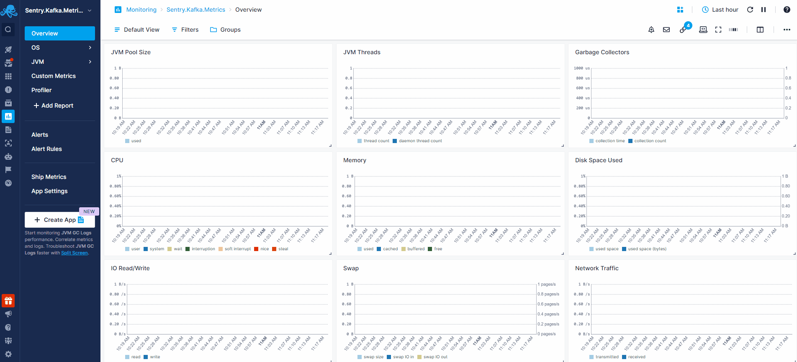

title: JVM
description: Sematext Java application performance monitoring provides real time reports on JVM pool size, utilization and threads, garbage collectors, JVM open files, memory and resource usage, and more. Correlate them with other infrastructure metrics (server, virtualization, logs, etc.), and use proactive alerts and intuitive dashboards for rapid problem diagnosis at JVM level

JVM is an abstract computing machine enabling Java bytecode execution and providing a runtime environment for Java applications. The [Sematext Agent](https://sematext.com/docs/agents/sematext-agent/) collects JVM metrics and garbage collection logs, transmits them to Sematext Cloud; installing the agent takes less than 5 minutes.

## Install Sematext Agent

2. Create an JVM Logs or Monitoring [App](https://sematext.com/docs/guide/app-guide/). This will let you install the agent and control access to your monitoring and logs data.
3. Install the Sematext Agent according to the [https://apps.sematext.com/ui/howto/JVM/overview](https://apps.sematext.com/ui/howto/JVM/overview) displayed in the UI.
4. After installing the agent, the Discovery tab shows all the JVM services identified on the host and you will start receiving metrics or garbage collection logs from JVM services.
5. If you've created an JVM Monitoring App and want to collect JVM garbage collection logs as well, or vice versa, click on the **Create Logs App** button from the left menu panel. This will navigate you to the 'Create Logs App' (or Monitoring App) page, where you'll find all the discovered log sources from JVM services and manage log and metric shipping effortlessly.

Having both JVM Logs and Monitoring Apps lets you correlate performance metrics and logs, and accelerate troubleshooting using [Split Screen](https://sematext.com/docs/guide/split-screen/) for faster resolution. 

To [explore logs and services](https://sematext.com/docs/monitoring/autodiscovery/) across multiple hosts, navigate to [Fleet & Discovery > Discovery > Services](https://apps.sematext.com/ui/fleet-and-discovery/discovery/services) (or  [Sematext Cloud Europe](https://apps.eu.sematext.com/ui/fleet-and-discovery/discovery/services)). From there, you can create additional [Apps](https://sematext.com/docs/guide/app-guide/) or stream data to existing ones without requiring any additional installations. 
