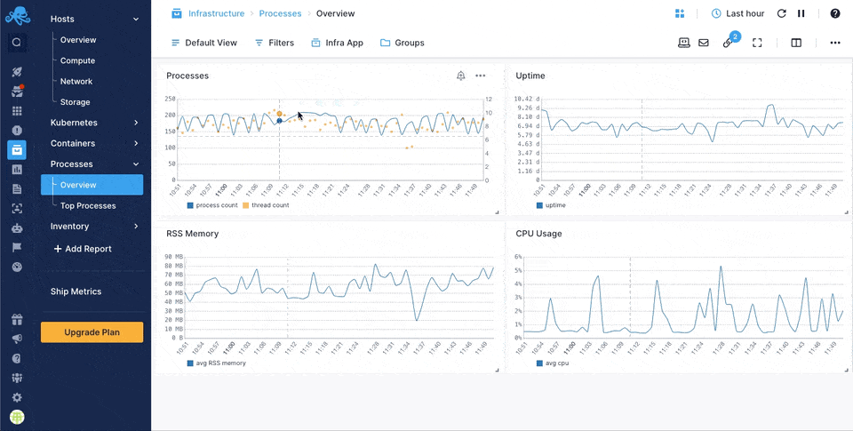
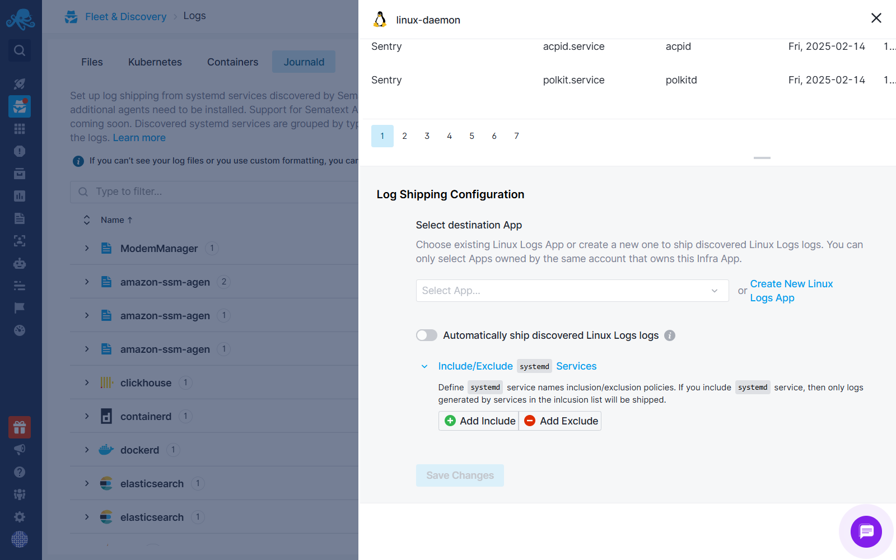

title: Sematext Linux Monitoring
description: Monitor Linux bare metal servers and VMs using a lightweight agent and visualize your full infrastructure in Sematext Cloud

Sematext Linux Monitoring provides insights into your Linux infrastructure, automatically monitoring servers, processes, packages and more across various Linux distributions. Check the following areas for more information:

- [Linux Servers](https://sematext.com/docs/monitoring/servers/)
- [Linux Processes](https://sematext.com/docs/monitoring/processes/)
- [Linux Packages](https://sematext.com/docs/monitoring/inventory/)
- [Events](https://sematext.com/docs/events/), etc.

## How it works

A lightweight agent, called [Sematext Agent](../agents/sematext-agent), will be installed on your Linux machine. This agent sends all infrastructure data to an Infra App in Sematext Cloud, whose token is configured during the agent's installation.

The agent itself can be installed either using a [native package manager](https://sematext.com/docs/agents/sematext-agent/installation/) for each distribution or using configuration automation tools like Ansible. Every option is available together with instructions during the [creation of an Infra App](https://sematext.com/docs/monitoring/infrastructure/#create-an-infra-app).

## Supported Linux distributions

Linux Monitoring supports the following Linux distributions:

- Ubuntu
- Debian
- CentOS
- Red Hat Enterprise Linux (RHEL)
- Fedora
- openSUSE
- Amazon Linux

For more information, please refer to our [platform support policy](https://sematext.com/docs/agents/sematext-agent/platform-support-policy/#linux) page.

## Infrastructure Reports

As soon as the Sematext Agent is installed, you can navigate to Sematext Cloud > Infrastructure section and access a wide variety of prebuilt reports. These reports contain hundreds of live [infrastructure metrics](https://sematext.com/docs/agents/sematext-agent/os-metrics/) together with their historical data.


All the metrics can be filtered or grouped by each individual host among other [supported tags](https://sematext.com/docs/tags/).

Moreover, some reports contain useful information about the [processes](https://sematext.com/docs/monitoring/processes/) running on your Linux servers 



Other reports give you insights about machine-related information such as host, VM, or container properties, kernel versions, and installed packages. All these are part of [Inventory Monitoring](https://sematext.com/docs/monitoring/inventory/).


## Out of the box alerts

Each time you create a new Infra App in Sematext Cloud to monitor your Linux servers, a number of pre-configured alerts are created as well, fine tuned to catch various issues and prevent your systems to go down. 

Refer to our [infrastructure default alerts](https://sematext.com/docs/monitoring/servers/#core-infrastructure-alerting) to learn more information.

## Logs

[Sematext Agent](https://sematext.com/docs/agents/sematext-agent/releasenotes/) is capable of collecting Linux File and JournaId logs logs along with metrics.

### Install Sematext Agent

1. Create a Linux Logs [App](https://sematext.com/docs/guide/app-guide/). This will let you install the agent and control access to your logs data.
2. Install [Sematext Agent](https://sematext.com/docs/agents/sematext-agent/releasenotes/) on each host you want to monitor according to the instructions displayed in the UI
3. Once you install the agent, you will see discovered file and journaId logs from your Linux operating system in your [App](https://sematext.com/docs/guide/app-guide/) within a few minutes.

When you configure log shipping from systemd service units via Fleet & Discovery, the following values will be automatically set in the agent, and the agent will ship service start-stop logs, audit logs, kernel logs, etc.

```
include-linux-matches:
  SYSLOG_IDENTIFIER:
    -"systemd"
    -"audit"
    -"systemd-shutdown"
  SYSLOG_FACILITY
    -"0"
    -"2"
  _COMM:
    -"sudo"
    -"su"
```

You can configure these settings by altering the `include-linux-matches section` in the `/opt/spm/properties/st-agent.yml` file.

Additionally, you can define inclusion and exclusion policies for `systemd` service names. If you include a `systemd` service, only logs generated by services in the inclusion list will be shipped.



### Reports

