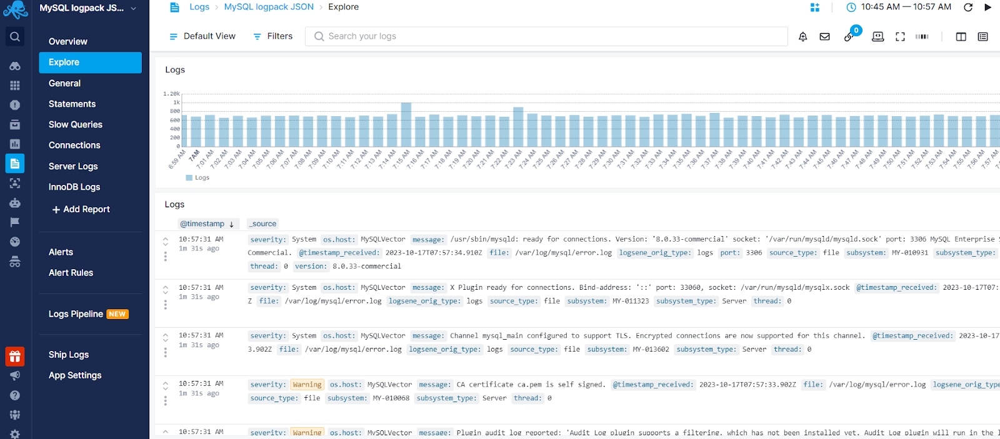
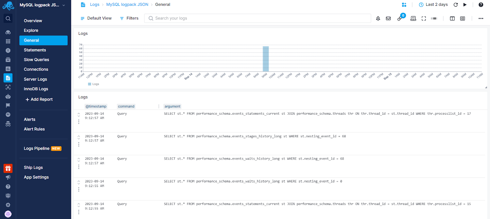
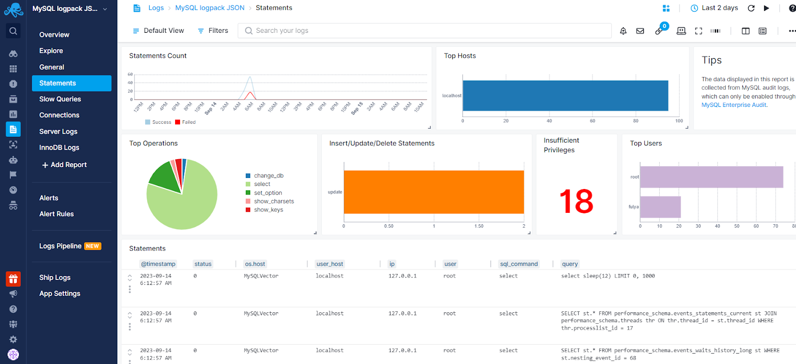
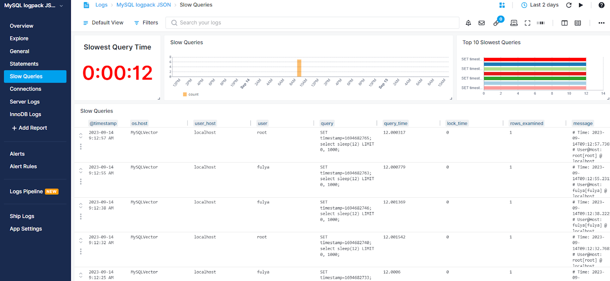
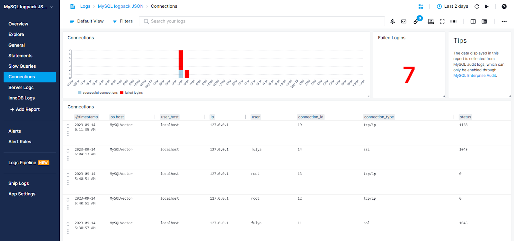
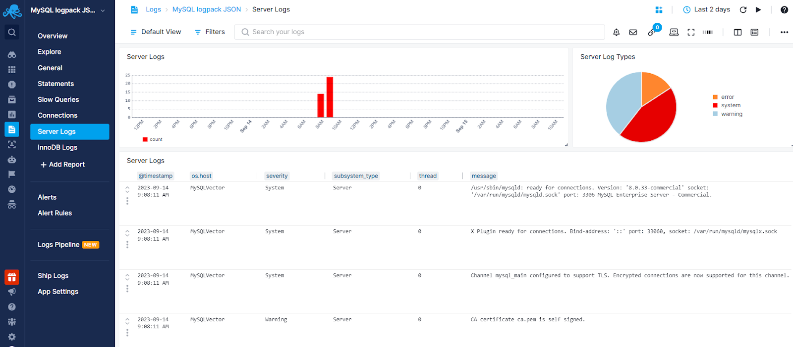
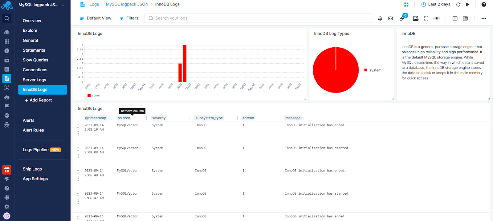

title: MySQL Logs Integration
description: With our new MySQL Logs Integration you get insight into your whole MySQL account. View general logs, connect and disconnect events as well as SQL statement events from clients.

To use the Sematext MySQL Logs integration simply install the [Sematext Agent](../agents/sematext-agent/index.md). The agent will [discover your logs](../logs/discovery/intro.md) and you'll be able to configure MySQL log shipping via the UI. When doing that, you will want to create or select an existing MySQL Logs App because that is what will provide you with all the out of the box dashboards. 

Moreover, the pre-configured anomaly alert rules will notify you about:

- High number of slow queries and queries that are taking more than a certain threshold
- High InnoDB and Server error rates
- Insufficient privileges and failed login attempts to identify security threats

## Log Collection

After installation on the host, [Sematext Agent](../agents/sematext-agent/index.md) can automatically discover, parse, and ship various types of logs, including general logs, slow query logs, MySQL Enterprise Audit logs, and MySQL server error logs.

## Exploring Logs

Once your MySQL logs are in Sematext, you can explore them via the built-in reports or create your own.



## General Logs Report

General logs display connect and disconnect events, as well as SQL statement events from clients. If you suspect an error in a client, you can precisely determine what the client sent to the MySQL instance by examining the general query log.

To enable general logging, execute the following command (for example, from the MySQL command line):

``` bash
SET GLOBAL general_log = 'ON';
```
See [The General Query Log](https://dev.mysql.com/doc/refman/8.0/en/query-log.html) for more details.



## Statements Report

The statement report contains data from audit logs, which can be collected using MySQL Enterprise Audit. This report includes information on the top database operations, users, hosts, insufficient privilege errors, and detailed statement events.

[Sematext Agent](../agents/sematext-agent/index.md) accepts log files in JSON format. See [Audit Logs Format](https://dev.mysql.com/doc/refman/8.0/en/audit-log-file-formats.html#:~:text=By%20default%2C%20audit%20log%20file,JSON%20%2C%20set%20audit_log_file%20to%20audit) for more details. 



## Slow Queries Report

The slow queries report shows detailed information about slow queries that could impact your database performance and overall server performance.

To enable slow query logs, execute the following command(for example, from the MySQL command line):

``` bash
SET GLOBAL general_log = 'ON';
```

See [The Slow Query Log](https://dev.mysql.com/doc/refman/8.0/en/slow-query-log.html#:~:text=The%20slow%20query%20log%20consists,are%20therefore%20candidates%20for%20optimization.) for more details.



## Connections Report

Connections report displays each connection made to MySQL servers, providing user, IP address, connection type, and status information. Additionally, it highlights failed login attempts, allowing you to identify potential security threats. Please note that connection logs can only be collected when using MySQL Enterprise Audit.

[Sematext Agent](../agents/sematext-agent/index.md) accepts log files in JSON format. See [Audit Logs Format](https://dev.mysql.com/doc/refman/8.0/en/audit-log-file-formats.html#:~:text=By%20default%2C%20audit%20log%20file,JSON%20%2C%20set%20audit_log_file%20to%20audit) for more details. 



## Server Logs Report

Server Logs report helps you detect and troubleshoot critical errors to ensure uninterrupted and optimal system operations.



## InnoDB Logs Report

InnoDB is a general-purpose storage engine that balances high reliability and high performance. It is the default MySQL storage engine. While MySQL determines the way in which data is saved to a database, the InnoDB storage engine stores the data on a disk or keeps it in the main memory for quick access. InnoDB storage engine logs give you insights into your storage engine's behavior to ensure optimal usage of resources.



## Troubleshooting

If you have trouble sending logs, try out the latest version of [Sematext Agent](../agents/sematext-agent/installation/). Also, make sure Sematext Agent is configured to send logs to your MySQL Logs App. Lastly, check the [Log Agents panel](https://sematext.com/docs/fleet/#log-agents) for any errors, and refer to our [Sematext Logs FAQ](https://sematext.com/docs/logs/faq/) for useful tips.


