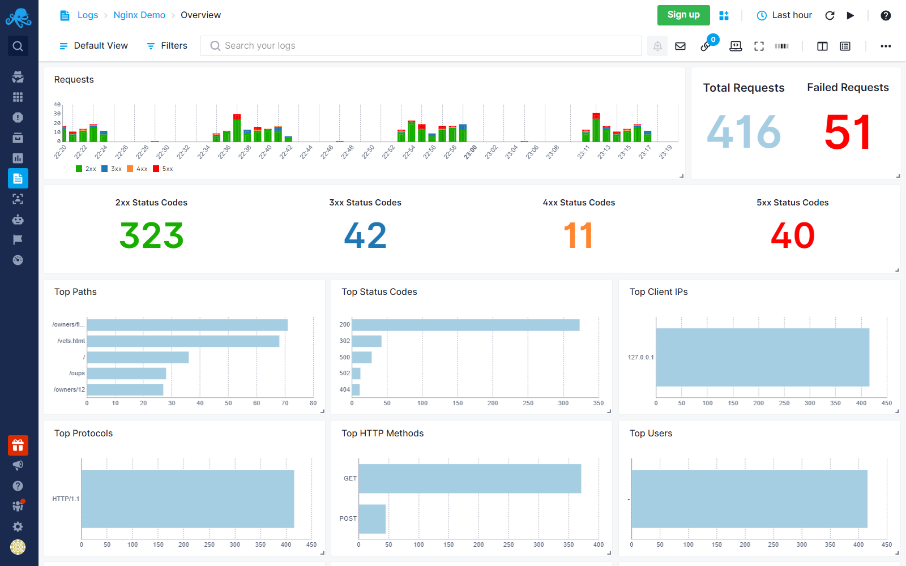

title: Nginx
description: The Sematext monitoring agent can collect many metrics from NGINX instances, including requests, reading, writing, waiting, active and more. Utilize built-in anomaly detection, threshold, and heartbeat alerting and send notifications to email and various chatops messaging services. dditionally, with event correlation, log filtering, and customizable visualizations, monitor cluster health seamlessly. With the Nginx Logs Integration, troubleshoot connection, access, and various NGINX issues.

Nginx is a high-performance, open-source web server and reverse proxy that handles HTTP, HTTPS, and other network protocols, renowned for its scalability and efficient handling of concurrent connections. The [Sematext Agent](https://sematext.com/docs/agents/sematext-agent/) collects Nginx metrics and logs, transmits them to Sematext Cloud; installing the agent takes less than 5 minutes.

## Install Sematext Agent

1.  Activate the Nginx stub_status module in the server section of your Nginx config file. If you are using the default Nginx config file it will be in `/etc/nginx/sites-enabled/default`:

        location /nginx_status {
          stub_status on;
          access_log off;
        }

2. Create an Nginx Logs or Monitoring [App](https://sematext.com/docs/guide/app-guide/). This will let you install the agent and control access to your monitoring and logs data.
3. Install the Sematext Agent according to the [https://apps.sematext.com/ui/howto/Nginx/overview](https://apps.sematext.com/ui/howto/Nginx/overview) displayed in the UI.
4. After installing the agent, the Discovery tab shows all the Nginx services identified on the host and you will start receiving metrics or logs from Nginx services.
5. If you've created an Nginx Monitoring App and want to collect Nginx logs as well, or vice versa, click on the **Create Logs App** button from the left menu panel. This will navigate you to the 'Create Logs App' (or Monitoring App) page, where you'll find all the discovered log sources from Nginx services and manage log and metric shipping effortlessly.

Having both Nginx Logs and Monitoring Apps lets you correlate performance metrics and logs, and accelerate troubleshooting using [Split Screen](https://sematext.com/docs/guide/split-screen/) for faster resolution. For example, correlating metrics (such as request rate, response times, error rates) with logs (access logs, error logs) helps identify performance bottlenecks, anomalies, or errors. For instance, by linking high request rates in metrics with specific errors or slow response times in logs, you can efficiently optimize configurations, fine-tune caching strategies, or address code-level issues to enhance NGINX performance. Or if you see an increase in 4XX errors in Nginx logs, monitoring can tell what's the impact on Nginx's response times and CPU usage.

To [explore logs and services](https://sematext.com/docs/monitoring/autodiscovery/) across multiple hosts, navigate to [Fleet & Discovery > Discovery > Services](https://apps.sematext.com/ui/fleet-and-discovery/discovery/services) (or  [Sematext Cloud Europe](https://apps.eu.sematext.com/ui/fleet-and-discovery/discovery/services)). From there, you can create additional [Apps](https://sematext.com/docs/guide/app-guide/) or stream data to existing ones without requiring any additional installations. 

## Nginx Metrics

Metric Name | Key | Agg | Type | Description
--- | --- | --- | --- | ---
requests | nginx.request.count | Sum | Long | <b>requests</b>: Request count
reading | nginx.requests.connections.reading | Avg | Double | <b>reading</b>: Nginx reads request header
writing | nginx.requests.connections.writing | Avg | Double | <b>writing</b>: Nginx reads request body, processes request, or writes response to a client
waiting | nginx.requests.connections.waiting | Avg | Double | <b>waiting</b>: keep-alive connections
active | nginx.requests.connections.active | Avg | Double | <b>active</b>: number of all open connections

## PHP-FPM Monitoring

PHP-FPM monitoring can be enabled along with Nginx monitoring. See [PHP-FPM](./php) for more details.

## NginxPlus Metrics

Metric Name  Key *(Type)* *(Unit)*                                                                    |  Description
---------------------------------------------------------------------------------------------------------|----------------------------------------------------------------------------------------------------------------------------------------------------------------
cache size **nginxp.cache.size**  *(long gauge)*                                                   |  The current size of the cache
max cache size **nginxp.cache.size.max**  *(long gauge)*                                           |  The limit on the maximum size of the cache specified in the configuration
cold state **nginxp.cache.cold**  *(long gauge)*                                                   |  The number of time cache in cold state
responses hits **nginxp.cache.hits.responses**  *(long counter)*                                   |  The number of responses read from the cache
responses hits size **nginxp.cache.hits.bytes**  *(long counter)* *(bytes)*                        |  The number of bytes read from the cache
stale responses **nginxp.cache.stale.responses**  *(long counter)*                                 |  The number of stale responses read from the cache
stale responses size **nginxp.cache.stale.bytes**  *(long counter)* *(bytes)*                      |  The number of stale bytes read from the cache
updating responses **nginxp.cache.updating.responses**  *(long counter)*                           |  The number of updating responses read from the cache
updating responses size **nginxp.cache.updating.bytes**  *(long counter)* *(bytes)*                |  The number of updating bytes read from the cache
revalidated responses **nginxp.cache.revalidated.responses**  *(long counter)*                     |  The number of revalidated responses read from the cache
revalidated responses size **nginxp.cache.revalidated.bytes**  *(long counter)* *(bytes)*          |  The number of revalidated bytes read from the cache
cache missed responses **nginxp.cache.miss.responses**  *(long counter)*                           |  The number of responses not taken from the cache
miss responses size **nginxp.cache.miss.bytes**  *(long counter)* *(bytes)*                        |  The number of bytes read from the proxied server
miss responses written **nginxp.cache.miss.responses.written**  *(long counter)*                   |  The number of miss responses written to the cache
miss written size **nginxp.cache.miss.bytes.written**  *(long counter)* *(bytes)*                  |  The number of miss bytes written to the cache
expired responses **nginxp.cache.expired.responses**  *(long counter)*                             |  The number of expired responses not taken from the cache
expired responses size **nginxp.cache.expired.bytes**  *(long counter)* *(bytes)*                  |  The number of expired bytes written to the cache
expired responses written **nginxp.cache.expired.responses.written**  *(long counter)*             |  The number of expired responses written to the cache
expired responses written size **nginxp.cache.expired.bytes.written**  *(long counter)* *(bytes)*  |  The number of expired bytes written to the cache
bypass responses **nginxp.cache.bypass.responses**  *(long counter)*                               |  The number of bypass responses not taken from the cache
bypass responses size **nginxp.cache.bypass.bytes**  *(long counter)* *(bytes)*                    |  The number of bypass bytes written to the cache
bypass responses written **nginxp.cache.bypass.responses.written**  *(long counter)*               |  The number of bypass responses written to the cache
bypass responses written size **nginxp.cache.bypass.bytes.written**  *(long counter)* *(bytes)*    |  The number of bypass bytes written to the cache
accepted connections **nginxp.connections.accepted**  *(long counter)*                             |  The number of accepted client connections
dropped connections **nginxp.connections.dropped**  *(long counter)*                               |  The number of idle client connections
active connections **nginxp.connections.active**  *(long gauge)*                                   |  The current number of active connections
idle connections **nginxp.connections.idle**  *(long gauge)*                                       |  The current number of idle client connections
total requests **nginxp.requests**  *(long counter)*                                               |  The total number of client requests
current active requests **nginxp.requests.current**  *(long gauge)*                                |  The current number of client requests
zone total requests **nginxp.zone.requests**  *(long counter)*                                     |  The total number of client requests received from clients
processing requests **nginxp.zone.requests.processing**  *(long gauge)*                            |  The number of client requests that are currently being processed
discarded requests **nginxp.zone.requests.discarded**  *(long counter)*                            |  The number of requests completed without sending a response
received clients data **nginxp.zone.traffic.rx.bytes**  *(long counter)* *(bytes)*                 |  Bytes received from clients
sent clients data **nginxp.zone.traffic.tx.bytes**  *(long counter)* *(bytes)*                     |  Bytes sent to clients
1xx responses **nginxp.zone.responses.1xx**  *(long counter)*                                      |  The number of responses with status codes 1xx
2xx responses **nginxp.zone.responses.2xx**  *(long counter)*                                      |  The number of responses with status codes 2xx
3xx responses **nginxp.zone.responses.3xx**  *(long counter)*                                      |  The number of responses with status codes 3xx
4xx responses **nginxp.zone.responses.4xx**  *(long counter)*                                      |  The number of responses with status codes 4xx
5xx responses **nginxp.zone.responses.5xx**  *(long counter)*                                      |  The number of responses with status codes 4xx
total responses **nginxp.zone.responses**  *(long counter)*                                        |  The total number of responses
status backup **nginxp.upstream.server.backup**  *(long gauge)*                                    |  A value indicating whether the server is a backup server
server weight **nginxp.upstream.server.weight**  *(long gauge)*                                    |  Weight of the server
state up **nginxp.upstream.state.up**  *(long counter)*                                            |  Server is up
state down **nginxp.upstream.state.down**  *(long counter)*                                        |  Server is down
state unavailable **nginxp.upstream.state.unavailable**  *(long counter)*                          |  Server is unavailable
state unhealthy **nginxp.upstream.state.unhealthy**  *(long counter)*                              |  Server is unhealthy
received data **nginxp.upstream.traffic.rx.bytes**  *(long counter)* *(bytes)*                     |  The number of bytes sent to this server.
sent data **nginxp.upstream.traffic.tx.bytes**  *(long counter)* *(bytes)*                         |  The number of bytes received from this server.
upstream check fails **nginxp.upstream.checks.fail**  *(long counter)*                             |  The number of unsuccessful attempts to communicate with the server
upstream check unavailable **nginxp.upstream.checks.unavailable**  *(long counter)*                |  How many times the server became unavailable for client requests (state “unavail”) due to the number of unsuccessful attempts reaching the max_fails threshold
downtime **nginxp.upstream.downtime**  *(long counter)* *(ms)*                                     |  Total time the server was in the unavail/checking/unhealthy states
downstart **nginxp.upstream.downstart**  *(long gauge)* *(ms)*                                     |  The time (in milliseconds since Epoch) when the server became unavail/checking/unhealthy
total responses **nginxp.upstream.responses**  *(long counter)*                                    |  The total number of responses obtained from this server
1xx responses **nginxp.upstream.responses.1xx**  *(long counter)*                                  |  The number of responses with status codes 1xx
2xx responses **nginxp.upstream.responses.2xx**  *(long counter)*                                  |  The number of responses with status codes 2xx
3xx responses **nginxp.upstream.responses.3xx**  *(long counter)*                                  |  The number of responses with status codes 3xx
4xx responses **nginxp.upstream.responses.4xx**  *(long counter)*                                  |  The number of responses with status codes 4xx
5xx responses **nginxp.upstream.responses.5xx**  *(long counter)*                                  |  The number of responses with status codes 5xx
upstream health checks **nginxp.upstream.health.checks**  *(long counter)*                         |  The total number of health check requests made
upstream health fails **nginxp.upstream.health.fails**  *(long counter)*                           |  The number of failed health checks
upstream unhealthy count **nginxp.upstream.health.unhealthy**  *(long gauge)*                      |  How many times the server became unhealthy (state unhealthy)
upstream health last passed **nginxp.upstream.health.passed**  *(long gauge)*                      |  Value indicating if the last health check request was successful and passed tests
active connections **nginxp.upstream.connections.active**  *(long gauge)*                          |  The current number of active connections
keepalive connections **nginxp.upstream.connections.keepalive**  *(long gauge)*                    |  The current number of idle keepalive connections
zombie connections **nginxp.upstream.connections.zombies**  *(long gauge)*                         |  The current number of servers removed from the group but still processing active client requests

## Logs

Once data is in, you can explore it via the built-in reports: 

### Exploring logs

Once data is in, you can explore it using the built-in reports or create your own. For example, you can use the Users report to check on where the requests are coming from:

Other built-in reports include:

- **Errors**: Logs specifically about errors. You can see which status codes are returned and which errors are logged by your Nginx server.
- **HTTP**: Logs about Nginx access logs. Use this report to view any and all data about HTTP requests and responses.
- **Sources**: Logs about Nginx source files. You can view where the logs are collected from and from where in the world users are accessing your Nginx server.

## Troubleshooting

If you have trouble sending logs, try out the latest version of [Sematext Agent](../agents/sematext-agent/installation/). Also, make sure Sematext Agent is configured to send logs to your Nginx Logs App. If you're using Nginx in a container, make sure to configure it to output logs to the stdout/stderr streams. Last, check the [Log Agents panel](https://sematext.com/docs/fleet/#log-agents) for any errors, and refer to our [Sematext Logs FAQ](https://sematext.com/docs/logs/faq/) for useful tips.

If you are having issues with Sematext Monitoring, i.e. not seeing Nginx metrics, see
[How do I create the diagnostics package](/monitoring/spm-faq/#how-do-i-create-the-diagnostics-package).

For more troubleshooting information please look at [Troubleshooting](/monitoring/spm-faq/#troubleshooting) section.
