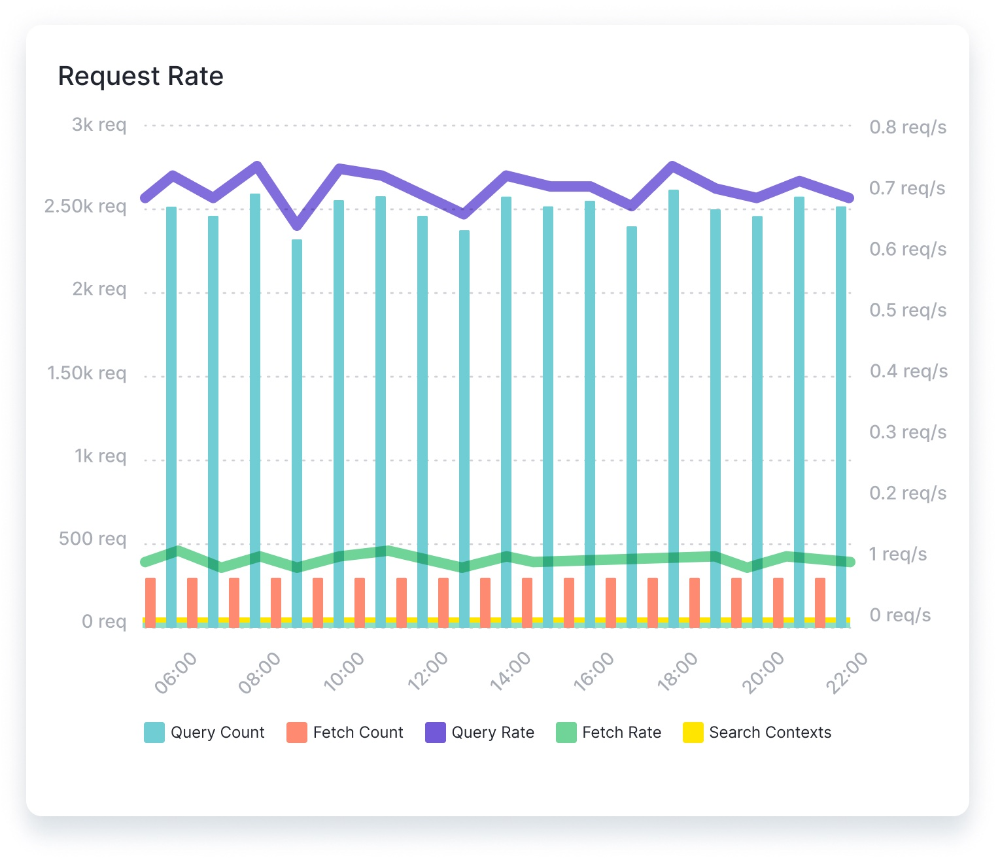
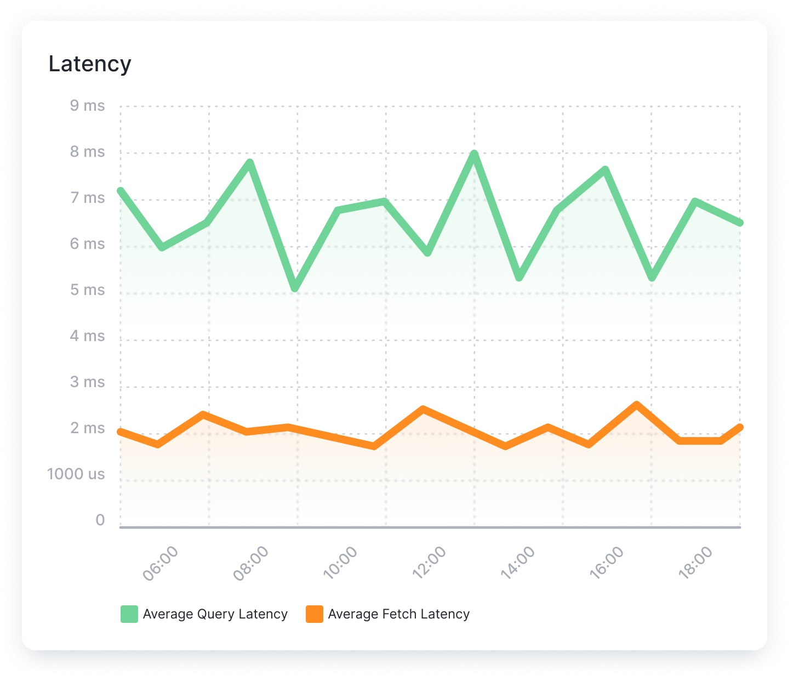
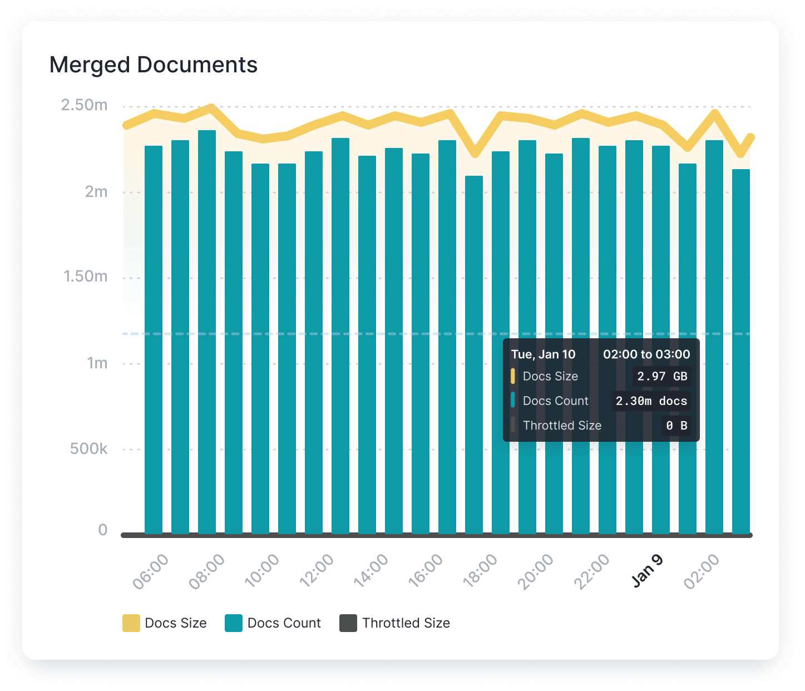
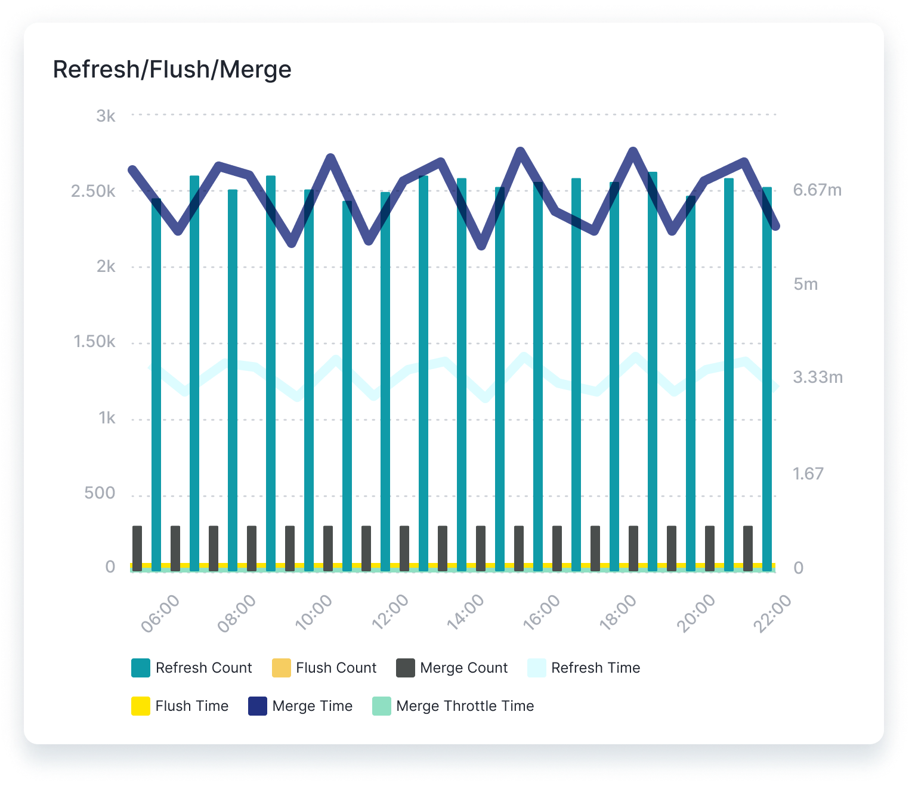
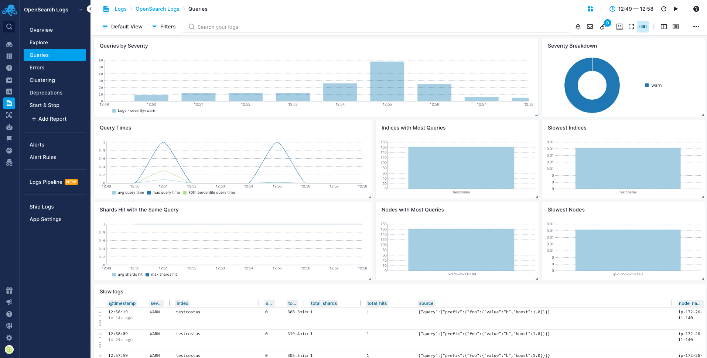
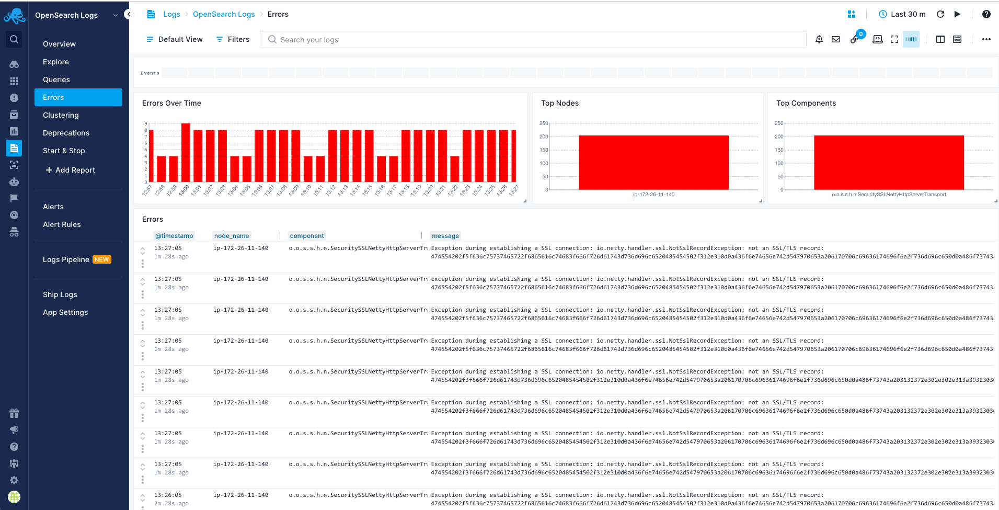
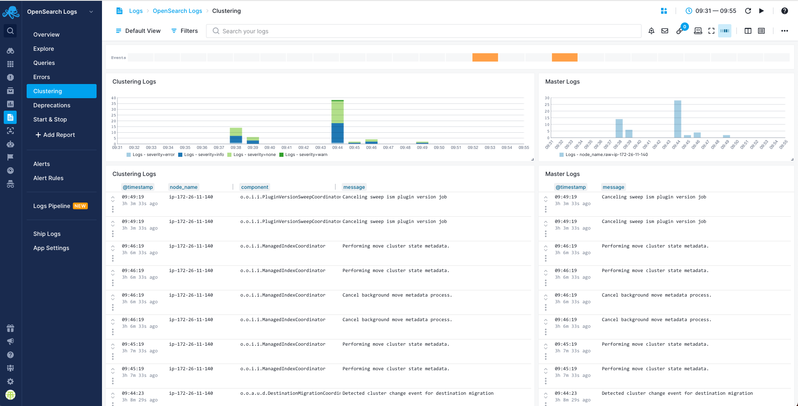
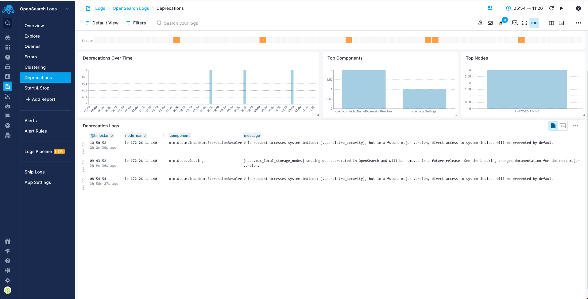
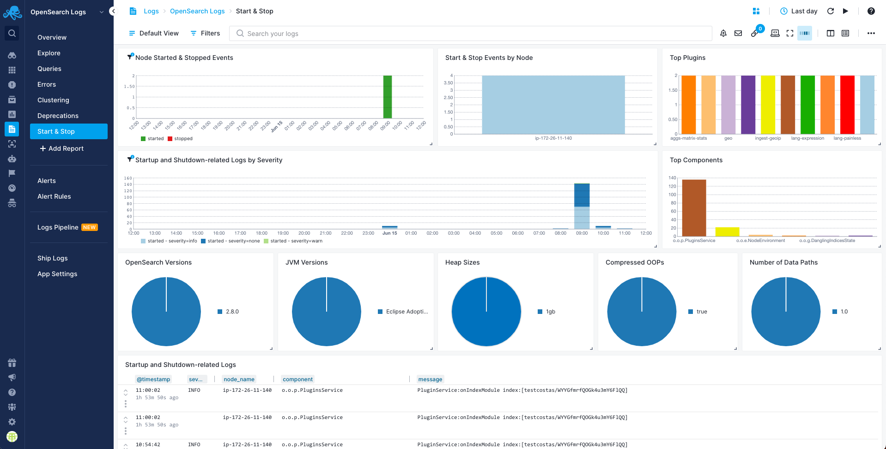

title: Opensearch
description: Covers critical metrics—Cluster States, Pending Tasks, shard memory, search latency, request and cache stats—with anomaly detection and diverse alerting options. Correlate events, logs, filter metrics, and visualize cluster health using standard graphs and custom dashboards. Additionally, the OpenSearch Logs integration offers insights into query distribution, error analysis, deprecations, and cluster manager logs for troubleshooting and analysis.

OpenSearch is a powerful, open-source search and analytics engine built for scalability, flexibility, and advanced data exploration capabilities. The [Sematext Agent](https://sematext.com/docs/agents/sematext-agent/) collects Opensearch metrics and logs, transmits them to Sematext Cloud; installing the agent takes less than 5 minutes.

## Install Sematext Agent

1. Create an Opensearch Logs or Monitoring [App](https://sematext.com/docs/guide/app-guide/). This will let you install the agent and control access to your monitoring and logs data.
3. Install the Sematext Agent according to the [https://apps.sematext.com/ui/howto/Opensearch/overview](https://apps.sematext.com/ui/howto/Opensearch/overview) displayed in the UI.
4. After installing the agent, the Discovery tab shows all the Opensearch services identified on the host and you will start receiving metrics or logs from Opensearch services.
5. If you've created an Opensearch Monitoring App and want to collect Opensearch logs as well, or vice versa, click on the **Create Logs App** button from the left menu panel. This will navigate you to the 'Create Logs App' (or Monitoring App) page, where you'll find all the discovered log sources from Opensearch services and manage log and metric shipping effortlessly.

Having both Opensearch Logs and Monitoring Apps lets you correlate performance metrics and logs, and accelerate troubleshooting using [Split Screen](https://sematext.com/docs/guide/split-screen/) for faster resolution. For example, if you see logs of a node restarting, metrics let you see the impact on the rest of the cluster in terms of CPU, GC, and other metrics. Including query time metrics, even if you don't collect slowlogs from [all] queries.

To [explore logs and services](https://sematext.com/docs/monitoring/autodiscovery/) across multiple hosts, navigate to [Fleet & Discovery > Discovery > Services](https://apps.sematext.com/ui/fleet-and-discovery/discovery/services) (or  [Sematext Cloud Europe](https://apps.eu.sematext.com/ui/fleet-and-discovery/discovery/services)). From there, you can create additional [Apps](https://sematext.com/docs/guide/app-guide/) or stream data to existing ones without requiring any additional installations. 

## Important Metrics to Watch and Alert on

### OpenSearch specific metrics

#### Search Query performance metrics: Request Rate and Latency
When the cluster receives a request, it may need to access data from multiple shards, across multiple nodes. Knowing the rate at which the system is processing and returning requests, how many requests are currently in progress, and how long requests are taking can provide valuable insights into the health and performance of the OpenSearch cluster.

#### Indexing Rate and Merge Times
Monitoring the OpenSearch document indexing rate and merge time can help identify anomalies and related problems before they begin to affect the performance of the cluster. Considering these metrics in parallel with the health of each node can provide essential clues to potential problems within the system, or opportunities to optimize performance.

### System and JVM Metrics
OS metrics like CPU, memory, disk I/O, and network play an essential role in OpenSearch monitoring.

OpenSearch runs within a Java Virtual Machine (JVM) and [monitoring JVM](https://sematext.com/docs/integration/jvm/) heap usage is critical to ensure cluster performance. Moreover, JVM supports [garbage collection](https://sematext.com/docs/integration/jvm-gc-logs/), which means that garbage collection frequency and duration are just as important to measure.

Finally, high disk reads and writes can indicate a poorly tuned system. Since accessing the disk is an expensive process in terms of time, a well-tuned system should reduce disk I/O wherever possible.

## Metrics

Metric Name  Key *(Type)* *(Unit)*                                                                             |  Description
------------------------------------------------------------------------------------------------------------------|--------------------------------------------------------------------------------------------------
outgoing searches **adaptiveReplicaSelection.searches.outgoing**  *(long gauge)*                            |  Searches from the monitored node to the remote node
average queue size **adaptiveReplicaSelection.queue.size.avg**  *(double gauge)*                            |  Exponentially weighted moving average queue size for searches on the remote node
average service time **adaptiveReplicaSelection.service.time.avg**  *(long gauge)* *(ns)*                   |  Exponentially weighted moving average task execution time on the remote node
average response time **adaptiveReplicaSelection.response.time.avg**  *(long gauge)* *(ns)*                 |  Exponentially weighted moving average response time on the remote node
rank **adaptiveReplicaSelection.rank**  *(double gauge)*                                                    |  Rank of the remote node used for replica selection
inFlightRequests max size **circuitBreaker.inFlightRequests.size.max**  *(long gauge)* *(bytes)*            |  Max in-flight requests size
inFlightRequests estimated size **circuitBreaker.inFlightRequests.size.estimate**  *(long gauge)* *(bytes)* |  Estimated in-flight requests size
inFlightRequests overhead **circuitBreaker.inFlightRequests.size.overhead**  *(double gauge)*               |  In-flight requests overhead
inFlightRequests tripped **circuitBreaker.inFlightRequests.tripped**  *(counter)*                           |  In-flight requests circuit breaker tripped
nodes **cluster.nodes**  *(long gauge)*                                                                     |  Number of nodes in the cluster
data nodes **cluster.nodes.data**  *(long gauge)*                                                           |  Number of data nodes in the cluster
active primary shards **cluster.health.shards.active.primary**  *(long gauge)*                              |  Number of active primary shards
active shards **cluster.health.shards.active**  *(long gauge)*                                              |  Number of active shards
relocating shards **cluster.health.shards.relocating**  *(long gauge)*                                      |  Number of currently relocating shards
unassigned shards **cluster.health.shards.unassigned**  *(long gauge)*                                      |  Number of currently unassigned shards
pending tasks **cluster.health.pendingTasks.total**  *(long gauge)*                                         |  Number of currently pending tasks in master's queue
pending tasks max waiting time **cluster.health.pendingTasks.maxQueueTime**  *(long gauge)* *(ms)*          |  Maximum time for a task in master's queue
open TCP conns **connection.tcp.server.open**  *(long gauge)*                                               |  Open TCP conns (server_open)
network received packets **transport.rx.packets**  *(counter)*                                              |  Network received packets count (rx_count)
network received size **transport.rx.bytes**  *(counter)* *(bytes)*                                         |  Network received size (rx_size)
network transmitted packets **transport.tx.packets**  *(counter)*                                           |  Network transmitted packets count (tx_count)
network transmitted size **transport.tx.bytes**  *(counter)* *(bytes)*                                      |  Network transmitted size (tx_size)
cluster state incompatible diff updates **cluster.state.published.diff.incompatible**  *(counter)*          |  Cluster state incompatible diff updates published
cluster state compatible diff updates **cluster.state.published.diff.compatible**  *(counter)*              |  Cluster state compatible diff updates published
docs count **index.docs.total**  *(long gauge)*                                                             |  Docs count on all (primary and replica) shards
docs deleted **index.docs.deleted.total**  *(long gauge)*                                                   |  Docs deleted on all (primary and replica) shards
ingest calls **ingest.calls.total**  *(counter)*                                                            |  Number of calls to this pipeline
ingest failures **ingest.calls.errors**  *(counter)*                                                        |  Number of failed calls to this pipeline
ingest time **ingest.time**  *(counter)* *(ms)*                                                             |  Time spent in this pipeline
read ops **disk.io.operations.read**  *(counter)*                                                           |  Disk IO read operations
write ops **disk.io.operations.write**  *(counter)*                                                         |  Disk IO write operations
gc collection count **gc.collection.count**  *(counter)*                                                    |  Count of GC collections
gc collection time **gc.collection.time**  *(counter)* *(ms)*                                               |  Duration of GC collections
heap_used **heap.used**  *(gauge)* *(bytes)*                                                                |  JVM heap used memory
heap.committed **heap.committed**  *(gauge)* *(bytes)*                                                      |  JVM heap committed
non_heap_used **nonheap.used**  *(gauge)* *(bytes)*                                                         |  JVM non-heap used memory
non_heap_committed **nonheap.committed**  *(gauge)* *(bytes)*                                               |  JVM non-heap committed
open files **files.open**  *(gauge)*                                                                        |  JVM currently open files
max open files **files.max**  *(gauge)*                                                                     |  JVM max open files limit
used **pool.used**  *(gauge)* *(bytes)*                                                                     |  JVM pool used memory
max **pool.max**  *(gauge)* *(bytes)*                                                                       |  JVM pool max memory
thread count **threads**  *(gauge)*                                                                         |  JVM thread count
peak thread count **threads.peak**  *(gauge)*                                                               |  Peak JVM thread count
merge count **indexing.merges.total**  *(counter)*                                                          |  Merge count on all (primary and replica) shards
merge time **indexing.merges.time.total**  *(counter)* *(ms)*                                               |  Merge time on all (primary and replica) shards
merged docs count **indexing.merges.docs.total**  *(counter)*                                               |  Merged docs count on all (primary and replica) shards
merged docs size **indexing.merges.docs.size.total**  *(counter)* *(bytes)*                                 |  Merged docs size on all (primary and replica) shards
throttled merge time **indexing.merges.throttled.time.total**  *(counter)* *(ms)*                           |  Throttled time for merges (i.e. when merges fall behind) on all (primary and replica) shards
throttled merge size **indexing.merges.throttled.size.total**  *(counter)* *(bytes)*                        |  Size of throttled merges on all (primary and replica) shards
field cache evictions **cache.field.evicted**  *(counter)*                                                  |  Field cache evictions
field cache size **cache.field.size**  *(long gauge)*                                                       |  Field cache size
number of processors **cpu.allocated.count**  *(long gauge)*                                                |  Number of processors allocated to the OpenSearch process
refresh count **indexing.refreshes.total**  *(counter)*                                                     |  Refresh count on all (primary and replica) shards
refresh time **indexing.refreshes.time.total**  *(counter)* *(ms)*                                          |  Refresh time on all (primary and replica) shards
script compilations **script.compilations.total**  *(counter)*                                              |  Script compilations (use params in scripts to reduce them)
script cache evictions **script.cache.evictions**  *(counter)*                                              |  Script cache evictions
script compilations limit triggered **script.compilations.limitTriggered**  *(counter)*                     |  Script compilations circuit breaker triggered (see script.max_compilations_rate setting)
query count **query.count.total**  *(counter)*                                                              |  Query count on all (primary and replica) shards
query latency **query.latency.time.total**  *(counter)* *(ms)*                                              |  Query latency on all (primary and replica) shards
fetch count **fetch.count.total**  *(counter)*                                                              |  Fetch count on all (primary and replica) shards
fetch latency **fetch.latency.time.total**  *(counter)* *(ms)*                                              |  Fetch latency on all (primary and replica) shards
suggest count **suggest.count.total**  *(counter)*                                                          |  Suggest count on all (primary and replica) shards
suggest latency **suggest.latency.time.total**  *(counter)* *(ms)*                                          |  Suggest latency on all (primary and replica) shards
scroll count **scroll.count.total**  *(counter)*                                                            |  Scroll count on all (primary and replica) shards
scroll latency **scroll.latency.time.total**  *(counter)* *(ms)*                                            |  Scroll latency on all (primary and replica) shards
search open contexts **search.opencontexts.total**  *(long gauge)*                                          |  Open search contexts on all (primary and replica) shards
avg. query latency **query.latency.total.avg**  *(gauge)* *(ms)*                                            |  Avg. query latency on all (primary and replica) shards
segments count **segments.count.total**  *(long gauge)*                                                     |  Number of segments
segments memory **segments.memory.total**  *(long gauge)* *(bytes)*                                         |  Total memory for segment-related data structures
terms memory **segments.memory.terms**  *(long gauge)* *(bytes)*                                            |  Memory used by the terms dictionary
stored fields memory **segments.memory.storedFields**  *(long gauge)* *(bytes)*                             |  Memory used by stored fields
term vectors memory **segments.memory.termVectors**  *(long gauge)* *(bytes)*                               |  Memory used by term vectors
norms memory **segments.memory.norms**  *(long gauge)* *(bytes)*                                            |  Memory used by (length) norms
points memory **segments.memory.points**  *(long gauge)* *(bytes)*                                          |  Memory used by point fields (includes numeric, date, geo)
doc values memory **segments.memory.docValues**  *(long gauge)* *(bytes)*                                   |  Memory used by doc values
indexing buffer memory **segments.memory.indexWriter**  *(long gauge)* *(bytes)*                            |  Memory used by the IndexWriter
version map memory **segments.memory.versionMap**  *(long gauge)* *(bytes)*                                 |  Memory used by the version map
fixed bitset memory **segments.memory.fixedBitSet**  *(long gauge)* *(bytes)*                               |  Memory used by the fixed bitset that speeds up nested queries/aggregations
unassigned shards **cluster.shards.unassigned**  *(long gauge)*                                             |  Number of unassigned shards
active shards **cluster.shards.active**  *(long gauge)*                                                     |  Number of active shards
active primary shards **cluster.shards.active.primary**  *(long gauge)*                                     |  Number of active primary shards
initializing shards **cluster.shards.initializing**  *(long gauge)*                                         |  Number of initializing shards
relocating shards **cluster.shards.relocating**  *(long gauge)*                                             |  Number of relocating shards
active threads **thread.pool.active**  *(long gauge)*                                                       |  Active threads
thread pool size **thread.pool.size**  *(long gauge)*                                                       |  Thread pool size
thread pool queue **thread.pool.queue**  *(long gauge)*                                                     |  Thread pool queue
thread pool queue size **thread.pool.queue.size**  *(long gauge)*                                           |  Thread pool queue size
rejected threads **thread.pool.rejected**  *(counter)*                                                      |  Rejected threads
thread pool largest **thread.pool.largest**  *(long gauge)*                                                 |  Thread pool largest
completed threads **thread.pool.completed**  *(counter)*                                                    |  Complete threads
thread pool min **thread.pool.min**  *(long gauge)*                                                         |  Thread pool min
thread pool max **thread.pool.max**  *(long gauge)*                                                         |  Thread pool max

## Logs

Once data is in, you can explore it via the built-in reports or create your own:

### Queries Report

You can use the Queries report to see a breakdown of your queries and "zoom in" to the ones you're interested in:

### Errors Report

You can use the Errors report to see breakdown of what's wrong, for example, which nodes or components generate errors:

### Clustering Report

You can use the Clustering report to see logs produced by components that have to do with cluster coordination. Cluster coordinator logs, logs related to a node joining/leaving a cluster and shard allocation:

### Deprecation Report

You can use the Deprecation report to see a breakdown of deprecation logs by node and component:

### Start & Stop Report

You can use the Start & Stop report to see startup-related and shutdown-related logs. Look here if a node went down unexpectedly or doesn't show up in the cluster when started:

## Troubleshooting

If you have trouble sending logs, try out the latest version of [Sematext Agent](../agents/sematext-agent/installation/). Also, make sure Sematext Agent is configured to send logs to your OpenSearch Logs App. Last, check the [Log Agents panel](https://sematext.com/docs/fleet/#log-agents) for any errors, and refer to our [Sematext Logs FAQ](https://sematext.com/docs/logs/faq/) for useful tips.
