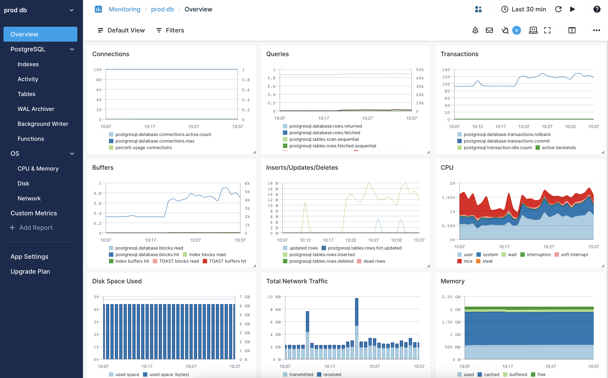
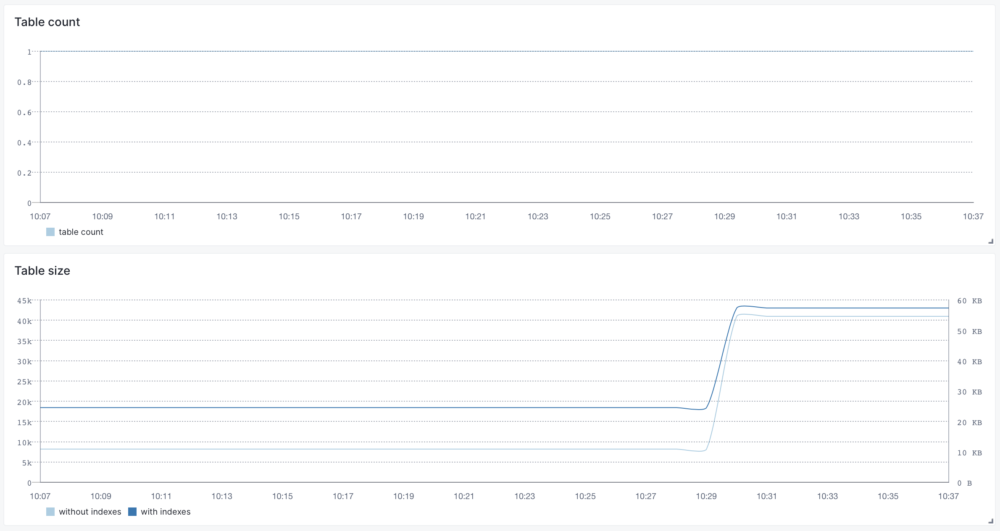
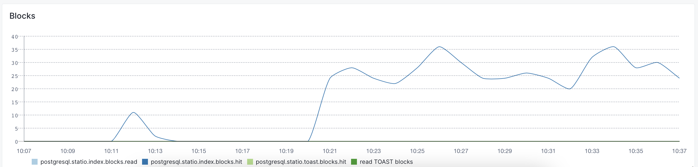
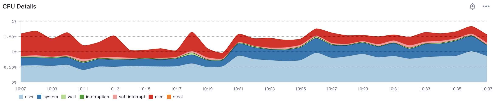
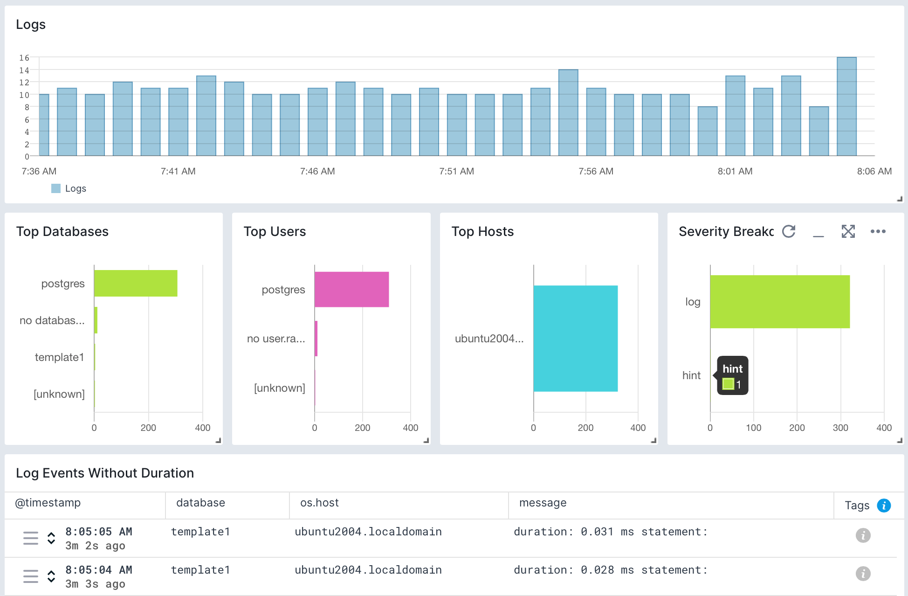
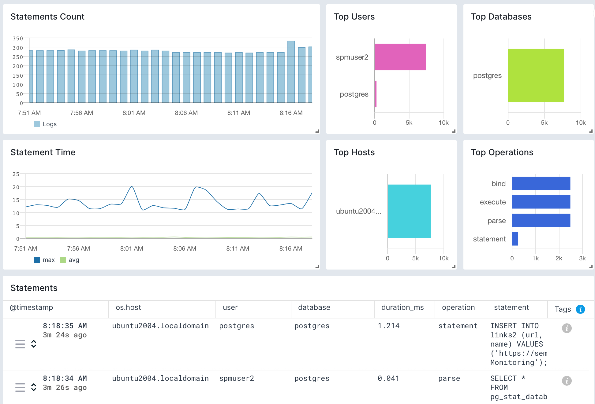

title: PostgreSQL
description: Comprehensive view of your database's health and performance through Sematext's monitoring and logs integration. Monitor real-time metrics, leverage reports and dashboards for proactive issue identification, while diving deeper into statement durations and user access logs for extensive analysis and troubleshooting.

PostgreSQL is a powerful open-source relational database management system (RDBMS) known for its robustness, extensibility, and compliance with SQL standards. The [Sematext Agent](https://sematext.com/docs/agents/sematext-agent/) collects PostgreSQL metrics and logs, transmits them to Sematext Cloud; installing the agent takes less than 5 minutes.

## Install Sematext Agent

1. Create an PostgreSQL Logs or Monitoring [App](https://sematext.com/docs/guide/app-guide/). This will let you install the agent and control access to your monitoring and logs data.
3. Install the Sematext Agent according to the [https://apps.sematext.com/ui/howto/PostgreSQL/overview](https://apps.sematext.com/ui/howto/PostgreSQL/overview) displayed in the UI.
4. After installing the agent, the Discovery tab shows all the PostgreSQL services identified on the host and you will start receiving metrics or logs from PostgreSQL services.
5. If you've created an PostgreSQL Monitoring App and want to collect PostgreSQL logs as well, or vice versa, click on the **Create Logs App** button from the left menu panel. This will navigate you to the 'Create Logs App' (or Monitoring App) page, where you'll find all the discovered log sources from PostgreSQL services and manage log and metric shipping effortlessly.

Having both PostgreSQL Logs and Monitoring Apps lets you correlate performance metrics and logs, and accelerate troubleshooting using [Split Screen](https://sematext.com/docs/guide/split-screen/) for faster resolution. For example, if you see a spike in number of rows fetched, you can check logs to see which queries fetch too many rows. A concrete example of doing that can be found in [this article](https://sematext.com/blog/postgresql-slow-queries/). Or if you notice expensive queries in the logs, monitoring can tell you whether they hit the indices or they were mostly scans.

To [explore logs and services](https://sematext.com/docs/monitoring/autodiscovery/) across multiple hosts, navigate to [Fleet & Discovery > Discovery > Services](https://apps.sematext.com/ui/fleet-and-discovery/discovery/services) (or  [Sematext Cloud Europe](https://apps.eu.sematext.com/ui/fleet-and-discovery/discovery/services)). From there, you can create additional [Apps](https://sematext.com/docs/guide/app-guide/) or stream data to existing ones without requiring any additional installations. 

From number of rows and connections to index and function-specific metrics, all the relevant stats are collected and displayed in built-in dashboards:

## Important PostgreSQL Metrics to Watch

You'd normally start from the Overview screen to check the higher-level metrics, such as number of rows or connections over time. Other high-level metrics can be found under Activity or Tables dashboards:

Then, if necessary, you can dive deeper into a specific direction. For example, if you think that indexes are over-used or not used enough, you can check their metrics in the Indexes dashboard. Like how often the index blocks are hit:

Finally, OS-level metrics can also point out bottlenecks, such as network or CPU:

You can find a full list of PostgreSQL-specific metrics that are collected below.

## Metrics

Metric Name  Key *(Type)* *(Unit)*                                                                     |  Description
----------------------------------------------------------------------------------------------------------|----------------------------------------------------------------------------------------------------------------------------------------------------------------------------------------------------------------------------------------------------------------------------------------------------------------------------------------------------------------------------------------------------------------------------------------------------------------------------------------------------------------------------------------------------------------
active backends use **transaction.open.count**  *(long gauge)*                             |  Number of backends executing a query
idle backends **transaction.idle.count**  *(long gauge)*                             |  Number of backends in a transaction, but not currently executing a query
WAL files **archiver.wal.success.count**  *(counter)*                             |  Number of WAL files that have been successfully archived
failed WAL files **archiver.wal.failed.count**  *(counter)*                             |  Number of failed attempts to archive WAL files
scheduled checkpoints **bgwriter.checkpoints.scheduled**  *(counter)*                             |  Number of scheduled checkpoints that have been performed
requested checkpoints **bgwriter.checkpoints.requested**  *(counter)*                             |  Number of requested checkpoints that have been performed
checkpoint buffers **bgwriter.buffers.written**  *(counter)*                             |  Number of buffers written during checkpoints
cleaned buffers **bgwriter.buffers.clean**  *(counter)*                             |  Number of buffers written by the background writer
max written clean buffers **bgwriter.buffers.cleaning.maxwritten.stopped**  *(counter)*                             |  Number of times the background writer stopped a cleaning scan because it had written too many buffers
backend buffers **bgwriter.buffers.backend**  *(counter)*                             |  Number of buffers written directly by a backend
allocated buffers **bgwriter.buffers.alloc**  *(counter)*                             |  Number of buffers allocated
active connections **database.connections.active.count**  *(long gauge)*                             |  Number of backends currently connected to this database
committed transactions **database.transactions.commit**  *(counter)*                             |  Number of transactions in this database that have been committed
rolled back transactions **database.transactions.rollback**  *(counter)*                             |  Number of transactions in this database that have been rolled back
disk blocks read **database.blocks.read**  *(counter)*                             |  Number of disk blocks read in this database
disk block cache hit **database.blocks.hit**  *(counter)*                             |  Number of times disk blocks were found already in the buffer cache, so that a read was not necessary (this only includes hits in the PostgreSQL buffer cache, not the operating system's file system cache)
rows returned **database.rows.returned**  *(counter)*                             |  Number of rows returned by queries in this database
rows fetched **database.rows.fetched**  *(counter)*                             |  Number of rows fetched by queries in this database
rows inserted **database.rows.inserted**  *(counter)*                             |  Number of rows inserted by queries in this database
rows updated **database.rows.updated**  *(counter)*                             |  Number of rows updated by queries in this database
rows deleted **database.rows.deleted**  *(counter)*                             |  Number of rows deleted by queries in this database
max connections **database.connections.max**  *(double gauge)*                             |  Maximum number of concurrent connections to the database server. Parameter set at server startup
percent usage connections **database.connections.usage**  *(double gauge)*                             |  Percentage of used connections (ratio between number of active backends and maximum allowed connections)
table count **table.count**  *(long gauge)*                             |  Number of tables in this DB
function calls **function.calls**  *(counter)*                             |  Number of times this function has been called
function total time **function.time.total**  *(counter)*                             |  Total time spent in this function and all other functions called by it, in milliseconds
function self time **function.time.self**  *(counter)*                             |  Total time spent in this function itself, not including other functions called by it, in milliseconds
index scan **indexes.scan**  *(counter)*                             |  Number of index scans initiated on this index
returned index entries **indexes.rows.read**  *(counter)*                             |   Number of index entries returned by scans on this index
fetched rows **indexes.rows.feched**  *(counter)*                             |  Number of live rows fetched by index scans
lock count **lock.count**  *(long gauge)*                             |  Number of active lockable objects
sequential scans **tables.scan.sequential**  *(counter)*                             |  Number of sequential scans initiated on a table
sequential rows fetched **tables.rows.fetched.sequential**  *(counter)*                             |  Number of live rows fetched by sequential scans
index rows fetched **tables.rows.fetched.index**  *(counter)*                             |  Number of live rows fetched by index scans
inserted rows **tables.rows.inserted**  *(counter)*                             |  Number of rows inserted
updated rows **tables.rows.updated**  *(counter)*                             |  Number of rows updated
deleted rows **tables.rows.deleted**  *(counter)*                             |  Number of rows deleted
hot updated rows **tables.rows.hot.updated**  *(counter)*                             |  Number of rows hot updated (i.e., with no separate index update required)
live rows **tables.rows.live**  *(long gauge)*                             |  Estimated number of live rows
dead rows **tables.rows.dead**  *(long gauge)*                             |  Estimated number of dead rows
replication delay **replication.delay.time**  *(long gauge)*                             |  Replication delay in milliseconds
replication delay bytes **replication.delay.bytes**  *(long gauge)*                             |  Replication delay in bytes
table size **table.disk.size**  *(long gauge)*                             |  Disk space used by the a table, excluding indexes (but including TOAST, free space map, and visibility map)
index size **index.disk.size**  *(long gauge)*                             |  Total disk space used by indexes attached to the a table
total size **table.total.disk.size**  *(long gauge)*                             |  Total disk space used by the a table, including all indexes and TOAST data
read disk blocks **statio.heap.blocks.read**  *(counter)*                             |  Number of disk blocks read from a table
hit disk blocks **statio.heap.blocks.hit**  *(counter)*                             |  Number of buffer hits in a table
read index blocks **statio.index.blocks.read**  *(tttttt)*                             |  Number of disk blocks read from all indexes on a table
hit index blocks **statio.index.blocks.hit**  *(counter)*                             |  Number of buffer hits in all indexes on a table
read TOAST blocks **statio.toast.blocks.read**  *(counter)*                             |  Number of disk blocks read from a table's TOAST table (if any)
hit TOAST buffers **statio.toast.blocks.hit**  *(counter)*                             |  Number of buffer hits in a table's TOAST table (if any)
read TOAST index **statio.tidx.blocks.read**  *(counter)*                             |  Number of disk blocks read from a table's TOAST table index (if any)
hit TOAST buffer **statio.tidx.blocks.hit**  *(counter)*                             |  Number of buffer hits in a table's TOAST table index (if any)

## Logs

Once data is in, you can explore it via the built-in reports: 

## Exploring logs

Once data is in, you can explore it using the built-in reports or create your own. For example, you can use the Statement Duration report to check on your queries:

## Troubleshooting

If you are having trouble sending logs, try out the latest version of the [Sematext Agent](../agents/sematext-agent/installation/). Additionally, make sure to check out the [Log Agents panel](https://sematext.com/docs/fleet/#log-agents) for any errors, and refer to our [Sematext Logs FAQ](https://sematext.com/docs/logs/faq/) for useful tips.

If you are having issues with Sematext Monitoring, i.e. not seeing PostgreSQL metrics, see
[How do I create the diagnostics package](/monitoring/spm-faq/#how-do-i-create-the-diagnostics-package).

For more troubleshooting information please look at the [Troubleshooting](/monitoring/spm-faq/#troubleshooting) section.

