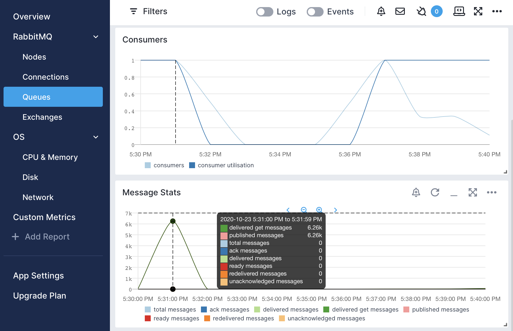
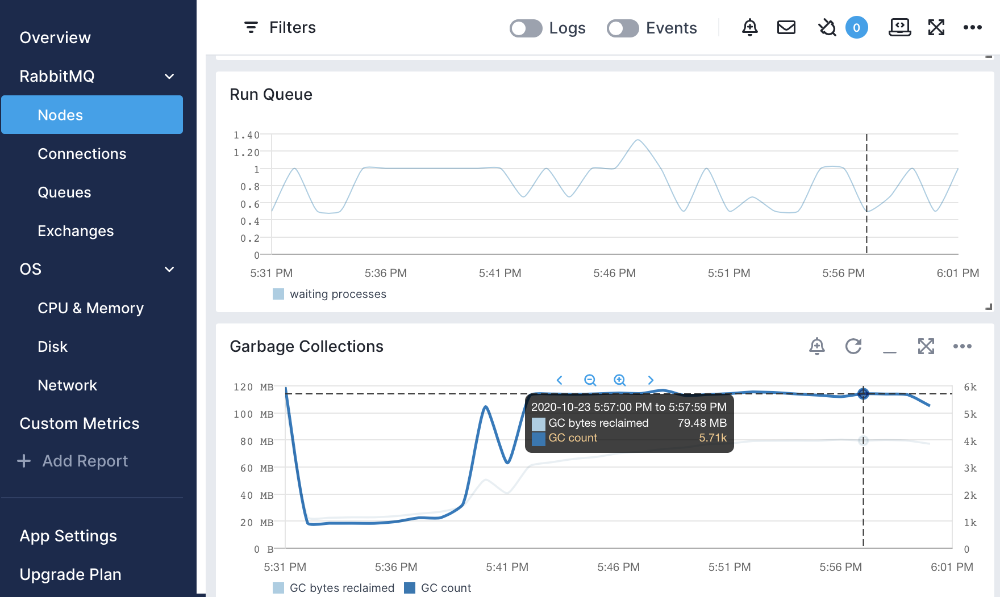
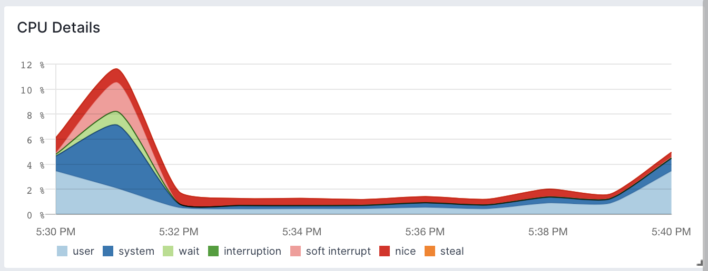
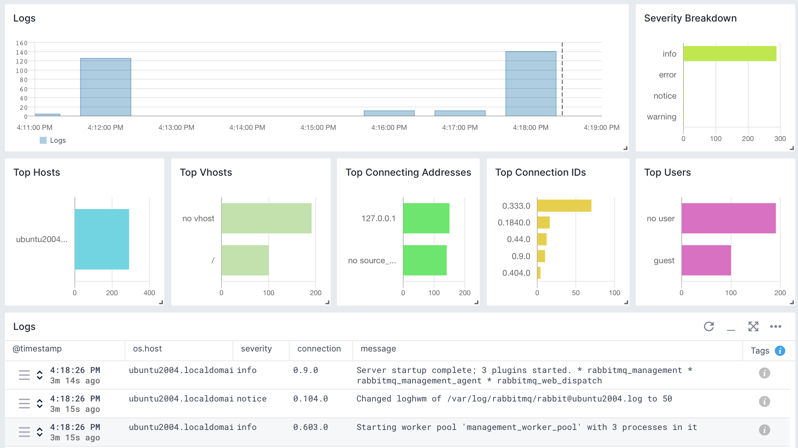
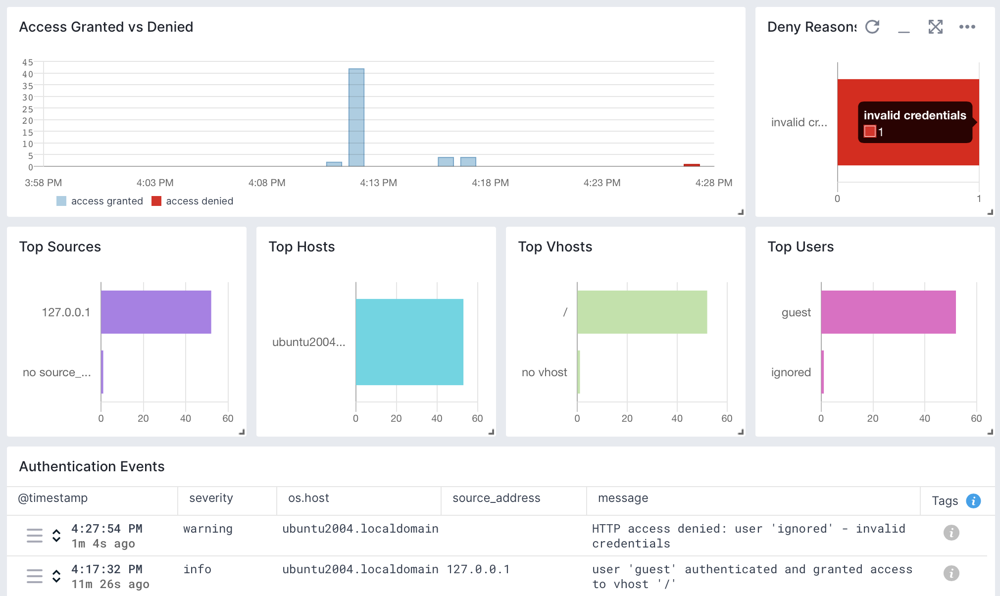

title: RabbitMQ
description: Comprehensive view of RabbitMQ's health and performance using Sematext's monitoring and logs integration. Monitor real-time metrics, leverage reports and dashboards for proactive issue identification, and troubleshoot various RabbitMQ issues, including connection and access, through detailed logs analysis.

RabbitMQ is an open-source message broker software that facilitates message queuing, enabling communication and transfer of data between distributed applications. The [Sematext Agent](https://sematext.com/docs/agents/sematext-agent/) collects RabbitMQ metrics and logs, transmits them to Sematext Cloud; installing the agent takes less than 5 minutes.

## Install Sematext Agent

1. Create an RabbitMQ Logs or Monitoring [App](https://sematext.com/docs/guide/app-guide/). This will let you install the agent and control access to your monitoring and logs data.
2. Install the Sematext Agent according to the [https://apps.sematext.com/ui/howto/RabbitMQ/overview](https://apps.sematext.com/ui/howto/RabbitMQ/overview) displayed in the UI.
3. Install the [RabbitMQ management plugin](https://www.rabbitmq.com/management.html), if it's not already installed
4. create a user with `administrator` tags, to be able to get all metrics
4. Configure Sematext Agent to connect to the RabbitMQ host and port (`localhost:15672` by default), using your App token and the newly created user's credentials
5. After installing the agent and configuring RabbitMQ, the Discovery tab shows all the RabbitMQ services identified on the host and you will start receiving metrics or logs from RabbitMQ services.
6. If you've created an RabbitMQ Monitoring App and want to collect RabbitMQ logs as well, or vice versa, click on the **Create Logs App** button from the left menu panel. This will navigate you to the 'Create Logs App' (or Monitoring App) page, where you'll find all the discovered log sources from RabbitMQ services and manage log and metric shipping effortlessly.

Having both RabbitMQ Logs and Monitoring Apps lets you correlate performance metrics and logs, and accelerate troubleshooting using [Split Screen](https://sematext.com/docs/guide/split-screen/) for faster resolution.For example, if you see a spike in connection metrics, you can check logs to see what are the sources of these connections. Or if you see an increase in authentication errors, monitoring can tell what's the impact on RabbitMQ's memory usage, garbage collection and CPU.

To [explore logs and services](https://sematext.com/docs/monitoring/autodiscovery/) across multiple hosts, navigate to [Fleet & Discovery > Discovery > Services](https://apps.sematext.com/ui/fleet-and-discovery/discovery/services) (or  [Sematext Cloud Europe](https://apps.eu.sematext.com/ui/fleet-and-discovery/discovery/services)). From there, you can create additional [Apps](https://sematext.com/docs/guide/app-guide/) or stream data to existing ones without requiring any additional installations. 

## Important RabbitMQ Metrics to Watch

The usual entry point is the Messages report: do you have many messages published in a specific timeframe? Out of those, how many are unacknowledged or redelivered? These could be red flags.

If there are any signs of trouble, it's time to dig deeper. Is the RabbitMQ server itself at fault? Check the Nodes metrics, such as Garbage Collection or Run Queue size:

Finally, OS-level metrics can also point out bottlenecks, such as network or CPU:

## Metrics

Metric Name  Key *(Type)* *(Unit)*                                                                     |  Description
----------------------------------------------------------------------------------------------------------|----------------------------------------------------------------------------------------------------------------------------------------------------------------------------------------------------------------------------------------------------------------------------------------------------------------------------------------------------------------------------------------------------------------------------------------------------------------------------------------------------------------------------------------------------------------
connections **connections.count**  *(gauge)*  |  Total number of connections
channels **channels.count**  *(gauge)*  |  Total number of channels
queues **queues.count**  *(gauge)*  |  Total number of queues
consumers **consumers.count**  *(gauge)*  |   Total number of consumers
messages **messages.count**  *(gauge)*  |  Total number of messages (ready plus unacknowledged)
ready messages **messages.ready.count**  *(gauge)*  |  Number of messages ready for delivery
unacknowledged messages **messages.unacknowledged.count**  *(gauge)*  |  Number of unacknowledged messages
ack messages **messages.acked**  *(counter)*  |  Number of messages delivered to clients and acknowledged
confirmed messages **messages.confirmed**  *(counter)*  |  Count of messages confirmed
delivered get messages **messages.delivered.get**  *(counter)*  |  Sum of messages delivered in acknowledgement mode to consumers, in no-acknowledgement mode to consumers, in acknowledgement mode in response to basic.get, and in no-acknowledgement mode in response to basic.get
published messages **messages.published**  *(counter)*  |  Count of messages published
published in messages **messages.published.in**  *(counter)*  |  Count of messages published from channels into this exchange
published out messages **messages.published.out**  *(counter)*  |  Count of messages published from this exchange into queues
unroutable messages **messages.returned.unroutable**  *(counter)*  |  Count of messages returned to publisher as unroutable
redelivered messages **messages.redelivered**  *(counter)*  |  Count of subset of messages in deliver_get which had the redelivered flag set
ack messages **exchanges.messages.acked**  *(counter)*  |   Number of messages delivered to clients and acknowledged (per exchange)
confirmed messages **exchanges.messages.confirmed**  *(counter)*  |  Count of messages confirmed (per exchange)
delivered get messages **exchanges.messages.delivered.get**  *(counter)*  |  Sum of messages delivered in acknowledgement mode to consumers, in no-acknowledgement mode to consumers, in acknowledgement mode in response to basic.get, and in no-acknowledgement mode in response to basic.get. Also per exchange
published messages **exchanges.messages.published**  *(counter)*  |  Count of messages published, per exchange
published in messages **exchanges.messages.published.in**  *(counter)*  |  Count of messages published from channels into this exchange
published out messages **exchanges.messages.published.out**  *(counter)*  |  Count of messages published from this exchange into queues
unroutable messages **exchanges.messages.returned.unroutable**  *(counter)*  |  Count of messages returned to publisher as unroutable (per exchange)
redelivered messages **exchanges.messages.redelivered**  *(counter)*  |  Count of subset of messages in deliver_get which had the redelivered flag set (per exchange)
GC count **gc.count**  *(counter)*  |  Number of garbage collections
GC bytes reclaimed **gc.reclaimed.bytes**  *(counter)*  |  Bytes reclaimed by garbage collections
used files **file.descriptors.used**  *(gauge)*  |  Used file descriptors
free space **disk.free**  *(counter)*  |  Current free disk space
used memory **memory.used**  *(gauge)*  |  Memory used in bytes
waiting processes **process.wait**  *(gauge)*  |  Average number of Erlang processes waiting to run
used sockets **sockets.used**  *(gauge)*  |  Number of file descriptors used as sockets
partitions **network.partitions**  *(gauge)*  |  Number of network partitions this node is seeing
running **node.running**  *(gauge)*  |  Is the node running or not
memory alarm **memory.alarm.enabled**  *(gauge)*  |  Does the host have memory alarm
disk alarm **disk.alarm.enabled**  *(gauge)*  |  Does the node have disk alarm
active consumers **queues.consumers.active**  *(gauge)*  |  Number of active consumers, consumers that can immediately receive any messages sent to the queue
consumers **queues.consumers**  *(gauge)*  |  Number of consumers
consumer utilisation **queues.consumer.utilisation**  *(gauge)*  |  The ratio of time that a queue's consumers can take new messages
memory **queues.memory**  *(gauge)*  |  Bytes of memory consumed by the Erlang process associated with the queue, including stack, heap and internal structures
messages **queues.messages**  *(gauge)*  |  Count of the total messages in the queue
ready messages **queues.messages.ready**  *(gauge)*  |  Number of messages ready to be delivered to clients (per queue)
unacknowledged messages **queues.messages.unacknowledged**  *(gauge)*  |  Number of messages delivered to clients but not yet acknowledged (per queue)
ack messages **queues.messages.acked**  *(counter)*  |  Number of messages delivered to clients and acknowledged (per queue)
delivered messages **queues.messages.delivered**  *(counter)*  |  Count of messages delivered in acknowledgement mode to consumers (per queue)
delivered get messages **queues.messages.delivered.get**  *(counter)*  |  Sum of messages delivered in acknowledgement mode to consumers, in no-acknowledgement mode to consumers, in acknowledgement mode in response to basic.get, and in no-acknowledgement mode in response to basic.get. Per queue.
published messages **queues.messages.published**  *(counter)*  |  Count of messages published (per queue)
redelivered messages **queues.messages.redelivered**  *(counter)*  |  Count of subset of messages in deliver_get which had the redelivered flag set

## Logs

Once data is in, you can explore it via the built-in reports: 

## Exploring logs

Once data is in, you can explore it using the built-in reports or create your own. For example, you can use the Authentication report to check on granted and denied connections:

Other built-in reports include:

- **Connections**: Logs specifically about accepted and closed connections. You can see here when you have spikes in connection creation. You can also identify noisy sources, users, as well as popular destinations.
- **Start & Stop**: Logs about RabbitMQ startup and shutdown. Besides unexpected restarts, you can find info about which write-ahead logs (WALs) were recovered.

## Troubleshooting

If you are having trouble sending logs, try out the latest version of the [Sematext Agent](../agents/sematext-agent/installation/). Additionally, make sure to check out the [Log Agents panel](https://sematext.com/docs/fleet/#log-agents) for any errors, and refer to our [Sematext Logs FAQ](https://sematext.com/docs/logs/faq/) for useful tips.
