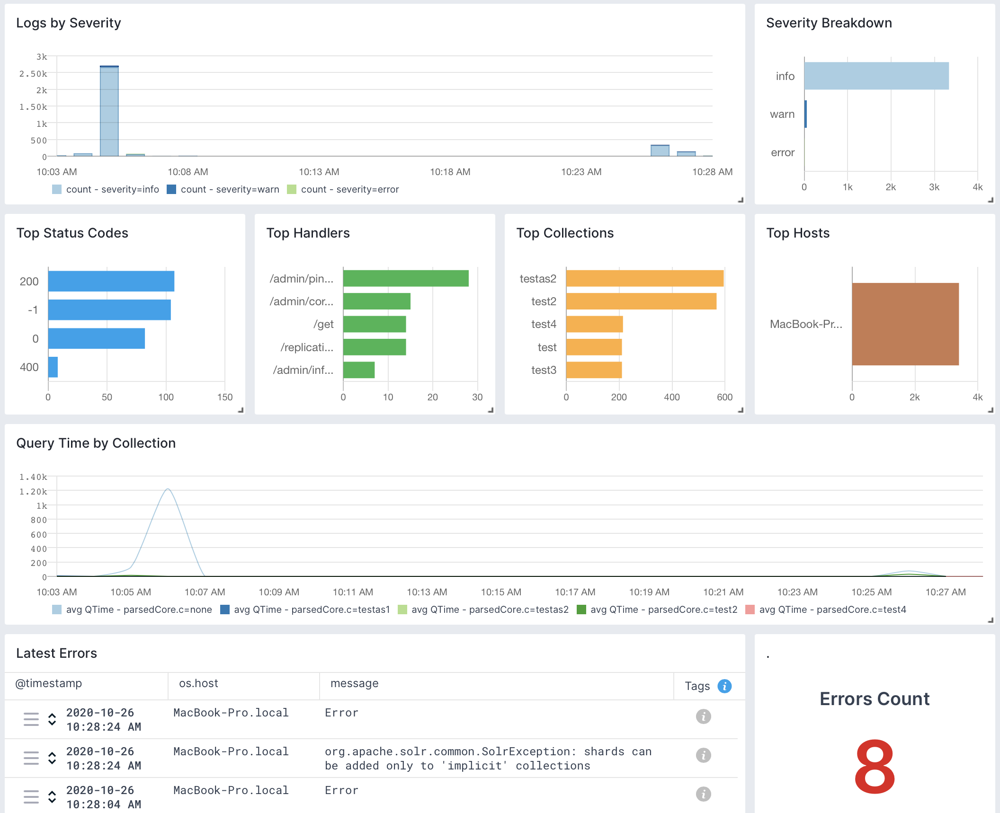

title: Solr / SolrCloud
description: Comprehensive monitoring and logging integration for Solr and SolrCloud, providing robust capabilities to monitor and manage critical issues across your Solr infrastructure. Leverage predefined key metric reports and advanced data visualization tools to oversee Solr performance, including memory usage, uptime, load averages, index stats, document and filter caches, latency, query distribution, errors analysis, Zookeeper and Overseer logs, and more. Receive timely alerts to address potential concerns and optimize the efficiency of your Solr and SolrCloud environments.

Solr is an open-source search platform used for building and managing powerful search and data retrieval capabilities in applications. The [Sematext Agent](https://sematext.com/docs/agents/sematext-agent/) collects Solr metrics and logs, transmits them to Sematext Cloud; installing the agent takes less than 5 minutes and require no changes in Solr source code or your application source code.

## Install Sematext Agent

This lightweight, open-source [Monitoring Agent](https://github.com/sematext/sematext-agent-java) collects Solr performance metrics and sends them to Sematext. It comes packaged with a Golang-based agent responsible for Operating System level metrics like network, disk I/O, and more. The Solr Monitoring Agent can be installed with RPM/DEB package manager on any host running Linux or in a containerized environment using ```sematext/sematext-agent```.

The Sematext Solr Monitoring Agent can be run in two different modes - *in-process* and *standalone*. The *in-process* one is run as a Java agent, it is simpler to initially set up, but will require restarting your Solr node when you will want to upgrade your monitoring Agent, i.e. to get new features. The benefit of the *standalone* agent mode is that it runs as a separate process and doesn't require a Solr restart when it is installed or upgraded.

1. Create an Solr Logs or Monitoring [App](https://sematext.com/docs/guide/app-guide/). This will let you install the agent and control access to your monitoring and logs data.
2. Install the Sematext Agent on each host running your Solr/SolrCloud nodes to have the full visibility over the metrics from each host. The full installation instructions can be found in the [setup instructions](https://apps.sematext.com/ui/howto/SolrCloud/overview) displayed in the UI.

The last step to install Sematext Agent is by running a command like this:

```bash
sudo bash /opt/spm/bin/setup-sematext  \
    --monitoring-token <your-monitoring-token-goes-here>   \
    --app-type solrcloud  \
    --agent-type javaagent  \
    --infra-token <your-infra-token-goes-here>
```

The command above will set up your SolrCloud Monitoring Agent in the *in-process* mode. To have it running in the *standalone* mode, run the command below instead of the one above:

```bash
sudo bash /opt/spm/bin/setup-sematext  \
    --monitoring-token <your-monitoring-token-goes-here>   \
    --app-type solr  \
    --agent-type standalone  \
    --infra-token <your-infra-token-goes-here>  \
    --jmx-params '-Dspm.remote.jmx.url=localhost:3000'
```

Keep in mind that your need to provide the Monitoring token and Infra token. They are both provided in the [installation instructions](https://apps.sematext.com/ui/howto/SolrCloud/overview) for your SolrCloud App.
  
3. Adjust the ```solr.in.sh``` file and add the following section:
   
```bash
SOLR_OPTS="$SOLR_OPTS -Dcom.sun.management.jmxremote
-javaagent:/opt/spm/spm-monitor/lib/spm-monitor-generic.jar=<your-monitoring-token-goes-here>::default"
```

Or if you would like to run the Solr Monitoring Agent in the *standalone* mode add the following section to the ```solr.in.sh``` file:
```bash
SOLR_OPTS="$SOLR_OPTS -Dcom.sun.management.jmxremote -Dcom.sun.management.jmxremote.port=3000 -Dcom.sun.management.jmxremote.ssl=false -Dcom.sun.management.jmxremote.authenticate=false"
```
Make sure that tag ```<jmx />``` is enabled in your ```solrconfig.xml``` file.

**You need to restart your Solr node after the changes above.**

4. After installing the agent, the Discovery tab shows all the Solr services identified on the host and you will start receiving metrics or logs from Solr services.
5. If you've created an Solr Monitoring App and want to collect Solr logs as well, or vice versa, click on the **Create Logs App** button from the left menu panel. This will navigate you to the 'Create Logs App' (or Monitoring App) page, where you'll find all the discovered log sources from Solr services and manage log and metric shipping effortlessly.

Having both Solr Logs and Monitoring Apps lets you correlate performance metrics and logs, and accelerate troubleshooting using [Split Screen](https://sematext.com/docs/guide/split-screen/) for faster resolution. For example, your metrics might indicate a sudden spike in query latency or a rise in memory consumption. By correlating this with the logs, you might discover that during this period of high latency, there were specific queries generating errors or that certain indexing tasks were failing due to insufficient resources.

To [explore logs and services](https://sematext.com/docs/monitoring/autodiscovery/) across multiple hosts, navigate to [Fleet & Discovery > Discovery > Services](https://apps.sematext.com/ui/fleet-and-discovery/discovery/services) (or  [Sematext Cloud Europe](https://apps.eu.sematext.com/ui/fleet-and-discovery/discovery/services)). From there, you can create additional [Apps](https://sematext.com/docs/guide/app-guide/) or stream data to existing ones without requiring any additional installations. 

## Collected Metrics

The Sematext Solr monitoring agent collects the following metrics.

### Operating System

- CPU usage
- CPU load
- Memory usage
- Swap usage
- Disk space used
- I/O Reads and Writes
- Network traffic


### Java Virtual Machine

- Garbage collectors time and count
- JVM pool size and utilization
- Threads and daemon threads
- Files opened by the JVM


### Solr

- Requests rate and latency
- Solr index stats and file system stats
- Added and pending documents
- Deletes by id and queries
- Filter cache statistics
- Document cache statistics
- Query result cache statistics
- Per segment filter cache statistics
- Commit events
- Warmup times


## Solr Default Alerts

As soon as you create an Elasticsearch App, you will receive a set of default [alert rules](https://sematext.com/docs/guide/alerts-guide/). These pre-configured rules will [notify](https://sematext.com/docs/alerts/alert-notifications/) you of important events that may require your attention, as shown below.

### Warmup time > 5m

This alert rule continuously monitors the warmup time of a Solr cache, identifying instances where the warmup time exceeds 5 minutes. When such instances are detected, it triggers a warning (WARN priority). The minimum delay between consecutive alerts triggered by this alert rule is set to 10 minutes.

Suppose a Solr cache is configured to warm up before serving requests, and the typical warmup time is around 3 minutes. However, due to increased data volume or inefficient warmup processes, the warmup time suddenly increases to 7 minutes. When this happens, the alert rule checks for warmup time anomalies over the last 5 minutes. Upon detecting the warmup time anomaly, the alert rule triggers a warning.

#### Actions to take

- Review the warmup process of the Solr cache for any bottlenecks or configuration issues contributing to the extended warmup time
- Optimize the warmup process by optimizing queries or adjusting cache configuration settings to reduce warmup time

You can [create additional alerts](https://sematext.com/docs/alerts) on any metric.


## Metrics

Metric Name<br> Key *(Type)* *(Unit)*                                                     |  Description
------------------------------------------------------------------------------------------|--------------------------------
cache lookups<br>**solr.cache.lookups** <br>*(long counter)*                              |  lookups count
cache hits<br>**solr.cache.hits** <br>*(long counter)*                                    |  hits count
cache size<br>**solr.cache.size** <br>*(long gauge)*                                      |  cache size (count of elements)
cache evictions<br>**solr.cache.evicted** <br>*(long counter)*                            |  count of evictions
warmup time<br>**solr.warmup.time** <br>*(long counter)* *(ms)*                           |  warmup time
cache memory used<br>**solr.cache.size.bytes** <br>*(long gauge)* *(bytes)*               |  cache size in bytes
cache max size<br>**solr.cache.size.max** <br>*(long gauge)*                              |  cache max size
autowarm count or %<br>**solr.cache.autowarm.count** <br>*(long gauge)*                   |  cache autowarm count or %
request time<br>**solr.requests.time** <br>*(long counter)* *(ms)*                        |  request time
req.count<br>**solr.requests** <br>*(long counter)* *(req)*                               |  request count
avg. request latency<br>**solr.requests.latency.avg** <br>*(double gauge)*                |  avg. request latency
request error count<br>**solr.requests.error.count** <br>*(long counter)*                 |  request error count
request timeout count<br>**solr.requests.timeout.count** <br>*(long counter)*             |  request timeout count
index max doc<br>**solr.index.docs.max** <br>*(long gauge)* *(docs)*                      |  max doc in the index
index num docs<br>**solr.index.docs** <br>*(long gauge)* *(docs)*                         |  number of docs in the index
index segments<br>**solr.index.segments** <br>*(long gauge)*                              |  index segments count
index num of files<br>**solr.index.files** <br>*(long gauge)*                             |  number of files in solr index
index size on the disk<br>**solr.index.files.size** <br>*(long gauge)* *(bytes)*          |  size of solr index on the disk
commits<br>**solr.indexing.commits** <br>*(long counter)*                                 |  total count of commits
optimizes<br>**solr.indexing.optimizes** <br>*(long counter)*                             |  count of optimizes
rollbacks<br>**solr.indexing.rollbacks** <br>*(long counter)*                             |  count of rollbacks
expunge deletes<br>**solr.indexing.deletes.expunge** <br>*(long counter)*                 |  count of expunge deletes
index docs added<br>**solr.indexing.docs.added** <br>*(long counter)* *(docs)*            |  added docs
deletes by id<br>**solr.indexing.deletes.id** <br>*(long counter)*                        |  deletes by id
deletes by query<br>**solr.indexing.deletes.query** <br>*(long counter)*                  |  deletes by query
update errors<br>**solr.indexing.errors** <br>*(long counter)*                            |  count of update errors
autocommits<br>**solr.indexing.commits.auto** <br>*(long counter)*                        |  count of auto commits
soft autocommits<br>**solr.indexing.commits.soft** <br>*(long counter)*                   |  count of soft auto commits
index docs pending<br>**solr.indexing.docs.pending** <br>*(long gauge)* *(docs)*          |  count of pending docs
autocommit max time<br>**solr.indexing.commits.auto.time.max** <br>*(long gauge)* *(ms)*  |  autocommit max time

## Logs

Once data is in, you can explore it via the built-in reports: 



Be sure to check out the [Solr Monitoring integration](./solr.md) as well, to get a complete view on Solr. For example, if you see logs of a node restarting, metrics let you see the impact on the rest of the cluster in terms of CPU, GC, and other metrics. Including query time metrics, even if you don't collect logs from [all] queries.

## Exploring logs

Once data is in, you can explore it using the built-in reports or create your own. For example, you can use the Queries report to see a breakdown of your queries and "zoom in" to the ones you're interested in:


Other built-in reports include:

- **Errors**: breakdown of what's wrong: which nodes/classes/collections/etc generate errors
- **Zookeeper**: logs produced by Solr's [Zookeeper](https://zookeeper.apache.org) client and other Zookeeper-related classes and threads. Look here for insights on SolrCloud's stability. For the Zookeeper ensemble itself, check out our [Zookeeper monitoring integration](./zookeeper.md)
- **Overseer**: logs produced by SolrCloud's [Overseer](https://lucene.apache.org/solr/8_6_0/solr-core/org/apache/solr/cloud/Overseer.html) thread and other Overseer activities (e.g. shard leader election)
- **Start & Stop**: startup-related and shutdown-related logs. Look here if a node went down unexpectedly or doesn't show up in the cluster when started

## Correlating Metrics & Logs

Be sure to check out the [Solr Logs integration](./solr-logs.md) as well, to get a complete view on Solr: what kind of errors or warnings are happening, how fast is each request, when Solr was restarted and so on.

You can also correlate logs with metrics using [Split Screen](../guide/split-screen.md). For example, if you have a slow query in the logs, you can bring your Solr Monitoring App on the same screen and dig deeper in four steps:


1. Click the Split Screen button to bring a new App to your screen.
2. Select your Solr Monitoring App.
3. Select the report/dashboard you're interested in, such as the CPU and Memory report.
4. Hover the mouse over the latency spike and you'll see the vertical bar showing the same time on all charts from both sides of your screen.

A full example of Solr metrics and logs correlation can be found in [this article](https://sematext.com/blog/solr-slow-queries/).

## Integration

- Agent: [https://github.com/sematext/sematext-agent-java](https://github.com/sematext/sematext-agent-java)
- Tutorial: [https://sematext.com/blog/solr-monitoring-made-easy-with-sematext/](https://sematext.com/blog/solr-monitoring-made-easy-with-sematext/)
- Instructions: [https://apps.sematext.com/ui/howto/Solr/overview](https://apps.sematext.com/ui/howto/Solr/overview)

## Troubleshooting

If you are having trouble sending logs, try out the latest version of the [Sematext Agent](../agents/sematext-agent/installation/). Additionally, make sure to check out the [Log Agents panel](https://sematext.com/docs/fleet/#log-agents) for any errors, and refer to our [Sematext Logs FAQ](https://sematext.com/docs/logs/faq/) for useful tips.

If you are having issues with Sematext Monitoring, i.e. not seeing Solr metrics, see
[How do I create the diagnostics package](/monitoring/spm-faq/#how-do-i-create-the-diagnostics-package).

For more troubleshooting information please look at [Troubleshooting](/monitoring/spm-faq/#troubleshooting) section.

## FAQ

** How do I enable JMX in Solr? **

Add or uncomment the **<jmx/\>** directive in ```solrconfig.xml``` and
restart Solr.  See <https://wiki.apache.org/solr/SolrJmx> for more
info.

** I don't see any data on Solr and JVM reports, what is the problem? **

You should probably enable JMX in your Solr. Add or uncomment
the **<jmx /\>** directive in ```solrconfig.xml``` and restart Solr.
 See <https://wiki.apache.org/solr/SolrJmx> for more info.

** I don't see any data only in Solr Components or Errors reports, what should I do? **

Most likely you are using the standalone variant of App Agent. In
that case, App Agent can't collect metrics which are available only
when running in-process. If so, switch to in-process (javaagent) version
of App Agent.

** Why don't I see Solr index file size metric? **

App Agent runs as 'spmmon' user.  Make sure this user has appropriate access permissions on Solr's index directories.  If you cannot give 'spmmon' user the read permissions you can switch to the in-process (javaagent) version of the App Agent.
