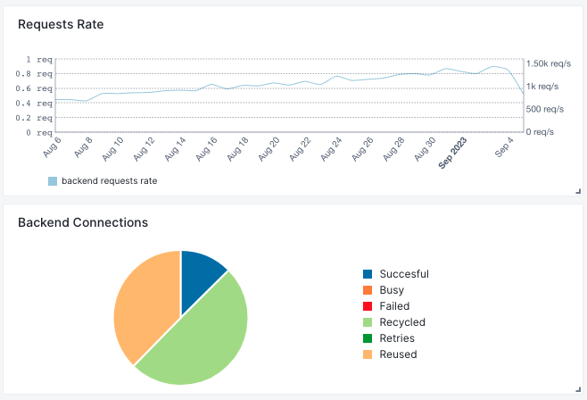
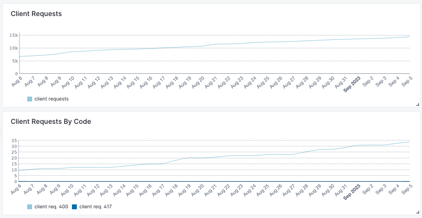
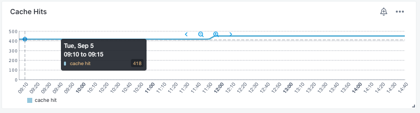
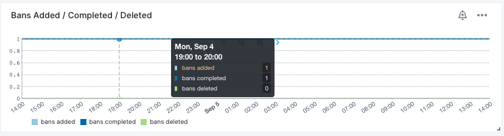
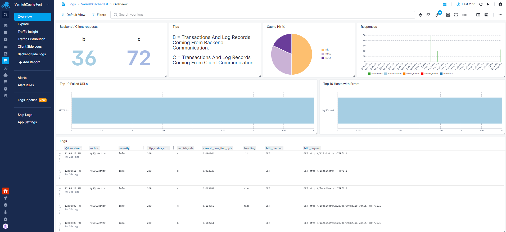
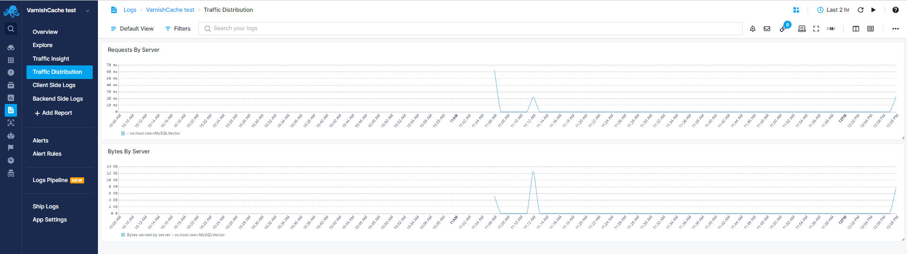
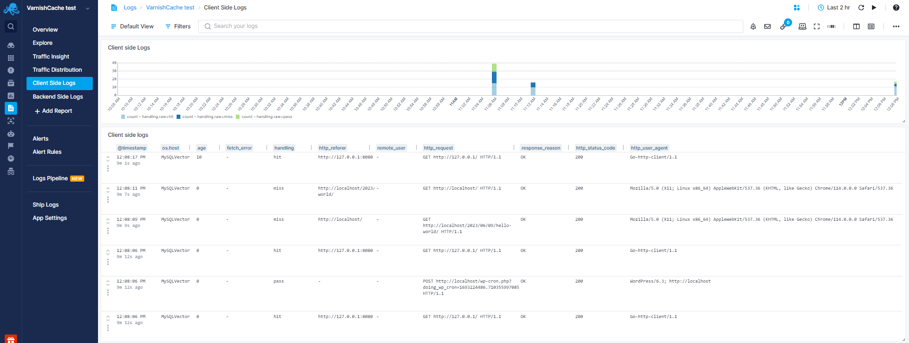
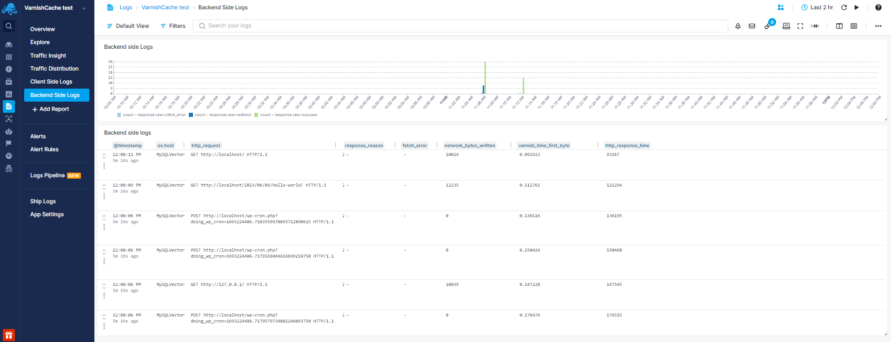

title: Varnish Cache
description: Monitor Varnish Cache comprehensively with pre-built dashboards showcasing client and backend connections, cache hits and misses, thread details, bans, and more, while leveraging Sematext's Varnish Cache Logs integration to analyze response times, initial byte served, traffic distribution across servers, and requests between clients and the backend.

Varnish Cache is an open-source HTTP accelerator and reverse proxy designed to significantly enhance web performance by caching and serving web content swiftly. The [Sematext Agent](https://sematext.com/docs/agents/sematext-agent/) collects Varnish Cache metrics and logs, transmits them to Sematext Cloud; installing the agent takes less than 5 minutes.

## Install Sematext Agent

1. Create an Varnish Cache Logs or Monitoring [App](https://sematext.com/docs/guide/app-guide/). This will let you install the agent and control access to your monitoring and logs data.
3. Install the Sematext Agent according to the [https://apps.sematext.com/ui/howto/varnishcache/overview](https://apps.sematext.com/ui/howto/varnishcache/overview) displayed in the UI.
4. After installing the agent, the Discovery tab shows all the Varnish Cache services identified on the host and you will start receiving metrics or logs from Varnish Cache services.
5. If you've created an Varnish Cache Monitoring App and want to collect Varnish Cache logs as well, or vice versa, click on the **Create Logs App** button from the left menu panel. This will navigate you to the 'Create Logs App' (or Monitoring App) page, where you'll find all the discovered log sources from Varnish Cache services and manage log and metric shipping effortlessly.

Having both Varnish Cache Logs and Monitoring Apps lets you correlate performance metrics and logs, and accelerate troubleshooting using [Split Screen](https://sematext.com/docs/guide/split-screen/) for faster resolution. For example, if you see logs of a node restarting, metrics let you see the impact on the rest of the cluster in terms of CPU, GC, and other metrics. Including query time metrics, even if you don't collect slowlogs from [all] queries.

To [explore logs and services](https://sematext.com/docs/monitoring/autodiscovery/) across multiple hosts, navigate to [Fleet & Discovery > Discovery > Services](https://apps.sematext.com/ui/fleet-and-discovery/discovery/services) (or  [Sematext Cloud Europe](https://apps.eu.sematext.com/ui/fleet-and-discovery/discovery/services)). From there, you can create additional [Apps](https://sematext.com/docs/guide/app-guide/) or stream data to existing ones without requiring any additional installations. 

## Important Metrics to Watch and Alert on

### Backend Connections and Requests
High backend connections might indicate that your Varnish cache is making frequent requests to the backend servers. This could be due to cache misses, ineffective caching rules, or other issues. Also, if backend connections suddenly spike or drop, it could be a sign of issues such as misconfigurations, network problems, or changes in traffic patterns.



Sudden spikes or drops in the backend request rate can be indicative of issues in your infrastructure, such as sudden traffic spikes, misconfigured cache rules, or even attacks on your system. Also it might imply that your cache is frequently missing and fetching content from the backend.

### Client Metrics
Monitoring changes in client requests can help you to identify potential problems in your infrastructure. Additionally, tracking client requests by response code allows you to quickly identify and address errors and issues in your applications. Common HTTP response codes like 500 (Internal Server Error) can indicate broken links, missing resources, or server-side problems that need immediate attention.



### Cache Hits and Misses
Cache hits indicate that Varnish is serving content directly from its cache, reducing the load on backend servers and improving response times. On the other hand, cache misses represent requests that Varnish Cache couldn't fulfill from its cache and had to pass through to the backend. Monitoring these metrics helps assess how efficiently Varnish Cache is utilizing its cache to reduce server load and improve performance.



### Bans
Bans are a mechanism in Varnish Cache to invalidate or purge specific objects from the cache. Monitoring bans allows you to understand when and why cache invalidations are occurring. This is important to ensure that stale or outdated content is removed from the cache promptly.



## Metrics

Metric Name <br> Key (Type) (Unit) | description
--- | ---
uptime <br> **varnish.uptime** <br> (counter) (sec) | Management process uptime
child_start <br> **varnish.child.start** <br> (counter) (sec) | Child process started
child_exit <br> **varnish.child.exit** <br> (counter) (sec) | Child process normal exit
child_stop <br> **varnish.child.stop** <br> (counter) (sec) | Child process unexpected exit
child_died <br> **varnish.child.died** <br> (counter) (sec) | Child process died (signal)
child_dump <br> **varnish.child.dump** <br> (counter) (sec) | Child process core dumped
child_panic <br> **varnish.child.panic** <br> (counter) (sec) | Child process panic
summs <br> **varnish.summs** <br> (counter) (sec) | stat summ operations
uptime <br> **varnish.uptime** <br> (counter) (sec) | Child process uptime
sess_conn <br> **varnish.sess.conn** <br> (counter) (sec) | Sessions accepted
sess_fail <br> **varnish.sess.fail** <br> (counter) (sec) | Session accept failures
sess_fail_econnaborted <br> **varnish.sess.fail.econnaborted** <br> (counter) (sec) | Session accept failures: connection aborted
sess_fail_eintr <br> **varnish.sess.fail.eintr** <br> (counter) (sec) | Session accept failures: interrupted system call
sess_fail_emfile <br> **varnish.sess.fail.emfile** <br> (counter) (sec) | Session accept failures: too many open files
sess_fail_ebadf <br> **varnish.sess.fail.ebadf** <br> (counter) (sec) | Session accept failures: bad file descriptor
sess_fail_enomem <br> **varnish.sess.fail.enomem** <br> (counter) (sec) | Session accept failures: not enough memory
sess_fail_other <br> **varnish.sess.fail.other** <br> (counter) (sec) | Session accept failures: other
client_req_400 <br> **varnish.client.req.400** <br> (counter) (sec) | Client requests received, subject to 400 errors
client_req_417 <br> **varnish.client.req.417** <br> (counter) (sec) | Client requests received, subject to 417 errors
client_req <br> **varnish.client.req** <br> (counter) (sec) | Good client requests received
esi_req <br> **varnish.esi.req** <br> (counter) (sec) | ESI subrequests
cache_hit <br> **varnish.cache.hit** <br> (counter) (sec) | Cache hits
cache_hit_grace <br> **varnish.cache.hit.grace** <br> (counter) (sec) | Cache grace hits
cache_hitpass <br> **varnish.cache.hitpass** <br> (counter) (sec) | Cache hits for pass.
cache_hitmiss <br> **varnish.cache.hitmiss** <br> (counter) (sec) | Cache hits for miss.
cache_miss <br> **varnish.cache.miss** <br> (counter) (sec) | Cache misses
beresp_uncacheable <br> **varnish.beresp.uncacheable** <br> (counter) (sec) | Uncacheable backend responses
beresp_shortlived <br> **varnish.beresp.shortlived** <br> (counter) (sec) | Shortlived objects
backend_conn <br> **varnish.backend.conn** <br> (counter) (sec) | Backend conn. success
backend_unhealthy <br> **varnish.backend.unhealthy** <br> (counter) (sec) | Backend conn. not attempted
backend_busy <br> **varnish.backend.busy** <br> (counter) (sec) | Backend conn. too many
backend_fail <br> **varnish.backend.fail** <br> (counter) (sec) | Backend conn. failures
backend_reuse <br> **varnish.backend.reuse** <br> (counter) (sec) | Backend conn. reuses
backend_recycle <br> **varnish.backend.recycle** <br> (counter) (sec) | Backend conn. recycles
backend_retry <br> **varnish.backend.retry** <br> (counter) (sec) | Backend conn. retry
fetch_head <br> **varnish.fetch.head** <br> (counter) (sec) | Fetch no body (HEAD)
fetch_length <br> **varnish.fetch.length** <br> (counter) (sec) | Fetch with Length
fetch_chunked <br> **varnish.fetch.chunked** <br> (counter) (sec) | Fetch chunked
fetch_eof <br> **varnish.fetch.eof** <br> (counter) (sec) | Fetch EOF
fetch_bad <br> **varnish.fetch.bad** <br> (counter) (sec) | Fetch bad T-E
fetch_none <br> **varnish.fetch.none** <br> (counter) (sec) | Fetch no body
fetch_1xx <br> **varnish.fetch.1xx** <br> (counter) (sec) | Fetch no body (1xx)
fetch_204 <br> **varnish.fetch.204** <br> (counter) (sec) | Fetch no body (204)
fetch_304 <br> **varnish.fetch.304** <br> (counter) (sec) | Fetch no body (304)
fetch_failed <br> **varnish.fetch.failed** <br> (counter) (sec) | Fetch failed (all causes)
fetch_no_thread <br> **varnish.fetch.no.thread** <br> (counter) (sec) | Fetch failed (no thread)
pools <br> **varnish.pools** <br> (gauge) (sec) | Number of thread pools
threads <br> **varnish.threads** <br> (gauge) (sec) | Total number of threads
threads_limited <br> **varnish.threads.limited** <br> (counter) (sec) | Threads hit max
threads_created <br> **varnish.threads.created** <br> (counter) (sec) | Threads created
threads_destroyed <br> **varnish.threads.destroyed** <br> (counter) (sec) | Threads destroyed
threads_failed <br> **varnish.threads.failed** <br> (counter) (sec) | Thread creation failed
thread_queue_len <br> **varnish.thread.queue.len** <br> (gauge) (sec) | Length of session queue
busy_sleep <br> **varnish.busy.sleep** <br> (counter) (sec) | Number of requests sent to sleep on busy objhdr
busy_wakeup <br> **varnish.busy.wakeup** <br> (counter) (sec) | Number of requests woken after sleep on busy objhdr
busy_killed <br> **varnish.busy.killed** <br> (counter) (sec) | Number of requests killed after sleep on busy objhdr
sess_queued <br> **varnish.sess.queued** <br> (counter) (sec) | Sessions queued for thread
sess_dropped <br> **varnish.sess.dropped** <br> (counter) (sec) | Sessions dropped for thread
req_dropped <br> **varnish.req.dropped** <br> (counter) (sec) | Requests dropped
n_object <br> **varnish.n.object** <br> (gauge) (sec) | object structs made
n_vampireobject <br> **varnish.n.vampireobject** <br> (gauge) (sec) | unresurrected objects
n_objectcore <br> **varnish.n.objectcore** <br> (gauge) (sec) | objectcore structs made
n_objecthead <br> **varnish.n.objecthead** <br> (gauge) (sec) | objecthead structs made
n_backend <br> **varnish.n.backend** <br> (gauge) (sec) | Number of backends
n_expired <br> **varnish.n.expired** <br> (counter) (sec) | Number of expired objects
n_lru_nuked <br> **varnish.n.lru.nuked** <br> (counter) (sec) | Number of LRU nuked objects
n_lru_moved <br> **varnish.n.lru.moved** <br> (counter) (sec) | Number of LRU moved objects
n_lru_limited <br> **varnish.n.lru.limited** <br> (counter) (sec) | Reached nuke_limit
losthdr <br> **varnish.losthdr** <br> (counter) (sec) | HTTP header overflows
s_sess <br> **varnish.s.sess** <br> (counter) (sec) | Total sessions seen
n_pipe <br> **varnish.n.pipe** <br> (gauge) (sec) | Number of ongoing pipe sessions
pipe_limited <br> **varnish.pipe.limited** <br> (counter) (sec) | Pipes hit pipe_sess_max
s_pipe <br> **varnish.s.pipe** <br> (counter) (sec) | Total pipe sessions seen
s_pass <br> **varnish.s.pass** <br> (counter) (sec) | Total pass-ed requests seen
s_fetch <br> **varnish.s.fetch** <br> (counter) (sec) | Total backend fetches initiated
s_bgfetch <br> **varnish.s.bgfetch** <br> (counter) (sec) | Total backend background fetches initiated
s_synth <br> **varnish.s.synth** <br> (counter) (sec) | Total synthetic responses made
s_req_hdrbytes <br> **varnish.s.req.hdrbytes** <br> (counter) (sec) | Request header bytes
s_req_bodybytes <br> **varnish.s.req.bodybytes** <br> (counter) (sec) | Request body bytes
s_resp_hdrbytes <br> **varnish.s.resp.hdrbytes** <br> (counter) (sec) | Response header bytes
s_resp_bodybytes <br> **varnish.s.resp.bodybytes** <br> (counter) (sec) | Response body bytes
s_pipe_hdrbytes <br> **varnish.s.pipe.hdrbytes** <br> (counter) (sec) | Pipe request header bytes
s_pipe_in <br> **varnish.s.pipe.in** <br> (counter) (sec) | Piped bytes from client
s_pipe_out <br> **varnish.s.pipe.out** <br> (counter) (sec) | Piped bytes to client
sess_closed <br> **varnish.sess.closed** <br> (counter) (sec) | Session Closed
sess_closed_err <br> **varnish.sess.closed.err** <br> (counter) (sec) | Session Closed with error
sess_readahead <br> **varnish.sess.readahead** <br> (counter) (sec) | Session Read Ahead
sess_herd <br> **varnish.sess.herd** <br> (counter) (sec) | Session herd
sc_rem_close <br> **varnish.sc.rem.close** <br> (counter) (sec) | Session OK  REM_CLOSE
sc_req_close <br> **varnish.sc.req.close** <br> (counter) (sec) | Session OK  REQ_CLOSE
sc_req_http10 <br> **varnish.sc.req.http10** <br> (counter) (sec) | Session Err REQ_HTTP10
sc_rx_bad <br> **varnish.sc.rx.bad** <br> (counter) (sec) | Session Err RX_BAD
sc_rx_body <br> **varnish.sc.rx.body** <br> (counter) (sec) | Session Err RX_BODY
sc_rx_junk <br> **varnish.sc.rx.junk** <br> (counter) (sec) | Session Err RX_JUNK
sc_rx_overflow <br> **varnish.sc.rx.overflow** <br> (counter) (sec) | Session Err RX_OVERFLOW
sc_rx_timeout <br> **varnish.sc.rx.timeout** <br> (counter) (sec) | Session Err RX_TIMEOUT
sc_rx_close_idle <br> **varnish.sc.rx.close.idle** <br> (counter) (sec) | Session Err RX_CLOSE_IDLE
sc_tx_pipe <br> **varnish.sc.tx.pipe** <br> (counter) (sec) | Session OK  TX_PIPE
sc_tx_error <br> **varnish.sc.tx.error** <br> (counter) (sec) | Session Err TX_ERROR
sc_tx_eof <br> **varnish.sc.tx.eof** <br> (counter) (sec) | Session OK  TX_EOF
sc_resp_close <br> **varnish.sc.resp.close** <br> (counter) (sec) | Session OK  RESP_CLOSE
sc_overload <br> **varnish.sc.overload** <br> (counter) (sec) | Session Err OVERLOAD
sc_pipe_overflow <br> **varnish.sc.pipe.overflow** <br> (counter) (sec) | Session Err PIPE_OVERFLOW
sc_range_short <br> **varnish.sc.range.short** <br> (counter) (sec) | Session Err RANGE_SHORT
sc_req_http20 <br> **varnish.sc.req.http20** <br> (counter) (sec) | Session Err REQ_HTTP20
sc_vcl_failure <br> **varnish.sc.vcl.failure** <br> (counter) (sec) | Session Err VCL_FAILURE
client_resp_500 <br> **varnish.client.resp.500** <br> (counter) (sec) | Delivery failed due to insufficient workspace.
ws_backend_overflow <br> **varnish.ws.backend.overflow** <br> (counter) (sec) | workspace_backend overflows
ws_client_overflow <br> **varnish.ws.client.overflow** <br> (counter) (sec) | workspace_client overflows
ws_thread_overflow <br> **varnish.ws.thread.overflow** <br> (counter) (sec) | workspace_thread overflows
ws_session_overflow <br> **varnish.ws.session.overflow** <br> (counter) (sec) | workspace_session overflows
shm_records <br> **varnish.shm.records** <br> (counter) (sec) | SHM records
shm_writes <br> **varnish.shm.writes** <br> (counter) (sec) | SHM writes
shm_flushes <br> **varnish.shm.flushes** <br> (counter) (sec) | SHM flushes due to overflow
shm_cont <br> **varnish.shm.cont** <br> (counter) (sec) | SHM MTX contention
shm_cycles <br> **varnish.shm.cycles** <br> (counter) (sec) | SHM cycles through buffer
backend_req <br> **varnish.backend.req** <br> (counter) (sec) | Backend requests made
n_vcl <br> **varnish.n.vcl** <br> (gauge) (sec) | Number of loaded VCLs in total
n_vcl_avail <br> **varnish.n.vcl.avail** <br> (gauge) (sec) | Number of VCLs available
n_vcl_discard <br> **varnish.n.vcl.discard** <br> (gauge) (sec) | Number of discarded VCLs
vcl_fail <br> **varnish.vcl.fail** <br> (counter) (sec) | VCL failures
bans <br> **varnish.bans** <br> (gauge) (sec) | Count of bans
bans_completed <br> **varnish.bans.completed** <br> (gauge) (sec) | Number of bans marked 'completed'
bans_obj <br> **varnish.bans.obj** <br> (gauge) (sec) | Number of bans using obj.*
bans_req <br> **varnish.bans.req** <br> (gauge) (sec) | Number of bans using req.*
bans_added <br> **varnish.bans.added** <br> (counter) (sec) | Bans added
bans_deleted <br> **varnish.bans.deleted** <br> (counter) (sec) | Bans deleted
bans_tested <br> **varnish.bans.tested** <br> (counter) (sec) | Bans tested against objects (lookup)
bans_obj_killed <br> **varnish.bans.obj.killed** <br> (counter) (sec) | Objects killed by bans (lookup)
bans_lurker_tested <br> **varnish.bans.lurker.tested** <br> (counter) (sec) | Bans tested against objects (lurker)
bans_tests_tested <br> **varnish.bans.tests.tested** <br> (counter) (sec) | Ban tests tested against objects (lookup)
bans_lurker_tests_tested <br> **varnish.bans.lurker.tests.tested** <br> (counter) (sec) | Ban tests tested against objects (lurker)
bans_lurker_obj_killed <br> **varnish.bans.lurker.obj.killed** <br> (counter) (sec) | Objects killed by bans (lurker)
bans_lurker_obj_killed_cutoff <br> **varnish.bans.lurker.obj.killed.cutoff** <br> (counter) (sec) | Objects killed by bans for cutoff (lurker)
bans_dups <br> **varnish.bans.dups** <br> (counter) (sec) | Bans superseded by other bans
bans_lurker_contention <br> **varnish.bans.lurker.contention** <br> (counter) (sec) | Lurker gave way for lookup
bans_persisted_bytes <br> **varnish.bans.persisted.bytes** <br> (gauge) (sec) | Bytes used by the persisted ban lists
bans_persisted_fragmentation <br> **varnish.bans.persisted.fragmentation** <br> (gauge) (sec) | Extra bytes in persisted ban lists due to fragmentation
n_purges <br> **varnish.n.purges** <br> (counter) (sec) | Number of purge operations executed
n_obj_purged <br> **varnish.n.obj.purged** <br> (counter) (sec) | Number of purged objects
exp_mailed <br> **varnish.exp.mailed** <br> (counter) (sec) | Number of objects mailed to expiry thread
exp_received <br> **varnish.exp.received** <br> (counter) (sec) | Number of objects received by expiry thread
hcb_nolock <br> **varnish.hcb.nolock** <br> (counter) (sec) | HCB Lookups without lock
hcb_lock <br> **varnish.hcb.lock** <br> (counter) (sec) | HCB Lookups with lock
hcb_insert <br> **varnish.hcb.insert** <br> (counter) (sec) | HCB Inserts
esi_errors <br> **varnish.esi.errors** <br> (counter) (sec) | ESI parse errors (unlock)
esi_warnings <br> **varnish.esi.warnings** <br> (counter) (sec) | ESI parse warnings (unlock)
vmods <br> **varnish.vmods** <br> (gauge) (sec) | Loaded VMODs
n_gzip <br> **varnish.n.gzip** <br> (counter) (sec) | Gzip operations
n_gunzip <br> **varnish.n.gunzip** <br> (counter) (sec) | Gunzip operations
n_test_gunzip <br> **varnish.n.test.gunzip** <br> (counter) (sec) | Test gunzip operations
ban_creat <br> **varnish.ban.creat** <br> (counter) (sec) | Created locks
ban_destroy <br> **varnish.ban.destroy** <br> (counter) (sec) | Destroyed locks
ban_locks <br> **varnish.ban.locks** <br> (counter) (sec) | Lock Operations
ban_dbg_busy <br> **varnish.ban.dbg.busy** <br> (counter) (sec) | Contended lock operations
ban_dbg_try_fail <br> **varnish.ban.dbg.try.fail** <br> (counter) (sec) | Contended trylock operations
busyobj_creat <br> **varnish.busyobj.creat** <br> (counter) (sec) | Created locks
busyobj_destroy <br> **varnish.busyobj.destroy** <br> (counter) (sec) | Destroyed locks
busyobj_locks <br> **varnish.busyobj.locks** <br> (counter) (sec) | Lock Operations
busyobj_dbg_busy <br> **varnish.busyobj.dbg.busy** <br> (counter) (sec) | Contended lock operations
busyobj_dbg_try_fail <br> **varnish.busyobj.dbg.try.fail** <br> (counter) (sec) | Contended trylock operations
cli_creat <br> **varnish.cli.creat** <br> (counter) (sec) | Created locks
cli_destroy <br> **varnish.cli.destroy** <br> (counter) (sec) | Destroyed locks
cli_locks <br> **varnish.cli.locks** <br> (counter) (sec) | Lock Operations
cli_dbg_busy <br> **varnish.cli.dbg.busy** <br> (counter) (sec) | Contended lock operations
cli_dbg_try_fail <br> **varnish.cli.dbg.try.fail** <br> (counter) (sec) | Contended trylock operations
mempool_creat <br> **varnish.mempool.creat** <br> (counter) (sec) | Created locks
mempool_destroy <br> **varnish.mempool.destroy** <br> (counter) (sec) | Destroyed locks
mempool_locks <br> **varnish.mempool.locks** <br> (counter) (sec) | Lock Operations
mempool_dbg_busy <br> **varnish.mempool.dbg.busy** <br> (counter) (sec) | Contended lock operations
mempool_dbg_try_fail <br> **varnish.mempool.dbg.try.fail** <br> (counter) (sec) | Contended trylock operations
busyobj_live <br> **varnish.busyobj.live** <br> (gauge) (sec) | In use
busyobj_pool <br> **varnish.busyobj.pool** <br> (gauge) (sec) | In Pool
busyobj_sz_wanted <br> **varnish.busyobj.sz.wanted** <br> (gauge) (sec) | Size requested
busyobj_sz_actual <br> **varnish.busyobj.sz.actual** <br> (gauge) (sec) | Size allocated
busyobj_allocs <br> **varnish.busyobj.allocs** <br> (counter) (sec) | Allocations
busyobj_frees <br> **varnish.busyobj.frees** <br> (counter) (sec) | Frees
busyobj_recycle <br> **varnish.busyobj.recycle** <br> (counter) (sec) | Recycled from pool
busyobj_timeout <br> **varnish.busyobj.timeout** <br> (counter) (sec) | Timed out from pool
busyobj_toosmall <br> **varnish.busyobj.toosmall** <br> (counter) (sec) | Too small to recycle
busyobj_surplus <br> **varnish.busyobj.surplus** <br> (counter) (sec) | Too many for pool
busyobj_randry <br> **varnish.busyobj.randry** <br> (counter) (sec) | Pool ran dry
boot_default_happy <br> **varnish.boot.default.happy** <br> (double_gauge (sec)) (sec) | Happy health probes
boot_default_bereq_hdrbytes <br> **varnish.boot.default.bereq.hdrbytes** <br> (counter) (sec) | Request header bytes
boot_default_bereq_bodybytes <br> **varnish.boot.default.bereq.bodybytes** <br> (counter) (sec) | Request body bytes
boot_default_beresp_hdrbytes <br> **varnish.boot.default.beresp.hdrbytes** <br> (counter) (sec) | Response header bytes
boot_default_beresp_bodybytes <br> **varnish.boot.default.beresp.bodybytes** <br> (counter) (sec) | Response body bytes
boot_default_pipe_hdrbytes <br> **varnish.boot.default.pipe.hdrbytes** <br> (counter) (sec) | Pipe request header bytes
boot_default_pipe_out <br> **varnish.boot.default.pipe.out** <br> (counter) (sec) | Piped bytes to backend
boot_default_pipe_in <br> **varnish.boot.default.pipe.in** <br> (counter) (sec) | Piped bytes from backend
boot_default_conn <br> **varnish.boot.default.conn** <br> (gauge) (sec) | Concurrent connections used
boot_default_req <br> **varnish.boot.default.req** <br> (counter) (sec) | Backend requests sent
boot_default_unhealthy <br> **varnish.boot.default.unhealthy** <br> (counter) (sec) | Fetches not attempted due to backend being unhealthy
boot_default_busy <br> **varnish.boot.default.busy** <br> (counter) (sec) | Fetches not attempted due to backend being busy
boot_default_fail <br> **varnish.boot.default.fail** <br> (counter) (sec) | Connections failed
boot_default_fail_eacces <br> **varnish.boot.default.fail.eacces** <br> (counter) (sec) | Connections failed with EACCES or EPERM
boot_default_fail_eaddrnotavail <br> **varnish.boot.default.fail.eaddrnotavail** <br> (counter) (sec) | Connections failed with EADDRNOTAVAIL
boot_default_fail_econnrefused <br> **varnish.boot.default.fail.econnrefused** <br> (counter) (sec) | Connections failed with ECONNREFUSED
boot_default_fail_enetunreach <br> **varnish.boot.default.fail.enetunreach** <br> (counter) (sec) | Connections failed with ENETUNREACH
boot_default_fail_etimedout <br> **varnish.boot.default.fail.etimedout** <br> (counter) (sec) | Connections failed ETIMEDOUT
boot_default_fail_other <br> **varnish.boot.default.fail.other** <br> (counter) (sec) | Connections failed for other reason
boot_default_helddown <br> **varnish.boot.default.helddown** <br> (counter) (sec) | Connection opens not attempted

## Logs

### Log Collection

- To enable Varnish logging uncomment the following in `/etc/default/varnishncsa`:

``` bash
  VARNISHNCSA_ENABLED=1
```

- Create `st_varnishncsa_format` file and add the following:

``` bash
"Timestamp": "%t", "network_client_ip": "%h", "varnish_hit_miss": "%{Varnish:hitmiss}x", "varnish_side": "%{Varnish:side}x", "age": %{age}o, "handling": "%{Varnish:handling}x", "http_request": "%r", "varnish_time_first_byte": %{Varnish:time_firstbyte}x, "http_method": "%m", "http_status_code": %s, "response_reason": "%{VSL:RespReason}x", "fetch_error": "%{VSL:FetchError}x", "x_forwarded_for": "%{x-forwarded-for}i", "remote_user": "%u", "network_bytes_written": "%b", "http_response_time": %D, "http_user_agent": "%{User-agent}i", "http_referer": "%{Referer}i", "x_varnish": "%{x-varnish}o", "x_magento_yags": "%{x-magento-tags}o"
```

- Execute the `sudo systemctl edit varnishncsa` command to edit `ExecStart` property and paste the following:

``` bash
[Service]
ExecStart=
ExecStart=/usr/bin/varnishncsa -a -w /var/log/varnish/varnishncsa.log -D -c -b -f /home/user/st_varnishncsa_format -P /run/varnishncsa/varnishncsa.pid
```
You should provide the full path to the `st_varnishncsa_format` file in the command above. In this example, the file was located within the `/home/user` directory.

- Restart the varnishncsa to apply the changes.

### Exploring logs

Once data is in, you can explore it via the built-in reports or create your own.  Moreover, the pre-configured anomaly alert rules will notify you about increasing **4xx** and **5xx** response rates.



#### Traffic Insight Report

You can use the Traffic Insight report to see top clients, referrers, average response time and time to serve the first byte based on servers and "zoom in" to the ones you're interested in:


#### Traffic Distribution Report

You can use the Traffic Distribution report to see the traffic distribution across servers for resource planning by analyzing data volume and bytes served:



#### Client Side Logs Report

You can use the Client Side Logs report to see the requests made to the client side:



#### Backend Side Logs Report

You can use the Backend Side Logs report to see the requests made to the backend side:



## Troubleshooting

If you have trouble sending logs, try out the latest version of [Sematext Agent](../agents/sematext-agent/installation/). Also, make sure Sematext Agent is configured to send logs to your Varnish Cache Logs App. Lastly, check the [Log Agents panel](https://sematext.com/docs/fleet/#log-agents) for any errors, and refer to our [Sematext Logs FAQ](https://sematext.com/docs/logs/faq/) for useful tips.

If you are having trouble sending metrics, try out the latest version of the [Sematext Agent](../agents/sematext-agent/installation/). Additionally, make sure to check out the [Agents Information panel](https://sematext.com/docs/fleet/#agent-information-panel) for any errors, and refer to our [Sematext Monitoring FAQ](https://sematext.com/docs/monitoring/spm-faq/) for useful tips.

### Varnish Permissions
In case you encounter issues getting metrics from Varnish Cache, make sure that the Sematext `spmon` user is a member of the `varnish` group. It can be added using the command below:

```sudo usermod -a -G varnish spmmon```

