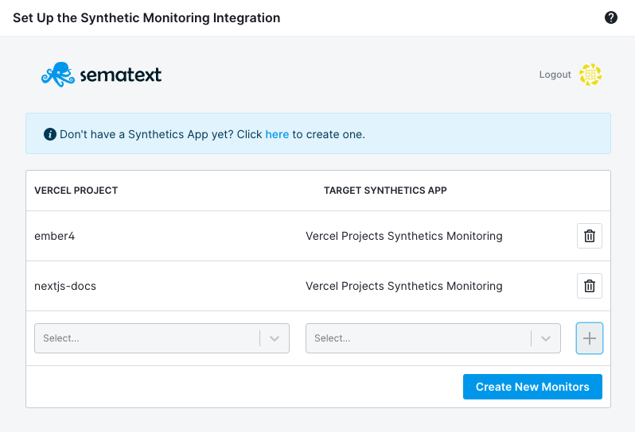
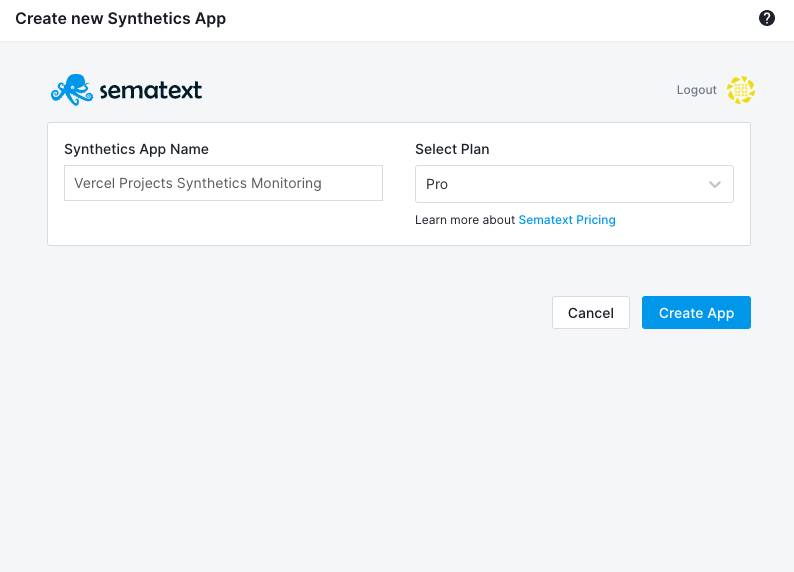
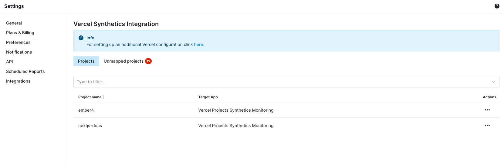
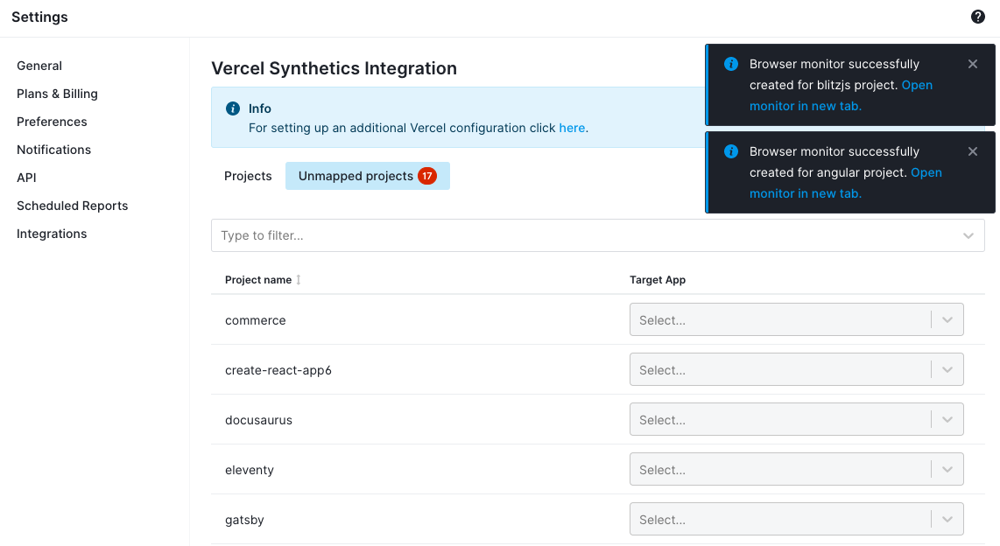

title: Vercel Synthetics Integration
description: Test and monitor site uptime, APIs, and frontend user experience for your Vercel projects

## Vercel Synthetics Quick Start

The Sematext Synthetics Vercel integration enables you to deliver fast, reliable and consistent websites & APIs with almost no setup:
- Monitor the availability of your website, APIs, and business-critical web transactions
- Diagnose and prevent website performance issues
- Avoid website downtime due to SSL certificate issues
- Track network timings across all layers (DNS, TCP, SSL & HTTP)
- Track third-party performance and SLAs
- Diagnose web performance issues using waterfall view and analysis
- Simulate user interactions using a real Google Chrome browser
- Simulate accessing your website from various different devices, such as desktops, tablets and mobile devices
- Benchmark your site's performance against your competitors’ key pages and transactions

Furthermore, you can also use the [Sematext Logs](https://vercel.com/integrations/sematext-logs) Vercel integration to ingest all your Vercel function logs for analysis and long-term storage.  

## Install the Sematext Synthetics Vercel Integration

Installing the Sematext Synthetics Vercel Integration is fast and easy:

1. Initiate installation of the [Sematext Synthetics integration](https://vercel.com/integrations/sematext-synthetics-monitoring) from the Vercel Integrations Marketplace by clicking the **Add Integration** button
2. Select the Vercel personal or team account to which you want to add the integration
3. Select the Projects to which the integration will be added
4. Link your Vercel projects with the target Synthetics Apps on the setup screen - a new Browser monitor will be created for each selected Vercel project

If you don't have an existing Synthetics App, you can create a new one by clicking on the link provided on the setup screen

## Configure your Sematext Synthetics Vercel Integration installation

If you want to modify your current installation go to the [configuration page](https://apps.sematext.com/ui/account/integrations/vercel/synthetics).

On the configuration page when the Projects tab is selected you can see an overview of all the Browser monitors you have created for your Vercel projects.

You can delete any of the created Browser monitors by choosing **Delete Synthetics Monitor** from the table actions. Monitors can also be managed from the [Monitors Overview page](https://apps.sematext.com/ui/synthetics/monitors).

To add new Browser monitors select the **Unmapped Projects** tab and select the target Synthetics App for the Vercel project for which you want to create a Browser monitor. If the monitor has been created successfully, a notification will appear in the top right corner with the link to the newly created Browser monitor.

