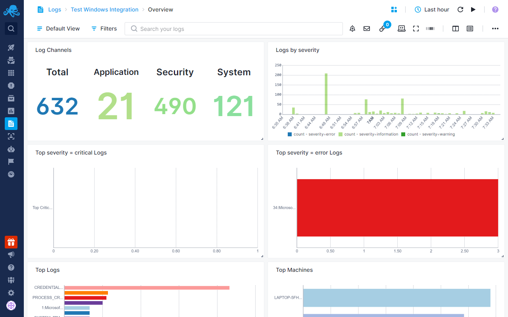
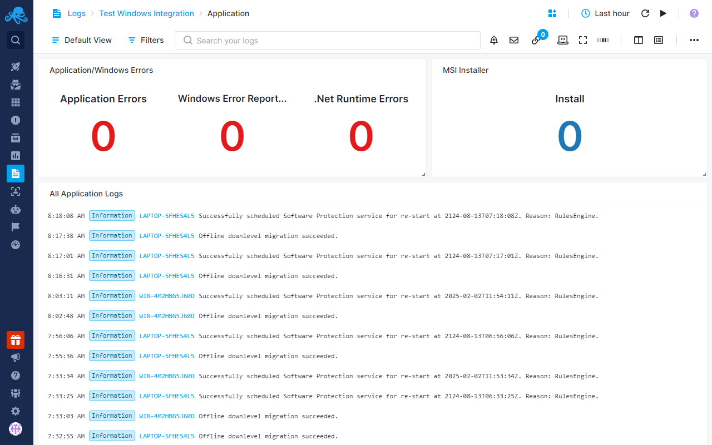
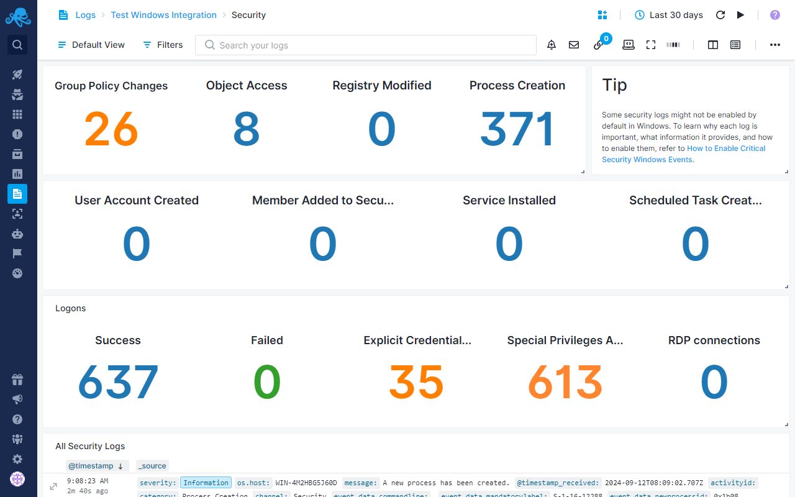

title: Sematext Windows Monitoring
description: Monitor Windows bare metal servers and VMs using a lightweight agent and visualize your full infrastructure in Sematext Cloud

## Windows Services

Sematext Monitoring includes support for Windows Services. Starting from Sematext Agent [version 3.5.0](https://sematext.com/docs/agents/sematext-agent/releasenotes/#version-350), you can collect and monitor the status of any Windows Service available in your system.

### Metrics

The [Sematext Agent for Windows](https://sematext.com/docs/agents/sematext-agent/windows-installation/), starting from version 3.5.0, is capable of collecting metrics related with the status of Windows services. At present, the primary metric supported is the status of each service including a number of statistics, which allows users to determine whether a service is running, stopped, or experiencing issues.

#### List of available metrics

|Name| Type  | Description |
|----|-------|-------------|
|windows.service.status            | number |status of a Windows service|
|windows.service.total             | gauge  |total number of Windows services|
|windows.service.total.running     | gauge  |total number of running Windows services|
|windows.service.total.not_running | gauge  |total number of non running Windows services|

#### Available Windows Services statuses 

Below is a list of all the possible values (statuses) of the `windows.service.status` metric.

|Value | Service Status  |
|------|-----------------|
|1     | stopped         |
|2     | start pending   |
|3     | stop pending    |
|4     | running         |
|5     | continue pending|
|6     | pause pending   |
|7     | paused          |

#### Available Tags

Below is a list of available [tags](https://sematext.com/docs/tags/) related to Windows Services. Tags can be used in conjuction with the `windows.service.status` metric to get information  about a specific Windows service, such as the name or type of the service. For example, you can edit any chart in the Infrastructure > Windows > Top Services report to see how Windows Service metrics and tags can be used to retrieve this information.

|Tag name | Description  |
|---------|--------------|
|windows.service.name   | name of the Windows service       |
|windows.service.type   | type of the Windows service       |
|windows.service.pid    | process ID of the Windows service |

For more information about the status of Windows Services and the available service types, please refer to the [official documentation](https://learn.microsoft.com/en-us/windows/win32/api/winsvc/ns-winsvc-service_status).

### Windows Services Reports

Coming Soon!

## Out of the box alerts

Each time you create a new Infra App in Sematext Cloud to monitor your Windows servers, a number of pre-configured alerts are created as well, fine tuned to catch various issues and help you prevent your systems from going down.

Refer to our [infrastructure default alerts](https://sematext.com/docs/monitoring/servers/#core-infrastructure-alerting) to learn more.

Moreover, a set of pre-defined [alerts](https://sematext.com/docs/alerts/) is supported for the status of several important Windows services. These alerts are triggered when the status of any monitored service is not running. The following services are monitored out-of-the-box:

- Windows Time (W32Time)
- Security Accounts Manager (SamSs)
- Event Log (eventlog)
- Task Scheduler (Schedule)
- DHCP Client (Dhcp)
- LanmanWorkstation
- LanmanServer
- Plug and Play (PlugPlay)
- Windows Management Instrumentation (WMI) (winmgmt)
- Group Policy Client (gpsvc)
- Cryptographic Services (CryptSvc)
- Print Spooler (Spooler)
- Remote Access Connection Manager (RasMan)
- Network Store Interface Service (nsi)
- Network List Service (NlaSvc)

In addition to having alerts for these services, you can [create alerts](https://sematext.com/docs/alerts/creating-metrics-alerts/) for any other Windows Service you like, as long as it is available on your Windows machines.

## Logs

Starting from [version 3.7.0](https://sematext.com/docs/agents/sematext-agent/releasenotes/#version-370), [Sematext Agent for Windows](https://sematext.com/docs/agents/sematext-agent/windows-installation/) is capable of collecting Windows Event logs along with metrics related with the status of Windows services.

### Install Sematext Agent

1. Create a Windows Logs [App](https://sematext.com/docs/guide/app-guide/). This will let you install the agent and control access to your logs data.
2. Install [Sematext Agent for Windows](https://sematext.com/docs/agents/sematext-agent/windows-installation/) on each host you want to monitor according to the instructions displayed in the UI
3. Once you install the agent, you will start seeing logs from your Windows operating system in your [App](https://sematext.com/docs/guide/app-guide/) within a few minutes.
4. The agent comes with additional configuration options. See [Configuring the Sematext Windows Agent](https://sematext.com/docs/integration/configuring-windows-agent/) for more details.

### Reports

Once data is in, you can explore it via the built-in reports:

Pre-configured [alert rules](https://sematext.com/docs/guide/alerts-guide/) will notify you about:

- Unusual or excessive occurrences of application errors, such as patterns of frequent application crashes or unusual error codes.
- Unexpected system shutdowns, which could indicate power loss, hardware failure, or other critical issues.
- System shutdowns initiated by a user or process, helping to track deliberate shutdowns and distinguish them from unexpected shutdowns.

#### Application Logs

Application logs capture information generated by applications running on the system, detailing activities, errors, warnings, and informational messages. These logs can help diagnose issues, track performance, and monitor the overall behavior of applications. 

#### Security Logs

Security logs record events related to system security, such as successful and failed login attempts, user account management (creation, deletion, or modification), permission changes, and access to resources. These logs help track user activities and security-related changes, providing information for auditing, compliance, and forensic analysis.

- **Group Policy Changes**: When changes are made to the system’s group policies, which control settings and permissions for users and computers in a network. It helps track who made the change and what was altered.
- **Object Access (File Audit)**: Tracks access to specific files or folders, showing who opened, modified, or deleted them. It helps monitor file activity and detect unauthorized access. File audit is not enabled by default, to enable file auditing for specific files or folder check out ….
- **Registry Changes**: Changes made to the Windows registry, which stores system and application settings. It helps track modifications that could affect system behavior or security.
- **Process Creation**: New process or application starts on the system. It helps you see what programs are running and detect any unusual or unauthorized applications.
- **User Account Creation**: Helps tracking the addition of new users and ensures that only authorized accounts are added.
Member Added to Security Group: When a user is added to a security group, which affects their access rights and permissions. It helps track changes in user permissions and access levels.
- **Service Installed**: Tracks the installation of new services on the system. It helps monitor the addition of new system components and ensure that only approved services are installed.
- **Scheduled Task Created**: Tracks the creation of new scheduled tasks, which are automated jobs that run at set times. It helps track automation and ensure that scheduled tasks are legitimate.
- **Logons (Successful, Failed, Logon with Explicit Credentials)**: These logs capture user logon attempts, including successful logins, failed attempts, and those using specific credentials. They help monitor user access and detect potential login issues or unauthorized access attempts.
- **Remote Desktop Connections**: This log shows when a user connects to the system using Remote Desktop. It helps track remote access and ensure that connections are authorized and secure.

By default, certain critical security events, such as file auditing, audit policy changes and registry changes, are not logged by Windows Servers. To make sure all necessary security events are tracked, these need to be manually enabled in the server’s auditing settings. See [How to Enable Security Logs](https://sematext.com/docs/integration/how-to-enable-windows-security-logs/) for more information.

#### System Logs

System logs contain events generated by the operating system and its components, focusing on the functioning and performance of the system itself. These logs capture information related to system hardware, drivers, and services, including errors, warnings, and status changes. For example, system logs can record events like driver failures, service startups or shutdowns, hardware issues, or updates to the operating system. 

