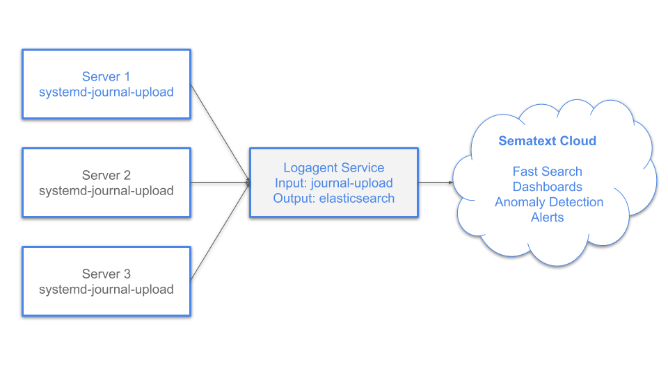

# How To Centralize Linux System Journal


Did you know that most Linux systems have a complete log management solution onboard? Distributions based on `systemd` contain `journald` and `journalctl`.   

**systemd-journald** - All Linux system processes write logs to the system journal, which is managed by `journald`. The system journal is local log storage. 

**journalctl*** is the command-line client to display logs with various filter options like time, system unit or any other field stored in the log event. For advanced searches, it is possible to pipe the output to grep, which makes it easy to apply complex search expressions to journalctl output. 
The journalctl client is not only useful for log search, but it also provides various other functions such as management of the system journal storage. 

**systemd-journal-upload** is a service to forward log events to a remote `journald` instance. Configuring `journal-upload` on all your Linux machines forwarding log events to a central log server is the best way to centralize logs. Then you can use `journalctl` on the central log server for log search.  Even though the Linux console is cool, you want a web UI to search logs and visualize extracted data for easier and more practical troubleshooting.

Shipping the logs to the Elastic Stack is a common practice to centralize logs, but how can this be done with journald? 

Unlike rsyslog, journald has no option to forward logs directly to Elasticsearch. As we need json data the output of `journalctl -o json` could be useful. Piping the output of journalctl to Logagent could be a solution: 

```journalctl -o json -f | logagent -i mylogs -u http://elasticsearch:9200```

Cool, it works! However, the running processes would not catch logs at boot time or recover gracefully after a restart - we might lose some logs - a nogo!

Luckily, Logagent has got a [plugin](https://sematext.com/docs/logagent/input-plugin-journald-upload/) that receives logs from the `systemd-journal-upload` service. Let’s start from scratch and set up Logagent to receive journald logs and store them in Elasticsearch or Sematext Cloud.  



## Setup Logagent as a local logging hub

To run Logagent you will need a Logs App Token first. If you don't have Sematext Logs Apps yet, you can [create Logs Apps now](https://apps.sematext.com/ui/integrations).
Then you can [install Logagent](https://sematext.com/docs/logagent/installation/). The default setup ships log files from /var/log to Sematext Cloud. To run Logagent you will need a Logs App Token. 

To receive logs from the `journal-upload` service, activate the plugin in `/etc/sematext/logagent.conf`. 


```yml
# Global options
options:
  includeOriginalLine: true


input:
   journal-upload:
    module: input-journald-upload
    port: 9090
    worker: 0
    systemdUnitFilter: 
      include: !!js/regexp /.*/i
    # exclude: !!js/regexp /docker|containerd/i
    # add static tags to every log event 
    tags:
     log_shipper: logagent
     # _index is special tag for log routing with elasticsearch output-plugin
     # Set the index name here in case journald logs should be 
     # stored in a separate index
     # _index: MY_INDEX_FOR_ELASTICSEARCH_OUTPUT or 
     #         YOUR_SEMATEXT_LOGS_TOKEN_HERE
     # you can add any other static tag 
     # node_role: kubernetes_worker
     # journald might provide many fields, 
     # to reduce storage usage you can remove redundant fields
    removeFields:
      - __CURSOR
      - __REALTIME_TIMESTAMP
      - _SOURCE_REALTIME_TIMESTAMP
      - __MONOTONIC_TIMESTAMP
      - _TRANSPORT
      
output: 
  # output data for debugging on stdout in YAML format
  # stdout: yaml
  sematext-cloud:
    module: elasticsearch
    url: https://logsene-receiver.sematext.com
    # url: https://logsene-receiver.eu.sematext.com
    index: YOUR_SEMATEXT_LOGS_TOKEN_HERE


```

Now we can restart the `logagent` service with 

```
systemctl restart logagent
```

Perfect, our logging hub for journald logs is running. 

Let’s move on to set up the `systemd-journal-upload` on our Linux server.


# Setup systemd-journal-upload 


__Note: Please note the example uses 127.0.0.1 as IP address for Logagent. You should replace 127.0.0.1 with the IP address with the actual IP of the server you run logagent.__


Use the following command to install `systemd-journal-remote`

```
sudo apt-get install systemd-journal-remote
```

Edit `/etc/systemd/journal-upload.conf` and change the URL property.

```
[Upload]
URL=http://127.0.0,1:9090
# ServerKeyFile=/etc/ssl/private/journal-upload.pem
# ServerCertificateFile=/etc/ssl/certs/journal-upload.pem
# TrustedCertificateFile=/etc/ssl/ca/trusted.pem
```

This will make sure `journal-upload` starts on boot. 

Note that the upload service might stop if creating the HTTP connection doesn't work. Should that happen the service stores the current cursor position in the system-journal. Therefore, you should set useful restart options in the service definition. 

Edit `/etc/systemd/system/multi-user.target.wants/systemd-journal-upload.service ` to change restart options. 


```
[Unit]
Description=Journal Remote Upload Service
Documentation=man:systemd-journal-upload(8)
After=network.target


[Service]
ExecStart=/lib/systemd/systemd-journal-upload \
          --save-state
User=systemd-journal-upload
SupplementaryGroups=systemd-journal
PrivateTmp=yes
PrivateDevices=yes
#WatchdogSec=3min
Restart=always
TimeoutStartSec=1
TimeoutStopSec=1
StartLimitBurst=1000
StartLimitIntervalSec=5
# If there are many split up journal files we need a lot of fds to
# access them all and combine
LimitNOFILE=16384
[Install]
WantedBy=multi-user.target
```

Apply the changes and restart `journal-upload`:

```
systemctl daemon-reload
sudo systemctl enable systemd-journal-upload.service
```

Check if your logs arrive in Sematext Cloud by opening your Logs App. 
The following video shows how to use the Sematext UI.

<iframe width="696" height="392" src="https://www.youtube.com/embed/glwZ8OCV0kc?list=PLT_fd32OFYpfLBFZz_HiafnqjdlTth1NS" frameborder="0" allow="accelerometer; autoplay; encrypted-media; gyroscope; picture-in-picture" allowfullscreen></iframe>
