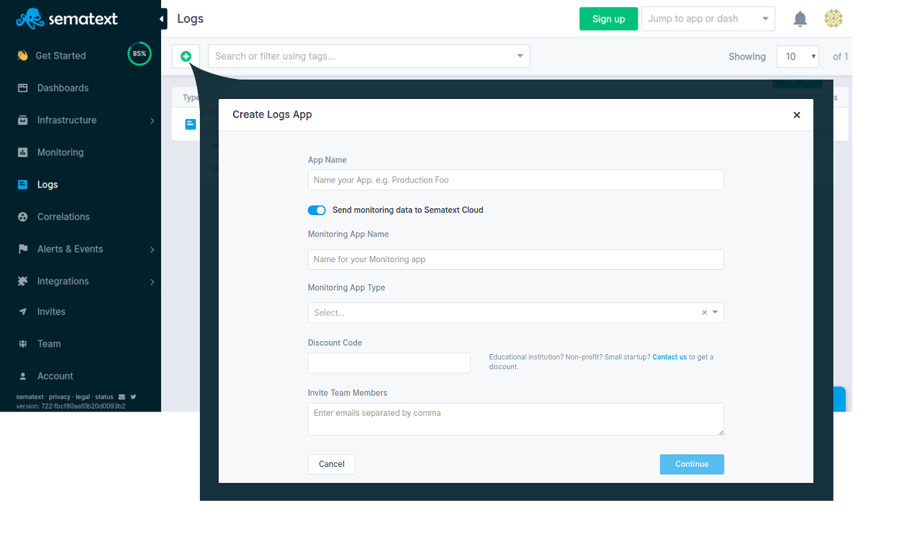

title: Installing Logagent on Linux
description: Logagent, Sematext log shipper and Logstash alternative, is available as node.js npm package for Linux, Mac, and Windows. It has automatic Systemd or Upstart service scripts installation and seamless logging system service integration with our logs management and analysis platform

[Logagent](./index.md) is a general purpose log shipper. It runs as a system service on Linux by using Systemd or Upstart.

## Install Node.js on your server
First, make sure you have [Node.js 8.11 or later installed](https://nodejs.org/en/download/package-manager/). E.g. for Debian/Ubuntu:
``` bash
curl -sL https://deb.nodesource.com/setup_12.x | sudo -E bash -
sudo apt-get install -y nodejs
```

## Install the Logagent npm package
```bash
sudo npm i -g @sematext/logagent 
```

## Run Logagent and ship logs

### 1. Register for a free account at [Sematext.com](https://apps.sematext.com/ui/registration)


### 2. [Create a Logs App](https://apps.sematext.com/ui/logs-create/app/logsene) to get a Logs Token for [Sematext Logs](https://www.sematext.com/logsene/)


### 3. Run Logagent as System Service

By running the `logagent-setup` command, Logagent will detect the init system and install Systemd or Upstart service scripts.

- *Ship logs to default US region*
    <!-- language: bash -->
        
        sudo logagent-setup -i LOGS_TOKEN

- *Ship logs to EU region*
    <!-- language: bash -->
        
        sudo logagent-setup -i LOGS_TOKEN -u logsene-receiver.eu.sematext.com

- *Ship logs to any Elasticsearch endpoint*
    <!-- language: bash -->
        
        sudo logagent-setup -i index -u http://localhost:9200

Changing the Elasticsearch `index` and `endpoint` lets you ship logs to any Elasticsearch cluster. After running `logagent-setup` the agent will start shipping logs immediately.

##### Location of service scripts
- Systemd: `/etc/systemd/system/logagent.service`
- Upstart: `/etc/init/logagent.conf`

##### Check service status
- Systemd: `systemctl status logagent`
- Upstart: `service logagent status`

##### Start/stop service
- Systemd: `systemctl stop/start logagent`
- Upstart: `service logagent stop/start`

### 4. Configure Logagent settings
The setup script generates the configuration file in `/etc/sematext/logagent.conf`. The default settings will ship all log files from the `/var/log` directory to Sematext Cloud. [Here's the configuration guide](./config-file).
