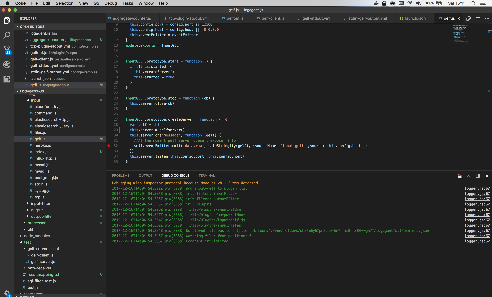
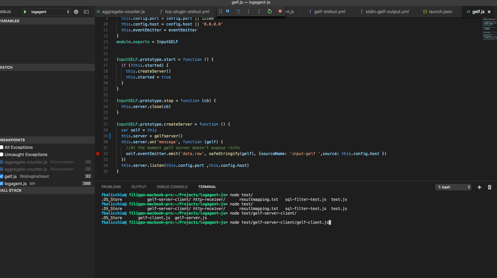
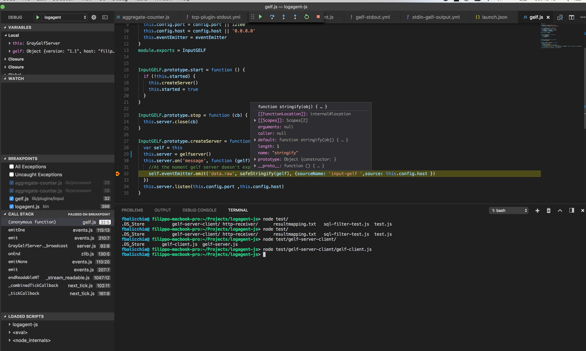

title: Logagent Debugging
description: Debug Logagent using Visual Source Code Logagent. Logagent is light-weight log shipper, filebeat, fluentd or rsyslog alternative with out of the box and extensible log parsing, on-disk buffering, secure transport, bulk indexing to Elasticsearch and Sematext logs management platform

### Logagent Debugging with Visual Source Code:

Here we try explain how to debug Logagent using Visual Source
Code. After [downloading](https://code.visualstudio.com/Download) VSC
and importing Logagent project, you can debug Logagent configuration
with `launch configuration` like this - you'll want to adjust the path
below, obviously:

```
{
    "version": "0.2.0",
    "configurations": [

    {
        "type": "node",
        "request": "launch",
        "name": "logagent",
        "program": "${workspaceFolder}/bin/logagent.js",
        "args": [
            "-c",
            "/Users/fbalicchia/Projects/logagent-js/config/examples/gelf-stdout.yml",
            ""
        ],
        "console": "externalTerminal"
    }
    ]
}

```
`"console": "externalTerminal"` lets you open an external console for stdin/stdout in case your Logagent configuration uses console plugin.

### Example :
Say we are trying to pinpoint a problem in GELF Input Plugin. We can add a **breakpoint** in GELF Input Plugin on the event message:

s

Next, we need to produce a message from a GELF client.  We could do that by typing in the terminal:



Logagent will stop at our breakpoint and we can then start to debug:



### Useful Plugins to install:

Visual Source Code provides a lot of plugins, including ESLint, which helps keep the code more consistent and easier to debug.
