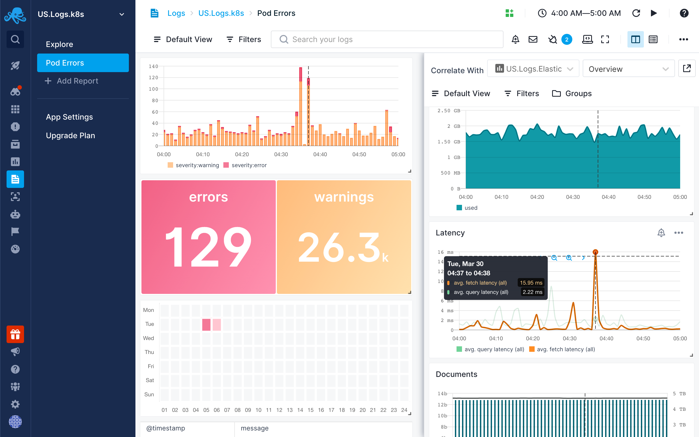

title: Logs correlation in Sematext
description: How to use Split screen to correlate logs with  metrics, other logs, events, or any other observability data.

Correlating logs with other observability data in Sematext is a great way to troubleshoot faster.

## What to Correlate

When troubleshooting issues you will most likely want to correlate logs with [performance metrics](../monitoring/) or [events](../events/). 

### Correlating Logs with Metrics

Often times, issues correlate with an increase in error or warning logs.  Correlating a performance spike, dip, or any other anomaly with logs will often lead you to error logs that will either immediately explain what is going on or will at least guide you in the right direction.  You can correlate any Log App's report with any Monitoring App's report, but any [Connected Apps](../guide/connected-apps/) will be more easily accessible during correlation.

### Correlating Logs with Events

Application deployments and infrastructure changes can introduce new errors and these new errors typically end up in your logs.  When new errors start appearing in your logs you will often see a spike in error logs or overall log count.  If you are [tracking your deployments in Sematext](../events/event-examples/#application-deployment-tracking) then you will be able to correlate changes in the error log volume with your deployment events.  This is a great way to discover newly introduced issues and track them back to the deployment that brought them to production all the way down to invididual commits that were included in the deployment.

## How to Correlate: Use the Split Screen

Log events can be correlated with other observability data in Sematext and this is best done using the [Split Screen](../guide/split-screen) feature. With Split Screen you can compare and correlate any Logs report with any Monitoring, Infrastructure or Experience reports. Correlation is also possible with [Events](../events/) or Synthetic Monitors. Split Screen can be used to correlate even data within the same Monitoring report but with different filters and groups in the two different screens.

Once you select a report you want to correlate with, it’ll be remembered so you can quickly toggle it.
