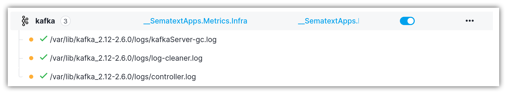
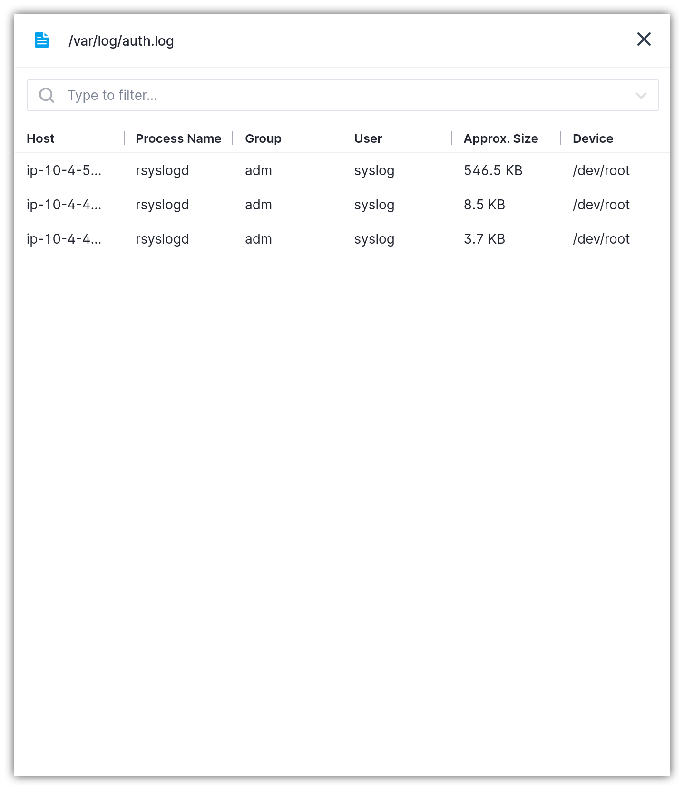
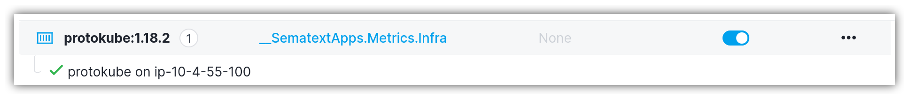

title: Logs Discovery Control Plane
description: Logs Discovery Control Plane

Logs Discovery Control Plane is the central location for managing the shipping of discovered log sources. It consists of various tabs, each of them designated to one particular log source.

The rows have the following columns:

- `Name` represents the human-friendly identifier for the log source, such as log file name or container name.
- `Infra App` is linked to the App token that was used to deploy the Sematext Agent. If you have only one Infra App, then this column is not shown. The Infra App stores infrastructure data and metrics including discovered log sources.
- `Destination App` specifies the Logs App where logs are shipped. You can select a distinct Logs App for each group.
- `Automatic Shipping` determines whether the logs are automatically shipped for some group. Initially, if no log shipping was set up, this column shows the `Set Up` button. Conversely, if log shipping was configured, this column displays a toggle that permits enabling/disabling the automatic log shipping.
- `Actions` column that contains various log shipping-related actions.

## Log sources

- `Files` show discovered log files grouped by service type or process name. The Sematext Agent infers the service that's writing to a log file and automatically tags all log files of such a service. If the agent can't recognize the service type, because the signature for that service is not present in the agent's internal catalog, the log files are grouped by process name that owns the log files and writes to them.

As shown above, the Kafka group has three log file sources that pertain to the Kafka service. Each log file source can have multiple instances of the same log file discovered on different hosts. Clicking a particular log file source shows all log file instances grouped by host, as shown below.

- `Kubernetes` show all Kubernetes services and components, grouped by type of service/process producing the logs.

- `Containers` reveal all discovered Docker containers grouped by image name or the image digest. This log source contains plain Docker containers, meaning they are not controlled by the orchestrators such as Kubernetes.

In a similar manner to log file sources, each container log group shows a collection of containers that might be running on different nodes.

- `Journald` show all systemd services grouped by type of process producing the logs.

