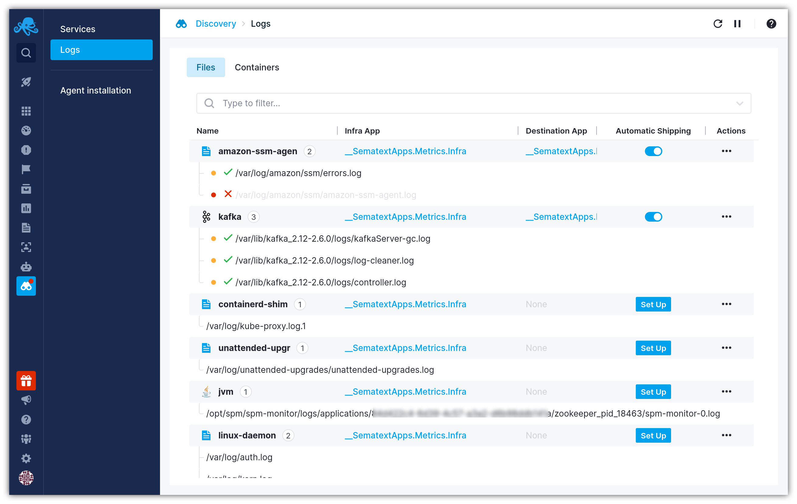

title: Set up logs discovery
description: Getting started with logs discovery

To set up logs discovery simply deploy the Sematext Agent in your infrastructure. Head to the [installation](/agents/sematext-agent/installation) instructions to proceed with the deployment.

Once you have successfully deployed the agent, navigate to the `Discovery > Logs` screen where you can explore all of your discovered log sources.

