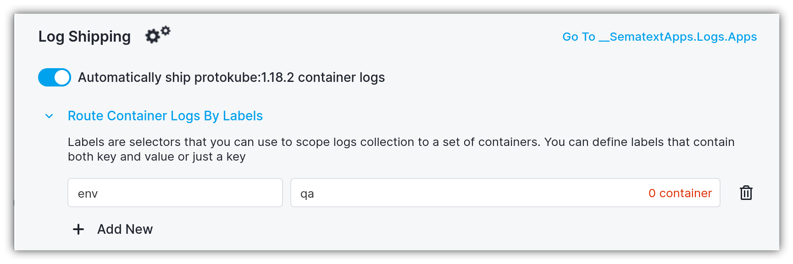

title: Shipping Container Logs
description: Shipping Container Log Sources

To enable automatic container logs shipping, start by clicking on the `Set Up` button. This will open the following flyout panel that allows configuring container log shipping:

1. Trigger the "Automatically ship <group-name> logs" toggle
2. Select the destination Logs App. If the Logs App doesn't exist, you'll be able to create one from the same screen
3. Click the `Save Changes` button

Log shipping is configured by the specific container image. This implies that any freshly created containers that match this image name will automatically have their logs shipped to Sematext Cloud.

## Routing logs by container labels

If you want to restrict the scope of log collection, it is possible to route the container logs by labels. You can either select a label from the list of already defined labels in this container or write a custom label. Labels can contain a key/value pair, or just a key.

