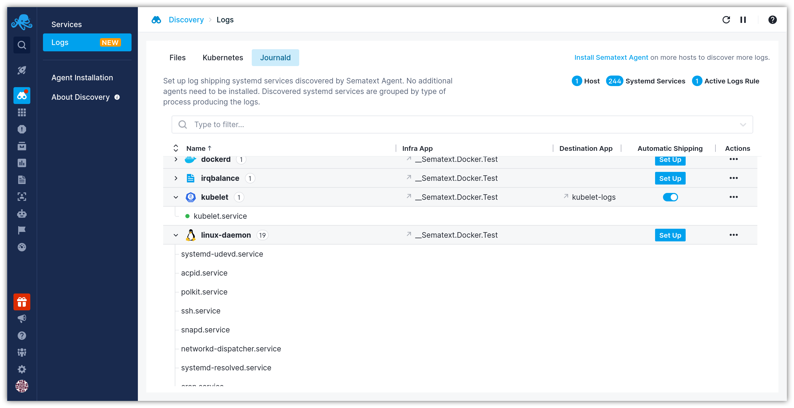
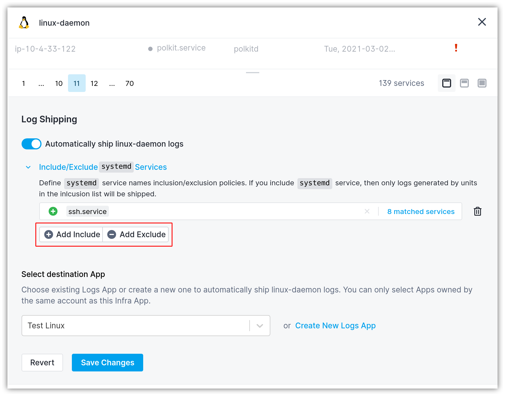

title: Shipping Journald Logs
description: Shipping Journald Log Sources

[Journald](https://sematext.com/blog/journald-logging-tutorial/) is the logging system that collects and stores logs in _systemd_-based Linux distributions. Journald Logs Discovery classifies the systemd services into groups of types that are known to our internal catalog. For unknown service types, the systemd services are grouped by the process executing inside the _systemd_ service.

To enable automatic Journald logs shipping head to the [Logs Discovery UI](https://apps.sematext.com/ui/fleet-and-discovery/discovery/logs/) (or [EU Discovery](https://apps.eu.sematext.com/ui/fleet-and-discovery/discovery/logs/) if you use Sematext EU), and start by clicking on the `Set Up` button to configure log collection for the particular _systemd_ service(s).

This will display a panel where you can configure Journald log shipping:

1. Enable the "Automatically ship <group-name> logs" toggle
2. Select the destination Logs App. If the Logs App doesn't exist, you'll be able to create one from the same screen
3. Click the `Save Changes` button

## Including/excluding systemd services

You can fine-tune the log shipping by defining inclusion/exclusion policies for systemd services. Only the systemd services that you specify in the inclusion list will get their logs shipped.

