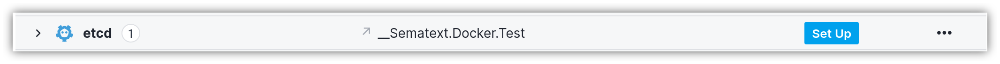
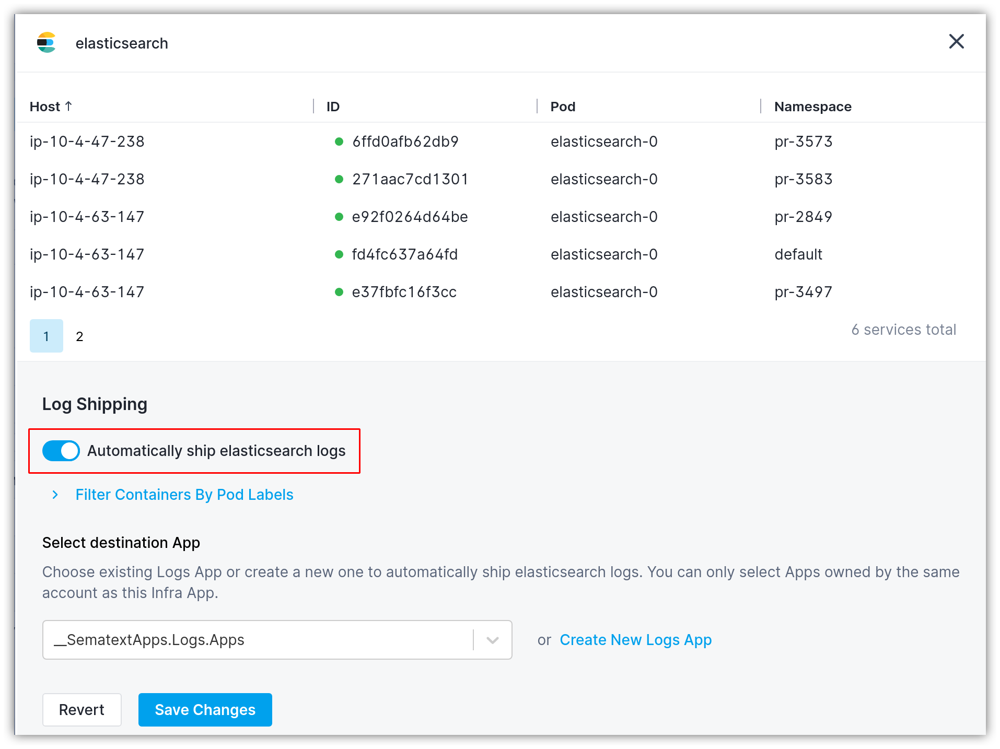
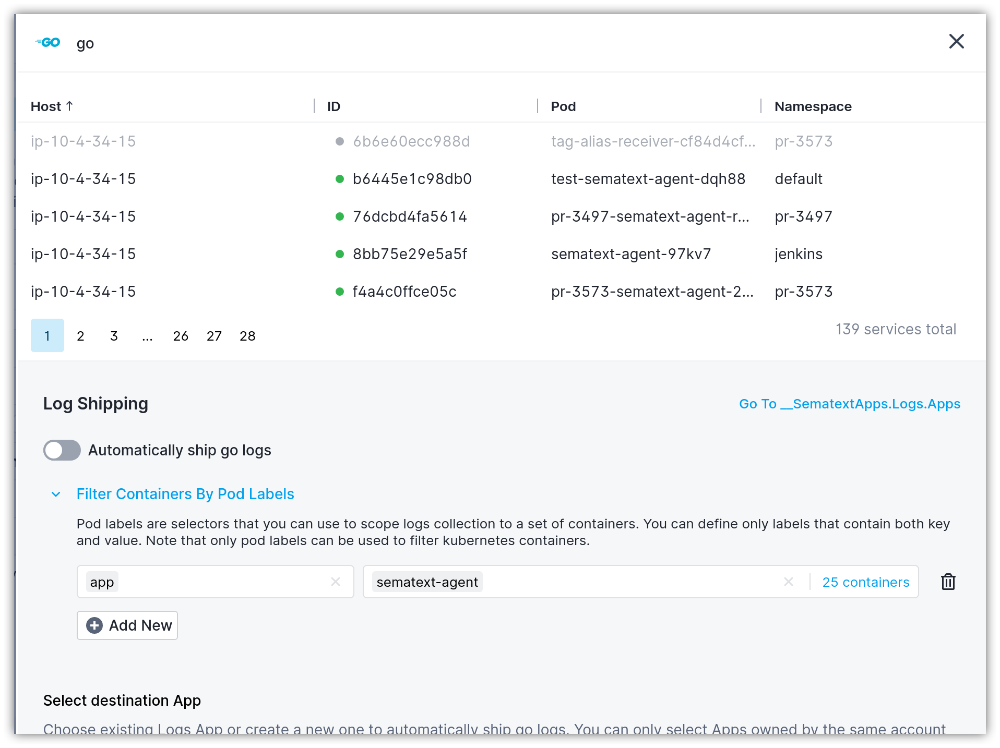

title: Shipping Kubernetes Logs
description: Shipping Kubernetes Log Sources

Collecting and shipping Kubernetes logs is accomplished in a similar manner to [log files](/logs/discovery/tailing-log-files) and [plain container](/logs/discovery/tailing-containers) logs. The Kubernetes containers are grouped by type of service or process that is running inside the container.

To enable automatic Kubernetes logs shipping head to the [Logs Discovery UI](https://apps.sematext.com/ui/fleet-and-discovery/discovery/logs/) (or [EU Discovery](https://apps.eu.sematext.com/ui/fleet-and-discovery/discovery/logs/) if you use Sematext EU), and start by clicking on the `Set Up` button for the service, group or process whose Kubernetes logs you would like to ship.

This will display a panel where you can configure Kubernetes log shipping:

1. Enable the "Automatically ship <group-name> logs" toggle
2. Select the destination Logs App. If the Logs App doesn't exist, you'll be able to create one from the same screen
3. Click the `Save Changes` button

## Filtering logs by pod labels

For every container that belongs to the service or process group, you can narrow down logs collection by pod labels. Both the label's keys and values are obtained for each pod that contains one or multiple containers identified by the service type or process name.

