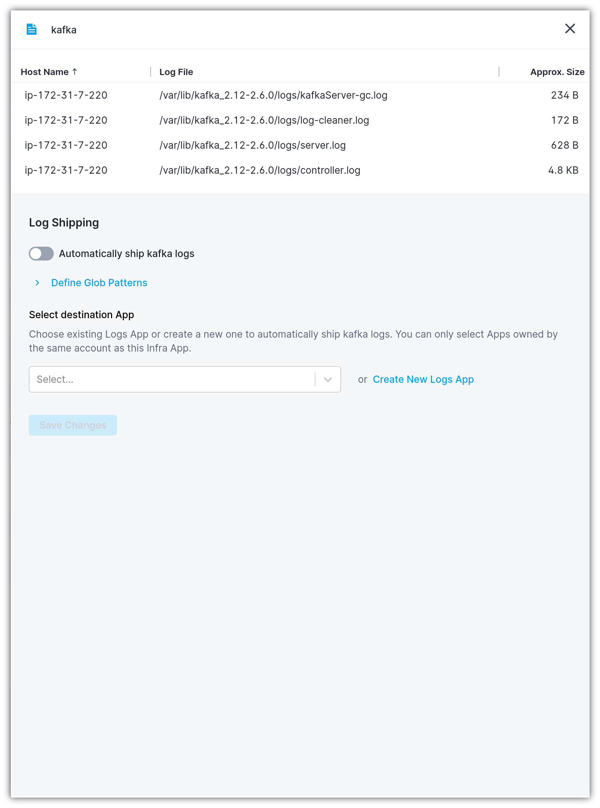
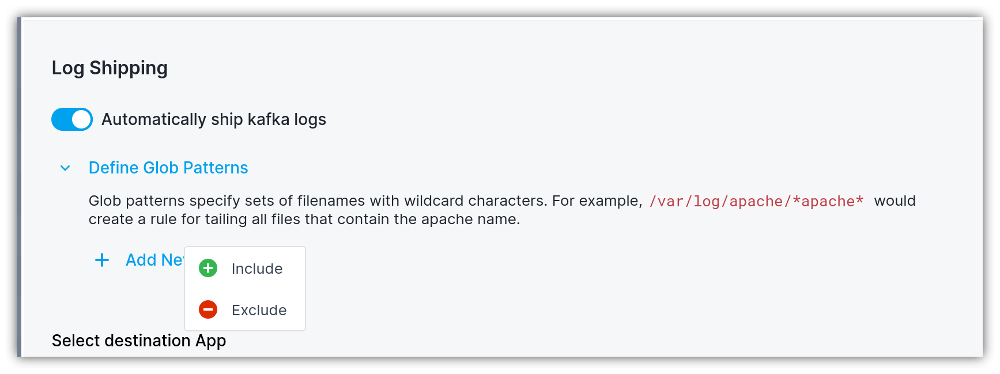
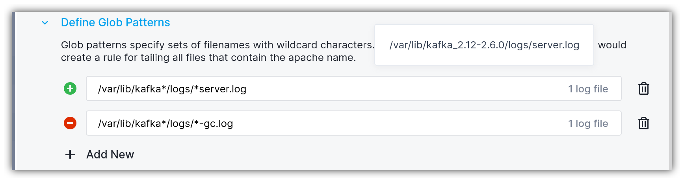
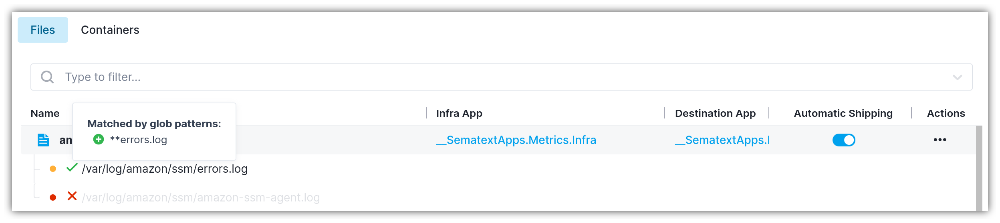
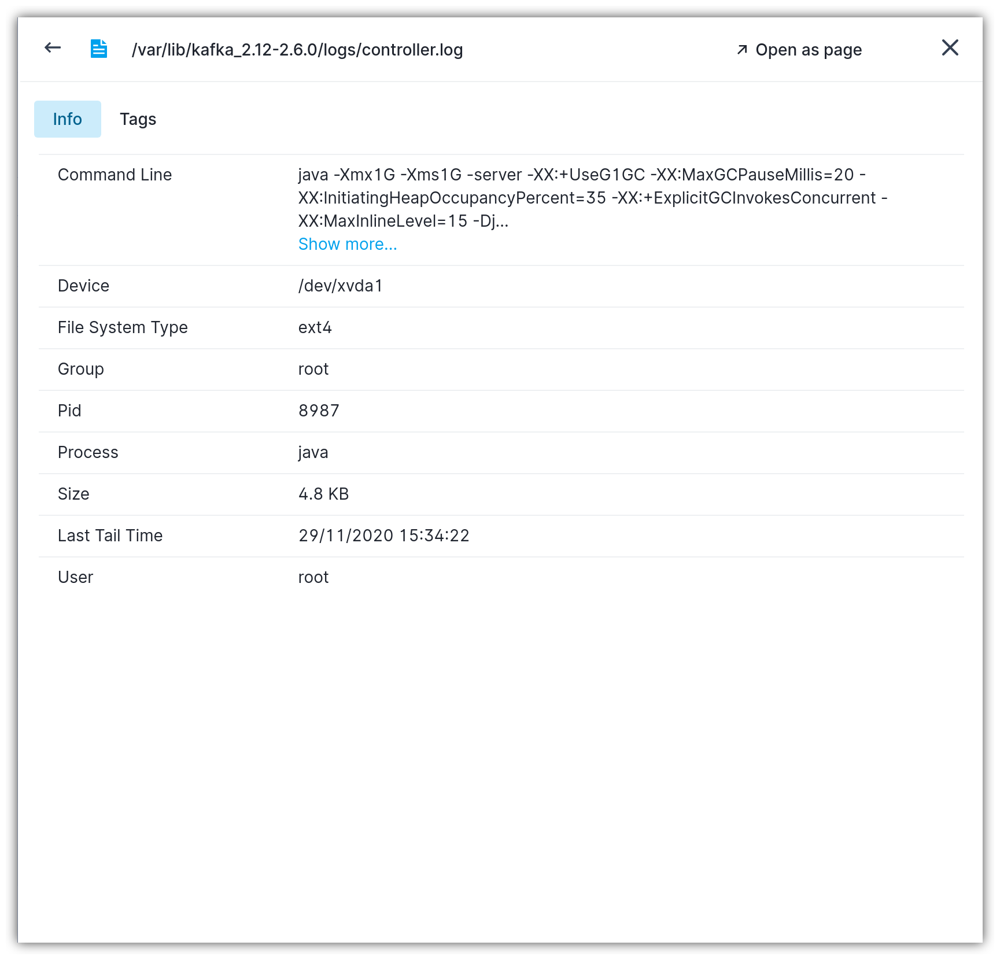

title: Shipping Log Files
description: Shipping Log File Sources

Enabling automatic logs shipping is accomplished by triggering the "Set up" button that opens the flyout for configuring log file shipping.

In the flyout panel, you have to repeat the following steps to start shipping logs for the log file source:

1. Enable the "Automatically ship <group-name> logs" toggle
2. Select the destination Logs App. If the Logs App doesn't exist, you'll be able to create one from the same screen
3. Click the `Save Changes` button

The log shipper will automatically start tailing any log file that pertains to the service type for which the log shipping was set up.

## Defining glob patterns

To narrow down which log files should be tailed, you can define include/exclude [glob](https://en.wikipedia.org/wiki/Glob_(programming)) patterns. The following glob wildcards are supported:

- `*` matches any sequence of non-separator characters
- `?` matches any single non-separator character
- `[0-9]` matches character ranges

When defining glob patterns, you can either specify include or exclude glob expressions. Exclude glob patterns take precedence over include patterns. This means that a log file that matches an include pattern will not be shipped if it also matches an exclude pattern.

As you're inputting the glob pattern, you'll be automatically getting feedback on how many and which exact log files are matched by include/exclude glob patterns.

Going back to the main table, you'll notice two kinds of visual indicators that signal whether a particular log file source is included or excluded by the glob expression. By hovering over the `✓` or `✕` icons, you'll be able to figure out which exact glob pattern(s) are applied on the log file. If the log file is excluded from tailing, it is grayed out in the table row.

The orange/yellow circles reflect log file tailing state. If you hover over them, the count of log files that are actually being shipped is shown. The red state indicates that some log file instances might not be tailed by the log shipper.

## Exploring log file metadata

Each log file discovered is accompanied by meta information that you can access by clicking on the log file instance. The following attributes are displayed:

- `Command Line` reveals the command line arguments of the process that has opened the log file and it is writing to it
- `Process` is the name of the process that is writing to the log file
- `Pid` is the identifier of the process that is writing to the log file
- `Device` represents the disk device where the log file is stored
- `File System Type` designates the file system of the disk device where the log file is located
- `Size` shows the approximate size of the log file
- `User` is the user name that owns the file
- `Group` is the group name to which the log file pertains
- `Last Tail Time` represents the last time the log file was tailed

