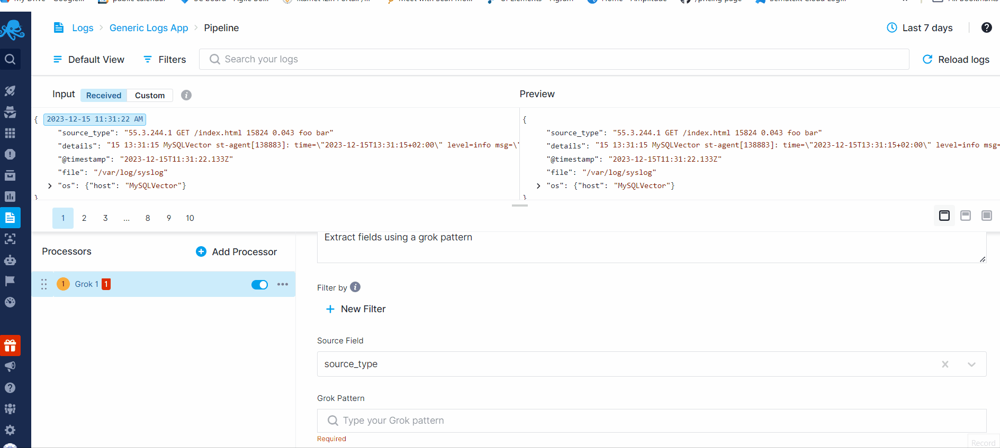
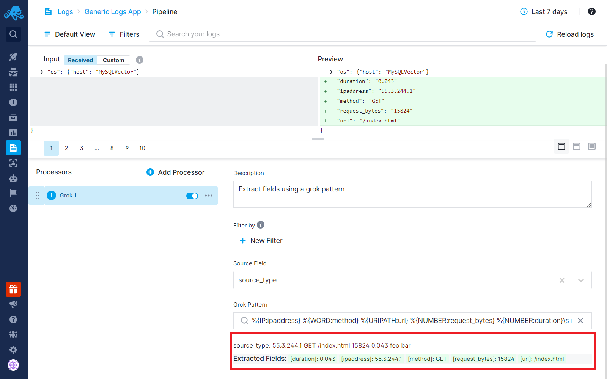

title: Field Extractor Processor
description: Extract fields using a GROK pattern

Structuring data into fields is important if you are using Sematext Logs.  Having your logs structured makes it easy to analyze logs, create charts with data from individual fields, filter log events, or group them by their field values.

By using Field Patterns Extractor, you can extract multiple fields from other fields. With GROK patterns, you can efficiently extract essential information from lengthy text fields, eliminating redundant data, thus reducing costs. Check out [How Logs Pipelines Can Reduce Your Log Monitoring Costs](../logs/reduce-costs-with-pipelines) for additional information.

Grok works by combining text patterns into something that matches your logs.
The syntax for a grok pattern is `%{SYNTAX:SEMANTIC}`

Imagine we have a message field:
`Got document of 142 kb from 255.35.244.0`

The `SYNTAX` is the name of the pattern that will match your text. For example, `142` will be matched by the `NUMBER` pattern and `255.35.244.0` will be matched by the `IP` pattern. The syntax is how you match.

The `SEMANTIC` is the identifier you give to the piece of text being matched. For example, `142` could be the size of a document in bytes, so you could call it simply size. Further, a string `255.35.244.0` might identify the `IP` of device which sending a document.

For the above example, your grok filter would look something like this:

`Got document of %{NUMBER:sizeOfDoc} kb from %{IP:deviceIp}`

Field Extractor provides a bunch of predefined patterns you may use for your purposes, readily accessible within the tooltip while inputting the GROK pattern. Autocompletion makes it easy to navigate through and select them.

Upon selecting the source field and entering the GROK pattern, note that we promptly showcase both the original value of the field and the newly extracted fields just below the pattern box. This immediate display allows you to effortlessly track the results of the GROK pattern as you type.

