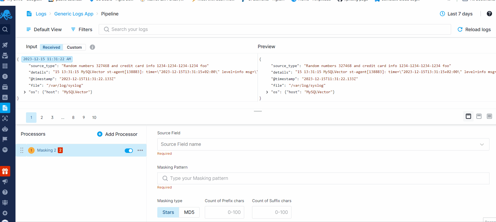
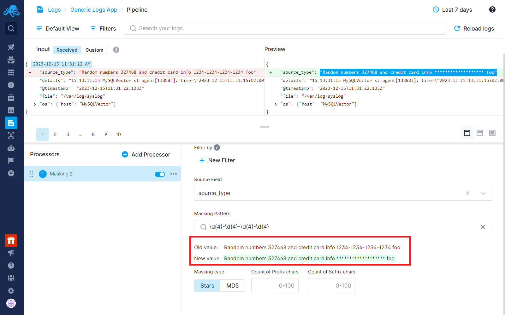

title: Field Masking Processor
description: Mask fields using a regex pattern.

The Field Masking Processor enables the masking of specific sections within text fields using regex patterns. This processor is ideal for safeguarding sensitive data, including credit card details, social security numbers, and more. Additionally, sensitive information can also be dropped altogether using various processors available in Logs Pipelines. Check out [Handle Sensitive Data](../logs/handle-sensitive-data-with-pipelines) for additional information.

Field Masking Processor provides a bunch of predefined patterns you may use for your purposes, readily accessible within the tooltip while inputting the regex pattern. Autocompletion makes it easy to navigate through and select them.

Upon selecting the source field and entering the regex pattern, note that we promptly showcase both the original and the new value of the field just below the pattern box. This immediate display allows you to effortlessly track the results of the regex pattern as you type.

