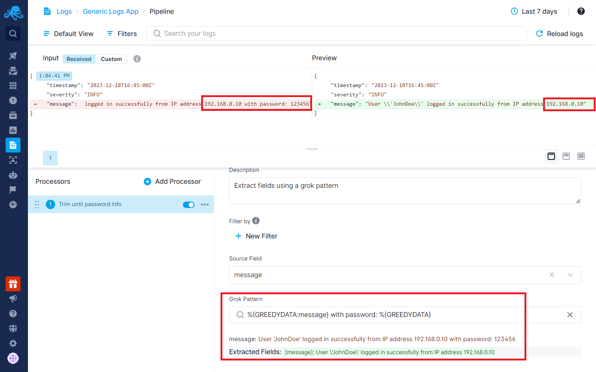
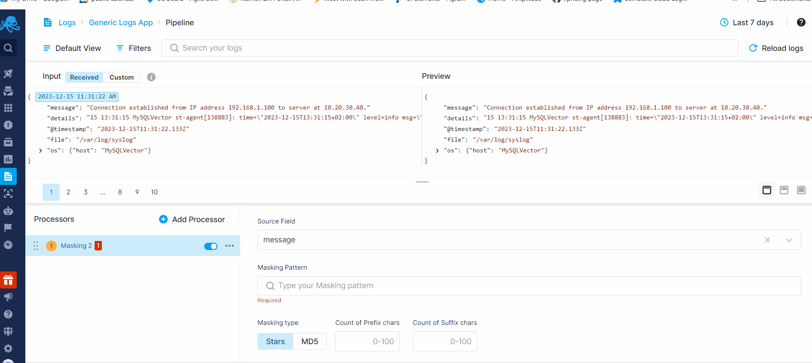
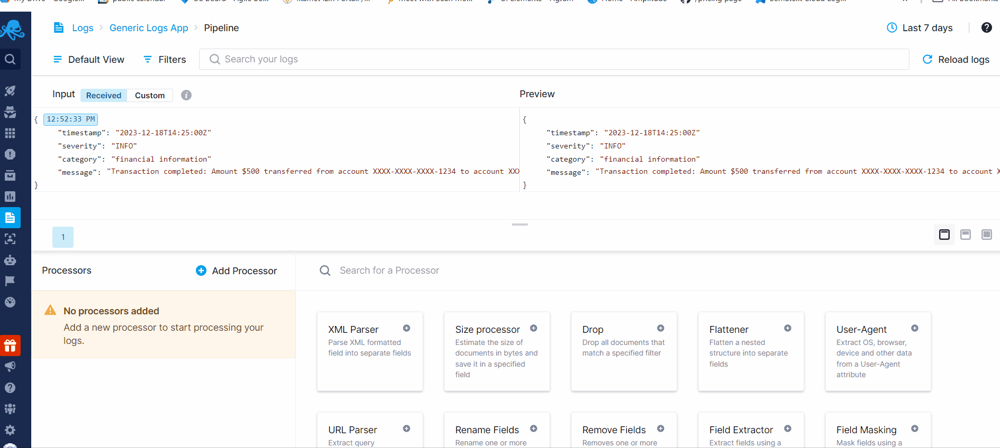
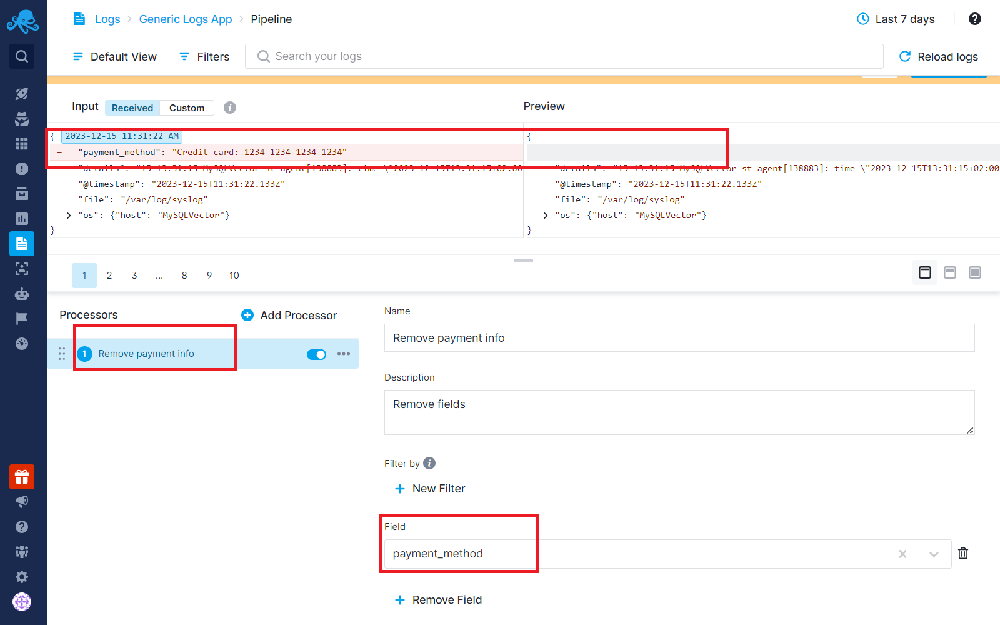

title: How to Handle Sensitive Data
description: How to handle sensitive data using various processors offered in Logs Pipelines

Logs can contain sensitive information that requires handling to maintain security and compliance with data protection regulations, and the protection of personal data. In Logs Pipelines, various processors allow protection of sensitive data before insertion into the database.

## Field Extractor Processor (Trimming)

The [Field Extractor](field-extractor-processor) processor assists in trimming specific parts of log fields. You can use this to remove senstive information from logs by using a GROK pattern.

For example, if you have a log with a message field containing useful information but also revealing user passwords in plain text, you can use the Field Extractor to trim the message field. This allows you to retain relevant information while dropping any sensitive data, such as passwords included in the user login details.

**Message field:**

`{"timestamp":"2023-12-18T16:45:00Z","severity":"INFO","message":"User 'JohnDoe' logged in successfully from IP address 192.168.0.10 **with password: 123456"**}`

After entering the necessary GROK pattern, the message field will be trimmed, removing any sensitive information such as passwords.

**New message field:**

`User \'JohnDoe\' logged in successfully from IP address 192.168.0.10`

## Masking Processor

The [Field Masking](field-masking-processor) processor accepts regex as input and masks the matching phrases in the source field, replacing them with masked characters. Here is an example of masking IP addresses within a message field.

## Drop Processor

For scenarios where certain log events need to be eliminated entirely, the Drop processor is employed to remove these events from the logs. Here is an example of dropping events that are under financial information category.

After applying the filter to drop events containing financial transaction information, the preview section will appear empty for these types of logs. This indicates that these logs will be dropped and will not be stored in the database.

## Remove Field Processor

It's possible to completely remove a field from logs altogether. This allows you to eliminate specific fields entirely if their contents contain sensitive information. Here is an example of removal of a field that contains credit card information.

