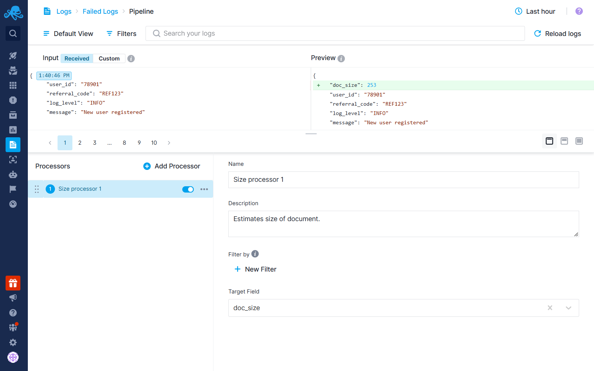
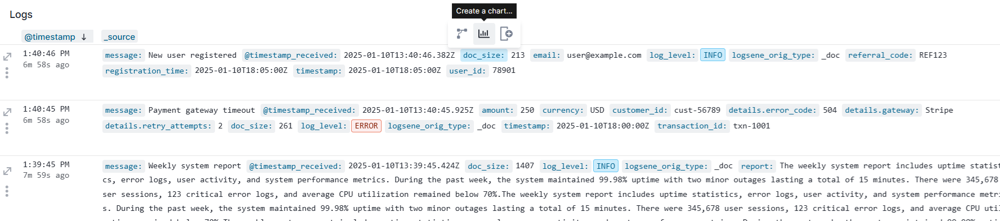
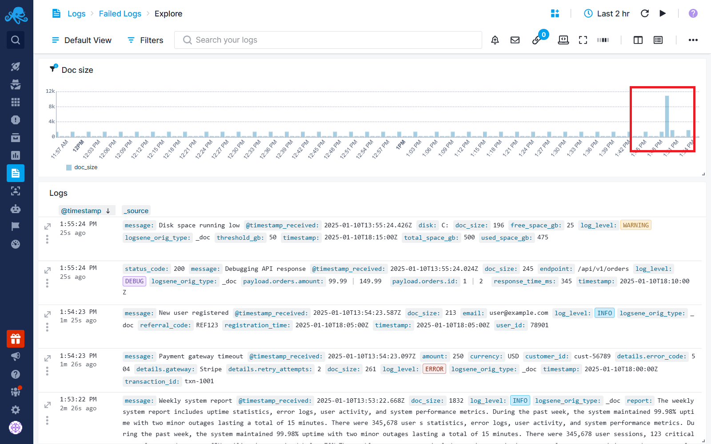
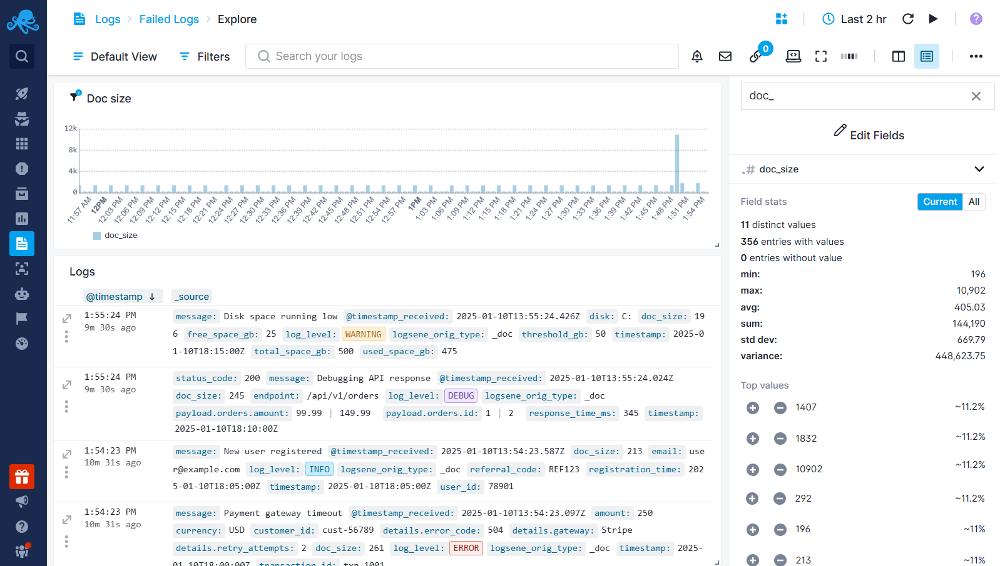
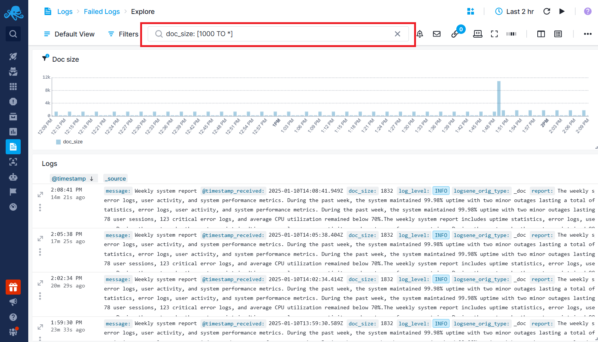

title: Trim Big Logs to Cut Costs
description: Use Logs Pipeline's size processor to identify large logs and extract vital information from long text fields to reduce your costs.

By leveraging the **Size Processor**, you can identify large logs, analyze their content, and optimize your log storage. By removing or optimizing unnecessary fields, the overall **log volume decreases**, leading to **lower costs**.

> **Note:** Be sure to check out [Plan Recommendations](https://sematext.com/docs/logs/plan-recommendations/) to ensure you’re using the most cost-effective plan for your logs in Sematext.

Go to [Logs Pipelines](https://sematext.com/docs/logs/pipelines/) screen, add a **Size Processor** and configure it to extract the size of each log message and store it in a numeric field (e.g., `doc_size`).

Within a few minutes, you will see that new logs coming into your App will contain the doc_size field. Click on this field and select the [Quick Chart](https://sematext.com/docs/logs/logs-table-quick-actions/#quick-chart) action.

Create a time series chart and use the Max aggregation to show the largest log size in each time interval. Analyze the chart for spikes, which indicate unusually large logs.

When you see a spike, open [Fields & Filters](https://sematext.com/docs/logs/fields/#fields-structure), find the `doc_size` field, and check the top log volume values.

Filter the logs with large volumes, and identify the field that contains long text or large number of fields.

Use the [Field Extractor](https://sematext.com/docs/logs/field-extractor-processor/) in [Logs Pipelines](https://sematext.com/docs/logs/pipelines/) to extract the important part of the field's value into a new field, and then use the **Drop Field Processor** to completely remove the original field from your logs.

Alternatively, if the large log volume is caused by a large number of unnecessary fields, use the **Drop Field Processor** to remove those fields entirely from your logs.

See [How Logs Pipelines Can Reduce Your Log Monitoring Costs](https://sematext.com/docs/logs/reduce-costs-with-pipelines/) to learn more about using the Field Extractor and Drop Field Processor to cut costs effectively.
