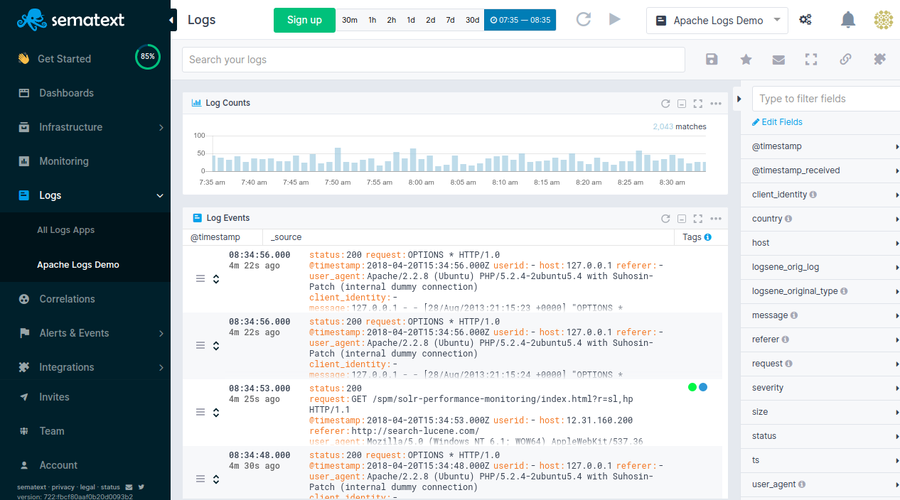

title: Sematext Logs Documentation
description:  Cloud based SaaS / On-premises logging as a service platform. Index machine data, search, correlate and investigate. Build in reports and dashboards with monitoring and alerting capabilities.

Think of Sematext Logs as logging as a service or your own logging box in the cloud (or [on your own infrastructure](../sematext-enterprise) if you really can't ship logs out to the cloud).

It is cheaper alternative to Splunk, or even as Hosted Elasticsearch, since one of the APIs Logsene exposes is [Elasticsearch API for indexing](index-events-via-elasticsearch-api) and [searching](searching-log-events).

Data can be indexed from virtually any source, format or location. Search real-time and historical data using the same interface and familiar search commands to define, limit or widen your search, and correlate events across multiple data sources to reveal new insights.

Turn searches into real-time alerts and automatically trigger notifications via email and various other 3rd party integrations. Alerts can be triggered based on a variety of thresholds, trend-based conditions and other complex searches, assisting with faster analysis and issue resolution.

You can create custom dashboards that can integrate multiple charts and views of your real-time data that helps you understand important trends, summarize top values and view the frequency of conditions.  Sematext log management system lets your devops and business teams analyze your data further with advanced visualizations, chart overlay and pan and zoom controls and more.



## Creating a Logs App

After you get logged into Sematext Cloud at <https://apps.sematext.com> (or <https://apps.eu.sematext.com> if using Sematext Cloud Europe), the first step is to create a Logs App. An App is an independent namespace for your data.

For example, if you have a development and a production environment, it might make sense to have one App for each. You can create as many Apps as you want.

After creating an App you will get a confirmation screen that tells you how to [send data to your new application](sending-log-events). Once you start sending data, you can start [searching and analyzing those events](searching-log-events) via the native Sematext UI or [explore your data with Kibana](kibana).

<iframe width="1000" height="563" src="https://www.youtube.com/embed/TR_qXdR8DVk" frameborder="0" allow="autoplay; encrypted-media" allowfullscreen></iframe>

## Adding Data to Your App

There are two ways to send data: [through Elasticsearch's API](index-events-via-elasticsearch-api) or [through syslog](syslog).

### Elasticsearch API

The easiest way to send logs is [through Logstash](logstash), Filebeat, or [Logagent](/logagent). You can also use any tool that works with Elasticsearch's REST API, for both [indexing](index-events-via-elasticsearch-api) and [searching](search-through-the-elasticsearch-api).

The only condition is to use the App's token as the index name, and **https://logsene-receiver.sematext.com:443** (or https://logsene-receiver.eu.sematext.com:443 if using Sematext Cloud Europe) as the address.

For more details on using the Elasticsearch REST API with Sematext see [Index Events via Elasticsearch API](index-events-via-elasticsearch-api).

### Syslog

You can forward syslog via **UDP** (port 514), **TCP** (port 514), **RELP** (port 20514) and **TLS** (port 10514). The host name is **logsene-syslog-receiver.sematext.com** / **logsene-syslog-receiver.eu.sematext.com**

To get started with syslog shipping quickly, you can use our configuration script and add your App token as a parameter:

``` bash
curl -O https://apps.sematext.com/logsene/configure-syslog.py
sudo python configure-syslog.py $ADD-YOUR-APP-TOKEN-HERE
```
For more details, take a look at the [Syslog](syslog) page, and the pages that are linked from it.

## App Settings

App's settings include, but are not limited to:

  - inviting new users to your application
  - [authorizing public IPs to send data to your app via syslog](authorizing-ips-for-syslog)
  - adjusting data retention time, daily volume, and limits
  - [changing your app's plan](faq/#plans-prices)
  - checking how much data is, or has been shipped to your App

  </a>

## Getting Support

We hope you enjoy using Sematext Infrastructure Monitoring and Log Management tools. If you need further support or have any feedback regarding our products, please don't hesitate to [contact us](mailto:support@sematext.com)! You can also contact / talk to us using chat widget at the bottom right corner of the page or give us a shout [@Sematext](http://twitter.com/sematext).
