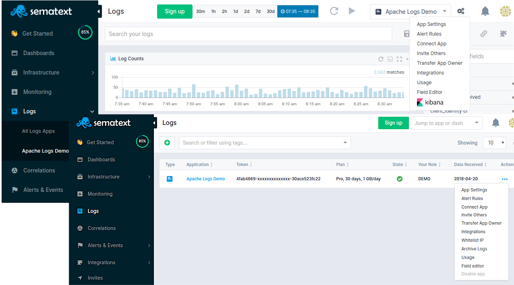

title: Sematext Logs
description:  Cloud based SaaS / On-premises logging as a service platform. Index machine data, search, correlate and investigate. Build in reports and dashboards with monitoring and alerting capabilities.

Sematext Logs is a **Log Management-as-a-service**. Think of it as your own **central location for logs** in the cloud. If you want to have the same but on your own infrastructure, check out our [Enterprise](../sematext-enterprise) product.

You can collect logs from any part of your software stack, IoT devices, network hardware and much more. By using log shippers you centralize and index logs from all parts in one single place, [Sematext Logs](../logs).

[Sematext Logs](../logs) supports [sending logs](../logs/sending-log-events/) from infrastructure, containers, AWS, applications, custom events, and much more, all through an Elasticsearch API or Syslog.

It's a cheaper [alternative to Splunk or Logz.io](https://sematext.com/resources/industry-comparisons/). You can **use Sematext Logs as your own Hosted Elasticsearch** since it exposes an Elasticsearch API for indexing and searching. Data can be indexed from virtually any source, format or location.

You can create [custom dashboards](./dashboards-guide) with real-time data that helps you understand important trends, summarize top values and view the frequency of conditions.

[Searching logs](./searching-log-events/) is easy with a Google-like [query syntax](./search-syntax). You can also turn all searches into real-time [alerts](../alerts/) and automatically trigger notifications. Sematext Logs supports sending **alerts via E-mail, Slack, PagerDuty**, and various other 3rd party integrations. Alerts can be triggered based on thresholds, trend-based conditions and other complex searches.

## Creating a Logs App

After you get logged into Sematext Cloud at <https://apps.sematext.com> (or <https://apps.eu.sematext.com> if using Sematext Cloud Europe), the first step is to create a Logs App. An App is an independent namespace for your data.

For example, if you have a development and a production environment, it might make sense to have one App for each. You can create as many Apps as you want.

<video style="display:block; width:100%; height:auto;" controls>
  <source src="https://cdn.sematext.com/videos/sematext-create-logs-app.mp4" type="video/mp4" />
</video>

Check out the [Quick Start](./quick-start) for more info.

## Adding Data to Your App

The easiest way to send logs is [through Logstash](logstash), Filebeat, or [Logagent](/logagent). You can also use any tool that works with Elasticsearch's REST API, for both [indexing](index-events-via-elasticsearch-api) and [searching](search-through-the-elasticsearch-api).

The only condition is to use the App's token as the index name, and **https://logsene-receiver.sematext.com:443** (or https://logsene-receiver.eu.sematext.com:443 if using Sematext Cloud Europe) as the address.

For more details on using the Elasticsearch REST API with Sematext see [Index Events via Elasticsearch API](index-events-via-elasticsearch-api).

## App Settings

App's settings include, but are not limited to:

  - inviting new users to your application
  - [authorizing public IPs to send data to your app via syslog](authorizing-ips-for-syslog)
  - adjusting data retention time, daily volume, and limits
  - [changing your app's plan](faq/#plans-prices)
  - checking how much data is, or has been shipped to your App

  </a>

Read more on the [Settings](./settings) page.

## Getting Support

We hope you enjoy using Sematext Infrastructure Monitoring and Log Management tools. If you need further support or have any feedback regarding our products, please don't hesitate to [contact us](mailto:support@sematext.com)! You can also contact / talk to us using chat widget at the bottom right corner of the page or give us a shout [@Sematext](http://twitter.com/sematext).
