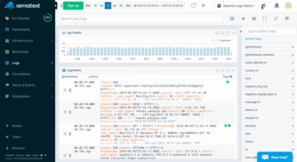

title: Sematext Kibana Integration
description: The first true hosted ELK Stack as a service with Elasticsearch API and integrated Kibana

Kibana is analytics and visualization platform used to perform various searches and create logging analytics dashboards.

Kibana is fully intergrated with Sematext's cloud and on-premises service used to monitor, search, analyze, and visualize your data interactively. Customize dashboards and use Kibana to analyze log data and perform advanced management tasks.

Open the App Settings dropdown by clicking on the App name in the left menu panel, and then click on the **Open in Kibana** button.

Once you're there, you can customize your dashboard to do all kinds of searches and visualizations to your data.

If you want even more flexibility, you can [install Kibana locally and point it to your Logs App](faq/#kibana).
