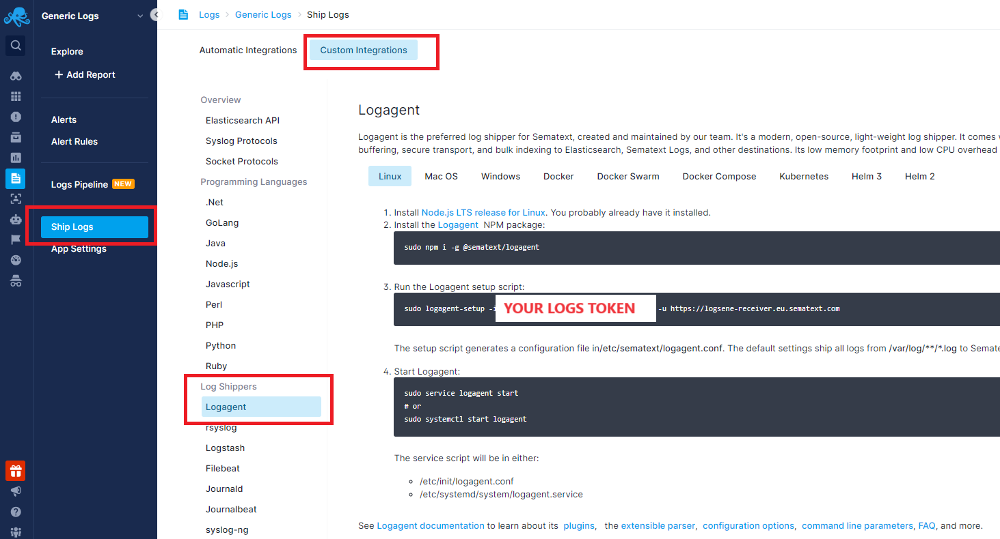

title: Sematext Logagent Integration
description: Logagent can be used to send logs to Sematext monitoring and logging platform. Parse logs with grok filter, tag specific events, aggregate and index data and metrics from different sources

The recommended method for sending logs to Sematext is by installing the [Sematext Agent and configuring log shipping from Discovery](sending-log-events).

Please note that Logagent is deprecated, and does not support [Discovery](discovery/intro/). Therefore, you'll need to manually set up Logagent to transmit the content of log files defined in `logagent.cnf`.

Follow the instructions in Custom Integrations → Log Shippers → Logagent screen to install the agent.



This will do two things. First, generate a YAML configuration file in the `/etc/sematext/` directory called `logagent.conf`. But also create a system service for Logagent and run the log shipper.

### Tailing Log Files

Since Logagent doesn’t support [Discovery](discovery/intro/), to send the contents of all log files in a directory, you'd have to configure Logagent.

Below is an example of sending contents of all log files in the  `/var/log/` directory.

```yaml hl_lines="17 18 19"
# /etc/sematext/logagent.conf

# Global options
options:
  # print stats every 60 seconds 
  printStats: 60
  # don't write parsed logs to stdout
  suppress: true
  diskBufferDir: /tmp/sematext-logagent

input:
  files:
    - '/var/log/**/*.log'

output:
  sematext:
    module: elasticsearch
    url: https://logsene-receiver.sematext.com
    index: <LOGS_TOKEN>
```
Read more about Logagent in the [docs here](../logagent).
