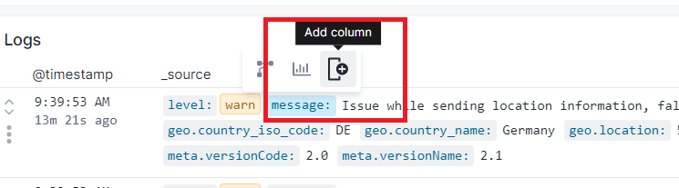
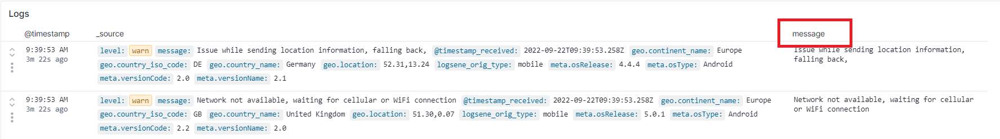
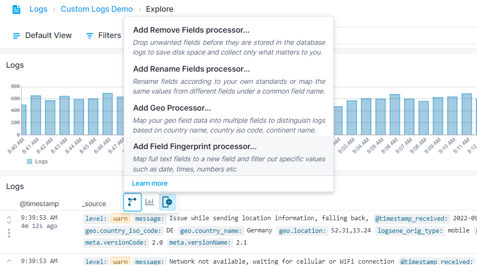
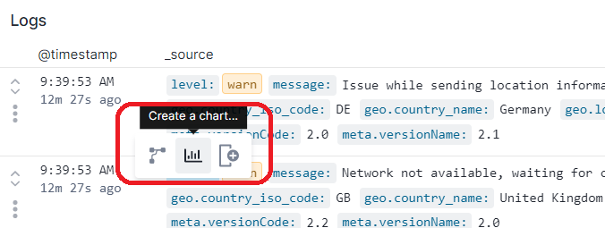
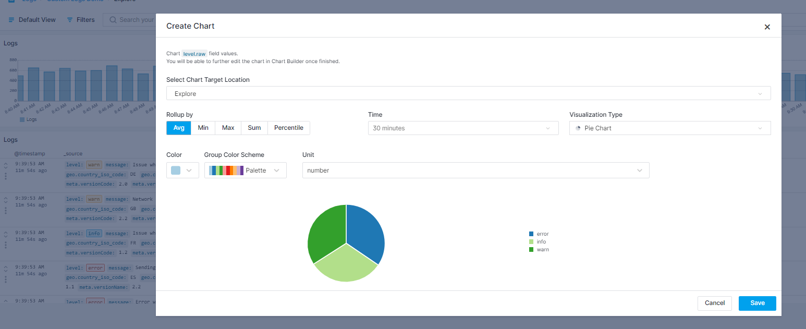
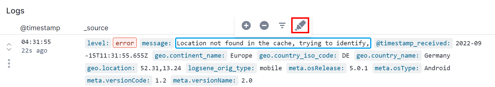
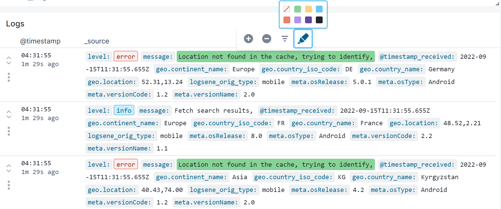
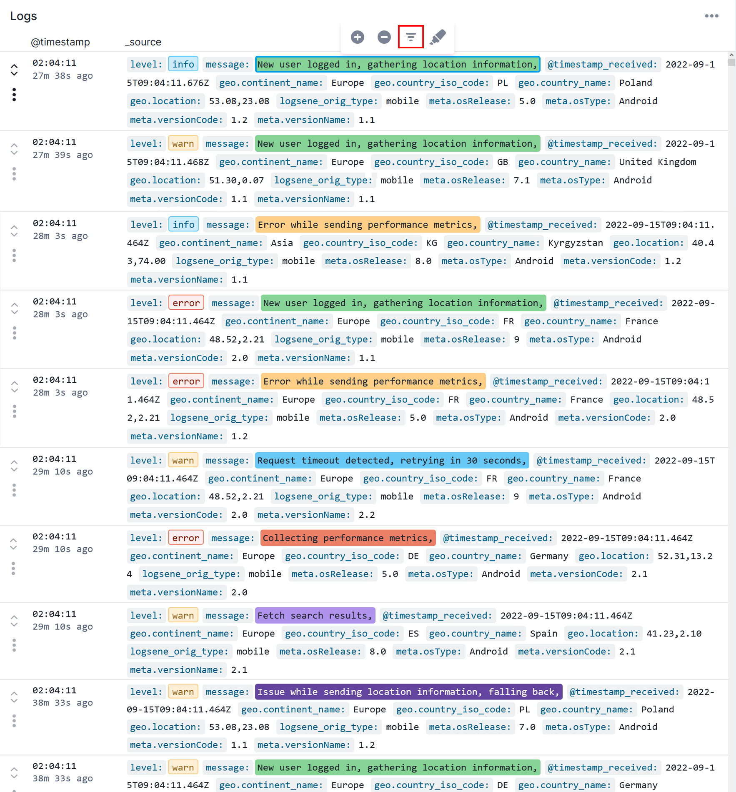
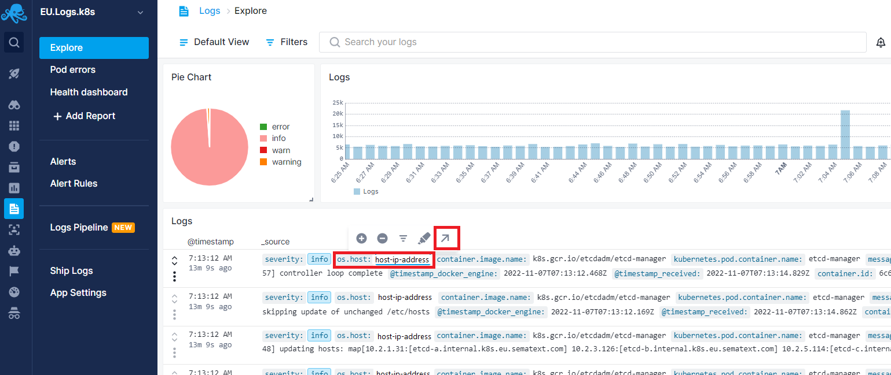
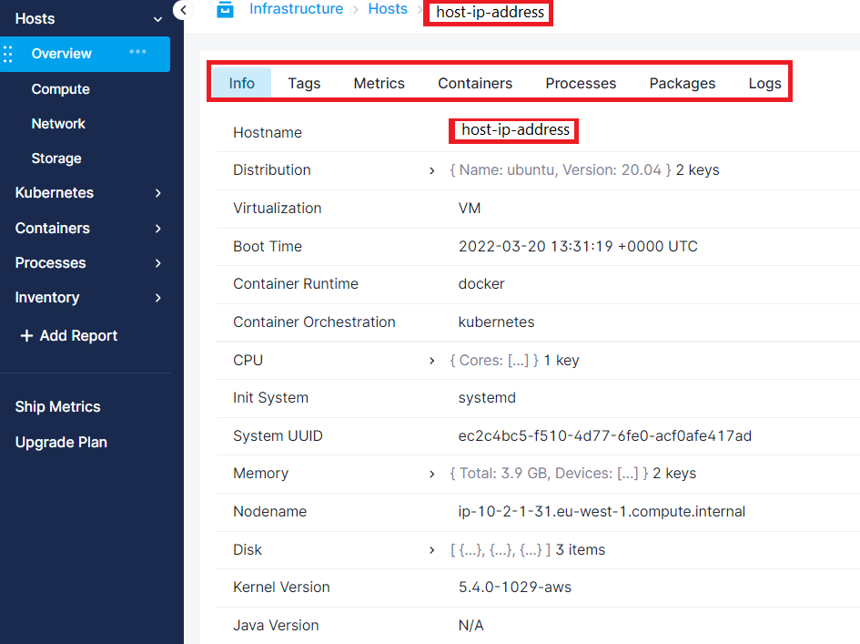

title: Logs Table Quick Actions

You can take quick actions from the logs table while going through your logs.

The actions include:

  - Toggle column
  - Add [Pipeline Processor](../logs/pipelines)
  - Create a chart
  - Highlight values
  - Correlate with metrics

## Toggle Column

To add a field as a separate column, click on the field name. This will open a small context menu where you can click on the Add column button. 

## Add Pipelines Processor

[Pipelines processors](../logs/pipelines) help you structure the fields the way you want them to be. Or drop unwanted logs to reduce the volume of stored logs and thus reduce your costs.

To quickly create a pipeline processor for a particular field, simply click on the field name to open the context menu. Click on the pipelines icon and select the processor that suits your needs. 

## Quick Chart

If you want to visualize the values for a specific field, simply click on the field value. This will open a context menu where you can click to add a chart for it.
You can select the report or dashboard you want to save the chart in, timeframe, style and visualization type.

## Highlighting

You can use the highlighting feature to focus on any value while going through your logs.
Click on the value to open the quick action menu and select manual highlighting.

Choose the color to highlight the selected value. This specific value will be highlighted for you to easily distinguish the logs that you want to focus on.

You can also enable auto highlighting feature from the quick action menu by clicking on a value. This will highlight the first 10 unique values of the corresponding field with different colors.

## Correlate with Metrics

You can easily navigate to metrics from any of the standard fields that are listed in [Sematext Common Schema](../tags/common-schema). 

Simply click on any of the field values from Logs Table;

And you will be navigated to the Infra App automatically filtered by that value to see relevant metrics.

