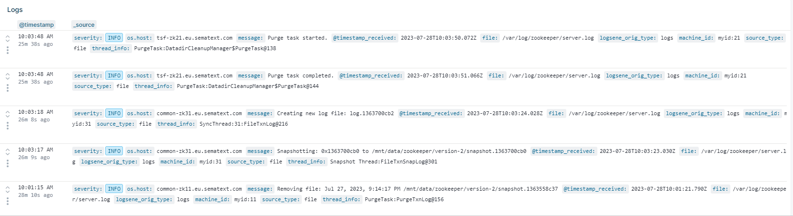
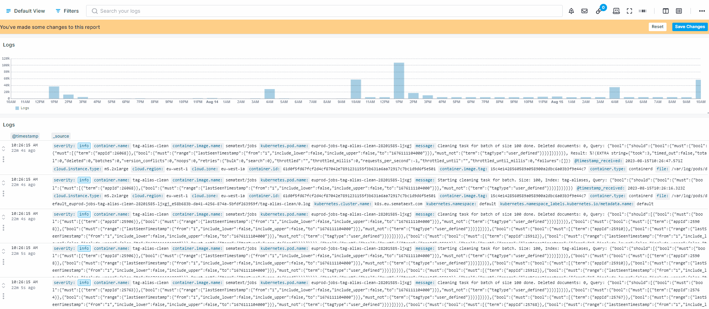

title: Sematext Logs Table Terminal View
description: Sematext Logs Table has a Terminal View option. Check out how to use it.

Terminal View offers the ability to view logs in a more compact format. It provides a terminal-like display of logs, eliminating all the visual noise of a rich graphical UI.

You can easily switch between Table and Terminal views using the toggle icons located in the top-right corner of the [Logs Table Component](https://sematext.com/docs/logs/reports-and-components/#logs-components). 

 

In the **Edit component** section, you have the option to select specific fields and apply color-coding based on your requirements.

 
