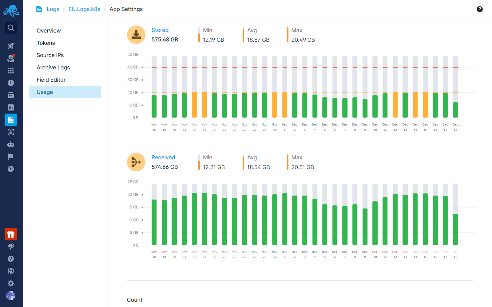
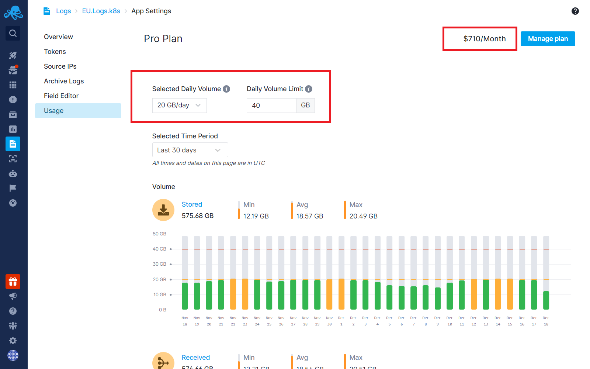
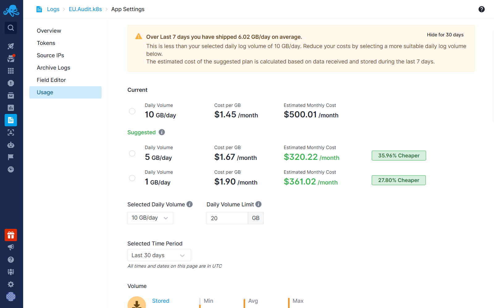

title: Logs Usage Screen
description: Learn about Daily Log Volume, its impact on pricing, and how Sematext provides transparent cost structures, empowering informed decisions for optimized log storage.

The Logs Usage screen provides insights into historical data concerning daily log volumes received and stored for Admins and Owners of the Logs Apps. It's important to note that there are no predefined limits to the number of logs you can store within your Logs App. However, selecting the optimal Daily Volume plan is crucial, as it directly impacts the $/GB price, ensuring cost-effectiveness. See [Plan Recommendations](../logs/plan-recommendations).

The costs are determined by the data you send to the Logs App. When you transmit raw log messages to Sematext, a fixed rate of $0.1 per GB applies (received price), regardless of your plan or daily log volume/retention selection. Once Sematext receives the logs, any defined pipeline processors are applied to structure or discard them based on your specified pipeline conditions before storing. Storage prices vary across plans, daily log volumes, and retention periods. Therefore, it's crucial to note that while you can send large amounts of data to Sematext, it's beneficial to filter out noise or unnecessary data to minimize storage expenses.

## Daily Log Volume and Cost Optimization
Selecting the appropriate Daily Volume plan is pivotal for achieving the **optimal $/GB** price. If the chosen Daily Volume is consistently exceeded, it can result in a higher $/GB price compared to selecting the next higher Daily Volume tier.

## Going Over the Selected Daily Log Volume

It's imperative to understand that the GB/day volume serves as a benchmark for the cost per GB and is not a strict limit. Exceeding the selected Daily Volume doesn't lead to data rejection.
Instead, any data over the chosen daily volume is tracked and added to the monthly cost using the $/GB rate corresponding to the selected Daily Volume. For added protection, consider using the **Max Daily Volume** feature, which enables the rejection of logs if the daily log volume exceeds a specified limit in GB.

The **Daily Volume Limit** and **Max Daily Volume Limit** can be easily set and modified from the Usage screen at any time. Additionally, the estimated monthly amount is displayed on the top right of the screen.

## Optimizing Daily Volume Selection

The selection of the Daily Volume tier directly impacts the per GB price. For instance, if you are consistently shipping close to 5 GB/day into a Logs App then opting for a 5 GB/day volume selection will result in a lower $/GB rate than if you selected the 1 GB/day Daily Log Volume. Therefore, aligning the Daily Volume with your actual log shipping volume ensures the more cost-effective pricing model. 

Transparency in cost structures is a core value for us.  We analyze the average daily log volume shipped to Logs Apps over the last 7 days. Based on this analysis, we recommend more suitable and cost-effective plans whenever available. 

Once a better plan is detected, a green '$' icon will appear in the left menu panel of the Logs App and the plan suggestions will become visible in the Usage Screen, App Settings, and Manage Plan sections.

See [Plan Recommendations](../logs/plan-recommendations) for more information.
