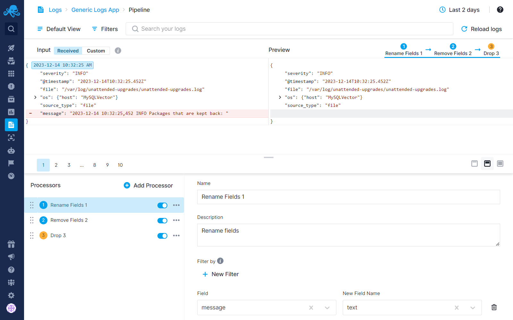
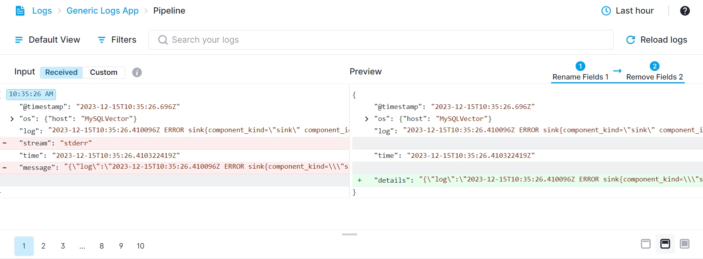
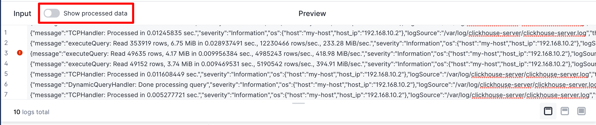
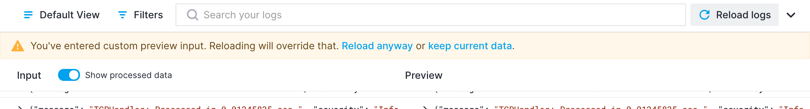
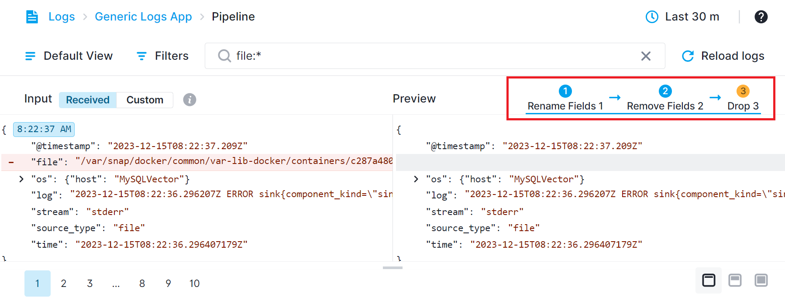
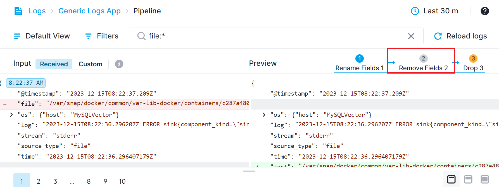
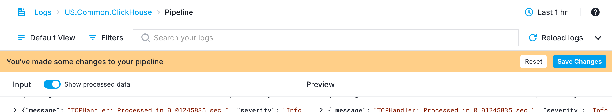

title: Logs Pipelines
description: Add processing steps to log ingestion

Log events are not always structured the way you want them to be. For various reasons it might be hard to set up a log shipper to transform or filter log events.  An alternative approach is to configure processing steps that are executed during log event ingestion. We call this **Pipelines**. 

Each Pipeline consists of one or more [Processors](../logs/processors-overview) that are executed in the order in which they are defined in a Pipeline.  Pipelines and its Processors can be used to drop unwanted log events, remove unwanted fields, enrich or transform your documents, and more. 

### Managing Log Costs with  Pipelines

Understanding the dynamics of log monitoring costs is pivotal, particularly as it directly correlates with the volume of stored logs. It's important to note that the cost doesn't hinge upon the volume of logs shipped to Sematext. Any data eliminated during the ingestion process **doesn’t have additional cost** and is **free**. This unique feature allows for efficient management of log volumes without incurring unnecessary expenses.

You can transmit significant amounts of logs to Sematext. An intriguing aspect is that while these logs can be transmitted to Sematext, the ingestion cost doesn't escalate if you opt to drop specific logs through [Pipelines Processors](../logs/processors-overview). This presents an advantageous scenario wherein logs can be available at a moment's notice through a simple toggle using the enable/disable option within the processors. 

Consequently, this flexibility ensures that even if logs are not actively stored, they remain accessible, allowing for swift activation whenever required.

See [Reducing Log Monitoring Costs](../logs/reduce-costs-with-pipelines) for more information.

## Pipeline Builder

The Pipeline Builder accessible in the main menu of every Logs App, as its name implies, what you use to set up Pipelines.  Once the Pipeline Builder is opened, you'll see a dedicated page where you can configure ingestion settings.

On top we have a header and subnav that can be used to pick events to preview. The page is split between a resizable preview section and a Pipeline configuration section.

The preview shows log events before and after processing. The Pipeline configuration section has a list of Processors on the left and configuration details for a selected Processor on the right.

The header and subnav let you define time and filters that will be used to load sample data for previewing the Pipeline. The logs displayed in the input section are sorted in descending order. Based on the applied filters and selected time frame, the most recent log will appear at the first page. To navigate through these logs, use the pagination at the bottom of the input/preview section to view up to the 10 most recent logs.

### Preview

The preview section is a helper tool you use to see how the Pipeline you are configuring is working. It runs loaded or manually entered input through the configured Pipeline and shows the difference between input and output log events.

The differences are presented in a way you're already used to, line by line. Since structured events can be presented as JSON objects, you can expand them and see which part of every event was changed, removed or added.

### Custom Input

The input is automatically loaded from the App, respecting the selected time, filters and number of events. However, the App might be empty, or log events in the App might already be processed by the Pipeline so they may not have cases that you would like to test. In such situations, you can switch to enter custom tab and enter or adjust the input.

At the moment, JSON is the only input format that is supported. The input editor will check each line if it is a valid JSON and report an error if it is not. If there is a specific place where an error is found, clicking on the error icon will place the cursor at the error.
Once the input is manually edited, a warning will be displayed if you try to reload data.

### Processor Coloring

The order of the processors defined in the Preview section determines their sequence of application. Processors highlighted in **blue** indicate that operations within those processors are applied to the logs visible in the input section. If a processor is marked in **yellow** are **Not Applied**. It means that, due to filters or patterns within that processor, it hasn't affected the log displayed on the input side. When calculating the **Not Applied** status, we check if there is any difference between the log shown on the input side and the log shown on the preview side.

Processors displayed with a **gray background** are disabled, indicating they won't affect any logs.

To view the impact of processors up to a specific point in the Preview section, click on that processor. This action will display the effects on the log up to the selected processor in the Preview section. The blue lines or arrows between processors indicate which processors are applied and displayed in the preview section, up until a specific processor.

### Not Applied Behavior

**Not Applied!** means that due to filters or patterns within that processor, it hasn't affected the log displayed on the input side. When calculating the **Not Applied!** status, we check if there is any difference between the log shown on the input side and the log shown on the preview side.
 
However **Not Applied!** doesn't always indicate that the operations defined in the processor won't be applied to the newly arrived records. The processors defined in pipelines are processed just before being inserted into the Elasticsearch database. So only the processed version of the log is stored in the database. We do not store raw logs.

If the log has been received after the processors were saved, the displayed version on the input side already reflects the applied state of the saved processors. In this case, there's no difference between the Input and Preview sections, so it's normal for that processor to appear as **Not Applied!**.

## Saving Pipeline
Changes made to Pipelines are not automatically saved. Once you make changes and all Processors are configured, the `Save Changes` button will be enabled and the Pipeline configuration can be saved.

The new configuration will not be applied immediately. It can take up to 5 minutes before your changes will take effect. If, while working with Pipelines, you discover that your fields are not quite of the right type, make sure you adjust field types using the [Field Editor](./fields/#field-editor).
