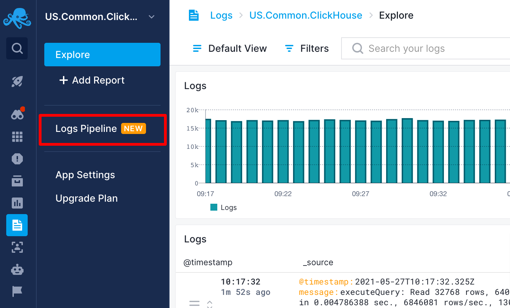
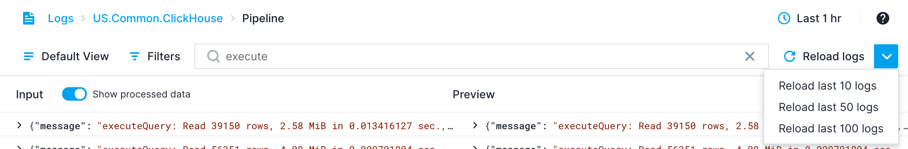
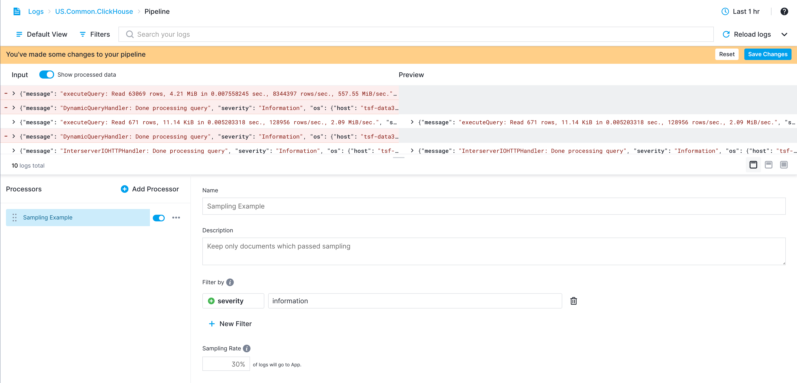
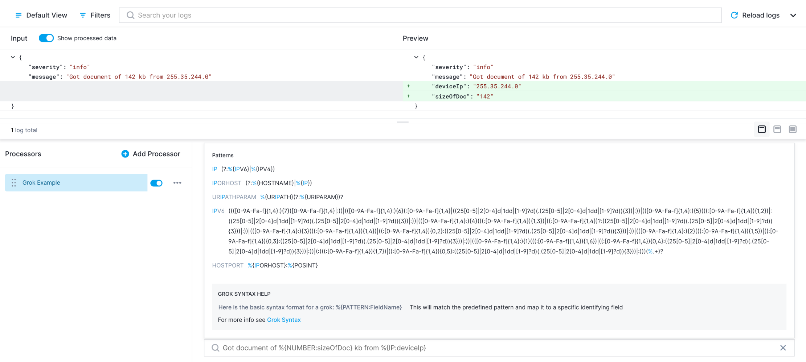

title: Logs Pipelines
description: Add processing steps to log ingestion

Log events are not always structured the way you want them to be. For various reasons it might be hard to set up a log shipper to transform or filter log events.  An alternative approach is to configure processing steps that are executed during log event ingestion. We call this **Pipelines**. 

Each Pipeline consists of one or more **Processors** that are executed in the order in which they are defined in a Pipeline.  Pipelines and its Processors can be used to drop unwanted log events, remove unwanted fields, enrich or transform your documents, and more.  They are easily accessible in the main menu of every Logs App. This gives you access to the Pipeline Builder.




### Pipeline Builder
The Pipeline Builder is, as its name implies, what you use to set up Pipelines.  Once the Pipeline Builder is opened, you'll see a dedicated page where you can configure ingestion settings.


On top we have a header and subnav that can be used to pick events to preview. The page is split between a resizable preview section and a Pipeline configuration section.

The preview shows log events before and after processing. The Pipeline configuration section has a list of Processors on the left and configuration details for a selected Processor on the right.

The header and subnav let you define time and filters that will be used to load sample data for previewing the Pipeline.



By default, only 10 log events are loaded. You can also change it to 50 or 100. Note that a higher number of log events may slow the preview down a bit since events are sent for processing on each Pipeline configuration change.

#### Processors
Processors are units of processing in Pipelines. 

They can change, drop, or even produce additional events. They are chained to form a Pipeline. The output of one Processor is the input for the next Processor.

Configuration section will be empty in most cases when you initially open Pipeline Builder.


In such cases, instead of a selected Processor configuration, there will be a list of available Processors. Clicking on any Processor card will add a Processor with default values. Processors can also be added by clicking the "Add Processor" button.


When clicking this button, a modal with a searchable list of Processors will appear. You can then select which Processor to add.
You can also add Processors by duplicating existing Processors.


The duplicate action is below the standard action button in the list of Processors. Note that **the order of Processors matters** since the **output of one Processor is the input for the next Processor**. 

You can reorder Processors using the drag handle to the left of each Processor's name.

The selected Processor configuration will be displayed on the right side. Every Processor has at least a name and a description field, but all Processors will also have additional, Processor-specific configurations.

##### Errors


If a Processor is not configured correctly, the number of errors will be displayed next to the Processor's name and the `Save Changes` button will be disabled.

##### Filters
Almost all Processors have optional filters. With filters, you can select only a subset of events that the Processor should be applied to. Events that do not match filters will be ignored.


Processors use the same filtering you are already used to in Sematext. 

The only difference is that you can also enter fields that are not keywords or even defined yet. 

###### Wildcards
Another important difference is that you can use wildcards for values. There is support for standard wildcard characters: `*` matches any number of characters, and `?` matches a single character.

This way you can, for example, drop events whose message field contains `*raws*` as in example below


##### Sampling
You can do events sampling with Pipeline as well. 

Without filters sampling is applied to all events, but by using filters you can sample only a subset of events.
 
One example might be to filter by events from one specific service. The sample rate is expressed as a percentage of events that should be stored. By default, the sampling rate is 100%, meaning no events will be dropped. Setting sampling to 10% means that only 10 in 100 events will be stored and 90 will be dropped.

Below is an example where we leave only 30% of log events with severity `Information`, while events with all other severities will be processed without any sampling.



##### Field Extractor
Structuring data into fields is important if you are using Sematext Logs.  Having your logs structured makes it easy to analyze logs, create charts with data from individual fields, filter log events, or group them by their field values.

By using Grok Patterns Extractor, you can extract multiple fields from other fields. 

Grok works by combining text patterns into something that matches your logs.
The syntax for a grok pattern is `%{SYNTAX:SEMANTIC}`

Imagine we have a message field:
`Got document of 142 kb from 255.35.244.0`

The `SYNTAX` is the name of the pattern that will match your text. For example, `142` will be matched by the `NUMBER` pattern and `255.35.244.0` will be matched by the `IP` pattern. The syntax is how you match.

The `SEMANTIC` is the identifier you give to the piece of text being matched. For example, `142` could be the size of a document in bytes, so you could call it simply size. Further, a string `255.35.244.0` might identify the `IP` of device which sending a document.

For the above example, your grok filter would look something like this:

`Got document of %{NUMBER:sizeOfDoc} kb from %{IP:deviceIp}`

Field Extractor provides a bunch of predefined patterns you may use for your purposes. Autocompletion makes it easy to navigate through and select them.



##### Scripting
Scripting is supported using Script processor which uses [painless](https://www.elastic.co/guide/en/elasticsearch/painless/current/painless-guide.html) language. Painless is a simple scripting language similar to Java. It can safely be used for stored scripts.
You can access fields using `doc` method. Since value type can be anything, before using it you must cast value to a specific type like: String, Integer, Double, etc.

The following is supported:

- Math operators: +, -, /, *, %, ^, e.g. `(Integer)doc['size.kb']*2`
- Relational operators: ==, !=, <, <=, >, >=, e.g. `(Integer)doc['size'] > 10`
- Logical operators: &&, ||, !, e.g. `(Integer)doc['size'] > -1 && (Integer)doc['size'] < 10`
- Ternary operator, e.g. `(Integer)doc['speed'] < 1000 ? "OK" : "SLOW"`
- String functions, e.g. `((String)doc['severity']).toUpperCase()` or `((String)doc['message']).splitOnToken('-')[3]`

Conditional block and loops are supported. The last line should result in a value that will be stored as a field.
Artificial example bellow shows this. 

```java
String[] tokens = ((String)doc['message']).splitOnToken(' '); 
if(tokens.length % 2 != 0){
  String result = "Iterator ";
  for(int i = 0; i < tokens.length; i++){
      result += i;
  }
  result;
}
else {
  tokens.length * 10;
}
```

Imagine we have a message field:
`Got document of 142 kb from 255.35.244.0`
and that we want to extract number of kilobytes. The script could be something like:

```java
int kbIdx = ((String)doc['message']).indexOf(' kb');
((String)doc['message']).substring(17, kbIdx)
```


#### Preview
The preview section is a helper tool you use to see how the Pipeline you are configuring is working. It runs loaded or manually entered input through the configured Pipeline and shows the difference between input and output log events.


The differences are presented in a way you're already used to, line by line. Since structured events can be presented as JSON objects, you can expand them and see which part of every event was changed, removed or added.

The input is automatically loaded from the App, respecting the selected time, filters and number of events. However, the App might be empty, or log events in the App might already be processed by the Pipeline so they may not have cases that you would like to test. In such situations, manual editing is the way to enter or adjust the input. You can toggle between editing and preview.


At the moment, JSON is the only input format that is supported. The input editor will check each line if it is a valid JSON and report an error if it is not. If there is a specific place where an error is found, clicking on the error icon will place the cursor at the error.
Once the input is manually edited, a warning will be displayed if you try to reload data.


#### Saving Pipeline
Changes made to Pipelines are not automatically saved. Once you make changes and all Processors are configured, the `Save Changes` button will be enabled and the Pipeline configuration can be saved.


The new configuration will not be applied immediately. It can take up to 5 minutes before your changes will take effect. If, while working with Pipelines, you discover that your fields are not quite of the right type, make sure you adjust field types using the [Field Editor](./fields/#field-editor).
