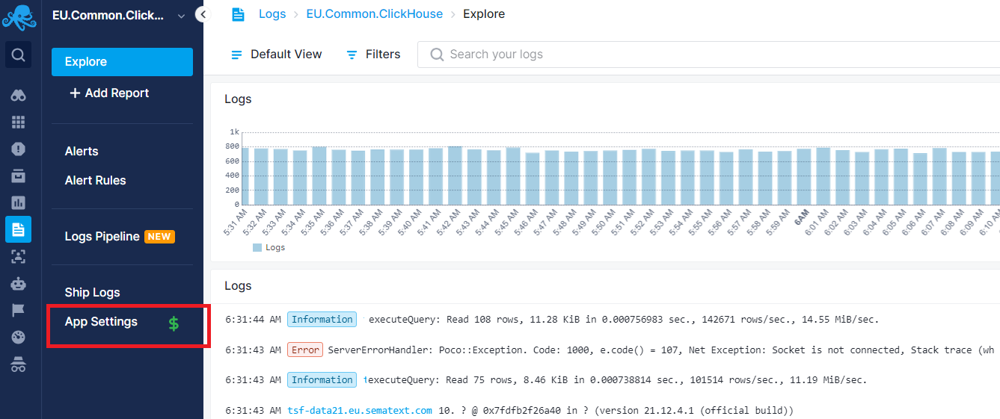
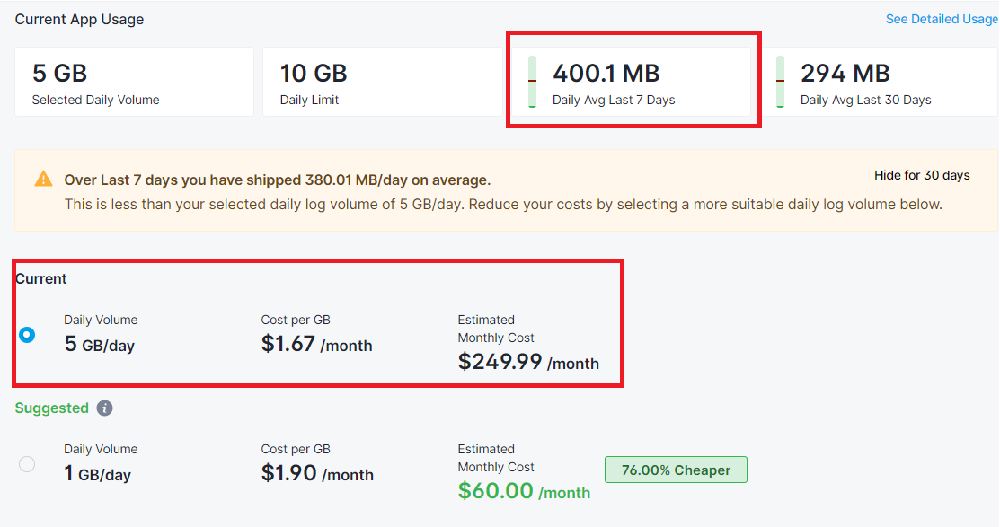

title: Plan Recommendations
description: Make the most cost-effective choice for your log data needs with Plan Recommendations feature.

We understand that every organization has unique needs when it comes to log management. That's why we offer a range of plans with multiple retention periods and daily log volume options. Plan recommendations feature is designed to help you make the most cost-effective choice for your log monitoring needs.

> Reminder: Every Logs App has its own plan, retention, and daily log volume selection.  Everything described here applies to each Logs App individually.

## Daily Volume and Cost Clarification

It's important to note that the selected plan’s daily GB/day volume limit is not a hard limit. It primarily influences the cost per GB of logs. Even if you exceed your selected daily volume, we won't reject your data. Instead, we track the additional data you've shipped over your chosen daily volume and calculate the monthly cost based on the $/GB rate of your selected daily volume. On top of that, you can utilize the Max Daily Volume setting as a hard stop to reject data exceeding a specified GB/day limit, providing an added layer of protection. Max Daily Volume can even be set to the exact same value as Daily Log Volume.

## Optimal Plan Recommendations

We monitor your daily log volume and, based on your usage history, recommend the optimal plan to save on costs. No more guessing or worrying about overages!

## Cost-Efficiency at Your Fingertips

Our pricing structure allows you to choose higher daily volumes, which results in lower $/GB rates. With the plan recommendations feature, we take it a step further. We analyze your past daily log ingestion volumes and suggest a more economical plan, which you can switch to with a single click. This way, you can save even more on your log management costs.

## Cost Estimations and Transparency

If you exceed your selected daily volume, we'll estimate your end-of-month bill, including overage charges. However, with plan recommendations, we proactively recommend better plans to help you avoid overpaying. You can access these recommendations as soon as you log in to your Sematext Logs App. Conversely, if you ship less data than your chosen daily volume, we'll identify cheaper plans with lower daily volumes and suggest them to you. This way, you won't have to pay for daily log volume that you don't actually need.

**Let's walk through it with an example in Sematext Cloud:**

When you log in to your Sematext Logs App, keep an eye on the left menu panel. If we find a better plan for you, you'll notice a '$' symbol next to "App Settings."

Click on "App Settings" to access your current plan selection. In this example, the Daily Log Volume is set to 5 GB/day. You can also see the average daily log volume shipped in the last 7 and 30 days, which, in this instance, is 400 MB/day.

Based on your recent daily log volumes, we recommend a better Daily Log Volume selection for you. In this case, the 1 GB/day is cheaper and will more than suffice. By making this switch, the monthly bill will go from $250 down to just $60. That's a massive 76% decrease in cost!

Beyond plan recommendations, you have the opportunity to lower your expenses through [Logs Pipelines](../logs/pipelines). Logs Pipelines allow you to filter out irrelevant events based on your criteria, remove unnecessary fields to reduce storage costs, and serve as a significant money-saving tool.  This is described in [How Logs Pipelines Can Reduce Your Log Monitoring Costs](reduce-costs-with-pipelines/).  Following steps described there will result in the reduction of your daily log volume and, if the log volume was sufficiently reduced, in a few days you may see a recommendation for a more optimal Daily Log Volume selection.
