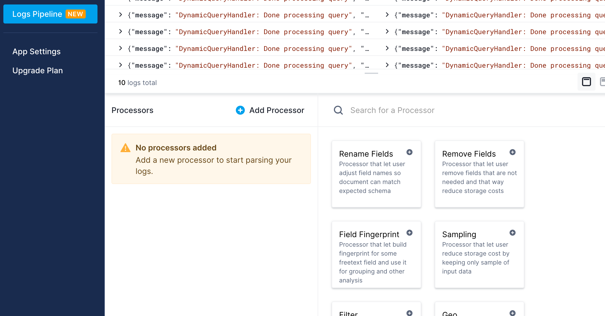
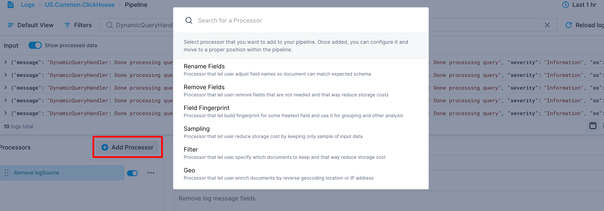
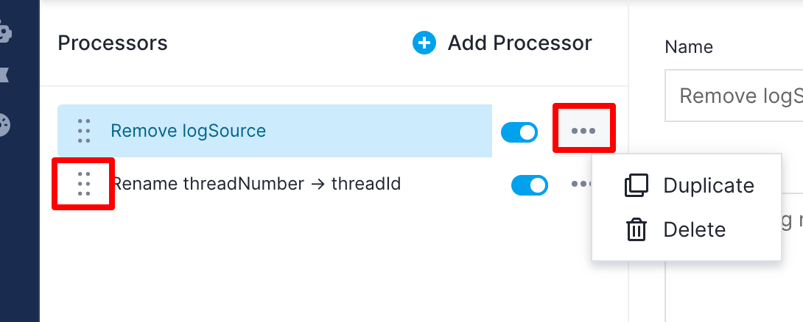
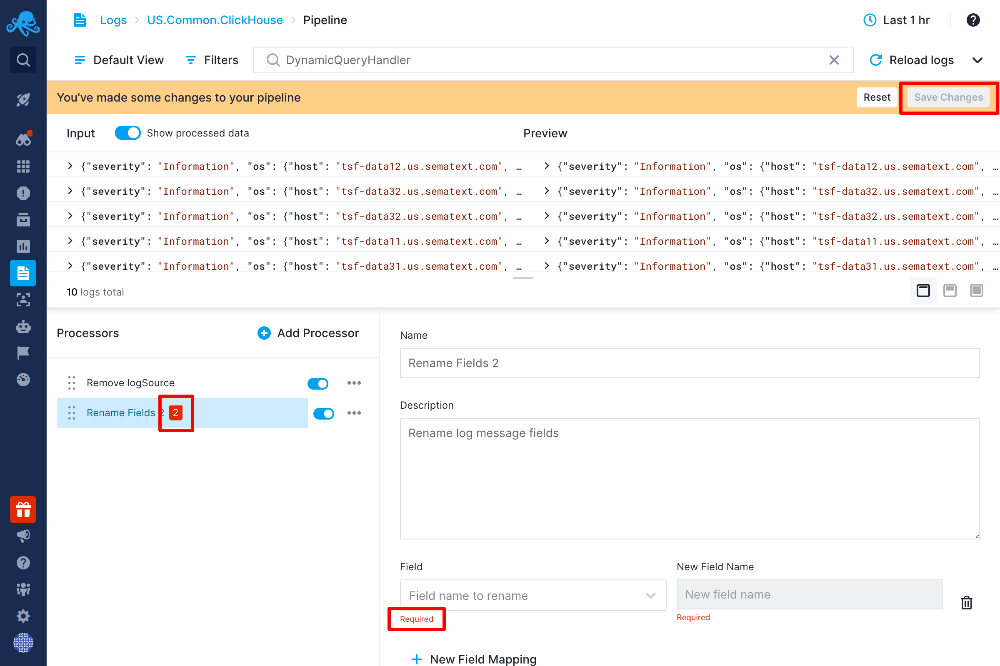
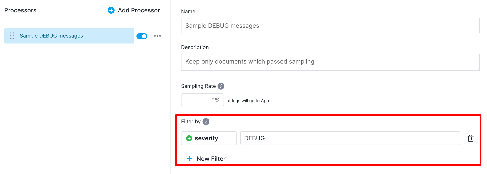
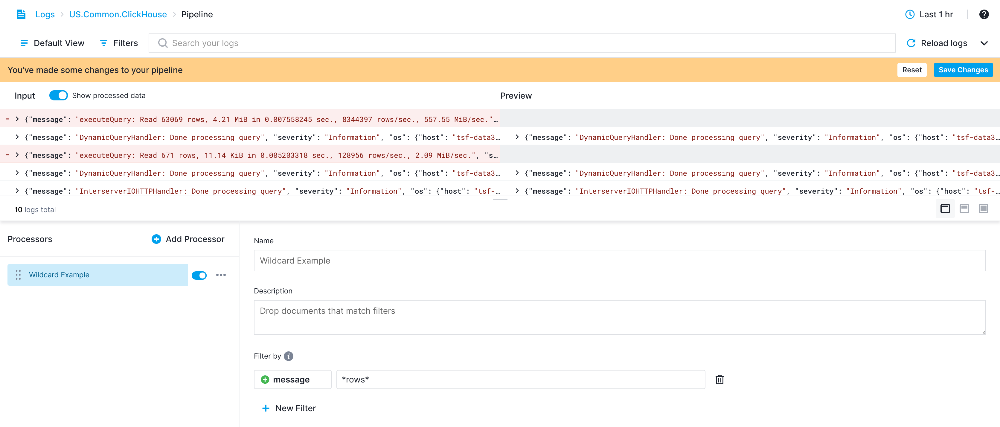

title: Processors
description: Add or change a field using a script

Processors are units of processing in Pipelines. They can change, drop, or even produce additional events. They are chained to form a Pipeline. The output of one Processor is the input for the next Processor.

Processors available in Logs Pipelines are:

- [XML Parser](../logs/xml-parser)
- [Size processor](../logs/size-processor)
- [Drop processor](../logs/drop-processor)
- [Flattener processor](../logs/flattener-processor)
- [User-Agent processor](../logs/user-Agent-processor)
- [URL Parser](../logs/url-parser)
- [Rename Fields Processor](../logs/rename-fields-processor)
- [Remove Fields Processor](../logs/remove-fields-processor)
- [Field Extractor Processor](../logs/field-extractor-processor)
- [Field Masking Processor](../logs/field-masking-processor)
- [Script Field Processor](../logs/script-field-processor)
- [Sampling Processor](../logs/sampling-processor)
- [Geo Processor](../logs/geo-processor)
- [URL Parser](../logs/url-parser)

Configuration section will be empty in most cases when you initially open Pipeline Builder.

In such cases, instead of a selected Processor configuration, there will be a list of available Processors. Clicking on any Processor card will add a Processor with default values. Processors can also be added by clicking the "Add Processor" button.

When clicking this button, a modal with a searchable list of Processors will appear. You can then select which Processor to add.
You can also add Processors by duplicating existing Processors.

The duplicate action is below the standard action button in the list of Processors. Note that **the order of Processors matters** since the **output of one Processor is the input for the next Processor**. 

You can reorder Processors using the drag handle to the left of each Processor's name.

The selected Processor configuration will be displayed on the right side. Every Processor has at least a name and a description field, but all Processors will also have additional, Processor-specific configurations.

### Errors

If a Processor is not configured correctly, the number of errors will be displayed next to the Processor's name and the `Save Changes` button will be disabled.

### Filters
Almost all Processors have optional filters. With filters, you can select only a subset of events that the Processor should be applied to. Events that do not match filters will be ignored.

Processors use the same filtering you are already used to in Sematext. 

The only difference is that you can also enter fields that are not keywords or even defined yet. 

#### Wildcards
Another important difference is that you can use wildcards for values. There is support for standard wildcard characters: `*` matches any number of characters, and `?` matches a single character.

This way you can, for example, drop events whose message field contains `*raws*` as in example below

