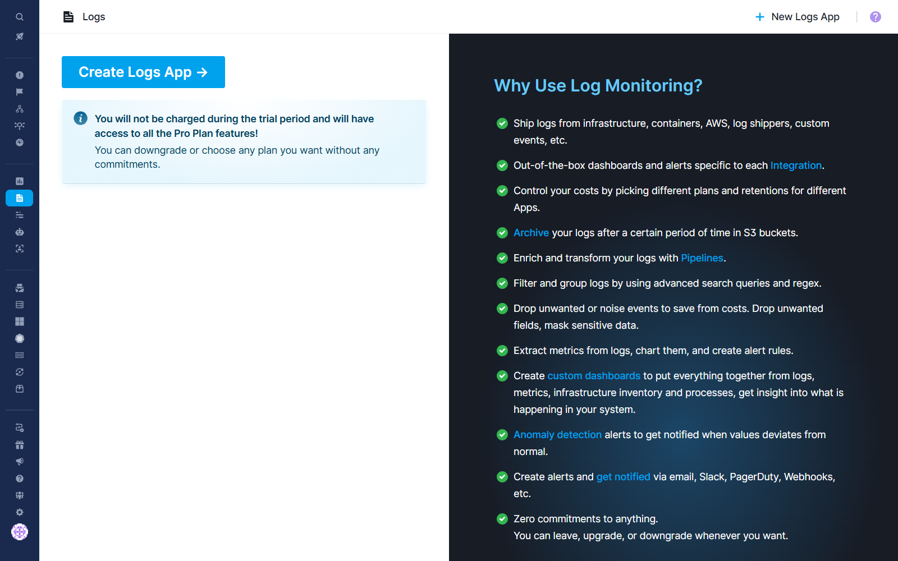
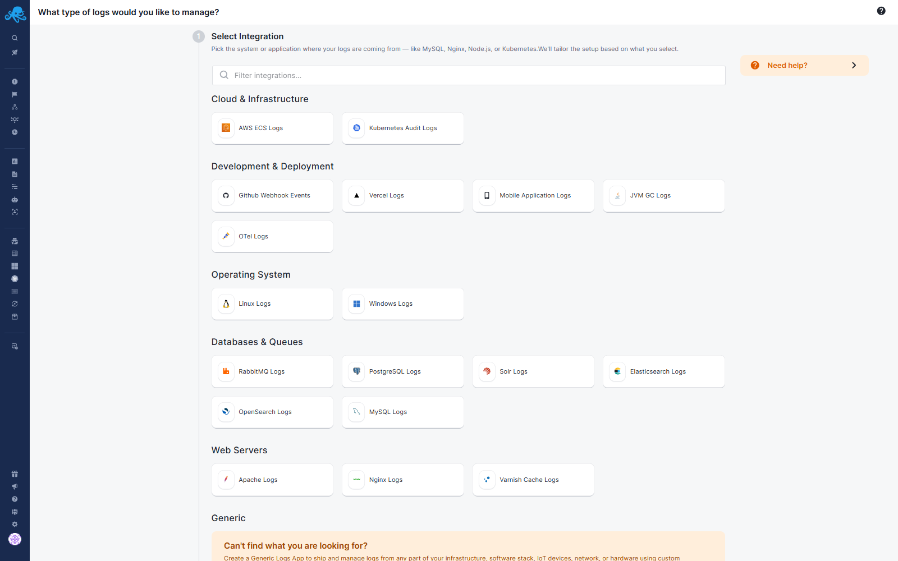
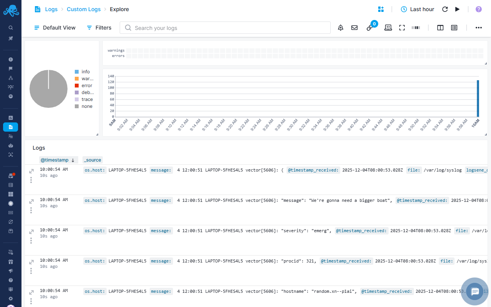

title: Sematext Logs Quick Start
description: Get up-and-running quickly with Sematext Logs. Here's how to start shipping and searching logs in no-time!

After you get logged into Sematext Cloud at <https://apps.sematext.com> (or <https://apps.eu.sematext.com> if using Sematext Cloud Europe), the first step is to create a Logs App. An [App](../guide/app-guide) is an independent namespace for your data.

For example, if you have a development and a production environment, it might make sense to have one App for each. You can create as many Apps as you want.

## Creating a Logs App

You create an App by pressing the **Create Logs App** button in the Logs tab.

Choose one of the many available [integrations](../guide/integrations-guide).

 Click on your desired integration, add a name, and press **Create App**.
 
 Then choose the platform you want to install [Sematext Agent](../agents/sematext-agent).

And this will open up the agent installation instruction page for the selected environment.

If you don’t see your platform in the Automatic Integrations list navigate to the Custom Integrations section to set up log shipping manually. Custom integrations screen tells you how to [manually send data to your new Logs App](../logs/sending-log-events).

Once you start sending data, you can start [searching and analyzing these logs](../logs/searching-log-events) in the Logs App.

See [Reports And Components](../logs/reports-and-components) for more details. 

### Adding Data to Your Logs App

You can add more log sources into your Logs App by navigating to the Ship Logs section from the left menu panel. Pick an environment to install Sematext Agent to another host or set up log shipping from the custom integrations section with [manual instructions](../logs/sending-log-events). 

## Troubleshooting With Logs

Quality Log Management tools have several main requirements for analyzing logs:

- A way to ship, ingest, and reliably index logs data
- Tools to search, correlate and investigate logs data
- Drill-down analysis functionality to reveal trends, spikes, and anomalies
- Monitoring and alerting features with 3rd party webhooks and integrations 
- Building custom reports and dashboards from your data

These are key features Sematext Logs offers. The rest of this guide will help you get started with using it to its full potential. But first, check out this short video about troubleshooting with logs.

<iframe src="https://www.youtube.com/embed/glwZ8OCV0kc"
frameborder="0" allow="autoplay; encrypted-media" 
allowfullscreen class="video"></iframe>

Moving on, let's see how to make the best out of a Logs App.

## Logs App Layout

The image below shows the default logs view. 

 Marked are the main application and system UI elements

See [Reports And Components](../logs/reports-and-components) for more details. 

You can create custom dashboards that can integrate multiple charts and views of your real-time data that help you understand important trends, summarize top values and view the frequency of conditions.  Sematext log management system lets your DevOps and business teams analyze your data further with advanced visualizations, chart overlay and pan and zoom controls and more.
