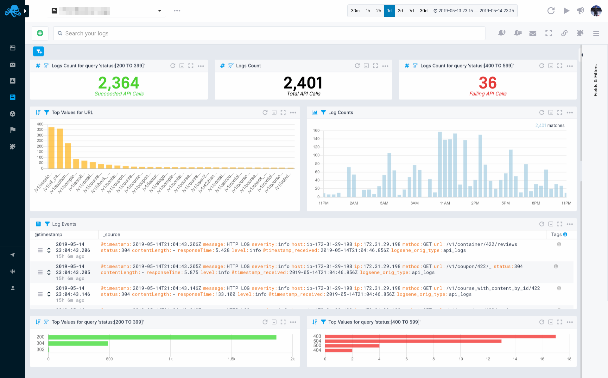

title: Sematext Logs Reports and Components
description: Cloud based SaaS / On-premises logging as a service platform. Index machine data, search, correlate and investigate. Build in reports and dashboards with monitoring and alerting capabilities.

Each Logs App has one default Report called **Explore**. You can create as many reports as you want with custom Components.

## Logs Search and Report Menu

Events, Alerts, and Logs are integrated into a single reports pane, and used to search logs, create alerts for anomalies, view events, and much more. 

Our [log management platform](https://sematext.com/logsene/) gives you the ability to create your own queries through its [Elasticsearch API](https://sematext.com/docs/logs/search-through-the-elasticsearch-api/) as well as using simple query syntax very much like the [query syntax](https://sematext.com/docs/logs/search-syntax/) used by Google.

You can also create and integrate [alerts](https://sematext.com/docs/alerts/) with commonly used collaboration and messaging software such as [Hipchat](https://sematext.com/docs/integration/alerts-hipchat-integration/), [Slack](https://sematext.com/docs/integration/alerts-slack-integration/), [Big Panda](https://sematext.com/docs/integration/alerts-bigpanda-integration/), [PagerDuty](https://sematext.com/docs/integration/alerts-pagerduty-integration/), [VictorOps](https://sematext.com/docs/integration/alerts-victorops-integration/), [OpsGenie](https://sematext.com/docs/integration/alerts-opsgenie-integration/) or simply by using your email address(es). Use these services to continuously monitor large volume of data and logs, and ensure that you are alerted in time.

 

### App State

When your Logs App is loaded the **Save and Reset buttons will be hidden** since you see the App's default state. If a **new component is added** or any existing **component is edited, alert created, and report component removed**, the **Save and Reset buttons will appear** in the report menu and allow for changes to be saved or reset to the initial state. If your browser is suddenly closed, and no changes were saved or reset, the App will preserve its initial state.

### Report Actions 

The set of icons in the logs search and report menu let you:

- **Save Query / Add Alert** - Every query can be sa**ved for later use, and used to send alerts**. The ability to save queries and alerts is part of the essential tools for searching, correlating and investigating logs data. Each saved query becomes part of the saved queries section.

- **Saved Queries / Alert Rules** - Right next to the save query / alert icon you can see the saved queries and alert rules, this will open a modal dialogue window with **all your saved queries and alert rules** displayed in a [Sematable](https://github.com/sematext/sematable), a table component that displays

	- _Tag Color_ that can be assigned to any logs query while it is being saved by user using colour picker componenet 
	- _Query Name_ to further identify and describe logs query
	- _Query String_ will be string you use in logs search input field
	- _Owner_	
	- _10m, 1h, 12h, and 1d_ shortcuts with histogram for fast observability of query patterns across common time intervals
	- Saved _query actions_ dropdown menu used to add new, edit, clone, reset, and delete saved logs report

- **Email Report** - There are E-mail and Subscription types available with time, frequency, and time range defined so your team can get automatated reports about your logs and system health.

- **Full Screen Mode** - Entering full screen mode brings only the component you choose into view. It's useful for presentations and viewing detailed info of a single component. All charts have zoom, hairline, and time navigation tools with tooltips available for effective chart interaction and data analysis.

- **Connected Applications** - Connecting a Logs App to a Monitoring App will **pre-select that Logs App when you decide to correlate metrics from the connected Monitoring App**. When you receive an alert notification for an app, the **alert notification will automatically include information and charts from connected apps**, and thus provide more information and context for you. You can connect any two apps you have access to, regardless of their type. **Any App can be connected to any number of other Apps**.

- **Integrations** - This section will guide you through installing Agents and Monitors. You will need to install **Sematext Agents so metrics or logs** data can be shipped to your Logs or Monitoring App. 
		
	Please refer to the [Integrations](https://sematext.com/docs/integration/) documentation pages for particular tech you wish to monitor. Learn more about how to monitor various programming languages, operating systems, containers (Docker, Kubernetes, Mesos), Cloud IaaS / PaaS services, iOS, Android, AWS EC2, AWS s3, and how to integrate log management with log shippers. You'll find detailed information on how to install and configure different agents required to start sending your logs and metrics data to Sematext Cloud there.

### Report Settings

- **Report Actions** - Your customized logs report can be better described using **meta name and description**, and you can assign a **unique URL Alias** to identify that report.

- **Legends Position and Extended Charts features** - Except in the default overview mode, each **report can have legends** for each metric name, arranged below, to the left, or hidden entirely for better chart interaction. Extended charts are also displayed below and provide a comparative view into a longer time span relative to the time frame displayed in the main chart. Just like report legends, the extended view can be hidden and only the chart with X and Y values will be displayed.

## Components

Using custom components you can **add metrics time series, events count time series, events, markdown notes, and create custom reports** with rich data visualizations and chart tools to analyze data.

Some components are common for both Logs and Monitoring, while other are specific for either one. They will be contextually available depending on whether you're adding them to a Monitoring or Logs App. Each **component can be also added to custom dashboards** you create.

### Logs Components

The Logs and Logs Count Time Series components are added by default to your Logs App. Additional Logs components that can be added to your App are Metric Panels, Logs Count, Top Values and Numeric Field Time Series.

These can be configured by whichever search query you want in any way you want. Making it easy to set up your Logs Report just the way you want.

 

Use them together with out-of-the-box metrics, from a Monitoring App, and you will go from metric spikes to Logs in seconds, and get to the root cause in minutes. Forget about ssh-ing to servers and grepping logs and find similar metric patterns with built-in metric correlations.

### Logs Component Settings

Each Component can be added to a custom Dashboard, and you can organize reports from one or several applications, both Logs Apps as well as Monitoring Apps. Creating rich data and visualization reports based on various metrics and logs data has never been easier.

Here's an image of the **Log Events Component** dropdown menu with log specific export and field editor features and the ability to add the component to a custom dashboard.

