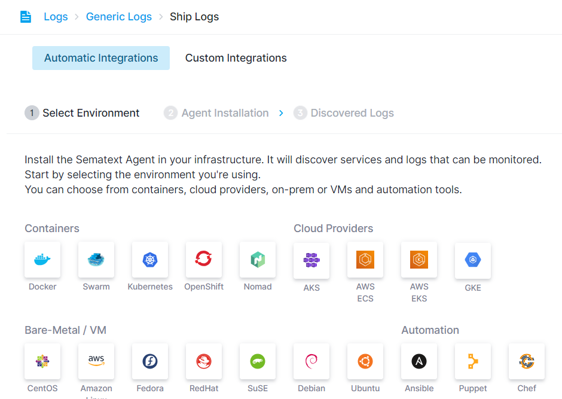
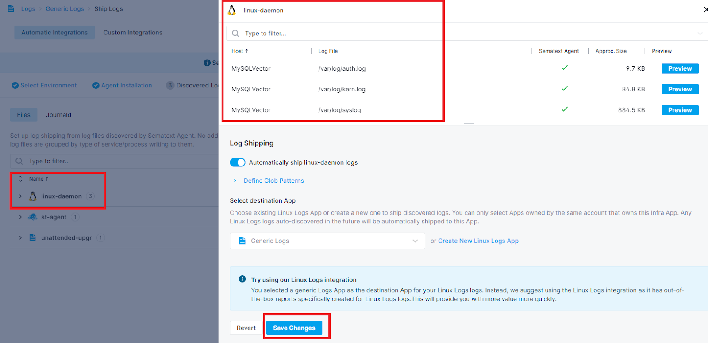
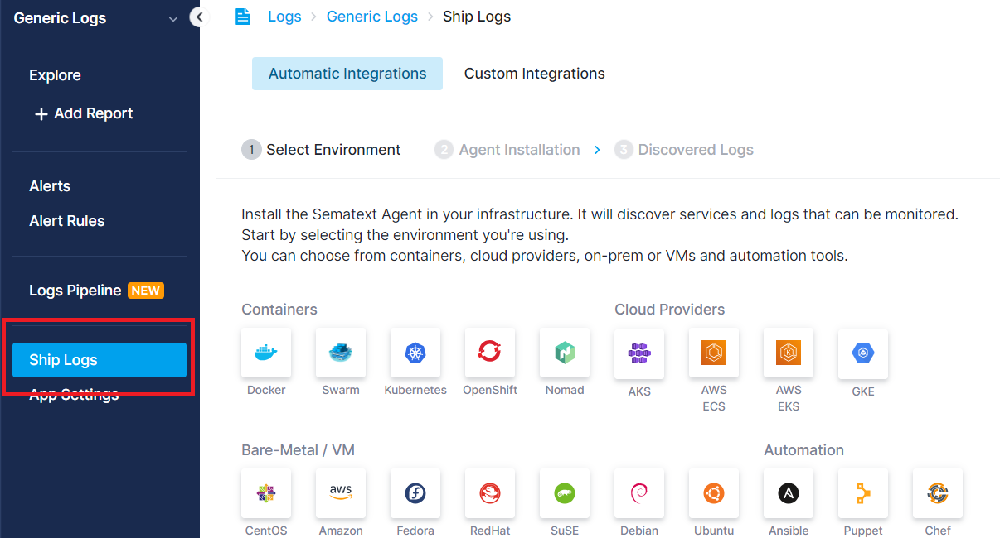
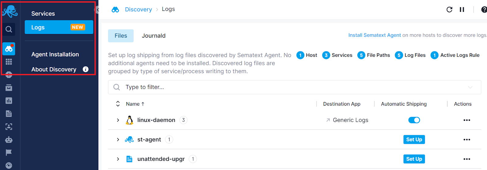
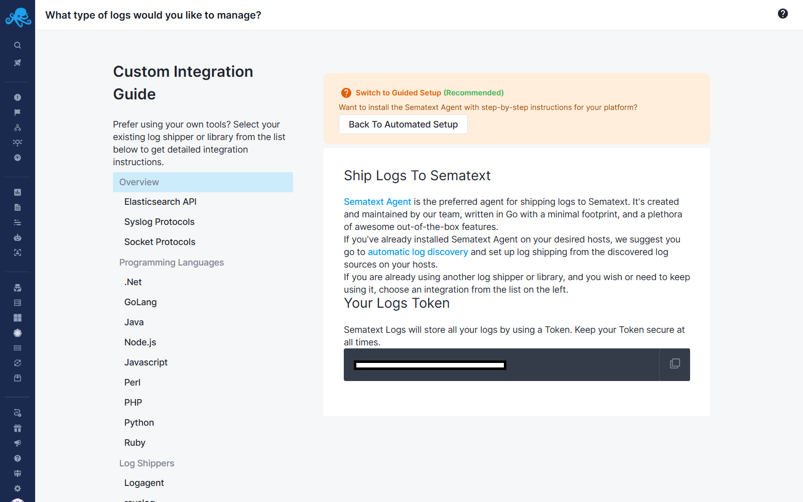
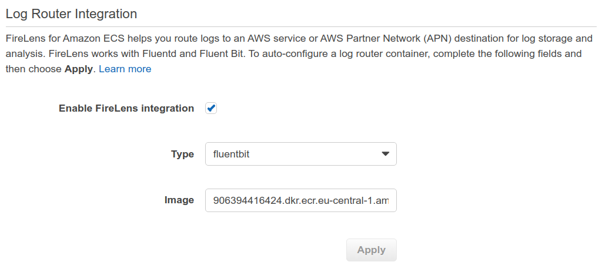

title: Sending Log Events to Sematext
description: Send new log events to Sematext using Sematext Agent, Elasticsearch API or syslog, and log shippers such as  Logstash, Fluentd, rsyslog, syslog-ng, Fluentbit and more

## Logs Discovery

The simplest - and the recommended way - to ship logs to Sematext is via the [Discovery](discovery/intro/) screen after the [initial setup](discovery/setup/). Setting up log shipping from there will be the easiest and will yield the best results, resulting in a the most suitable type of Logs App being created with the most useful pre-built dasboards and the most useful alert rules.


Follow these step-by-step instructions for setting up the [Sematext Agent](https://sematext.com/docs/agents/sematext-agent/) through the Logs App.

### Create Logs App

A Logs App is the space in Sematext that holds your logs.  You can have any number of Logs Apps in your account and each of them can have a different plan, retention, users who can access it, etc. 

#### Integration-specific Logs Apps

It is important to note that _most_ Logs Apps are "typed".  That is, most Logs Apps are built for a specific integration, for logs with some _specific_, known log format. For example, you can see an Nginx Logs App in a screenshot below. If you want to ship Nginx logs that is the Logs App you want to create.  Not only will that Logs App have a bunch of ready to use Nginx-specific reports and charts out of the box, but it will also come with a set of default alert rules that are applicable to monitoring Nginx logs.  Make use of this and save time by creating an appropriate Logs App.  You can find other integrations in [integrations docs](../integration/).


#### Generic Logs App

If you need to ship logs whose "type" you don't see among the list of offered Logs Apps types, create a `Generic Logs App`.  This type of Logs App has log search, alerting, and all other capabilities, but has _general reports_ that work for _all_ types of logs regardless of their format.  You can later create additional reports, charts, etc. to customize things to your liking.

### Select Your Environment Type

After creating the Logs App, the environment selection screen for agent installation will be displayed.



Choose the environment in which you intend to install the [Sematext Agent](https://sematext.com/docs/agents/sematext-agent/). The installation instructions specific to that environment will be displayed.
Follow the provided instructions to install the agent. Once installed, the Logs App will identify the host and display the discovered log sources within it.

### View Discovered Logs

Discovered Logs shows a list of log sources discovered within the host grouped by service type.


### Set Up Automatic Log Shipping

Click on the **Set Up** button next to the services from which you want to ship logs. This enables automatic log shipping for the selected services. For example, you can configure the system to send all log sources from Linux daemon services to Sematext Cloud as soon as they are discovered.



Congratulations! You have successfully configured automatic log shipping for logs discovered under Linux daemon services without any additional configuration.

### Shipping to the Same App from Additional Sources

If you want to ship logs from additional hosts and containers to the same Logs App, you can always navigate to the Ship Logs screen from the left Menu panel and repeat the steps to install the agent to another host.



Furthermore, at any time, you can navigate to the Discovery screen to view the log sources and services identified across your infrastructure, from all the containers and hosts where the [Sematext Agent](https://sematext.com/docs/agents/sematext-agent/) is installed. From this screen, you have the option to configure automatic log shipping or metrics without the need for any additional installations.



## Custom Integration Options

Alternatively, you can explore various custom integration options for shipping log events to Sematext. These include support for [Elasticsearch API](index-events-via-elasticsearch-api), [syslog-ng](syslog-ng), various programming languages, and popular log shippers such as [rsyslog](rsyslog), Logstash, Fluentd, and many many more. You can discover all supported custom integrations by accessing any Logs App, clicking 'Ship Logs' on the left menu panel, and navigating to the Custom Integrations tab.  We recommend you use this only if, for some reason, setting up log shipping from Discovery screen in Sematext Cloud UI doesn't work and our support is unable to help you.



For further insights, refer to [Logging Libraries vs Log Shippers](https://sematext.com/blog/logging-libraries-vs-log-shippers/).

### Log Shippers 

<ul>
 	<li><a  href="https://apps.sematext.com/ui/howto/Logsene/overview?activeSection=logagent-log-shippers">Logagent</a> - cross platform, Smart and lightweight Log Parser and Log Shipper written in Node.js</li>
 	<li><a href="https://apps.sematext.com/ui/howto/Logsene/overview?activeSection=rsyslog">rsyslog</a> - easy to get started, very fast and very light on resources, docs are harder to navigate for beginners though.</li>
 	<li><a href="https://apps.sematext.com/ui/howto/Logsene/overview?activeSection=logstash">Logstash OSS</a> - cross platform, very simple to set up, well documented, but a little heavy on resource usage</li>
 	<li><a  href="https://apps.sematext.com/ui/howto/Logsene/overview?activeSection=filebeat">Filebeat OSS</a> - cross platform, much lighter on resource usage, requires a Logstash instance to aggregate logs</li>
 	<li><a href="https://apps.sematext.com/ui/howto/Logsene/overview?activeSection=syslog">syslog-ng</a> - very fast and very light on resources, good docs, available as both free and paid version</li>
 	<li><a href="https://apps.sematext.com/ui/howto/Logsene/overview?activeSection=syslogd">syslogd</a> - quite old, light on resources, not very feature rich</li>
 	<li><a href="https://apps.sematext.com/ui/howto/Logsene/overview?activeSection=fluentd">Fluentd</a> - cross platform, easy to get started, horizontally scalable, available as both free and paid version</li>
 	<li><a href="https://apps.sematext.com/ui/howto/Logsene/overview?activeSection=fluentbit">Fluent Bit</a> - FluentBit is an open source specialized data collector. It provides built-in metrics and general purpose output interfaces for centralized collectors such as Fluentd.</li>
 	<li><a href="https://apps.sematext.com/ui/howto/Logsene/overview?activeSection=nxlog">NXLog</a> - cross platform but mostly used on Windows, easy to get started, available as both free and paid version</li>
</ul>

### Programming Languages

<ul>
 	<li><a href="https://apps.sematext.com/ui/howto/Logsene/overview?activeSection=dotnet">.Net</a></li>
 	<li><a href="https://apps.sematext.com/ui/howto/Logsene/overview?activeSection=golang">GoLang</a></li>
 	<li><a href="https://apps.sematext.com/ui/howto/Logsene/overview?activeSection=java">Java</a></li>
 	<li><a href="https://apps.sematext.com/ui/howto/Logsene/overview?activeSection=nodejs">Node.js</a></li>
 	<li><a href="https://apps.sematext.com/ui/howto/Logsene/overview?activeSection=javascript">Javascript</a></li>
 	<li><a href="https://apps.sematext.com/ui/howto/Logsene/overview?activeSection=perl">Perl</a></li>
 	<li><a href="https://apps.sematext.com/ui/howto/Logsene/overview?activeSection=php">PHP</a></li>
 	<li><a href="https://apps.sematext.com/ui/howto/Logsene/overview?activeSection=python">Python</a></li>
 	<li><a href="https://apps.sematext.com/ui/howto/Logsene/overview?activeSection=ruby">Ruby</a></li>
</ul>

### Operating Systems 

<ul>
 	<li><a href="https://apps.sematext.com/ui/howto/Logsene/overview?activeSection=windows">Windows</a></li>
 	<li><a href="https://apps.sematext.com/ui/howto/Logsene/overview?activeSection=linux">Linux</a></li>
 	<li><a href="https://apps.sematext.com/ui/howto/Logsene/overview?activeSection=osx">Mac OS</a></li>
</ul>

### Containers 

<ul>
 	<li><a href="https://apps.sematext.com/ui/howto/Logsene/overview?activeSection=docker">Docker</a></li>
 	<li><a href="https://apps.sematext.com/ui/howto/Logsene/overview?activeSection=kubernetes">Kubernetes</a></li>
 	<li><a href="../kubernetes-audit-integration">Kubernetes Audit</a></li>
 	<li><a href="https://apps.sematext.com/ui/howto/Logsene/overview?activeSection=kubernetes-containerd">Kubernetes Containerd</a></li>
 	<li><a href="https://apps.sematext.com/ui/howto/Logsene/overview?activeSection=kubernetes-crio">Kubernetes CRI-O</a></li>
 	<li><a href="https://apps.sematext.com/ui/howto/Logsene/overview?activeSection=mesosmarathon">Mesos Marathon</a></li>
</ul>

### Cloud IaaS / PaaS

<ul>
 	<li><a href="https://apps.sematext.com/ui/howto/Logsene/overview?activeSection=awss3">AWS S3</a></li>
 	<li><a href="https://apps.sematext.com/ui/howto/Logsene/overview?activeSection=awscloudtrail">AWS CloudTrail</a></li>
 	<li><a href="https://apps.sematext.com/ui/howto/Logsene/overview?activeSection=awscloudwatch">AWS CloudWatch</a></li>
 	<li><a href="https://apps.sematext.com/ui/howto/Logsene/overview?activeSection=awsvpsflow">AWS VPC Flow Logs</a></li>
 	<li><a href="https://apps.sematext.com/ui/howto/Logsene/overview?activeSection=heroku">Heroku</a></li>
 	<li><a href="https://apps.sematext.com/ui/howto/Logsene/overview?activeSection=cloudfoundry">Cloud Foundry</a></li>
 	<li><a href="https://apps.sematext.com/ui/howto/Logsene/overview?activeSection=gae">Google App Engine</a></li>
 	<li><a href="../github-webhook-events-integration">GitHub Webhook Events</a></li>
 	<li><a href="../vercel-logs-integration">Vercel</a></li>
</ul>

### iOS 

<div>For iOS apps use <a href="https://github.com/sematext/sematext-logsene-ios" target="_blank" rel="noopener">Sematext Logs for iOS</a> library.</div>

### Android 

<div>For Android apps use<a href="https://github.com/sematext/sematext-logsene-android" target="_blank" rel="noopener"> Sematext Logs for Android</a> library.</div>

### AWS EC2 

If you're an EC2 user, you can log Sematext from your instances by
setting up a <a class="" href="https://sematext.com/docs/logs/sending-log-events/#log-shippers">log
shipper</a> like you would from any other physical or virtual machine.

### AWS ECS on AWS Fargate With FireLens 

We recommend you use the [AWS ECS Logs Integration](./ecs-logs) to get more detailed out-of-the-box reports.

There are two main ways you can forward logs from containers running in Fargate to Sematext. They rely on two different log drivers.

- [AWS FireLens](https://docs.aws.amazon.com/AmazonECS/latest/developerguide/using_firelens.html) - `awsfirelens`
- [AWS Logs](https://docs.aws.amazon.com/AmazonECS/latest/developerguide/using_awslogs.html) - `awslogs`

We suggest you use AWS Firelens to avoid additional CloudWatch costs.

With Firelens you can route logs to another AWS service, like Firehose, or use Fluentd or Fluent Bit. AWS provides the image for Fluentd / Fluent Bit. You need to configure the output module.

#### 1. Enable FireLens
In the ECS Task Definition, check a checkbox called Enable FireLens integration. Choose Fluent Bit and AWS will populate the image name for you.



AWS will add an additional container called `log_router` to the list of containers in your Task Definition.

#### 2. Configure the FireLens Log Driver
Next, in the same Task Definition but for your own container (not the `log_router`), you configure the `logConfiguration` like this:

```json
"logConfiguration": {
  "logDriver": "awsfirelens",
  "options": {
    "Type": "ecs",
    "Port": "443",
    "Host": "logsene-receiver.sematext.com",
    "Index": "<LOGS_TOKEN>",
    "TLS": "On",
    "Match": "*",
    "Name": "es"
  }
}
```

> Note: If you are using the EU region of Sematext you should set the Host like this: `"Host": "logsene-receiver.eu.sematext.com"`

This will forward all container logs to Sematext.

### AWS ECS on AWS Fargate With AWS Logs
This log driver will forward all logs to CloudWatch. From there you can configure a Lambda function to collect the logs and forward them to Sematext. 

#### 1. Enable forwarding to CloudWatch
Your ECS task configuration JSON will contain this snippet:
    
```json
"logConfiguration": {
  "logDriver": "awslogs",
  "options": {
    "awslogs-group": "/ecs/ecs-service-name",
    "awslogs-region": "eu-central-1",
    "awslogs-stream-prefix": "ecs"
  }
}
```

#### 2. Set up a Lambda function pipeline to collect and forward CloudWatch logs to Sematext
Once forwarding to CloudWatch is configured, you need to set up a Lambda function to collect these logs from CloudWatch and send them to Sematext. You do this by [following this guide](https://sematext.com/blog/centralized-aws-lambda-logs-kinesis-serverless/). Or, if you already know how to, [here is the code for the Lambda pipeline so you can deploy](https://github.com/sematext/cloudwatch-sematext-aws-lambda-log-shipper) right away. 

All you need to do is edit the secrets to add your Sematext LOGS_TOKEN and LOGS_RECEIVER_URL. Also, don't forget to [edit the PREFIX](https://github.com/sematext/cloudwatch-sematext-aws-lambda-log-shipper/blob/39c781df576e0decb9c4bfa4e615d76805d7b69f/sample.secrets.json#L9) to match your ECS containers. E.g:

```
"PREFIX": "/ecs/ecs-service-name"
```


### AWS ECS on AWS EC2

We recommend you use the [AWS ECS Logs Integration](./ecs-logs) to get more detailed out-of-the-box reports.

When using EC2 container instances you can configure [Logagent](https://hub.docker.com/_/logagent) to forward container logs.

#### 1. Set env vars
In the ECS Task Definition you need to make sure you have these two environment variables configured:

- `LOGS_TOKEN` - set to your token
- `REGION` - either US or EU based on the region you are using

In JSON it looks like this:

```json
{
  "requiresCompatibilities": [
    "EC2"
  ],
  ...
  "containerDefinitions": [
    {
      "name": "st-logagent",
      "image": "sematext/logagent:latest",
      ...
      "environment": [
        {
            "name": "LOGS_TOKEN",
            "value": "9c63d337-xxxx-xxxx-xxxx-abcc87342d47"
        },
        {
            "name": "REGION",
            "value": "US"
        }
      ],
      ...
    }
  ]
  ...
}
```

#### 2. Set volumes
To enable log collection you must bind the Docker Socket volume from the EC2 container instance to the Logagent container.

The `/var/run/docker.sock` path on the host must be bound to the `/var/run/docker.sock` path in the container.

In JSON it looks like this:

```json
{
  "requiresCompatibilities": [
    "EC2"
  ],
  ...
  "containerDefinitions": [
    {
      "name": "st-logagent",
      "image": "sematext/logagent:latest",
      ...
      "environment": [
        {
          "name": "LOGS_TOKEN",
          "value": "9c63d337-xxxx-xxxx-xxxx-abcc87342d47"
        },
        {
          "name": "REGION",
          "value": "US"
        }
      ],
      "mountPoints": [
        {
          "sourceVolume": "docker-socket",
          "containerPath": "/var/run/docker.sock",
          "readOnly": ""
        }
      ]
      ...
    }
  ],
  "volumes": [
    {
      "host": {
        "sourcePath": "/var/run/docker.sock"
      },
      "name": "docker-socket"
    }
  ]
  ...
}
```

#### 3. Run the Logagent Task Definition as a Daemon Service type
When creating the Logagent service make sure to set the `Launch type` as **EC2** and `Service type` as **DAEMON**.


### AWS S3 (CloudTrail, Flow logs, ELB access logs, etc.) **

If you have logs stored in S3, you can ship them to Sematext <a
href="https://github.com/sematext/logsene-aws-lambda-s3"
target="_blank" rel="noopener">via this AWS Lambda function</a>. This
method also works for when you periodically upload logs to S3 buckets,
like Amazon CloudTrail does.

### AWS CloudWatch Logs 

If you want to ship CloudWatch logs, you can use <a
href="https://github.com/sematext/logsene-aws-lambda-cloudwatch"
target="_blank" rel="noopener">another AWS Lambda function</a>. If
logs are VPC flowlogs, the Lambda function will also parse them and
add geoIP information on the source IP addresses.

### Centralized Logging for AWS Lambda

If you want to automatically subscribe to AWS Lambda log streams you can use
this <a href="https://github.com/sematext/cloudwatch-sematext-aws-lambda-log-shipper" target="_blank" rel="noopener">CloudFormation stack</a>.

It'll let you run a single command and set up log group subscriptions,
funnel all CloudWatch logs to Kinesis, and use a dedicated Lambda function
to ship these logs to Sematext.

Read the [full tutorial on our blog](https://sematext.com/blog/centralized-aws-lambda-logs-kinesis-serverless/)!
